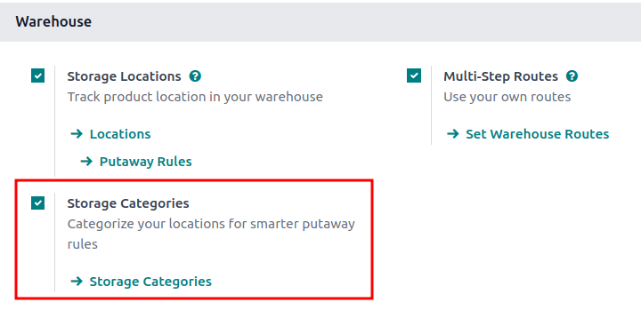

# Storage categories

A *storage category* is used with
`putaway rules `, as an extra
location attribute to automatically propose optimal storage locations
for products.

Follow these steps to complete the setup:

1.  `Enable the Storage Category feature `
2.  `Define a storage category ` with specific limitations
3.  Assign a
    `category to storage locations `
4.  Add the storage category as an attribute to a `putaway rule
    `

::: tip

Assigning categories to storage locations tells Odoo these locations
meet specific requirements, such as temperature or accessibility. Odoo
then evaluates these locations, based on defined capacity, and
recommends the best one on the warehouse transfer form.
::::

## Configuration 

To enable storage categories, go to
`Inventory app ‣ Configuration ‣ Settings`. Then, in the `Warehouse` section, ensure the
`Storage Locations` and
`Multi-Step Routes` features are
enabled.

Next, activate the `Storage Categories` feature. Finally, click `Save`.

## Define storage category 

A storage category with specific limitations **must** be created first,
before it is applied to locations, in order to decide the optimal
storage location.

To create a storage category, go to
`Inventory app ‣ Configuration ‣ Storage
Categories`, and click
`Create`.

On the storage category form, type a name for the category in the
`Storage Category` field.

Options are available to limit capacity by weight, product, and package
type.

::: tip

Weight limits can be combined with capacity by package or product (e.g.
a maximum of one hundred products with a total weight of two hundred
kilograms).

While it is possible to limit capacity by product and package type at
the same location, it may be more practical to store items in different
amounts across various locations, as shown in this example of
`capacity by package `.
::::

The `Allow New Product` field defines
when the location is considered available to store a product:

- `If location is empty`: a product
  can be added there only if the location is empty.
- `If products are the same`: a
  product can be added there only if the same product is already there.
- `Allow mixed products`: several
  different products can be stored in this location at the same time.

::: tip

When clicked, the `Location` smart
button shows which storage locations the category has been assigned to.
::::

### Capacity by weight

On a storage category form (`Inventory app ‣ Configuration ‣ Storage
Categories`), set a maximum
product weight in the `Max Weight`
field. This limit applies to each location assigned this storage
category.

### Capacity by product

In the `Capacity by Product` tab,
click `Add a Line` to input items,
and enter their capacities in the `Quantity` field.

::: example
Ensure only a maximum of five [Large Cabinets] and two
[Corner Desk Right Sit] are stored at a single storage
location, by specifying those amounts in the
`Capacity by Product` tab of a
storage category form.

:::

### Capacity by package 

For companies using
`packages `, it becomes possible to ensure real-time storage capacity
checks, based on package types (e.g., crates, bins, boxes, etc.).

::: warning

Enable the `Packages` feature in
`Inventory app ‣ Configuration ‣
Settings` to show the
`Capacity by Package` tab.
::::

::: example
Create putaway rules for pallet-stored items, by creating the [High
Frequency pallets] storage category.

In the `Capacity by Package` tab,
specify the number of packages for the designated
`Package Type`, and set a maximum of
[2.00] [Pallets] for a specific location.

:::

## Assign to location 

Once the storage category is created, assign it to a location. Navigate
to the location by going to
`Inventory app ‣ Configuration ‣ Locations`, and select the desired location. Then, select the
created category in the `Storage Category` field.

::: example
Assign the [High Frequency pallets] storage category (which
limits pallets stored at any location to two pallets) to the
[WH/Stock/pallets/PAL 1] sub-location.

:::

## Putaway rule 

With the
`storage category ` and `location
` set
up, create the `putaway rule ` by
navigating to
`Inventory app ‣ Configuration ‣ Putaway Rules`.

Click the `Create` button to create
the putaway rule. In the `Having Category` field of the new putaway rule form, select the storage
category.

::: example
Continuing the example from above, the [High Frequency
Pallets] storage category is assigned to the putaway rule
directing pallets of lemonade to locations with the [High Frequency
Pallets] storage category
`assigned to them `.

:::

## Use case: limit capacity by package

To limit the capacity of a storage location by a specific number of
packages, `create a storage
category with a Capacity By Package `.

Continuing the example from above, the [High Frequency
Pallets] storage category is assigned to the
[PAL1] and [PAL2] locations.

Then, `putaway rules ` are set, so that any pallets received in the warehouse are
directed to be stored in [PAL1] and [PAL2]
locations.

Depending on the number of pallets on-hand at each of the storage
locations, when one pallet of lemonade cans is received, the following
scenarios happen:

- If [PAL1] and [PAL2] are empty, the pallet is
  redirected to [WH/Stock/Pallets/PAL1].
- If [PAL1] is full, the pallet is redirected to
  [WH/Stock/Pallets/PAL2].
- If [PAL1] and [PAL2] are full, the pallet is
  redirected to [WH/Stock/Pallets].
