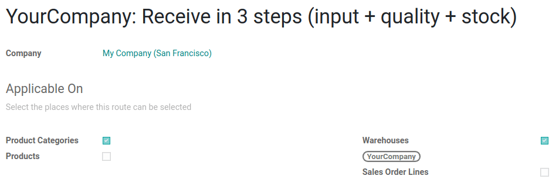
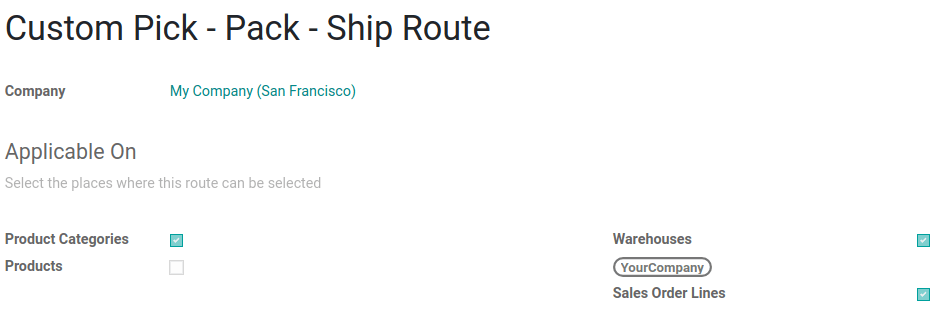
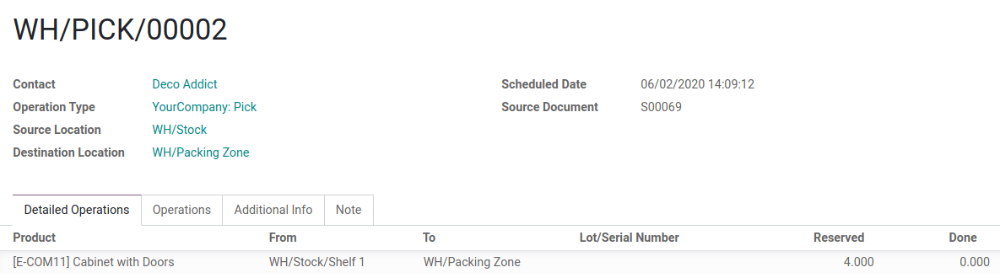

# Routes and push/pull rules

*Routes* in Odoo control the movement of products between different
locations, whether internal or external, using push and pull rules. Once
set up, these rules help automate the logistics of product movement
based on specific conditions.

::: tip

Routes are applicable on products, product categories, shipping methods,
`packagings
`, and on the sales order line.
::::

## About routes and terminology

In a generic warehouse, there are receiving docks, a quality control
area, storage locations, picking and packing areas, and shipping docks.
All products go through all these locations. As the products move
through the locations, each location triggers the products\' specified
route and rules.

In this example, vendor trucks unload pallets of ordered products at the
receiving docks. Operators then scan the products in the receiving area.
Depending on the product\'s route and rules, some of these products are
sent to a quality control area (for example, products that are
components used in the manufacturing process), while others are directly
stored in their respective locations.

Here is an example of a fulfillment route. In the morning, items are
picked for all the orders that need to be prepared during the day. These
items are picked from storage locations and moved to the picking area,
close to where the orders are packed. Then, the orders are packed in
their respective boxes, and conveyor belts bring them to the shipping
docks, ready to be delivered to customers.

### Push rules

Push rules are used to *supply products into a storage locations* as
soon as they arrive at a specific receiving location.

::: tip

Push rules can only be triggered if there are no pull rules that have
already generated the product transfers.
::::

In a
`one-step receipt route `, which uses one push rule, when a product arrives in the
warehouse, a push rule can automatically transfer it to the *Storage
Location*. Different push rules can be applied to different products,
allowing for customized storage locations.

Push rule for the 'Receive in one step' route.

For more information about configuring rules, skip to the
`Configure rules section
`.

### Pull rules

Pull rules trigger product moves on demand, such as a sales order or a
`need to restock
`.

Pull rules work backward from the demand location. For example, in a
`two-step delivery
` route, where items move from *Stock* to *Output* before
being delivered to the *Customer Location*, the pull rule first creates
a transfer from *Output* to the customer. If the product is not at
*Output*, another pull rule creates a transfer from *Stock* to *Output*.
The warehouse workers then process these transfers in the reverse order:
picking, then shipping.

Pull rules for the 'Deliver in two steps'
route.

For more information about configuring rules, skip to the
`Configure rules section
`.

## Configuration 

Since *Routes* are a collection of *Push and Pull Rules*, Odoo helps you
manage advanced route configurations such as:

- Manage product manufacturing chains.
- Manage default locations per product.
- Define routes within the stock warehouse according to business needs,
  such as quality control, after-sales services, or supplier returns.
- Help rental management by generating automated return moves for rented
  products.

To configure a route for a product, first, open the
`Inventory` application and go to
`Configuration ‣ Settings`.
Then, in the `Warehouse` section,
enable the `Multi-Step Routes`
feature and click `Save`.

::: tip

The `Storage Locations` feature is
automatically activated with the `Multi-Step Routes` feature.
::::

Once this first step is completed, the user can use pre-configured
routes that come with Odoo, or they can create custom routes.

### Pre-configured routes

To access Odoo\'s pre-configured routes, go to
`Inventory ‣ Configuration ‣
Warehouses`. Then, open a
warehouse form. In the `Warehouse Configuration` tab, the user can view the warehouse\'s pre-configured
routes for `Incoming Shipments` and
`Outgoing Shipments`.

Some more advanced routes, such as pick-pack-ship, are also available.
The user can select the route that best fits their business needs. Once
the `Incoming Shipments` and
`Outgoing Shipments` routes are set,
head to `Inventory ‣ Configuration
‣ Routes` to see the specific
routes that Odoo generated.

On the `Routes` page, click on a
route to open the route form. In the route form, the user can view which
places the route is `Applicable On`.
The user can also set the route to only apply on a specific
`Company`. This is useful for
multi-company environments; for example, a user can have a company and
warehouse in Country A and a second company and warehouse in Country B.

At the bottom of the route form, the user can view the specific
`Rules` for the route. Each
`Rule` has an
`Action`, a
`Source Location`, and a
`Destination Location`.

### Custom Routes

To create a custom route, go to
`Inventory ‣ Configuration ‣ Routes`, and click on `Create`. Next, choose the places where this route can be
selected. A route can be applicable on a combination of places.

Each place has a different behavior, so it is important to tick only the
useful ones and adapt each route accordingly. Then, configure the
`Rules` of the route.

If the route is applicable on a product category, the route still needs
to be manually set on the product category form by going to
`Inventory ‣ Configuration ‣ Product
Categories`. Then, select the
product category and open the form. Next, click `Edit` and under the `Logistics` section, set the `Routes`.

When applying the route on a product category, all the rules configured
in the route are applied to **every** product in the category. This can
be helpful if the business uses the dropshipping process for all the
products from the same category.

The same behavior applies to the warehouses. If the route can apply to
`Warehouses`, all the transfers
occurring inside the chosen warehouse that meet the conditions of the
route\'s rules will then follow that route.

If the route is applicable on `Sales Order Lines`, it is more or less the opposite. The route must be
manually chosen when creating a quotation. This is useful if some
products go through different routes.

Remember to toggle the visibility of the `Route` column on the quotation/sales order. Then, the route
can be chosen on each line of the quotation/sales order.

Finally, there are routes that can be applied to products. Those work
more or less like the product categories: once selected, the route must
be manually set on the product form.

To set a route on a product, go to
`Inventory ‣ Products ‣ Products` and select the desired product. Then, go to the
`Inventory` tab and under the
`Operations` section, select the
`Routes`.

::: warning

Rules must be set on the route in order for the route to work.
::::

#### Rules 

The rules are defined on the route form. First, go to
`Inventory ‣ Configuration
‣ Routes` and open the desired
route form. Next, click `Edit` and in
the `Rules` section, click on
`Add a line`.

The available rules trigger various actions. If Odoo offers *Push* and
*Pull* rules, others are also available. Each rule has an
`Action`:

- `Pull From`: this rule is triggered
  by a need for the product in a specific location. The need can come
  from a sales order being validated or from a manufacturing order
  requiring a specific component. When the need appears in the
  destination location, Odoo generates a picking to fulfill this need.
- `Push To`: this rule is triggered
  by the arrival of some products in the defined source location. In the
  case of the user moving products to the source location, Odoo
  generates a picking to move those products to the destination
  location.
- `Pull & Push`: this rule allows the
  generation of pickings in the two situations explained above. This
  means that when products are required at a specific location, a
  transfer is created from the previous location to fulfill that need.
  This creates a need in the previous location and a rule is triggered
  to fulfill it. Once the second need is fulfilled, the products are
  pushed to the destination location and all the needs are fulfilled.
- `Buy`: when products are needed at
  the destination location, a request for quotation is created to
  fulfill the need.
- `Manufacture`: when products are
  needed in the source location, a manufacturing order is created to
  fulfill the need.

The `Operation Type` must also be
defined on the rule. This defines which kind of picking is created from
the rule.

If the rule\'s `Action` is set to
`Pull From` or
`Pull & Push`, a
`Supply Method` must be set. The
`Supply Method` defines what happens
at the source location:

- `Take From Stock`: the products are
  taken from the available stock of the source location.
- `Trigger Another Rule`: the system
  tries to find a stock rule to bring the products to the source
  location. The available stock is ignored.
- `Take From Stock, if Unavailable, Trigger Another Rule`: the products are taken from the available stock of
  the source location. If there is no stock available, the system tries
  to find a rule to bring the products to the source location.

## Example flow

In this example, let\'s use a custom *Pick - Pack - Ship* route to try a
full flow with an advanced custom route.

First, a quick look at the route\'s rules and their supply methods.
There are three rules, all `Pull From` rules. The `Supply Methods` for each rule are the following:

- `Take From Stock`: When products
  are needed in the `WH/Packing Zone`, *picks* (internal transfers from
  `WH/Stock` to
  `WH/Packing Zone`) are created from
  `WH/Stock` to fulfill the need.
- `Trigger Another Rule`: When
  products are needed in `WH/Output`,
  *packs* (internal transfers from `WH/Packing Zone` to `WH/Output`)
  are created from `WH/Packing Zone`
  to fulfill the need.
- `Trigger Another Rule`: When
  products are needed in `Partner
  Locations/Customers`, *delivery
  orders* are created from `WH/Output` to fulfill the need.

This means that, when a customer orders products that have a *pick -
pack - ship* route set on it, a delivery order is created to fulfill the
order.

::: tip

If the source document for multiple tranfers is the same sales order,
the status is not the same. The status will be
`Waiting Another Operation` if the
previous transfer in the list is not done yet.
::::

To prepare the delivery order, packed products are needed at the output
area, so an internal transfer is requested from the packing zone.

Obviously, the packing zone needs products ready to be packed. So, an
internal transfer is requested to the stock and employees can gather the
required products from the warehouse.

As explained in the introduction of the documentation, the last step in
the process (for this route, the delivery order) is the first to be
triggered, which then triggers other rules until we reach the first step
in the process (here, the internal transfer from the stock to the
packing area). Now, everything is ready to be processed so the customer
can get the ordered items.

In this example, the product is delivered to the customer when all the
rules have been triggered and the transfers are done.

