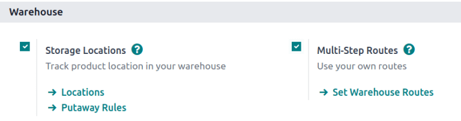
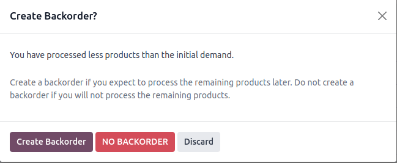

# Batch picking

::: 
*Batch picking* enables a single picker to handle multiple orders at
once, reducing the number of times needed to navigate to a warehouse
location. When picking in batches, orders are grouped and consolidated
into a picking list. After the picking, the batch is taken to an output
location, where the products are sorted into their respective delivery
packages.
:::

Since orders *must* be sorted at the output location after being picked,
this picking method suits businesses with a few products that are
ordered often. Storing high-demand items in easily accessible locations
can increase the number of orders that are fulfilled efficiently.

Batch picking is ideal for industries or warehouses that handle high
order volumes with a stable demand. This method increases efficiency by
allowing workers to pick items for multiple orders in one trip through
the warehouse, reducing travel time and boosting productivity.

## Configuration

To activate the batch picking option, begin by going to
`Inventory app ‣
Configuration ‣ Settings`.
Under the `Operations` section, check
the `Batch,
Wave & Cluster Transfers` box.

Since batch picking is a method to optimize the *pick* operation in
Odoo, the `Storage
Locations` and
`Multi-Step Routes` options under the
`Warehouse` heading must also be
checked on this settings page. When finished, click
`Save`.

## Create batch transfers

To manually group transfers directly from the
`Inventory app`, hover over the
desired operation type from the `Inventory Overview` menu (e.g. the `Receipts` Kanban card), click the
`fa-ellipsis-v`
`(vertical ellipsis)` icon, then
select `Prepare Batch`.

On the batch transfer form, fill the following fields out accordingly:

- `Responsible`: employee assigned to
  the picking. Leave this field blank if *any* worker can fulfill this
  picking.
- `Operation Type`: from the
  drop-down menu, select the operation type under which the picking is
  categorized.
- `Scheduled Date`: specifies the
  date by which the `Responsible`
  person should complete the transfer to the output location.

Next, in the `Transfers` list, click
`Add a line` to open the `Add:
Transfers` window.

If the `Operation Type` field was
filled, the list will filter transfer records matching the selected
`Operation Type`.

Click the `New` button to create a
new transfer.

Once the transfer records are selected, click
`Confirm` to confirm the batch
picking.

::: example
A new batch transfer is assigned to the `Responsible`, [Joel Willis], for the [Pick]
`Operation Type`. The
`Scheduled Date` is set to [August
11].

Clicking the `Add a line` button
opens the `Add:Transfers` window,
displaying only pickings. This is because the
`Operation Type` was set to
[Pick] on the batch transfer form.

Click the checkbox to the left of the transfers,
[WH/PICK/00001] and [WH/PICK/00002], to include
them in the new transfer. Then, click the `Select` button to close the `Add:Transfers` window.

:::

### Add batch from transfers list 

Another method of creating batch transfers is available using the
`Add to batch` option in a list.
Navigate to the `Inventory app ‣ Operations` drop-down menu, and select any of the
`Transfers` to open a filtered list
of transfers.

On the transfers list, select the checkbox to the left of the selected
transfers to add in a batch. Next, navigate to the
`fa-cog` `Actions` button, and click `Add to batch` from the resulting drop-down menu.

Doing so opens an `Add to batch`
pop-up window, wherein the employee `Responsible` for the picking can be assigned.

Choose from the two radio options to add to
`an existing batch transfer` or
create `a new batch transfer`.

Add a `Description` for this batch.

::: tip

The `Description` field can be used
to add additional information to help workers identify the source of the
batch, where to place the batch, what shipping containers to use, etc.
::::

To create a batch to be processed at a later time, select the
`Draft` checkbox.

Conclude the process by clicking `Confirm`.

### Automatic batches

Batches can be automatically created and assigned based on several
criteria. The *Automatic Batches* option is defined on the *operation
type* level.

::: example
In a multi-steps delivery process, the picking operation can be grouped
by customer, while the shipping operation can be organized by carrier
and destination country.
:::

To enable *Automatic Batches*, navigate to
`Inventory app ‣ Configuration ‣
Operation Types`, and select the
desired operation type (e.g. `Delivery`, `Pick`, etc). Then,
select one or more `Batch Grouping`
criteria by ticking the appropriate checkbox. Even if more than one
grouping option is selected, only one batch is created.

Batches can be automatically generated based on the following criteria:

- `Contact`
- `Carrier`
- `Destination Country`
- `Source Location`
- `Destination Location`

## Process batch transfer

Handle batch transfers in the
`Inventory app ‣ Operations ‣ Batch Transfers` page.

From here, select the intended transfer from the list. Then, on the
batch transfer form, input the `Done`
quantities for each product, under the
`Detailed Operations` tab. Finally,
select `Validate` to complete the
picking.

::: tip

Be certain the batch transfer is complete when the
`Validate` button is highlighted in
purple. If the `Check Availability`
button is highlighted instead, that means there are items in the batch
that are currently *not* available in-stock.
::::

:::: 
::: example
In a batch transfer involving products from pickings,
[WH/PICK/00001] and [WH/PICK/00002], the
`Detailed Operations` tab shows that
the product, [Cabinet with Doors], has been picked because
the `Done` column matches the value
in the `Reserved` column. However,
[0.00] quantities have been picked for the other product,
[Cable Management Box].

:::
::::

Only in-stock products are visible in the
`Detailed Operations` tab.

To view the complete product list, switch to the
`Operations` tab. On this list, the
`Demand` column indicates the
required quantity for the order. The `Reserved` column shows the available stock to fulfill the order.
Lastly, the `Done` column specifies
the products that have been picked, and are ready for the next step.

::: example
The product, [Desk Pad], from the same batch as the
`example above
`, is only visible in the `Operations` tab because there are no `Reserved` quantities in stock to fulfill the batch transfer.

Click the `Check Availability` button
to search the stock again for available products.

:::

### Create backorder

On the batch transfer form, if the `Done` quantity of the product is *less* than the
`Reserved` quantity, a pop-up window
appears.

This pop-up window provides the option:
`Create Backorder?`.

Clicking the `Create Backorder`
button automatically creates a new batch transfer.

::: tip

When creating a new backorder, the transfers that have **not** been
validated in the batch will be removed from it.
::::

Click `No Backorder` to finish the
picking *without* creating another batch picking.

Click `Discard` to cancel the
validation, and return to the batch transfer form.

