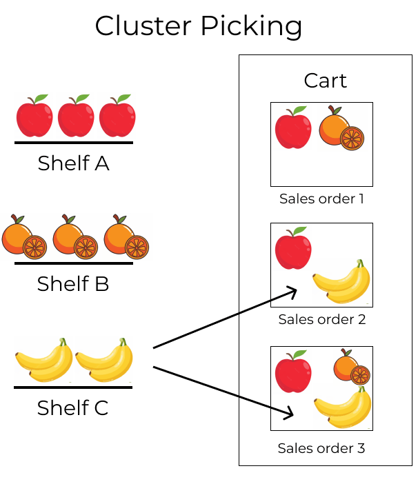

# Cluster picking

::: 
:::

Cluster picking is an advanced picking method that combines the
efficiency of `batch picking
` with
immediate sorting during the picking process. It is best suited for
warehouses with high order volumes where organization and speed are
critical.

Unlike batch picking, which requires a separate sorting step after
picking, cluster picking sorts items directly into designated bins or
containers for each *sales order* (SO). This eliminates the need for
post-picking consolidation, making it ideal for operations prioritizing
speed and accuracy.

Cluster picking is particularly effective in environments where
immediate organization is crucial, and orders contain a mix of items
that need precise sorting during, rather than after, the picking
process.

However, cluster picking does have some disadvantages. For instance,
urgent orders cannot be prioritized, and optimized batches must be
manually created beforehand. As a result, the picking process can lead
to bottlenecks.

:::: 
::: example
#\. `SO (Sales Order)` 1 calls for one
apple and orange #. `SO (Sales Order)` 2
calls for one apple and banana #. `SO (Sales Order)` 3 calls for one apple, orange, and banana

Apples are stored in Shelf A, oranges in Shelf B, and bananas in Shelf
C.

To pick products for three orders at once, the cart is loaded with three
empty packages.

Starting at Shelf A, the picker places apples into each package. Next,
the picker navigates to Shelf B, and places oranges in the packages
designated for `SO (Sales Order)` 1 and
`SO (Sales Order)` 3. Finally, the picker
pushes the cart to Shelf C, and loads packages for
`SO (Sales Order)` 2 and
`SO (Sales Order)` 3 with a banana, each.

With the packages for all three `SOs (Sales Orders)` packed, the picker pushes the cart to the output location,
where the packages are sealed and prepared for shipment.

:::
::::

## Configuration

To enable cluster picking, begin by navigating to
`Inventory app ‣ Configuration
‣ Settings`. Under the
`Operations` heading, activate the
`Packages` and
`Batch, Wave & Cluster Transfers`
options.

Since batch picking is used to optimize the *pick* operation in Odoo,
the `Storage
Locations` and
`Multi-Step Routes` options, under
the `Warehouse` heading, must also be
checked on this settings page.

*Storage locations* allow products to be stored in specific locations
they can be picked from, while *multi-step routes* enable the picking
operation itself.

When finished, click `Save`.

### Packages setup 

To configure the containers to be used during the picking process,
navigate to `Inventory app ‣ Products ‣ Packages`. Click the `New` button to create a new package.

On the new package form, the `Package Reference` is pre-filled with the next available
[PACK] number in the system. `Pack Date` is automatically set to the creation date of the form.

Set the `Package Use` field to
`Reusable Box`.

::: example
A package intended for cluster picking is named
[CLUSTER-PACK-3] for easy identification. For this workflow,
the products are directly packed using their intended shipping boxes, so
`Package Use` is set to
`Reusable Box`.

:::

## Create cluster batch

To create a cluster, navigate to `Inventory app` and select the operation type card,
`Delivery Orders` or
`Pick` (whichever is the first
operation in the delivery flow).

::: tip

Cluster pick batches can be created for outgoing shipments in one, two,
or three steps.
::::

Click the checkbox to the left of the corresponding outgoing operation
to add them to the batch. With the desired pickings selected, click the
`fa-cog` `Actions` button, and select the `Add to batch` option from the resulting drop-down menu.

::: example
To create a cluster batch, as shown in the `example above
`,
in a warehouse configured with two-step outgoing shipments, the
following pick operations are selected:

- \`WH/PICK/00007\`: linked to `SO (Sales Order)` 88 for one apple and orange.
- \`WH/PICK/00008\`: linked to `SO (Sales Order)` 89 for one apple and banana.
- \`WH/PICK/00009\`: linked to `SO (Sales Order)` 90 for one apple, orange, and banana.

:::

Doing so opens an `Add to batch`
pop-up window, wherein the employee `Responsible` for the picking can be assigned.

Choose from the two options in the `Add to` field to either: add to `an existing
batch transfer`, or create
`a new batch transfer`.

Then, add a `Description` for this
batch.

::: tip

The `Description` field can be used
to add additional information to help workers identify the source of the
batch, where to place the batch, what shipping containers to use, etc.
::::

To create draft batch pickings to be confirmed at a later date, select
the `Draft` checkbox.

Conclude the process by clicking `Confirm`.

## Process batches

To process batches, navigate to
`Inventory app ‣ Operations ‣ Batch Transfers`. Click on a batch to select it.

In the `Detailed Operations` tab,
products that are to be picked are grouped by location.

Set the `Destination Package` to the
package dedicated to that particular order.

::: example
Process the cluster batch for the three orders of apples, oranges, and
bananas `example
`
by assigning each picking to a dedicated package.

At the storage location for apples, [WH/Stock/Shelf A],
assign the apples in all three pickings to one of the three reusable
packages, [CLUSTER-PACK-1], [CLUSTER-PACK-2], or
[CLUSTER-PACK-3].

Record this in Odoo using the `Destination Package` field in the `Detailed
Operations` tab.

:::
