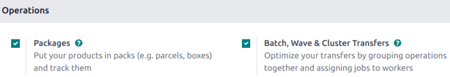
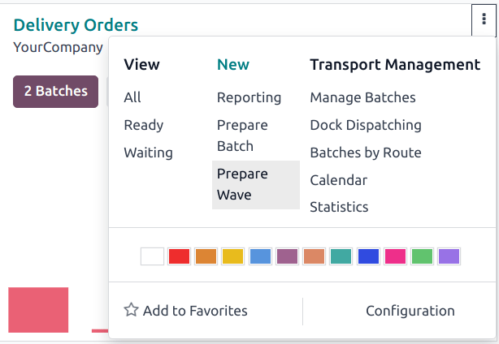
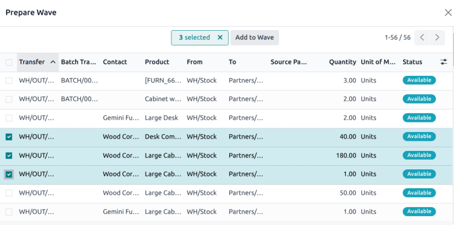
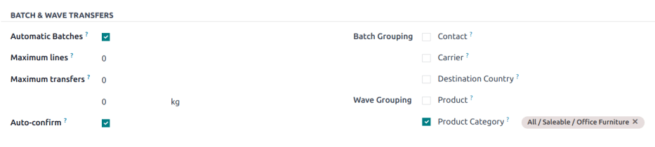

# Wave transfers

While a batch transfer is a group of several pickings, a **wave
transfer** contains certain parts of different pickings. In Odoo, wave
transfers are batch transfers with an extra step: transfers are split
before being grouped in a batch.

Wave picking is ideal for warehouses that need to optimize the handling
of high order volumes while managing complex picking criteria. With wave
transfers, orders are grouped into waves based on factors like product
location, category, or scheduled shipping times. Each wave is assigned
to a different employee for the most efficient execution.

Wave picking is particularly useful for operations where multiple sales
orders (SOs), or a single order, must be picked across different waves.
This approach enables flexible scheduling, allowing warehouses to align
picking activities with shipping deadlines, or resource availability.

::: tip
#\. `SO (sales order)` 1 calls for one
apple and one orange #. `SO (sales order)` 2 calls for one apple and one banana #.
`SO (sales order)` 3 calls for one apple,
one orange, and two bananas

Apples are stored in Shelf A, oranges in Shelf B, and bananas in Shelf
C. A warehouse employee is assigned to the wave, and is provided with
the following instructions:

- Shelf A: Pick three apples. Place them into a central cart designated
  for the wave.
- Shelf B: Pick two oranges. Add them to the same cart.
- Shelf C: Pick three bananas. Add them to the cart.

The employee then takes the cart to the sorting/packing station. Items
are then sorted and packed into individual orders.
:::

## Configuration

To enable wave picking, begin by navigating to
`Inventory ‣ Configuration ‣
Settings`. In the
`Operations` section, tick the
`Batch, Wave & Cluster
Transfers` checkbox to enable the
setting.

Next, the `Storage Locations` and
`Multi-Step Routes` options, under
the `Warehouse` heading, must also be
checked on this settings page.

*Storage locations* allow products to be stored in specific locations
they can be picked from, while *multi-step routes* enable the picking
operation itself.

Then, click `Save` to save the
changes.

## Create a wave

Wave transfers can only contain product lines from transfers of the same
operation type. To view all the transfers and product lines in a
specific operation, navigate to the `Inventory app`. Find the desired Kanban card, then click the
`fa-ellipsis-v`
`(vertical ellipsis)` icon to open
the options menu. Under `New`, click
`Prepare Wave`.

### Create a new wave

On the `Prepare Wave` pop-up, stock
moves lines are grouped by source location. Select the checkboxes for
the product lines that should be added. Then, click
`Add to Wave`.

::: tip

Use the `Filters` in the search bar
to group lines with the same product, location, carrier, etc.
::::

### Add products to an existing wave

To add products to an existing wave, navigate to
`Inventory ‣ Operations ‣ Wave
Transfers`. Click on the
appropriate wave from the list to open it.

Under the `Detailed Operations` tab,
click `Add a line`. Then, in the
`Product` field, search for the
desired product.

## Process a wave

To view all wave transfers and their statuses, go to
`Inventory ‣ Operations ‣
Wave Transfers`. Click on the
appropriate wave from the list to open it.

To assign the wave to a specific employee, click the
`Responsible` field and select the
appropriate name from the drop-down list.

To designate a
`Dock location `, select an option from the drop-down menu in the
`Docks Location` field.

::: tip

The
`dispatch management system ` feature in Odoo is used to plan and build shipments.
Assigning batches to loading docks ensures the right products are pack
into the appropriate trucks for delivery.
::::

Select a `Vehicle` from the
drop-down. Making a selection in this field automatically updates the
`Vehicle Category` field.

Enter a `Description` for this wave,
if desired.

::: tip

The `Description` field is
automatically generated for `automatic waves
`.
::::

## Automatic waves 

Waves can be automatically created and assigned based on different
criteria. The *Automatic Batches* option is defined on the *operation
type* level, which enables the creation of waves with distinct grouping
criteria for each operation type.

To enable *Automatic Batches*, navigate to
`Inventory app ‣ Configuration ‣
Operation Types`, and select the
desired operation type (e.g. `Delivery`, `Pick`, etc). Under
the `Batch & Wave Transfers` heading,
tick the `Automatic Batches`
checkbox.

Then, select one or more `Wave Grouping` criteria by ticking the appropriate checkbox. Even if
more than one grouping option is selected, only one wave is created.

Automatic waves can be created based on the following criteria:

- `Product`: Split transfers by
  product, then group transfers that have the same product.
- `Product Category`: Split transfers
  by product category, then group transfers that have the same product
  category.

