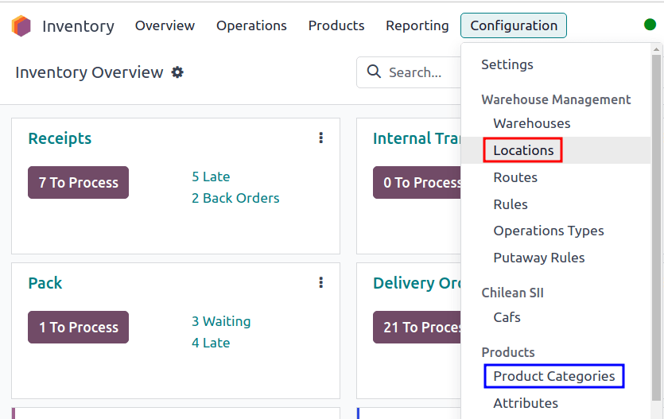

# Removal strategies

For companies with warehouses, *removal strategies* determine **which**
products are taken from the warehouse, and **when**. For example, for
perishable products, prioritizing the picking of goods with the nearest
expiration date helps minimize food spoilage.

The following columns in the table below list the removal strategies
available in Odoo, and detail how pickings are determined along with the
picking order. Leverage these removal strategies to have Odoo
automatically select how products are selected for orders:

                    `FIFO `                              `LIFO `                              `FEFO `                             `Closest Location `      `Least Packages `
  ----------------- ------------------------------------------------------------------------------------------- ------------------------------------------------------------------------------------------- ------------------------------------------------------------------------------------------ ------------------------------------------------------------------------------------------- -----------------------------------------------------------------------------------------
  Based on          `Incoming date `   `Incoming date `   `Removal date `   `Location sequence `   `Package quantity `
  Selection order   First in                                                                                    Last in                                                                                     `First to expire `    Alphanumeric name of location                                                               Quantity closest to fulfilling demand

For comprehensive examples for how to use each removal strategy, refer
to each individual documentation page.

## Configuration 

Removal strategies are set on either the product category or storage
location.

Configure removal strategies on the location by going to
`Inventory ‣ Configuration
‣ Locations`, and selecting
the desired location. On the location form, choose a removal strategy
from the `Removal Strategy` field\'s
drop-down menu options.

::: warning

To set a removal strategy on a location, the
`Storage Locations` and
`Multi-Step Routes` settings **must**
be enabled in `Inventory ‣
Configuration ‣ Settings`.

These features are **only** necessary when setting the removal strategy
on a location.
::::

Configure removal strategies on product categories by going to
`Inventory ‣
Configuration ‣ Product Categories` and selecting the intended product category. Next,
choose a removal strategy from the
`Force Removal Strategy` drop-down
menu options.

::: warning

When there are different removal strategies applied on both the location
and product category for a product, the value set on the
`Force Removal Strategy` field set on
a `Product Category` form is applied
as top priority.
::::

## Required features

While some removal strategies are available by default, some additional
features **must** be enabled in
`Inventory ‣ Configuration ‣ Settings` for the removal strategy option to appear in the
drop-down menu of the `Force Removal Strategy` or `Removal
Strategy` field.

Refer to the table below for a summary of required features. Otherwise,
refer to the dedicated sections for the removal strategy for more
details on requirements and usage.

                      FIFO                    LIFO                    FEFO                                     Closest Location                       Least Packages
  ------------------- ----------------------- ----------------------- ---------------------------------------- -------------------------------------- ----------------
  Required features   Lots & Serial Numbers   Lots & Serial Numbers   Lots & Serial Numbers, Expiration Date   Storage Locations, Multi-Step Routes   Packages

### Lots and serial numbers 

Lots and serial numbers differentiate identical products and track
information like arrival or expiration dates. To enable this feature,
navigate to `Inventory ‣ Configuration
‣ Settings`. Under the
`Traceability` heading, check the box
beside `Lots &
Serial Numbers` to enable the
feature.

Next, ensure the intended product is tracked by lots or serial numbers
by navigating to the product form through
`Inventory ‣ Products ‣ Products`, and selecting the desired product. On the product
form, switch to the `Inventory` tab,
and under the `Tracking` field,
select either the `By Unique Serial Number` or `By
Lots` options.

After enabling the features, assign lot or serial numbers to products
using an `inventory
adjustment ` or during `product
reception `.

### Locations and routes

**Storage locations** and **multi-step routes** are necessary features
for setting **all** types of removal strategies on a location. However,
these features are specifically required for the closest location
removal strategy since it is only applied at the location level.

To activate these features, navigate to
`Inventory ‣ Configuration ‣ Settings`. Under the `Warehouse` heading, enable the
`Storage Location` and
`Multi-Step Routes` features.

### Expiration date 

Enable the **expiration date** feature to track expiration dates, best
before dates, removal dates, and alert dates on a lot or serial number
by navigating to `Inventory ‣
Configuration ‣ Settings`.

Under the `Traceability` heading,
ensure the `Lots & Serial Numbers`
feature is selected, and then select the check box for
`Expiration Dates` to enable the
feature.

### Packages 

The *packages* feature is used to group products together and is
required for the least packages removal strategy.

Navigate to `Inventory ‣ Configuration ‣ Settings` and select the check box for the
`Packages` feature.

::: 
removal_strategies/fifo removal_strategies/lifo removal_strategies/fefo
removal_strategies/closest_location removal_strategies/least_packages
:::
