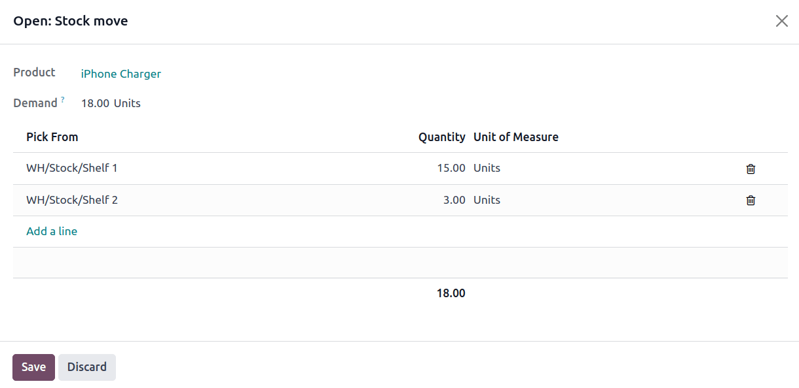

# Closest location removal

For the *Closest Location* removal strategy, products are picked based
on the alphanumeric order of storage location titles.

The goal of this strategy is to save the warehouse worker from taking a
long journey to a farther shelf when the product is also available at a
closer location.

::: 
To understand *location sequence* in the closest removal strategy,
consider the following example:
:::

::: tip
A product is stored in the following locations: [Shelf
A/Pallet], [Shelf A/Rack 1], and [Shelf A/Rack
2].

The sublocation, [Pallet], is on the ground level. Products
stored here are easier to retrieve, compared to requiring a forklift to
reach [Rack 1] and [Rack 2]. The storage
locations were strategically named in alphabetic order, based on ease of
access.
:::

::: warning

To use this removal strategy, the `Storage Locations` and `Multi-Step Routes` settings **must** be enabled in
`Inventory app ‣ Configuration ‣ Settings`.
::::

## Location names 

To configure location names, begin by navigating to
`Inventory app ‣ Configuration
‣ Locations`. Then, select an
existing location, or click `New` to
create a new one, and then enter the desired name in the
`Location Name` field.

Once the locations are named in alphabetical order, based on their
proximity to the output or packing location, set the removal strategy on
the `parent location
`.

To do that, in the `Locations` list,
select the parent location of the alphabetically named storage
locations.

Doing so opens the form for the parent location. In the
`Removal Strategy` field, select
`Closest Location`.

::: tip
In a warehouse, the storage location [WH/Stock/Shelf 1] is
located closest to the packing area, where products retrieved from
shelves are packed for shipment. The popular product, [iPhone
charger] is stored in three locations, [WH/Stock/Shelf
1], [WH/Stock/Shelf 2], and [WH/Stock/Shelf
3].

To use closest location, set the removal strategy on the parent
location, \'WH/Stock\'.
:::

## Workflow

To see how the closest location removal strategy works, consider the
following example, featuring the popular product, [iPhone
charger], which is stored in [WH/Stock/Shelf 1],
[WH/Stock/Shelf 2], and [WH/Stock/Shelf 3].

Fifteen, five, and thirty units are in stock at each respective
location.

::: tip

To check the on-hand stock at each storage location, navigate to the
product form, and click the `On Hand`
smart button.

::::

Create a
`delivery order ` for eighteen units of the [iPhone charger] by
navigating to the `Sales app`
and creating a new quotation.

After adding the products, clicking `Confirm` creates a delivery order that reserves items stored at
the closest location, using the removal strategy.

For more details about *where* the units were picked, select the
`⦙≣ (bulleted list)` icon, located on
the far-right. Doing so opens the `Open: Stock move` pop-up window that displays how the reserved items were
picked, according to the removal strategy.

In the `Open: Stock move` pop-up
window, the `Pick from` field
displays where the quantities to fulfill the `Demand` are picked. All fifteen of the units stored at the
closest location, [WH/Stock/Shelf 1], are picked first. The
remaining three units are then selected from the second closest
location, [WH/Stock/Shelf 2].

