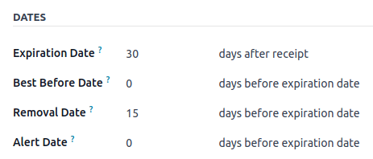
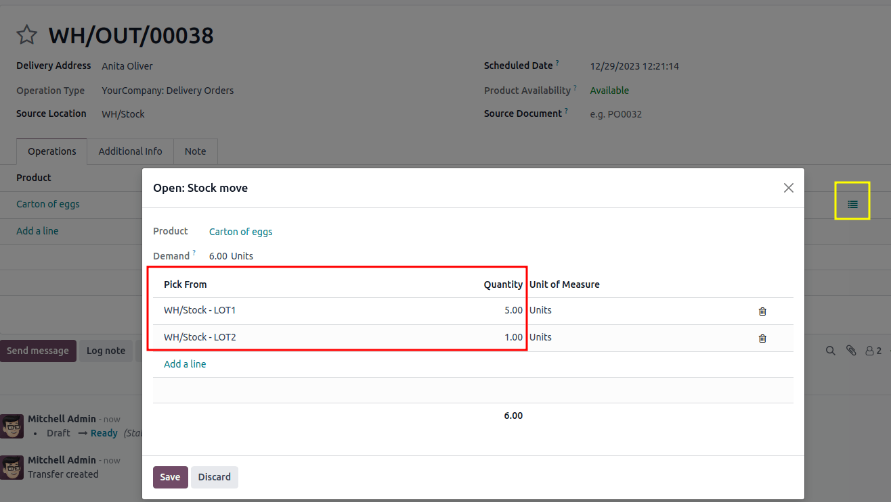

# FEFO removal

The *First Expired, First Out* (FEFO) removal strategy targets products
for removal based on their assigned removal dates.

## Removal date 

Products **must** be removed from inventory before their *removal date*,
which is set as a certain number of days before the product\'s
*expiration date*.

The user sets this number of days by navigating to the product form\'s
`Inventory` tab. Under the
`Traceability` section, ensure the
`Tracking` field is set to either
`By Lots` or
`By Unique Serial Number`.

Next, select the `Expiration Date`
option, which makes the `Removal Date` field (and other date fields) appear.

::: warning

The `Lots and Serial Numbers` and
`Expiration Dates` features **must**
be enabled in
`Inventory app ‣ Configuration ‣ Settings` to track expiration dates.
::::

The expiration date of a product is determined by adding the date the
product was received to the number of days specified in the
`Expiration Date` field of the
product form.

The removal date takes this expiration date, and subtracts the number of
days specified in the `Removal Date`
field of the product form.

::: tip
In the `Inventory` tab of the
product, [Egg], the following `Dates` are set by the user:

- `Expiration Date`: [30]
  days after receipt
- `Removal Date`: [15]
  days before expiration date

A shipment of Eggs arrive at the warehouse on January 1st. So, the
expiration date of the Eggs is **January 31st** (Jan 1st + 30). By
extension, the removal date is **January 16th** (Jan 31 -15).
:::

::: 
To view the expiration dates of items in stock, navigate to the product
form, and click the `On Hand` smart
button.
:::

Next, click the additional options icon, located on the far-right, and
select the columns: `Expiration Date`
and `Removal Date`.

## Workflow

Using the `FEFO (First Expired, First Out)` removal strategy ensures that products with the nearest
removal date are picked first.

To understand how this removal strategy works, consider the following
example below about the product, [Carton of eggs], which is
a box containing twelve eggs.

The product is tracked `By Lots`, and
the product category\'s `Force Removal
Strategy` is set to
`First Expired, First Out (FEFO)`.

                                                                                         LOT1          LOT2       LOT3
  -------------------------------------------------------------------------------------- ------------- ---------- ----------
  On-hand stock                                                                          5             2          1
  Expiration date                                                                        April 4       April 10   April 15
  `Removal date `   February 26   March 4    March 9

To see the removal strategy in action, go to the
`Sales app` and create a new
quotation.

Clicking `Confirm` creates a delivery
order for today, December 29th, and the lot numbers with the soonest
expiration dates are reserved, using the
`FEFO (First Expired, First Out)` removal
strategy.

To view the detailed pickings, click the
`⦙≣ (bulleted list)` icon, located on
the far-right of the Carton of egg\'s product line, in the
`Operations` tab of the delivery
order. Doing so opens the `Open: Stock move` pop-up window.

In the `Open: Stock move` pop-up
window, the `Pick from` field
displays where the quantities to fulfill the `Demand` are picked from.

Since the order demanded six Cartons of eggs, using the
`FEFO (First Expired, First Out)` removal
strategy, all five Cartons from [LOT1], with the removal
date of February 26th, are picked. The remaining Carton is selected from
[LOT2], which has a removal date of March 4th.

