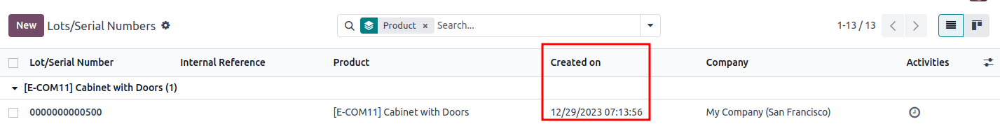

# FIFO removal

The *First In, First Out* (FIFO) removal strategy selects products with
the earliest arrival dates. This method is useful for companies selling
products that have short demand cycles, like clothes, for example. By
using `FIFO (First In, First Out)`,
companies can prevent prolonged stock retention of specific styles.

::: tip
Various quantities of the product, [T-shirt], tracked by lot
numbers, arrive on August 1st and August 25th. For an order made on
September 1st, the `FIFO (First In, First Out)` removal strategy prioritizes lots that have been in stock
the longest. So, products received on August 1st are selected first for
picking.

:::

## Arrival date 

To see the product lot or serial number that arrived in inventory first,
navigate to
`Inventory app ‣ Products ‣ Lots/Serial Numbers`.

Then, select the `▶️ (right-pointing arrow)` icon on the left of a product line, in order to reveal
a list of the product\'s lots or serial numbers that are in stock. The
`Created
On` field shows the lot/serial number
creation date, which is, essentially, the arrival date.

::: tip
Serial number [00000000500] of the product, [Cabinet with
Doors], arrived on December 29th, as displayed in the
`Created On` field.

:::

## Workflow

To understand how `FIFO (First In, First Out)` rotates products out, consider the following example,
focusing on three lots of white shirts.

The shirts are from the *All/Clothes* category, where
`FIFO (First In, First Out)` is set as
the `Force Removal Strategy`.

The white shirts are tracked `By Lots` in the `Inventory`
tab of the product form.

The following table represents the on-hand stock and lot number details
of white shirts.

                                                                                           LOT1      LOT2      LOT3
  ---------------------------------------------------------------------------------------- --------- --------- -------
  On-hand stock                                                                            5         3         2
  `Created on `   March 1   April 1   May 1

To see the removal strategy in action, create a
`delivery order ` for six white shirts by navigating to the
`Sales app` and creating a new
quotation.

After clicking `Confirm` on the sales
order, a delivery order with the oldest lot numbers for shirts are
reserved, using the `FIFO (First In, First Out)` removal strategy.

To view the detailed pickings, click the
`⦙≣ (bulleted list)` icon, located on
the far-right of the white shirt\'s product line in the
`Operations` tab of the delivery
order. Doing so opens the `Open: Stock move` pop-up window.

In the `Open: Stock move` pop-up
window, the `Pick from` field
displays where the quantities to fulfill the `Demand` are picked from. Since the order demanded six shirts,
all five shirts from [LOT1], and one shirt from
[LOT2], are selected.

