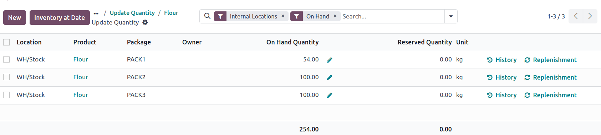
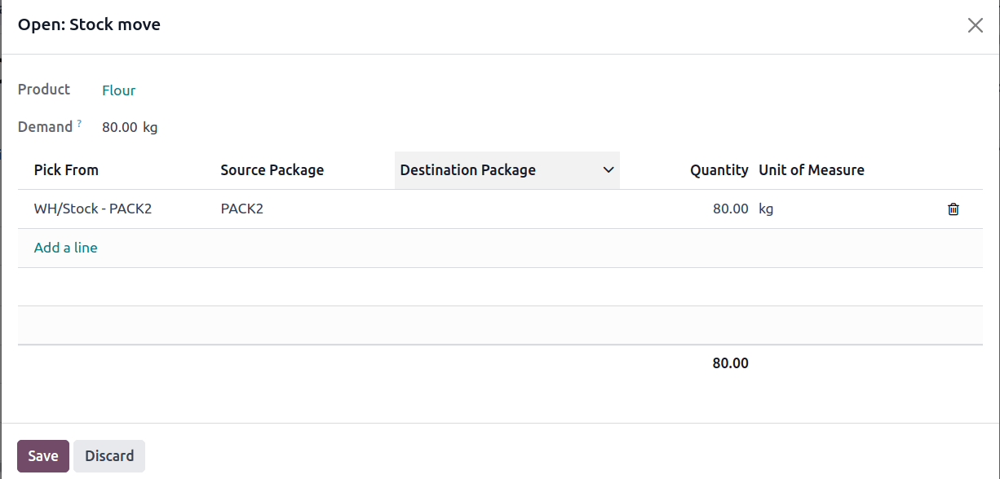

# Least packages removal

The *Least Packages* removal strategy fulfills an order by opening the
fewest number of packages, which is ideal for maintaining organized
stock without needing to open multiple boxes.

To understand how the removal strategy works, consider the following
example, featuring a warehouse that stores packages of flour in bulk
packages of [100 kg].

To minimize moisture, and/or prevent pests from entering open packages,
the least packages removal strategy is used to pick from a single,
opened package.

:::: 
::: tip
A package of [100 kg] of flour is depleted to [54
kg] after fulfilling some orders. There are other packages
of [100 kg] in stock.

1.  When an order for [14 kg] of flour is placed, the
    package of [54 kg] is selected.
2.  When an order for *more* than [54 kg] of flour is
    placed, an unopened [100 kg] package is used to fulfill
    the order. While this temporarily results in two open packages,
    these open packages are prioritized in the next picking.
:::
::::

## Workflow

Using the least package removal strategy, the fewest number of packages
is used to fulfill an order.

::: warning

The
`Packages feature ` **must** be enabled to use this strategy.
::::

Consider the following example, featuring the product,
[Flour]. The product\'s `Units of
Measure` field, located on the
product form, is set to [kg]. The product is stored in
packages of [100 kg], with one remaining package containing
[54 kg]. The product category\'s `Force
Removal Strategy` is set to
`Least Packages`.

::: tip

To check the product\'s on-hand stock, navigate to the product form, and
click the `On
Hand` smart button.

::::

Create a
`delivery order ` for eighty kilograms of flour by going to the
`Sales app` and creating a new
quotation. After clicking `Confirm`,
the delivery order is created.

On the delivery order, the `Quantity`
field displays the amount automatically picked, according to the removal
strategy.

For more details about *where* the units were picked, select the
`⦙≣ (bulleted list)` icon, located on
the far-right. Doing so opens the `Open: Stock move` pop-up window, displaying how the reserved items were
picked, according to the removal strategy.

In the `Open: Stock move` pop-up
window, the `Pick from` field
displays where the quantities to fulfill the `Demand` are picked. Since the order demanded eighty kilograms,
which exceeds the quantity in the opened package of [54 kg],
an unopened package of [100 kg] is selected.

