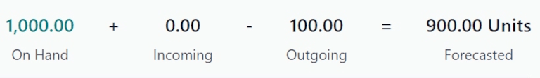

# At confirmation reservation

::: 
:::

The *at confirmation* reservation method reserves products **only** when
a sales order (SO) is confirmed, **and** if enough stock of the products
included in the `SO (Sales Order)` is
already available.

## Configuration

To set the reservation method to *at confirmation*, navigate to
`Inventory app ‣
Configuration ‣ Operations Types`. Then, select the desired
`Operation Type` to configure, or
create a new one by clicking `New`.

In the `General` tab on the operation
type form, locate the `Reservation Method` field, and select `At Confirmation`.

## Workflow

To see the *at confirmation* reservation method in action, create a new
`SO (Sales Order)` by navigating to
`Sales app ‣ New`.

Add a customer in the `Customer`
field. Then, in the `Order Lines`
tab, click `Add a product`, and
select a product to add to the quotation from the drop-down menu.
Finally, in the `Quantity` column,
adjust the desired quantity of the product to sell.

Once ready, click `Confirm` to
confirm the sales order.

Click the `📈 (area graph)` icon on
the product line to reveal the product\'s
`Availability` tooltip, which reveals
the `Reserved` number of units for
this order.

::: tip

If there is **not** sufficient quantity of stock for the product
included in the `SO (Sales Order)`, the
`📈 (area graph)` icon is red,
instead of green.

Instead of revealing the reserved number of units for the order, the
`Availability` tooltip reads
`Available`, and reveals the
available number of units (e.g., [0 Units]).
::::

::: admonition
Forecasted Report

To see all the factors that affect product reservation, click the
`View Forecast` internal link arrow
to view the `Forecasted Report`
dashboard.

The `Forecasted Report` displays
forecast information about the product(s) included in the sales order;
namely, any live receipts of the product, and any active sales orders,
which are listed in the `Used By`
column. See how each order is fulfilled in the
`Replenishment` column.

Additionally, the `Forecasted`
quantity is calculated at the top of the page, by adding the
`On Hand` and
`Incoming` quantity, and subtracting
the `Outgoing` quantity, as shown
below:

If one order should be prioritized over another order, click the
`Unreserve` button on the
corresponding order line in the `Replenishment` column.
:::

To deliver the products, click the `Delivery` smart button at the top of the sales order form. To
confirm that the reservation worked properly, ensure that the `Product
Availability` field reads
[Available] (in green text), and the numbers in the
`Demand` and
`Quantity` columns match (in this
case, both should read [100.00]).

Once ready, click `Validate`.

