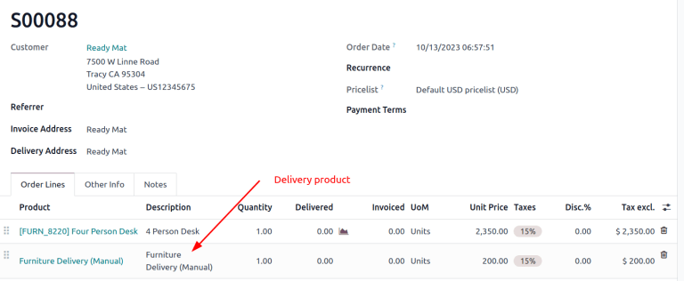

# Delivery methods

When activated in Odoo, the *Delivery Methods* setting adds the option
of calculating the cost of shipping on sales orders and e-commerce
shopping carts.

When integrated with a
`third-party carrier `, shipping prices are calculated based on the carrier\'s
pricing information.

## Configuration

To calculate shipping on sales orders and e-commerce, the *Delivery
Costs* module must be installed. To do so, navigate to the
`Apps` application from the main
Odoo dashboard.

Then, remove the `Apps` filter, and
type in [Delivery Costs] in the
`Search...` bar. After finding the
`Delivery Costs` module, click
`Activate` to install it.

## Add shipping 

Shipping methods can be added to sales orders in the form of delivery
products, which appear as individual line items. First, navigate to the
desired sales order by going to `Sales
app ‣ Orders ‣ Orders`.

On the sales order, click the `Add shipping` button, which opens the `Add a
shipping method` pop-up window. Then,
choose a `Shipping Method` from the
list.

The `Total Order Weight` is
pre-filled based on product weights (that are defined in the
`Inventory` tab for each product
form). Edit the field to specify the exact weight, and then click
`Add` to add the shipping method.

::: tip

The amount defined in `Total Order Weight` overwrites the total product weights defined on the
product form.
::::

The shipping cost is added to the *sales order line* as the
`Delivery Product` detailed on the
shipping method form.

::: example
[Furniture Delivery], a delivery product with a fixed rate
of [\$200], is added to sales order [S00088].

:::

### Delivery order

The shipping method added to the sales order is linked to the shipping
carrier details on the delivery order. To add or change the delivery
method on the delivery itself, go to the
`Additional Info` tab and modify the
`Carrier` field.

::: 
setup_configuration/new_delivery_method
setup_configuration/third_party_shipper setup_configuration/labels
setup_configuration/bpost setup_configuration/dhl_credentials
setup_configuration/envia_shipping setup_configuration/fedex
setup_configuration/sendcloud_shipping
setup_configuration/starshipit_shipping
setup_configuration/ups_credentials setup_configuration/zebra
setup_configuration/cancel setup_configuration/invoicing
setup_configuration/label_type setup_configuration/multipack
setup_configuration/print_on_validation setup_configuration/dispatch
:::
