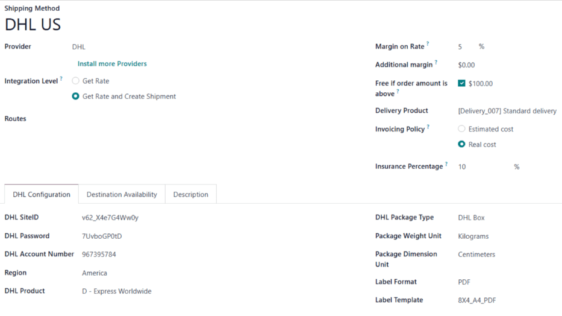
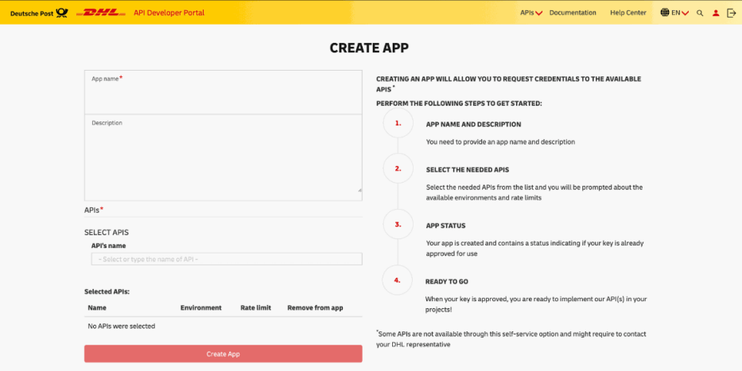

# DHL integration

DHL is one of the shipping carriers for which a *shipping connector* is
available in Odoo\'s **Inventory** app. By enabling the shipping
connector in the app\'s settings, and configuring at least one *shipping
method*, the process of `calculating shipping rates
` and
`generating shipping labels ` is
greatly simplified.

::: tip

While a variety of shipping connectors are available for different
carriers, this documentation details the configuration settings specific
to integrating DHL. For instructions on configuring the integration
settings common to all shippers, see the documentation on `third-party
shippers `.
::::

## Enable DHL shipping connector

Before creating a DHL shipping method, enable the carrier\'s shipping
connector. To do so, navigate to
`Inventory app ‣ Configuration ‣ Settings`.

Scroll down to the `Shipping Connectors` section, and tick the checkbox next to
`DHL Express Connector`. Finally,
click `Save` to apply the changes.

Then, click the `fa-arrow-right`
`DHL Shipping Methods` link to open a
page showing all shipping methods with the *Provider* set to DHL.

## Configure DHL shipping method

After enabling the shipping connector for DHL, shipping methods can be
configured for the carrier. Once configured, a shipping method can be
added as a line item to sales orders (SOs), which allows for automatic
computation of shipping rates, and generation of shipping labels.

To create a new DHL shipping method, navigate to
`Inventory app ‣ Configuration ‣
Settings`. In the
`Shipping Connectors` section, select
the `DHL Shipping
Methods` link below the
`DHL Express Connector` checkbox.

::: tip

It is also possible to see existing shipping methods for every carrier,
by navigating to
`Inventory app ‣ Configuration ‣ Shipping Methods`.
::::

Click `New` to open a blank shipping
method form. If a shipping method has already been created, it can be
selected from this screen.

### General information

Begin configuring the shipping method by entering its title in the
`Shipping Method` field.

In the `Provider` drop-down menu,
select the `DHL` option. After doing
so, a new `DHL Configuration` tab
appears at the bottom of the form.

All other fields in this section are identical on the shipping method
forms for each shipping carrier. See the documentation on
`third-party shippers ` for instructions on how to properly configure them.

### DHL Configuration

The `DHL Configuration` tab on the
shipping method form is used to connect the user\'s DHL account to Odoo,
and configure the shipping method\'s details.

#### DHL developer credentials

To integrate DHL with Odoo, developer credentials must be retrieved from
DHL\'s Developer Portal. These credentials are used to link the user\'s
DHL account to Odoo\'s **Inventory** app.

::: warning

The *SiteID* and *Password* are different credentials than the ones used
to log in to a DHL account.
::::

##### With DHL Express Account

If a DHL Express account is available, log into the [DHL Developer
portal](https://developer.dhl.com/api-reference/dhl-express-mydhl-api#get-started-section/user-guide%get-access)
and [request a DHL API account
number](https://developer.dhl.com/form/dhl-express-onboarding).

Then, in Odoo, on the shipping method form, enter the *DHL API Key* in
the `DHL SiteID` field, and the *API
Secret* in the `DHL Password` field.

##### Without DHL Express Account

If a DHL Express account is **not** available:

1.  Begin by opening a [DHL Express
    account](https://mydhl.express.dhl/gb/en/ship/open-account.html#/fs-step=connectors&fs-step=connectors).

2.  Once the developer portal account has been confirmed, log in to the
    portal using the username and password. Click the user avatar in the
    top-right corner of the screen to open the user dashboard.

3.  On the dashboard, open the `Apps`
    tab, and create an app. Follow the four steps in the app creation
    flow (app name, needed apps, app status, confirmation) to complete
    the setup.

    

4.  After setting up the DHL Express account, go
    [here](https://developer.dhl.com/user/login?destination=/form/dhl-express-onboarding)
    to get the *DHL API Key* and *API Secret* credentials.

Then, in Odoo, on the shipping method form, enter the *DHL API Key* in
the `DHL SiteID` field, and the *API
Secret* in the `DHL Password` field.

#### Shipping details

The rest of the fields in the `DHL Configuration` tab are used to configure the shipping method itself:

- `Region`: the region in which the
  shipping method is used.
- `DHL Product`: the shipping service
  purchased from DHL (e.g. Express Worldwide).
- `DHL Package Type`: the type of DHL
  package used for delivery (e.g. DHL Box).
- `Package Weight Unit`: the unit of
  measure used to display package weight.
- `Package Dimension Unit`: the unit
  of measure used to display package size.
- `Label Format`: the file format
  used to generate shipping labels.
- `Label Template`: the paper size
  used to print shipping labels.

::: warning

Before selecting service options for a shipping method, make sure those
services are actually available for the DHL account. Available services
depend on the contract negotiated with DHL.
::::

#### Options

Additional settings are available in the `Options` section at the bottom of the
`DHL Configuration` tab:

- `Generate Return Label`: Enable
  this option to automatically generate a return label after validating
  a delivery order.
- `Dutiable Material`: Enable this
  option if the shipping method is liable to customs or other duties.

## Turn on the DHL Connection

Once the DHL connection is set up, use the smart buttons at the top of
the form to publish, turn on production mode or activate debug logging.

- `Unpublished`/`Published`:
  determines if this shipping method is available on the user\'s
  **eCommerce** website.
- `Test Environment`/`Production Environment`: determines whether label creation is for testing and
  cancelled immediately (Test) or generate real shipping label that is
  charged to DHL account (Production).
- `No Debug`/`Debug Requests`:
  determines whether API requests and responses are logged in Odoo (turn
  on `developer mode ` and
  go to `Settings
  app ‣ Technical ‣ Logging`).
