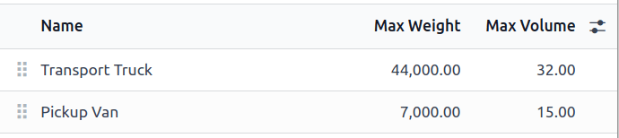
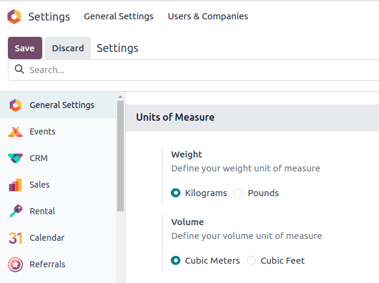
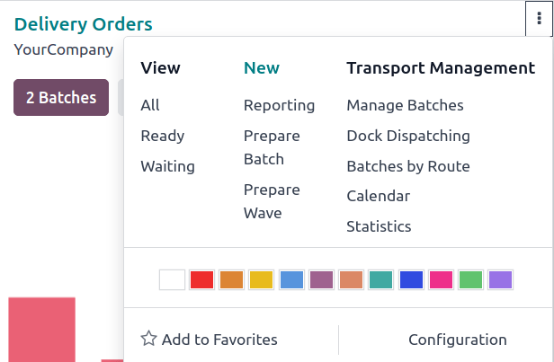
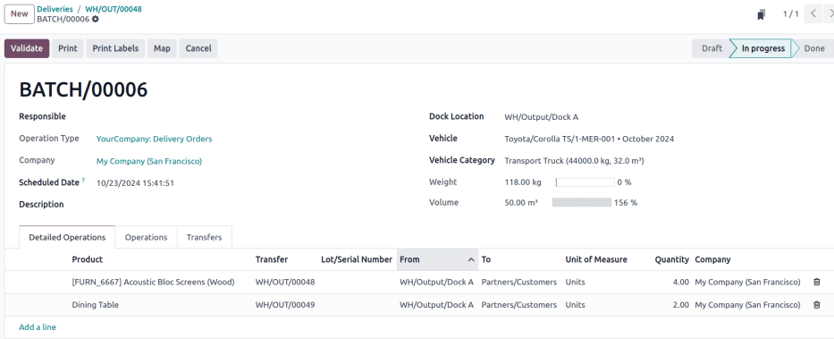
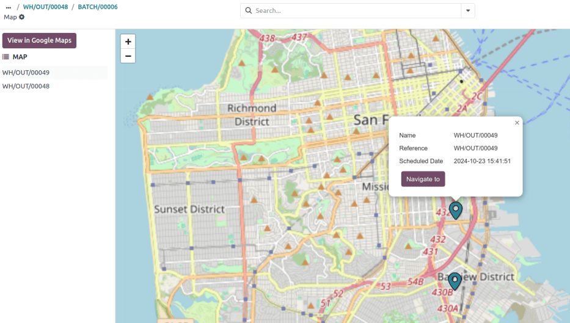
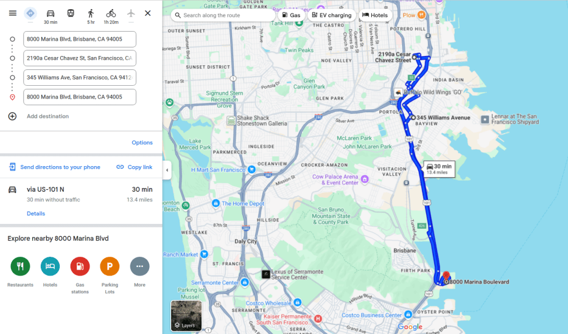

# Dispatch management system

The *dispatch management system* feature in Odoo is used to plan and
build shipments. Key features include:

- **Load building**: Group products for specific carriers, assign those
  `batches
  ` to loading
  docks, and manage vehicle assignments based on fleet capacity. This
  ensures the right products are packed into the appropriate trucks for
  delivery.
- `Fleet management `: Track and manage the capacity of in-house delivery
  vehicles.

## Configuration

To use the dispatch management system, the following setup must be
completed:

1.  `Install ` the
    **Fleet** application.
2.  Configure vehicle `capacity (volume and weight)
    `.
3.  Enter vehicle
    `car model(s) `.
4.  Enable
    `necessary features ` in the **Inventory** app.
5.  Set up `vehicles as delivery methods
    `.
6.  Create
    `dock locations `.

### Vehicle capacity 

To configure the vehicle capacity, go to
`Fleet app ‣ Configuration ‣
Categories`.

Next, click `New` to add a new
category, or click into an existing category to modify it. In the
`Name` field, enter the type of
vehicle (e.g., [Pick-up truck], [Van], or [Cargo
truck]). Then, enter the vehicle capacity in the
`Max Weight` (in kilograms) and
`Max Volume` (in cubic meters)
fields.

::: tip

The units of measurement for vehicle capacity are assigned at the global
level in the **Settings** app, in the
`Units of Measure` section.

::::

### Car model

Configuring a vehicle\'s car model is required when adding vehicles in
Odoo. Ensure the correct *Category* is selected for a car model. Doing
so automatically applies weight and volume capacities to all vehicles of
that type.

To configure, navigate to
`Fleet app ‣ Configuration ‣ Models`.

From the `Models` list, select an
existing model, or click `New` in the
top-left corner to create a new model. Then, set the relevant
`Category` field to the relevant
vehicle category.

### Inventory settings 

Next, go to
`Inventory app ‣ Configuration ‣ Settings`, and enable the required features for dispatch
management.

In the `Operations` section, tick the
`Batch, Wave & Cluster Transfers`
checkbox to prepare batches of orders for delivery.

In the `Shipping` section, tick the
`Delivery Methods` and `Dispatch
Management System` checkboxes. Doing
so allows specific vehicles to be `set as carriers
`.

In the `Warehouse` section, tick the
`Storage Locations` checkbox to
assign specific locations in the warehouse as loading zones for delivery
trucks.

Then, once all the configurations are complete, be sure to click
`Save`.

### Delivery method 

Next, assign each delivery vehicle as a *Carrier* by configuring a
delivery method.

To configure delivery methods, go to
`Inventory app ‣ Configuration ‣ Delivery
Methods`. Select an existing
delivery method, or click `New`.

On the `Delivery Method` form, enter
a name for the delivery method. It is recommended to use identifying
information, such as the vehicle description and license plate number
(e.g. [Truck 123-ABCD]).

Since the delivery methods are managed internally, set the
`Provider` to either
`Fixed Price` or
`Based on Rules`. For more
information about how shipping prices are calculated, refer to the
`Delivery method `
article.

Next, set a `Delivery Product`, which
is the product that shows up as the customer\'s
`delivery charge ` on the sales order or invoice.

Optionally, in the `Availability`
tab, set the `Countries`,
`States`, or
`Zip Prefixes` to limit the range of
local delivery.

Example delivery method, with the Zip Prefixes set to San
Francisco's zip code.

### Dock locations 

Each loading dock must have a dedicated location. To create or configure
dock locations, go to
`Inventory app ‣ Configuration ‣ Locations`.

Click the desired location, which opens the `Location` form. In the `Additional
Information` section, tick the
`Is a Dock Location` checkbox.

Location configuration page with Is a Dock Location
checkbox ticked.

## Build loads

Once setup is complete, `assign orders to a carrier
` and `group them into batches
`. Then, `configure the batch form
`, as needed.

To group products, go to the
`Inventory app ‣ Operations ‣ Deliveries`, which reveals a list of outgoing deliveries.

### Carrier assignment 

Reveal the *Carrier* column, if it is not visible by default, by
clicking the `oi-settings-adjust`
`(settings)` icon in the top-right
corner, and ticking the `Carrier`
checkbox.

::: tip

Other useful columns to enable can be `Zip` code, `Shipping Weight`, and `Shipping Volume`.
::::

Select the delivery orders for the batch by ticking the checkboxes on
the left. Next, click into the line\'s `Carrier` fields. In the resulting drop-down menu, choose the
desired vehicle\'s
`delivery method `. A `Confirmation` pop-up
window appears, indicating the number of orders being added to the
batch. Click `Confirm`, and the
carrier is updated for all the selected records.

The delivery method Truck
1-MER-001 is set as the Carrier for two delivery orders.

### Create batch 

With the carrier set, begin adding orders to a batch or wave transfer by
ticking the checkbox.

::: tip

If a delivery order is already assigned to a batch transfer, assigning a
batch transfer here does **not** update it.
::::

Then, click the `fa-cog`
`Actions` button, and click either
`Add to batch` or
`Add to wave`. In the pop-up window,
ensure `Add to` is set to `a
new [batch/wave] transfer`, then
click `Confirm`.

Delivery orders are selected to be grouped into a wave
transfer.

#### Alternative batch creation method

Another place to create batches is by going to the
`Inventory` app, and in the
`Delivery Orders` card, click the
`fa-ellipsis-v`
`(three dots)` icon. In the resulting
drop-down menu, click `Prepare batch`.

::: tip

The `Transport Management` drop-down
menu contains other tools for fleet management:

- `Manage Batches`: open list of
  batches
- `Dock Dispatching`: open weekly
  calendar view of scheduled batch operations
- `Batches by Route`: Kanban view of
  batches grouped by fulfillment route
- `Calendar`: open hourly calendar
  view of scheduled operations
- `Statistics`: open pivot table of
  the batch transfers
::::

### Batch form 

On the batch transfer form, fill the following fields out accordingly:

- `Responsible`: employee assigned to
  the picking. Leave blank if *any* worker can fulfill this picking.
- `Operation Type`: from the
  drop-down menu, select the operation type under which the picking is
  categorized.
- `Scheduled Date`: specifies the
  date by which the `Responsible`
  person should complete the transfer to the output location.
- `Dock Location`: select the loading
  location.
- `Vehicle`: select the vehicle,
  which will auto-fill `Vehicle Category`.
- `Vehicle Category`: show if the
  order exceeds the `vehicle's capacity limits
  `

::: example
The `Volume` bar is grayed out
because the capacity has been reached.

:::

#### Prepare delivery route

To help the driver prepare, click the `Map` button at the top of the batch or wave form to view
delivery destinations on a map. Selecting an individual delivery order
pinpoints its location.

::: tip

The `Map` button is only visible for
transfers with the `In progress`
status.
::::

Additionally, use the `View in Google Maps` button to generate a route from the warehouse to the
delivery points.

