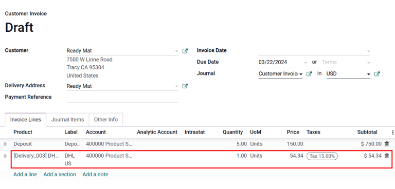

# Shipping cost invoicing

Invoicing customers for shipping after delivery ensures accurate charges
based on real-time shipping factors like distance, weight, and method.

In Odoo, shipping costs can be invoiced in two ways:

1.  Agree with the customer on a fixed cost and
    `include it in the sale order.
    `
2.  `Invoice shipping costs to the customer post-delivery
    `, reflecting the actual expenses incurred by the
    business.

## Configuration

To set prices to delivery methods, go to
`Inventory app ‣ Configuration ‣
Settings`. Under the
`Shipping` section, enable the
`Delivery Methods` feature. Then,
click `Save`.

## Add shipping method

Next, configure the the price of each delivery method by going to
`Inventory app ‣
Configuration ‣ Shipping Methods` and click the `Create` button. Doing so opens a form to provide details about
the shipping provider, including:

- `Shipping Method` (*required*) the
  name of the delivery method (e.g. [flat-rate shipping],
  [same day delivery], etc.).

- `Provider` (*required*): choose the
  delivery service, like FedEx, if using a third-party carrier Ensure
  the integration with the shipping carrier is properly installed and
  select the provider from the drop-down menu.

   
On the sales order, the delivery product appears in the
`Order Lines` tab, with the
`Unit Price` set as the shipping cost
calculated in the `Add a shipping method` pop-up window.
:::

Finally, after the product is delivered, click the
`Create invoice` button, and an
invoice is created that includes the shipping cost that was added
earlier.

Then, click the `Create and View Invoice` button, and a draft invoice is generated, with the
shipping cost included in the `Invoice Lines` tab.

## Invoice real shipping costs 

To modify the invoice to reflect the real cost of shipping, follow the
steps `above
` to create
an invoice with a delivery product with a `Unit
Price` of zero.

Then, on a draft invoice, modify the `Unit Price` to reflect the real shipping cost. Finally, invoice the
customer the adjusted shipping cost by clicking
`Confirm`.

