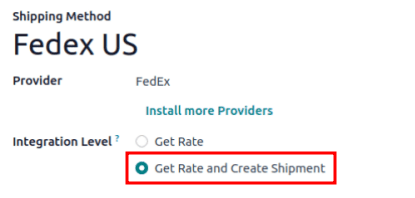
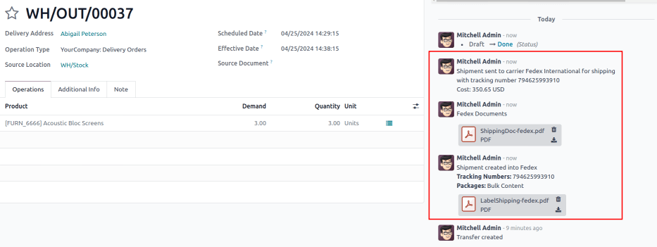

# Print shipping labels

Integrate Odoo with `third-party shipping carriers
` to automatically generate shipping labels that includes
prices, destination addresses, tracking numbers, and barcodes.

## Configuration

To generate labels for a third-party shipping carrier, first
`install the third-party shipping
connector `. Then, configure and activate the
`delivery method `, being sure to set the `Integration Level` to `Get Rate and Create Shipment` to generate shipping labels. Finally, provide the
company\'s `source address
` and `product weights
`.

### Labels for multi-step 

For companies using
`two ` or `three step
delivery `, labels can be triggered to print after validating the
picking or packing operation. To do that, go to `Inventory app ‣
Configuration ‣ Operations Types`, and choose the desired operation.

On the `Operation Type` configuration
page, tick the `Print Label`
checkbox. Enabling this feature ensures that the third-party shipping
label is printed upon validating this operation.

::: example
For
`two-step delivery `, where products are placed directly in packages during
picking, companies can print shipping labels during picking instead of
delivery. Odoo allows users to enable the
`Print Label` feature on the
[Pick] operation itself to achieve this flexibility.

:::

## Print tracking labels

Tracking labels are printed when specific operations are validated. By
default, validating a delivery order (DO) generates a tracking label in
the chatter.

::: tip

For companies using two or three step delivery, refer to the
`printing labels for multi-step
delivery ` section to learn how to print the label after validating a
picking or packing operation.
::::

When both the *Sales* and *Inventory* apps are installed, begin in the
`Sales` app, and proceed to the
desired quotation or sales order (SO). There, and `add the shipping cost
` to the order. Then, navigate to the linked
`DO (Delivery Order)` --- or another
operation type when using multi-step delivery --- to validate the
operation and print the label.

If only the *Inventory* app is installed, create
`DOs (Delivery Orders)` directly in the
`Inventory` app,
`add the third-party carrier
` in the `Carrier` field,
and validate the `DO (Delivery Order)`.

### Add shipping on quotation 

To generate a tracking label for an order, begin by creating a quotation
in `Sales
app ‣ Orders ‣ Quotations`,
clicking `New`, and filling out the
quotation form. Then, click the `Add Shipping` button in the bottom-right corner of the quotation.

In the resulting pop-up window, select the intended carrier from the
`Shipping Method` drop-down menu. The
`Total Order Weight` field is
automatically populated, based on the
`weight of products in the order `. Modify this field to overwrite the predicted weight, and
use this weight to estimate the cost of shipping.

Next, click `Get Rate` to display the
shipping cost for the customer, via the third-party carrier in the
`Cost` field.

::: warning

If clicking `Get Rate` results in an
error, ensure the `warehouse's address
` and `weight of products in the
order ` are properly configured.
::::

Click `Add` to add the cost to the
quotation, which is listed as the `configured
delivery product `. Finally, click `Confirm`
on the quotation, and click the `Delivery` smart button to access the
`DO (Delivery Order)`.

::: tip

For users who do not have the *Sales* app installed, specify the
`Carrier` by going to the
`Inventory` app, navigating to
the `DO (Delivery Order)`, and going to
the `Additional Info` tab.

::::

### Validate delivery order 

On a delivery order form, navigate to the
`Additional Info` tab to ensure the
third-party shipping carrier has been added to the
`Carrier` field.

::: warning

If the *Sales* app is not installed, the third-party carrier is set in
the `Carrier` field.
::::

After the items in the order have been packed, click
`Validate` to get the shipping
carrier\'s tracking number, and generate the shipping label.

::: tip

Create or select an existing delivery order by going to the
`Inventory` app, and selecting
the `Delivery Orders` card.
::::

The `Tracking Reference` number is
generated in the `Additional Info`
tab of the delivery order. Click the `Tracking` smart button to access the tracking link from the
shipping carrier\'s website.

The tracking label is found in PDF format in the chatter.

::: tip

For multi-package shipping, one label is generated per package. Each
label appears in the chatter.
::::

Sample label generated from Odoo's shipping connector with
FedEx.

