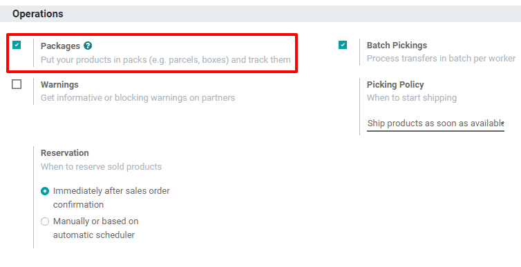
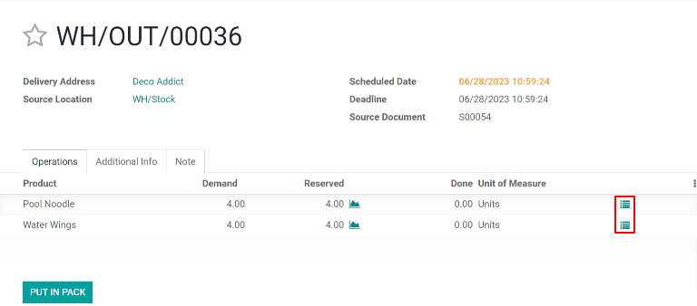
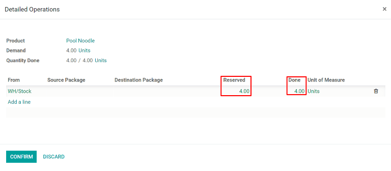
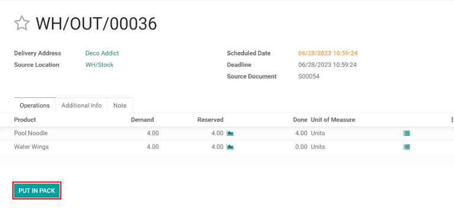
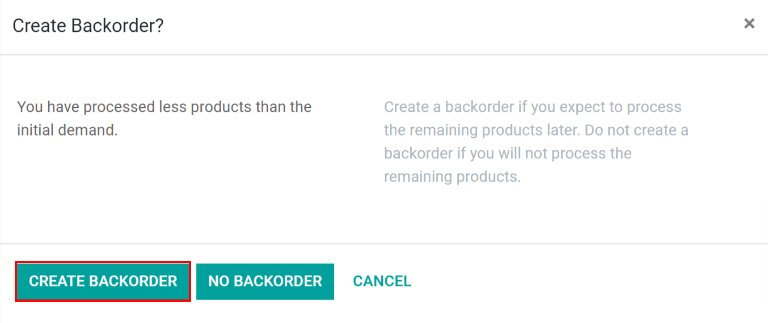

# Multi-package shipments

In some cases, a delivery order with multiple items may need to be
shipped in more than one package. This may be necessary if the items are
too large to ship in a single package, or if certain items cannot be
packaged together. Shipping a single delivery order in multiple packages
provides flexibility for how each item is packaged, without the need to
create multiple delivery orders.

## Configuration

In order to split a delivery order across multiple packages, the
*Packages* setting must be enabled. To do so, navigate to
`Inventory ‣ Configuration ‣ Settings`, then enable the checkbox next to
`Packages`. Click
`Save` to confirm the change.

## Ship items in multiple packages 

To split items in the same delivery order across multiple packages,
begin by navigating to `Inventory ‣ Delivery Orders`, then select a delivery order that has multiple
items, a multiple quantity of the same item, or both.

On the `Operations` tab, select the
`⁞≣ (menu)` icon in the line of the
product that will be shipped in the first package.

This makes a `Detailed Operations`
pop-up window appear. In the table at the bottom of the pop-up window,
the `Reserved` column shows the total
quantity of the product included in the delivery order.

If the full quantity will be shipped in the first package, enter the
number from the `Done` column in the
`Reserved` column. If less than the
full quantity will be shipped in the first package, enter a smaller
number than the one that appears in the `Reserved` column. Click `Confirm` to confirm the `Done` quantities and close the pop-up.

Repeat the same steps for every item quantity that is included in the
first package. Then, click `Put In Pack` to create a package with all of the selected items.

For the next package, follow the same steps as detailed above, marking
the quantity of each item to be included in the package as
`Done` before clicking
`Put In Pack` on the delivery order.
Continue doing so until the full quantity of all items are added to a
package.

Finally, after all of the packages have been shipped, click
`Validate` to confirm that the
delivery order has been completed.

::: tip

After one or more packages are created, a `Packages` smart button appears in the top-right corner of the
delivery order. Click the `Packages`
smart button to go to the `Packages`
page for the delivery order, where each package can be selected to view
all of the items included in it.

::::

## Create a backorder for items to be shipped later

If some items will be shipped at a later date than others, there is no
need to put them in a package until they are ready to be shipped.
Instead, create a backorder for the items being shipped later.

Begin by shipping the items that will be shipped immediately. If they
will be shipped in multiple packages, follow the
`steps above ` to package them as required. If they will be shipped in a
single package, simply mark in the `Done` column the quantity of each item being shipped, but
**do not** click the `Put In Pack`
button.

After all quantities being shipped immediately are marked as
`Done`, click the
`Validate` button, and a
`Create Backorder?` pop-up window
appears. Then, click the `Create Backorder` button. Doing so confirms the items being shipped
immediately and creates a new delivery order for the items that will be
shipped later.

The backorder delivery order will be listed in the chatter of the
original delivery order in a message that reads
`The backorder WH/OUT/XXXXX has been created.`. Click on `WH/OUT/XXXXX` in the message to view the backorder delivery order.

The backorder delivery order can also be accessed by navigating to
`Inventory`, clicking the
`# Back Orders` button on the
`Delivery Orders` card, and selecting
the delivery order.

Once the remaining items are ready to be shipped, navigate to the
backorder delivery order. The items can be shipped in a single package
by clicking `Validate` and selecting
`Apply` on the
`Immediate Transfer?` pop-up window
that appears, or shipped in multiple packages by following the steps
detailed in the section above.

It is also possible to ship out some of the items while creating another
backorder for the rest. To do so, simply follow the same steps used to
create the first backorder.
