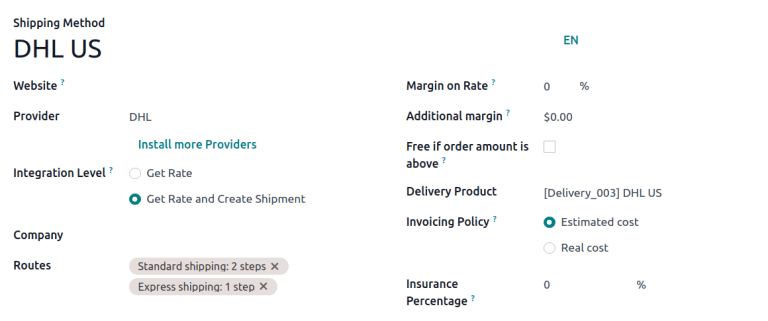

# Add a new delivery method

The *Delivery Methods* setting adds the option of calculating the cost
of shipping on sales orders and e-commerce shopping carts. The shipping
cost can then be added to a sales order as a delivery product, and the
shipping details can be added to the delivery order.

## Configuration

To configure delivery methods, go to
`Inventory app ‣ Configuration ‣ Delivery
Methods`.

::: tip

If the `Delivery Methods` option is
not available from the `Configuration` drop-down menu, verify whether the feature is enabled
by following these steps:

1.  Go to
    `Inventory app ‣ Configuration ‣ Settings`.
2.  Scroll to the `Shipping` section
    and enable the `Delivery Methods`
    feature by checking the corresponding checkbox.

::::

::: 
On the `Delivery Methods` page, add a
method by clicking `New`. Doing so
opens a form to provide details about the shipping provider, including:
:::

- `Delivery Method` (*Required
  field*): the name of the delivery method (e.g. [flat-rate
  shipping], [same day delivery], etc.).
- `Website`: configure shipping
  methods for an **eCommerce** page. Select the applicable website from
  the drop-down menu, or leave it blank to apply the method to all web
  pages.
- `Provider` (*Required field*):
  choose the delivery service, like FedEx, if using a
  `third-party carrier `. Ensure the integration with the shipping carrier is
  properly installed and select the provider from the drop-down menu.
  For more details on configuring custom shipping methods, such as
  `fixed price
  ` or
  `based on rules ` options, refer to their respective sections below.
- `Company`: If the shipping method
  should apply to a specific company, select it from the drop-down menu.
  Leave the field blank to apply the method to all companies.
- `Routes`: select the applicable
  routes to define different delivery methods, such as standard or
  express shipping, based on varying lead times. For more information,
  jump to the
  `Set routes on shipping method ` section.
- `Delivery Product` (*Required
  field*): the product listed on the `sales order line
  ` as the
  delivery charge.
- `Free if order amount is above`:
  checking this box enables free shipping if the customer spends above
  the specified amount.
- `Tracking Link`: This option adds a
  link to the portal so the customer can track their delivery. When a
  custom carrier is added in a delivery order, the tracking button is
  enabled, and the link directs to the tracking portal with that URL.

::: 
Use the `Availability` tab to define
conditions for the delivery method based on the order\'s content or
destination:
:::

- `Countries`: Specify one or more
  countries where the method is available.
- `Max Weight`: Set a maximum weight;
  the method is only available for orders below this limit.
- `Max Volume`: Set a maximum volume;
  the method is only available for orders below this limit.
- `Must Have Tags`: The method is
  available only if at least one product in the order has one of these
  tags.
- `Excluded Tags`: The method is
  unavailable if at least one product in the order has one of these
  tags.

For examples on how to configure specific shipping methods, refer to the
sections below.

## Fixed price 

To configure a shipping price that is the same for all orders, go to
`Inventory app
‣ Configuration ‣ Delivery Methods`. Then, click `New`, and on the shipping method form, set the
`Provider` to the
`Fixed Price` option. Selecting this
option makes the `Fixed Price` field
become available, which is where the fixed rate shipping amount is
defined.

To enable free shipping if the amount of the order exceeds a specified
amount, check the box `Free if order amount is above` and fill in the amount.

::: tip
To set up [\$20] flat-rate shipping that becomes free if the
customer spends over [\$100], fill in the following fields:

- `Delivery Method`: [Flat-rate
  shipping]
- `Provider`:
  `Fixed Price`
- `Fixed Price`:
  [\$20.00]
- `Free if order amount is above`:
  [\$100.00]
- `Delivery Product`: [\[SHIP\]
  Flat]

:::

## Based on rules 

To calculate the price of shipping based on pricing rules, set the
`Provider` field to the
`Based on Rules` option. Optionally,
adjust `Margin on Rate` and
`Additional margin` to include
additional shipping costs.

### Create pricing rules

Navigate to the `Pricing` tab and
click `Add a line`. Doing so opens
the `Create Pricing Rules` window,
where the `Condition` related to the
product weight, volume, price, or quantity is compared to a defined
amount to calculate the `Delivery Cost`.

Once finished, click either `Save & New` to add another rule, or
`Save & Close`.

::: tip
To charge customers \$20 in shipping for orders with five or fewer
products, set the `Condition` to
[Quantity \`
for it.

::: tip
Configuring multiple routes per shipping method is helpful for adjusting
warehouse delivery processes based on:

- speed (e.g., use
  `one-step delivery ` for express shipping, or
  `two-step ` for standard shipping).
- international shipping (e.g. use `three-step delivery
  ` to prepare documents for customs)
- in-store pickup or home delivery: ship from the central warehouse, or
  pick from the store\'s stock, depending on customer selection.
:::

To set up routes, go to
`Inventory app ‣ Configuration ‣ Routes`. Click `New`,
or select the desired route.

On the route form, in the `Applicable On` section, tick the `Shipping Methods` checkbox.

Routes form with the Shipping Method checkbox ticked.

Then, go to
`Inventory app ‣ Configuration ‣ Delivery Methods`, and select the desired shipping method.

On the shipping method form, in the `Routes` field, select the available fulfillment routes from the
drop-down menu.

::: tip

If the desired route is not selectable, check that the *Shipping
Methods* option is enabled in the route\'s *Applicable On* section.
::::

