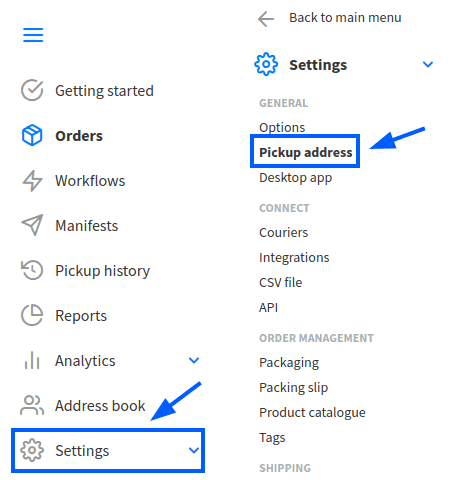
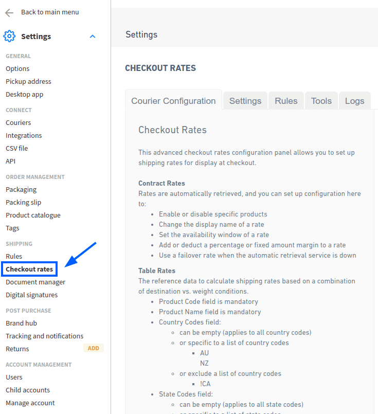
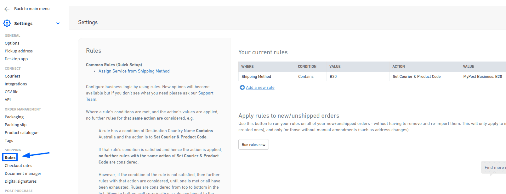
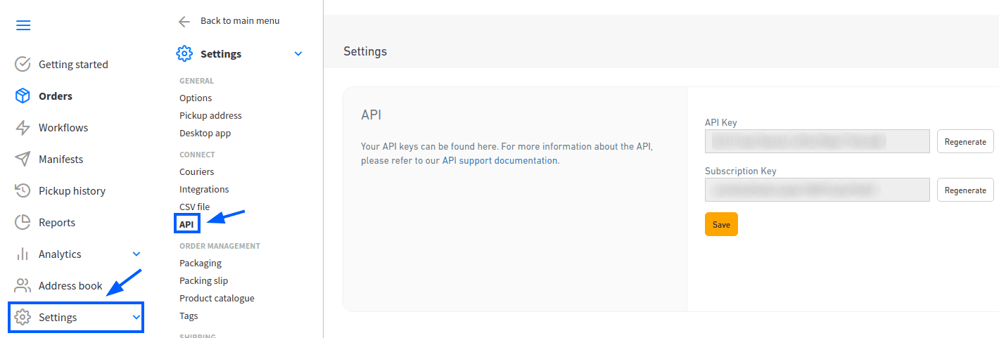

# Starshipit shipping

Starshipit is a shipping service operator that facilitates the
integration of Australasian shipping couriers with Odoo. Once
integrated, users can create shipping methods that will automatically
get rates from specific couriers (such as Australia Post, NZ Post,
DHL,\...) based on predefined conditions.

## Setup in Starshipit

### Create an account and activate couriers

To get started, go to [Starshipit\'s platform](https://starshipit.com/)
to configure the account and generate the connector credentials. Log in
with the Starshipit account, or create a new one if needed.

### Pickup address configuration

Once logged into the Starshipit account, navigate to
`Settings ‣ Pickup address`,
and fill in the `Pickup address`.
Ensure this field matches the warehouse address.

### Couriers configuration

To integrate with third-party couriers, navigate to
`Settings ‣ Couriers`, and
select `Couriers`.

::: tip

For details on integrating with different couriers, refer to
[Starshipit\'s support
center](https://support.starshipit.com/hc/en-us/).
::::

### Checkout rates

To configure shipping rate calculations, navigate to
`Settings ‣ Checkout rates`.
The selected delivery costs are automatically applied in Odoo when
calculating shipping costs.

### Starshipit API key

Configure shipping rules to assign the correct shipping methods to
orders based on specific conditions.

To create a rule, go to `Settings ‣ Rules` and click `Add a new rule`.

While there are multiple ways to configure rules, it is recommended to
set:

1.  `Condition` to
    `Contains`
2.  `Value` to the
    `product code`
3.  `Action` to
    `Set Courier & Product Code`

### Finding Starshipit API credentials 

In the Starshipit account, navigate to
`Settings ‣ API` in the side
menu. This page contains the
`API (Application Programming Interface)`
keys needed to connect to Odoo.

## Setup in Odoo

### Install

After the Starshipit account is set up, integrate it with the Odoo
database. To do that, go to Odoo\'s `Apps` module, search for the
`Starshipit Shipping` module, and
click `Activate` to install it.

### Configuration

Once installed, activate the feature by going to
`Inventory ‣ Configuration ‣
Settings`. Under the
`Shipping Connectors` section,
activate the `Starshipit
Connector` option.

After activating `Starshipit Connector`, click the
`Starshipit Shipping Methods` link
below the listed connector. Once on the
`Shipping Methods` page, click
`Create`.

::: tip

`Shipping Methods` can also be
accessed by going to `Inventory ‣
Configuration ‣ Delivery ‣ Shipping Methods`.
::::

Configure Starshipit in Odoo by filling out the fields on the
`Shipping Methods` form as follows:

- `Shipping Method`: type
  [Starshipit].

- `Provider`: select
  `Starshipit` from the drop-down
  menu.

- `Delivery Product`: assign or
  create the delivery product that will appear on the sales order line
  when the cost of shipping is computed.

  ::: tip
  : important

To set a default package type, the *Packages* feature **must** be
enabled in `Inventory ‣ Configuration ‣ Settings`.
::::

- Manually `Save` the form by
  clicking the cloud icon next to the `Shipping
  Methods / New` breadcrumbs.

To load the newly configured shipping products, click the
`Select a service linked to the
Starshipit account` link at the
bottom of the `Starshipit Configuration` tab.

Doing so opens the
`Choose Starshipit Shipping Service`
pop-up window. In the `Delivery Service` field, choose the desired shipping service for
deliveries and returns from the drop-down menu. Finally, click
`Confirm`.

The chosen delivery service will populate in the
`Service Name` field.

::: tip
Sample of a Starshipit shipping product configured in Odoo:

| `Sendle: Sendle drop off`
| `Shipping Product`: [Sendle
  Delivery]
| `Starshipit Service Code`:
  [STANDARD-DROPOFF]
:::

::: tip

Starshipit does not provide test keys when a company tests the sending
of a package in Odoo. This means that if a package is created, the
account may be charged.

Odoo has a built-in layer of protection against unwanted charges when
using test environments. Within a test environment, if a shipping method
is used to create labels, then those labels are immediately cancelled
after creation --- this occurs automatically. Please note that depending
on the shipping provider being used, the account might be charged for
printing label, unless the order is cancelled manually on the couriers's
portal.

Switch between the test and production environment by clicking the
`Environment` smart button at the top
of the shipping method form.
::::

### Generate a label with Starshipit 

When creating a quotation in Odoo, add the Starshipit shipping method by
clicking the `Add
shipping` button.

In the `Add a shipping method` pop-up
window, select Starshipit in the `Shipping
Method` field.

Calculate the shipping rate by clicking `Get rate`. Finally, click `Add` to include the cost of shipping to the sales order
line, labeled as the *delivery product*.

::: tip

Automatically calculate shipping costs for Starshipit in **both** Odoo
*Sales* and *eCommerce* applications.
::::

Then, `Validate` the delivery.
Shipping label documents are automatically generated in the chatter,
which includes the following:

1.  `Shipping label(s)` depending on
    the number of packages.
2.  `Tracking number(s)` if the
    selected courier supports it.
3.  `Return label(s)` if the
    Starshipit connector is configured for returns.

::: warning

Package weight in Odoo is calculated by adding the weights of the
products plus the empty package saved in the database. Ensure the
correct shipping option is selected, as the package weight is not
automatically verified.

Verify the destination address, as Starshipit checks it when the order
is created.

Finally, some couriers may require other information, such as an email
address or phone number. Please ensure that all necessary information
are set upon sending a shipping order.
::::

### Returns

Starshipit allows returns with the following couriers:

:   - Australia Post eParcel
    - TNT
    - Couriers Please
    - Aramex
    - StarTrack
    - DHL Express
    - NZ Post Domestic

This can be done by clicking the `Return` smart button on the intended delivery order. If the
selected courier supports returns, the
`Print Return Label` button will be
available.

### Cancellations

If a delivery order is cancelled in Odoo, it will be automatically
archived in Starshipit. However, the cancellation will not be sent to
the courier itself, so make sure to log onto the courier\'s platform to
handle the cancellation manually.
