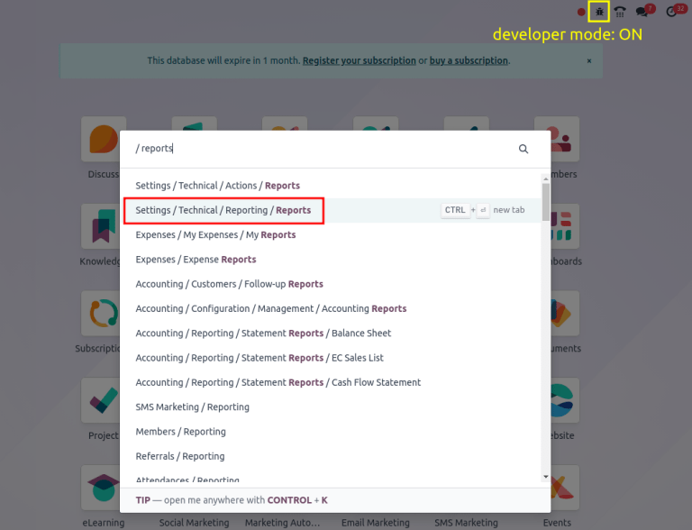
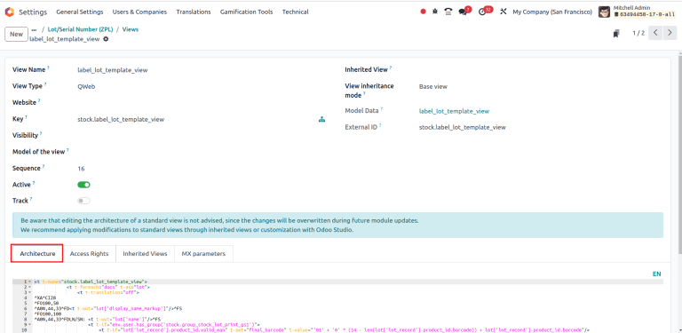
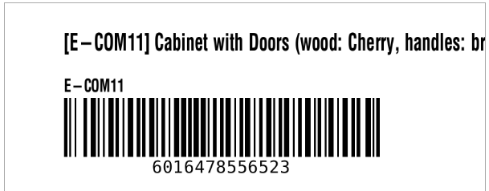
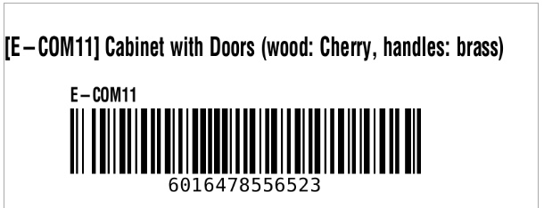
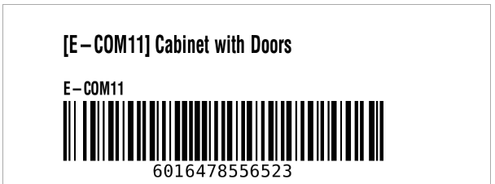
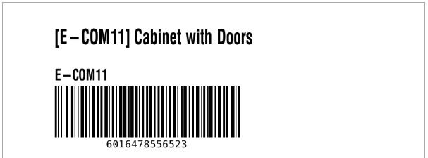
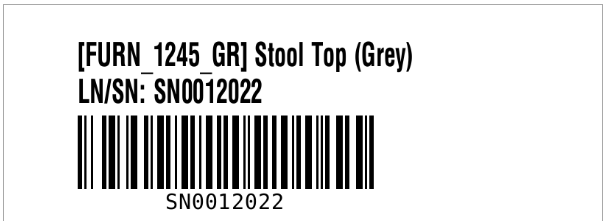
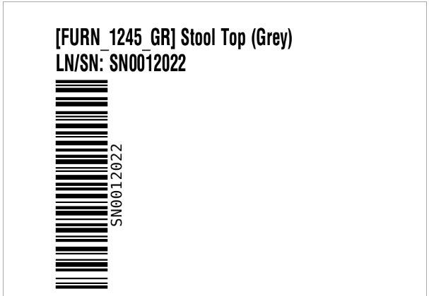

# Zebra label configuration

In Odoo, labels printed in the Zebra Programming Language (ZPL) file
format are designed to fit a four-by-six inch label. To resize (or
reformat) text to fit a variety of
`ZPL (Zebra Programming Language)` label
sizes,
`navigate to the ZPL label view `, and alter the
`ZPL (Zebra Programming Language)` code.

:::: warning

When customizing code in Odoo, please note that upgrading the database
to newer versions may break custom
`ZPL (Zebra Programming Language)` code.
**Customers are responsible for maintaining their custom code**.
::::

Refer to the following sections for explanations, and example code, for
frequently requested Zebra label customizations.

- `Adjust margins `
- `Enlarge/minimize barcodes `
- `Rotate elements `

## Navigate to ZPL label view 

To begin customizing a Zebra label in Odoo, turn on
`developer mode `, and on
the main Odoo dashboard, type [Reports]. From the search
results that appear in the resulting pop-up window, choose
`Settings / Technical / Reporting / Reports` to open the `Reports` page.

::: tip

To manually navigate to the `Reports`
page, go to `Settings app ‣
Technical ‣ Reporting: Reports`.
::::



On the `Reports` page, in the
`Search...` bar, type
[ZPL], and hit `Enter`. Upon
doing so, Odoo presents a list of available Zebra labels in Odoo. Select
the desired Zebra label from the list to modify it on a separate page.

::: tip

Printable ZPL labels in Odoo:

- `lot/serial number `
- operation type
- package barcode
- `product label `
- product packaging
- finished product (Odoo *Manufacturing* app required)
::::

Next, click the `fa-code`
`Qweb Views` smart button, and choose
the desired label
`view `.


Lot and Serial Number (ZPL) report,
highlighting the Qweb smart button.


On the resulting view form, go to the `Architecture` tab to view the
`ZPL (Zebra Programming Language)` code.

::: warning

To ensure the customization is **not** overwritten during an update,
click the `fa-bug`
`(bug)` icon on the view page. Then,
select the `View Metadata` option
from the resulting drop-down menu, in order to open the
`View Metadata` pop-up window. Then,
ensure the `No Update` field is set
to `true (change)`. Click
`Ok` to exit the
`View Metadata` pop-up window.
::::



## Adjust margin 

Text gets cut off from standard
`ZPL (Zebra Programming Language)` labels
printed in Odoo when the line exceeds fifty-five characters. To fit long
product names, or lot numbers, on a single line, adjust the margin.

To begin, navigate to the
`ZPL code of the label ` in the `Architecture`
tab. In the `ZPL (Zebra Programming Language)` code for product labels, look for the [\^FT]
command, which specifies where to start placing the text, or graphic
element, on the label. The two numbers immediately following
[\^FT] define the x-coordinate and y-coordinate in dots
(`similar to
pixels for printers`) from the left and
top margins.

::: warning

When customizing lot/serial number labels, look for the
[\^FO] command, instead of [\^FT].
::::

::: tip
The following is an example where the product\'s name gets cut off with
Odoo\'s default `ZPL (Zebra Programming Language)` formatting. In the **Fixed** tab, the x-coordinate of the
starting position of the label is changed from [\^FT100,80]
to [\^FT0,80], to fit the entire name.
:::

::::: tabs
::: tab
Default



**Code**:

``` xml
^XA^CI28
^FT100,80^A0N,40,30^FD[E-COM11] Cabinet with Doors (wood: Cherry, handles: brass)^FS
...
^XZ
```
:::

::: tab
Modified



**Code**:

``` xml
^XA^CI28
^FT0,80^A0N,40,30^FD[E-COM11] Cabinet with Doors (wood: Cherry, handles: brass)^FS
...
^XZ
```
:::
:::::

## Resize barcode 

To adjust the size of the barcode to scale, begin by navigating to the
`ZPL code of the label
`
in the `Architecture` tab. Look for
the [\^FO] command (typically in the third line), which is
the starting point of the margin for the barcode.

The [\^BY] command configures barcode size, and takes three
numbers: bar width, width of wide bars relative to narrow bars, and bar
height. By default, `ZPL (Zebra Programming Language)` code in Odoo uses [\^BY3], setting the bar
width to three dots, a typical size that is easy for barcode scanners to
read.

::: tip
To shrink the barcode to scale, [\^BY3] is reduced to
[\^BY2].
:::

::::: tabs
::: tab
Default



**Code**:

``` xml
^XA^CI28
...
^FO100,160^BY3
...
^XZ
```
:::

::: tab
Modified



**Code**:

``` xml
^XA^CI28
...
^FO100,160^BY2
...
^XZ
```
:::
:::::

## Rotate elements 

To rotate elements in
`ZPL (Zebra Programming Language)`, begin
by navigating to the `ZPL code of the label
`
in the `Architecture` tab.

The [\^BC] command\'s first parameter
(`information that affects the behavior of the command`) defines the rotation of an item, which can be:

- \`N\`: display normally
- \`R\`: rotate 90 degrees
- \`I\`: rotate 180 degrees
- \`B\`: rotate 270 degrees

::: tip
To rotate the barcode, [\^BCN] is changed to
[\^BCB].
:::

::::: tabs
::: tab
Default



**Code**:

``` xml
^XA^CI28
...
^BCN,100,Y,N,N
...
^XZ
```
:::

::: tab
Modified



**Code**:

``` xml
^XA^CI28
...
^BCB,100,Y,N,N
...
^XZ
```
:::
:::::
