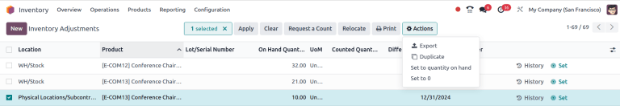
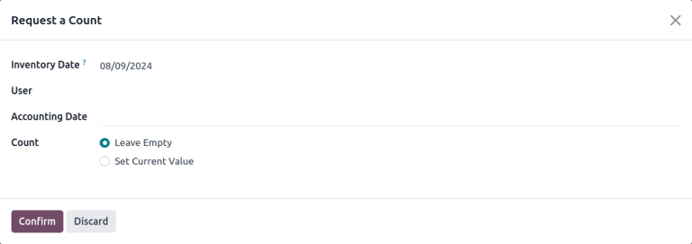

# Inventory adjustments

In any warehouse management system, the recorded inventory counts in the
database might not always match the actual inventory counts in the
warehouse. Discrepancy between counts can be due to damage, human error,
theft, or other factors. As such, inventory adjustments must be made to
reconcile the differences, and ensure that the recorded counts in the
database match the actual counts in the warehouse.

## Inventory Adjustments page

To view the `Inventory Adjustments`
page, navigate to `Inventory app ‣
Operations ‣ Physical Inventory`.

The `Inventory Adjustments` page
lists all products that are currently in stock.

::: tip

Only products with a quantity greater than zero are listed on the
`Inventory
Adjustments` page. To view product
lines with zero current quantity, go to
`Inventory app ‣ Reporting ‣ Stock`.
::::

For each product line, the following information is listed:

- `Location`: the specific location
  in the warehouse where a product is stored. This column is **only**
  visible if `Storage Locations ` are enabled.
- `Favorite`: identifies products
  that have been favorited.
- `Product`: the product whose
  quantity is listed on the inventory adjustment line.
- `Lot/Serial Number`: the tracking
  identifier assigned to the specific product listed. It can contain
  letters, numbers, or a combination of both.

::: tip

If a specific product has a quantity of more than [1.00] in
stock, and more than one serial number, or lot number, assigned to it,
each uniquely-identified product is displayed on its own product line
with its own lot/serial number, displayed under the
`Lot/Serial Number` column.
::::

- `Expiration Date`: the date on
  which the goods with this serial number are due to expire.
- `Last Count Date`: the last time
  the quantity was updated.
- `Package`: the package containing
  the quantity listed.
- `On Hand Quantity`: the quantity of
  the product currently recorded in the database.
- `Unit`: the *unit of measure* in
  which the product is measured. Unless otherwise specified (e.g., in
  `Pounds` or
  `Ounces`), the default
  `UoM (Unit of
  Measure)` is `Units`.
- `Counted Quantity`: the real
  quantity counted during an inventory count. This field is left blank
  by default but can be changed, depending on if it matches the `On Hand
  Quantity` or not.
- `Difference`: the difference
  between the `On Hand Quantity` and
  `Counted Quantity`, once an
  inventory adjustment is made. The difference is automatically
  calculated after every inventory adjustment.
- `Scheduled Date`: the date at which
  a count should be made. If not otherwise specified, this date will
  default to the 31st of December of the current year.
- `User`: the person assigned to the
  count in the database. This can either be the person physically
  counting the inventory, or applying the count in the database.

::: tip

Additional columns are hidden by default. To reveal these columns, click
the `oi-settings-adjust`
`(adjust)` icon to the far right of
the form\'s top row, and reveal any desired column by ticking the
checkbox next to that option.
::::

### Create an inventory adjustment 

To create a new inventory adjustment from the
`Inventory Adjustments` page,
click `New`. Doing so creates a new,
blank inventory adjustment line at the bottom of the page.

::: tip

inventory adjustments can also be created from the
`Forecasted Report` on an individual
product record. To open the report, navigate to a product record and
click the `Forecasted` smart button.
Then, at the top of the page, click `Update
Quantity`, then
`New`.

::::

On this blank inventory adjustment line, click the drop-down menu under
the `Product` column, and select a
product. If the selected product is tracked using either lots or serial
numbers, the desired lot or serial number needs to be chosen from the
drop-down menu under the `Lot/Serial Number` column.

::: tip

The inventory adjustment line can also be used to create or record lots
and serial numbers.
::::

Next, set the value in the `Counted Quantity` column to the quantity counted for that product during
the inventory adjustment process.

To the right of the `Counted Quantity` column, the `Scheduled Date` and `User` can also
be changed via their respective drop-down menus. Changing the
`Scheduled Date` changes the date
that the inventory adjustment should be processed on, and selecting a
responsible `User` assigns a user to
the specific inventory adjustment for traceability purposes.

Once all changes have been made to the new inventory adjustment line,
click away from the line. Doing so saves the adjustment, and moves the
line to the top of the page.

If the `Counted Quantity` is greater
than the `On Hand Quantity`, the
value in the `Difference` column is
**green**. If the `Counted Quantity`
is less than the `On Hand Quantity`,
the value in the `Difference` column
is **red**. If the quantities match, and have not been changed at all,
no value appears in the `Difference`
column.

At this stage, the count (`inventory adjustment`) is recorded, but not yet applied. This means that the
quantity on hand before the adjustment has not yet been updated to match
the new, real counted quantity.

### Apply adjusted count 

inventory adjustments can be completed in several ways. The first way is
to click the `Apply` button on the
line at the far right of the page. The second way is to tick the
checkbox on the far left of the line. Doing so reveals new button
options at the top of the page, one of which is an
`Apply` button. Clicking this button
instead causes an `Inventory Adjustment` pop-up window to appear.

From this pop-up menu, a reference or reason can be assigned to the
inventory adjustment. By default, the
`Inventory Reason` field is
pre-populated with today\'s date, the date the adjustment is being made
on, but can be changed to reflect whatever reference or reason is
desired.

Once ready, click `Apply` to apply
the inventory adjustment.

::: tip

Applying an inventory adjustment simultaneously creates a
`stock move line (SML)
` in the
*Moves History* report for traceability.
::::

## Relocate products

inventory adjustments can also be used to relocate products to different
storage locations, or to different packages. To relocate a product, tick
the checkbox at the far left of the line for the desired product. At the
top of the page, click the `Relocate`
button. Doing so opens a pop-up.

On the resulting pop-up, enter the following information:

- `To Location`: the new location for
  the products.
- `To Package`: the new package for
  the products.
- `Reason for relocation`: the reason
  for the move.

::: warning

Product relocations **only** work on internal locations. Products
**cannot** be moved between companies.

Only users with *Administrator* rights can perform product relocations.
::::

## Set to zero

inventory adjustments can also be used to clear inventory counts by
setting the quantity to zero. To do this, tick the checkbox at the far
left of the line for the desired product. At the top of the page, click
the `fa-gear` `Actions` button to open a drop-down menu. Click
`Set to 0`. Once this is complete,
`apply ` the
adjusted count.

## Count products

Counting products is a recurring activity in a warehouse. Once a count
is complete, go to
`Inventory app ‣ Operations ‣ Physical Inventory` to update the `Counted Quantity` column for each product line.

On each product line, identify whether the value in the
`On Hand Quantity` column recorded in
the database matches the newly-counted value. If the recorded value and
the counted value do match, click the `fa-bullseye` `Set` icon at the far
right of the product line.

Doing so copies the value from the `On Hand Quantity` column over to the `Counted Quantity` column, and sets the value of the
`Difference` column to
[0.00]. Subsequently, once applied, an inventory move with
[0.00] `Quantity Done` is
recorded in the product\'s inventory adjustment history.

If the newly-counted value for a given product does **not** match the
value in the `On
Hand Quantity` recorded in the
database, instead of clicking the `fa-bullseye` `Set` icon, record the
real value in the field in the `Counted Quantity` column.

To do so, click the field in the `Counted Quantity` column on the specific inventory adjustment line for
the product whose count is being changed. This automatically assigns a
`Counted Quantity` of
[0.00].

To change this value, type in a new value that matches the real,
newly-counted value. Then, click away from the line. Doing so saves the
adjustment, and automatically adjusts the value in the
`Difference` column.

If the `Counted Quantity` is greater
than the `On Hand Quantity`, the
value in the `Difference` column is
**green**. If the `Counted Quantity`
is less than the `On Hand Quantity`,
the value in the `Difference` column
is **red**. If the quantities match, and have not been changed at all,
no value appears in the `Difference`
column.

Subsequently, once applied, a move with the difference between the
`On Hand Quantity` and the
`Counted Quantity` is recorded in the
product\'s inventory adjustment history.

The `Actions` menu appears when one
or more products\' checkboxes are selected. The
`Actions` menu includes the option to
`Set to quantity on hand`, which sets
the selected products\' `Counted Quantity` to the `On Hand Quantity`, and `Set to 0`,
which sets the selected products\' `Counted Quantity` to zero.

::: warning

Sometimes a count occurs, but cannot be applied in the database right
away. In the time between the actual count and applying the inventory
adjustment, product moves can occur. In that case, the on-hand quantity
in the database can change and no longer be consistent with the counted
quantity. As an extra precaution, Odoo asks for confirmation before
applying the inventory adjustment.
::::

## Revert an inventory adjustment

To revert the changes made in an inventory adjustment, navigate to
`Inventory ‣
Reporting ‣ Moves History`.

Tick the checkbox at the far left of the line for the desired product.
At the top of the page, click the `fa-gear` `Actions` button to open
a drop-down menu, and click `Revert
Inventory Adjustment`.

::: tip

After an inventory adjustment is reverted, the line is not removed from
the `Moves
History` report. Instead, an
additional line is added, this time with the word
[\[reverted\]] added to the `Reference` column.

::::

## Change inventory count frequency

By default, the *scheduled date* for inventory adjustments are always
scheduled for the 31st of December of the current year. However, for
some companies, it is crucial that they have an accurate inventory count
at all times. In such cases, the default scheduled date can be modified.

To modify the default scheduled date, go to
`Inventory app ‣ Configuration ‣
Settings`. Then, in the
`Operations` section, locate the
`Annual Inventory Day
and Month` setting, which includes a
drop-down menu that is set to [31 December] by default.

To change the day, click the [31], enter a number from
[1-31], depending on the desired month of the year.

Then, to change the month, click `December` to reveal the drop-down menu, and select the desired
month.

Once all desired changes have been made, click `Save` to save all changes.

### Plan big inventory counts 

To plan big inventory counts, such as a full count of everything
currently in stock, first navigate to
`Inventory app ‣ Operations ‣ Physical Inventory`.

Then, select the desired products to be counted by ticking the checkbox
on the far left of each product line.

::: tip

To request a count of **all** products currently in stock, tick the
checkbox at the top of the table, in the header row next to the
`Location` label. This selects
**all** product lines.
::::

Once all desired products have been selected, click the
`Request a Count` button at the top
of the page. Doing so opens the `Request a Count` pop-up window, where the following information can be
filled:

- `Inventory Date`: the planned date
  of the count.
- `User`: the user responsible for
  the count.
- `Accounting Date`: the date at
  which the inventory adjustment will be accounted.
- `Count`: to leave the on-hand
  quantity of each product line blank, select
  `Leave Empty`. To pre-fill the
  on-hand quantity of each product line with the current value recorded
  in the database, select `Set Current Value`.

::: tip

The `Leave Empty` option forces the
employee conducting the audit to manually type in the number they
counted, while the `Set Current Value` option only requires the employee to *verify* the
counted quantity and click `Apply`.
::::

Finally, once ready, click `Confirm`
to request the count.

::: warning

In the Odoo **Barcode** app, users can only view inventory counts that
are assigned to *them*, and are scheduled for *today* or *earlier*.

Sometimes a count occurs, but cannot be applied in the database right
away. In the time between the actual count and applying the inventory
adjustment, product moves can occur. In that case, the on-hand quantity
in the database can change and no longer be consistent with the counted
quantity. As an extra precaution, Odoo asks for confirmation before
applying the inventory adjustment.
::::

## Adjustment history

Details regarding inventory adjustment can be viewed by clicking the
`fa-history` `History` icon.

The user who performed the count is listed in parenthesis in the
`Reference` field, while the user who
applied the count is listed in the `Done By`.

### Inventory audit

An inventory audit can be accessed from the
`Inventory Adjustment` page. This
audit includes an inventory record both before and after a count is
completed, to track what changed.

On the `Inventory Adjustment` page,
tick the checkbox at the top-left of the page to select all of the
lines. Then click the `Request a Count` button. On the pop-up, set `Count` to `Set Current Value`, then click `Confirm`.

After returning to the `Inventory Adjustment` page, select all of the lines again. Click
`Print ‣ Count Sheet`. The
`Count Sheet` exports in PDF form.

