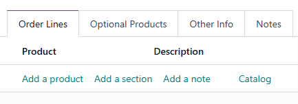
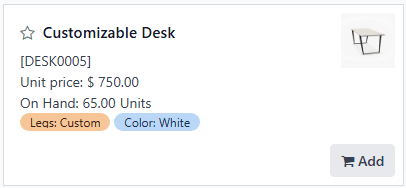
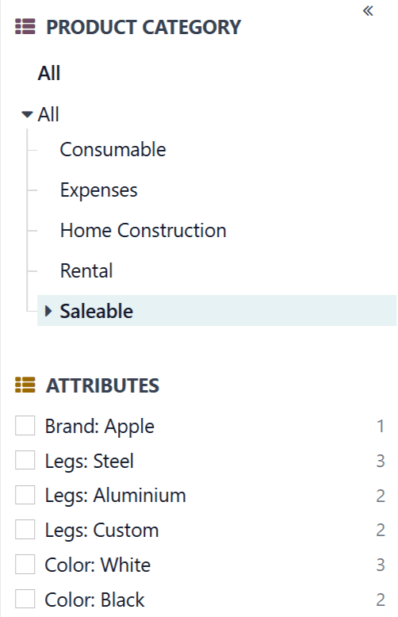
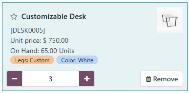

# Product catalog

The product *catalog* is a feature integrated with any Odoo app that
allows users to add products or components to an order. This includes
the **Inventory**, **Manufacturing**, **Sales**, **Purchase**, and
**Repairs** apps, among others.

The product catalog can be accessed from the first tab of a quotation,
request for quotation (RfQ), order, or bill of materials (BoM) form, and
opens in a new page when selected. The catalog displays products and
components in a user-friendly, POS-style format, from which they can be
selected and added to forms.

The product catalog simplifies the creation of new sales orders (SOs),
purchase orders (POs), manufacturing orders (MOs), bill of materials
(BoMs), and more, by providing a visual interface through which products
and components can be quickly selected.

## Use product catalog

To use the product catalog, begin by creating or opening a quotation,
`RfQ (request for quotation)`, order, or
`BoM (bill of materials)` to which
products or components can be added. For example, create a new sales
quotation by navigating to `Sales app`, and clicking `New`.

On the form (quotation, `RfQ (request for quotation)`, order, `BoM (bill of materials)`), make sure the first tab on the bottom is selected.
Depending on the form being configured, this tab may be titled *Order
Lines*, *Components*, *Products*, or *Parts*.

On the first blank line of the tab, click the
`Catalog` link to open the catalog in
a new page.

The product catalog displays a card for each product added to Odoo. Each
card displays a few key details about the corresponding product:

- Product photo
- Product title
- Price or cost of the product, depending on whether it is bought, sold,
  or used as a component
- Reference code (e.g. *DESK0005*)
- On-hand quantity
- Variant attributes (e.g. *Color: White*)

Products can be filtered using the search bar at the top of the page, or
the sidebar on the left side of the page.

To filter by product type, click the `fa-caret-down` `(down arrow)` button on
the right side of the search bar to open the search menu. In the
`Filters` section, select the
`Services` filter to only show
service products, or the `Products`
filter to only show physical products.

When creating or configuring a quotation or
`SO (sales order)`, specifically, an
`In the Order` filter appears in the
`Filters` section of the search bar.
Select this filter to only show products that have already been added to
the form.

In the sidebar on the left side of the page, select an option in the
`fa-th-list`
`PRODUCT CATEGORY` section to filter
by product category, or an option in the `fa-th-list` `ATTRIBUTES` section to
filter by variant attribute.

To add a product, click on the product\'s card, or click the
`fa-shopping-cart`
`Add` button in the bottom-right
corner of the card. Doing so adds one unit of the product, which is
displayed in a field in the bottom-left corner of the card.

Once a product has been added, clicking the product card continues to
add units of the product in increments of one.

To adjust the quantity of the product added, click the
`fa-minus` `(minus)` button to reduce the quantity by one, or the
`fa-plus` `(plus)` button to increase it by one.

Alternatively, a specific quantity can be entered by selecting the field
between the `fa-minus`
`(minus)` and
`fa-plus` `(plus)` buttons, and typing in the desired quantity.

To remove a product from the order or
`BoM (bill of materials)` entirely,
either click the `fa-trash`
`Remove` button in the bottom-right
corner of the product card, or click the `fa-minus` `(minus)` button until
the quantity has been reduced to zero.

Once the desired quantity of each product has been added, return to the
form by clicking the `Back to [X]`
button at the top of the screen. This button differs depending on the
type of form being configured (quotation,
`BoM (bill of materials)`, etc.).

::: warning

Products appear in the product catalog, and can be added to orders, even
if there are zero units of the product on hand. As a result, it is
important to confirm the quantity of a product being added to an order
is actually available, or inventory inconsistencies may arise.
::::
