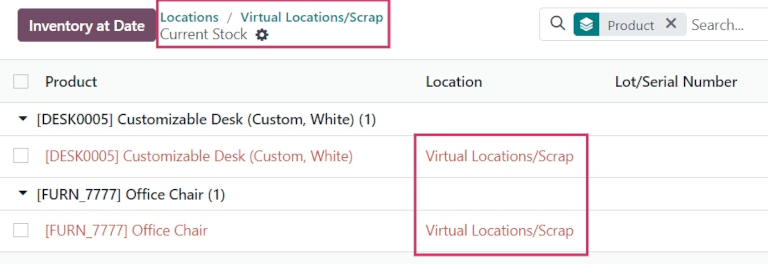
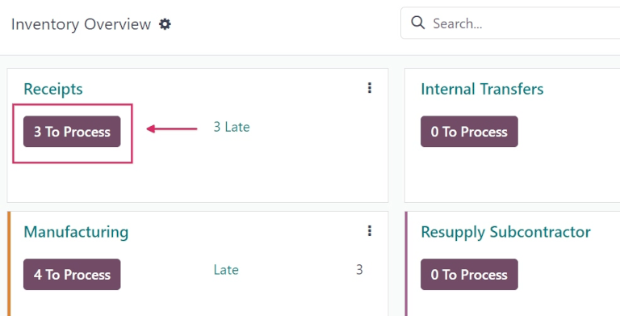

# Scrap inventory

Sometimes, products in a company\'s warehouse stock might be found to be
damaged or defective, past the point of being reparable. If it is not
possible to repair the product, or return the product to a vendor, it
can be scrapped.

Odoo *Inventory* allows users to scrap inventory, designating goods or
materials that are no longer usable or sellable for disposal (or
recycling).

Scrapping inventory in a database helps stock counts remain accurate, by
removing scrapped products from physical inventory, and placing it in a
virtual scrap location (*Virtual Locations/Scrap*).

::: tip

*Virtual locations* in Odoo are **not** real, physical spaces in a
warehouse. Rather, they are designated locations in a database that
provide tracking of items that shouldn\'t be counted in a physical
inventory.

For more information about virtual locations, see the documentation
about the different types of
`location types `.
::::

## Scrap from stock

To create a new scrap order (SP) for an in-stock product, navigate to
`Inventory app
‣ Operations ‣ Scrap`, and
click `New`. This opens a new
`SP (Scrap Order)` form.

Click the drop-down menu in the `Product` field, and select the product that should be scrapped
from inventory. In the `Quantity`
field, change the value to the quantity of the product that should be
scrapped (by default, this value is set to [1.00]).

The `Source Location` defaults to the
location where the product is currently stored. The
`Scrap Location` defaults to the
designated scrap location (`Virtual
Locations/Scrap`). Either of these
locations can be changed by selecting a different location from their
respective drop-down menus.

If the scrapping is tied to a specific existing operation, specify the
operation in the `Source Document`
field.

The `Company` field displays the
company whose warehouse this product belongs to. If a replenishment rule
is set up for the product being scrapped, and if the product should be
replenished, tick the checkbox for
`Replenish Quantities`.

Once ready, click `Validate` to
complete the new `SP (Scrap Order)`. Once
validated, a `Product Moves` smart
button appears at the top of the form. Click the smart button to view
the details of the scrap operation.

::: tip

To view the all-time total quantities of scrapped items, navigate to
`Inventory
app ‣ Configuration ‣ Locations`. Click the `x (remove)` button on the `Internal` filter in the `Search...` bar, to display virtual locations.

Select the `Virtual Locations/Scrap`
location. From the `Scrap`
location\'s form, click the `Current Stock` smart button, at the top of the form.

A list of all scrapped products, and their quantities, is displayed.

::::

## Scrap from an existing operation

Scrap orders (SPs) can *also* be created from existing operations, such
as receipts, delivery orders, and internal transfers, before they are
entered into, or removed from, stock for an operation.

To scrap a product during an operation, navigate to the
`Inventory app`. From the
`Inventory Overview`, click the
`# To Process` button on an
operation\'s task card (i.e. the `Receipts` task card).

Then, select an operation to process from the resulting list of existing
orders. Doing so opens that operation\'s form.

Click the `fa-cog`
`(cog)` icon, and select
`Scrap` from the resulting drop-down
menu. This opens a `Scrap Products`
pop-up window.

From this pop-up window, click the drop-down menu in the
`Product` field, and select the
products from the operation that should be scrapped. Adjust the value in
the `Quantity` field, if necessary.

If the `Product` selected is tracked
using a lot or serial number, a `Lot/Serial` field appears. Specify the tracking number in that
field.

The `Source Location` and
`Scrap Location` can be changed, if
needed. If a replenishment rule is set up for the product being
scrapped, and if the product should be replenished, tick the checkbox
for `Replenish Quantities`.

Once ready, click `Scrap Products`. A
`Scraps` smart button appears at the
top of the operation form. Click this smart button to view the details
of all scrap orders created from this specific operation.

