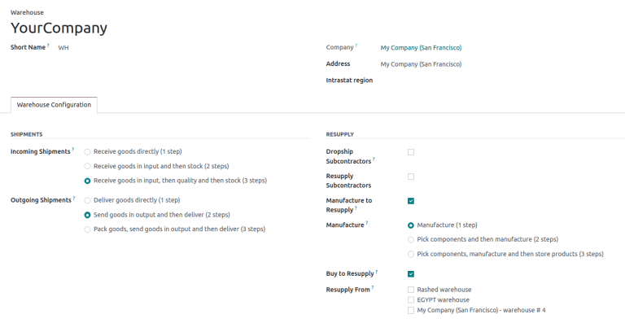

# Warehouses

In the Odoo *Inventory* app, a *warehouse* is a physical space with an
address for storing items, such as a storage facility, distribution
center, or physical store.

Each database has a pre-configured warehouse with the company\'s
address. Users can set up multiple warehouses, and
`create stock moves ` between them.

## Configuration

To create or manage warehouses, go to
`Inventory app ‣ Configuration ‣
Warehouses`.

Then, select an existing warehouse, or create a new one by clicking
`New`. Doing so opens the warehouse
form, which contains the following fields:

- `Warehouse` (*required field*): the
  full name of the warehouse.

- `Short Name` (*required field*):
  the abbreviated code for the warehouse (maximum five characters). The
  short name for the default warehouse in Odoo is [WH].

  ::: warning
  : important

The options below are available **only** when the *Multi-Step Routes*
feature is enabled in
`Inventory app ‣ Configuration ‣ Settings`.
::::

- `Incoming Shipments`: select the
  option to receive products from the warehouse in
  `one `, `two
  `, or `three
  ` steps.
- `Outgoing Shipments`: select the
  option to deliver products from the warehouse in
  `one `, `two
  `, or `three
  ` steps.
- `Dropship Subcontractors`:
  available with the *Subcontracting* feature enabled in
  `Manufacturing app ‣ Configuration ‣ Settings`. Tick this checkbox to purchase components from
  vendors, and dropship them to subcontractors.
- `Resupply Subcontractors`:
  available with the *Subcontracting* feature, tick this checkbox to
  supply subcontractors with raw materials stored in *this* specific
  warehouse.
- `Manufacture to Resupply`: tick
  this checkbox to allow for items to be manufactured in this warehouse.
- `Manufacture`: choose whether to
  manufacture products in `one
  `, `two
  `, or `three steps
  `.
- `Buy to Resupply`: tick this
  checkbox to allow for purchased products to be delivered to the
  warehouse.
- `Resupply From`: available with
  multiple warehouses in the database, select warehouses to pull stock
  *from* to fulfill orders.

