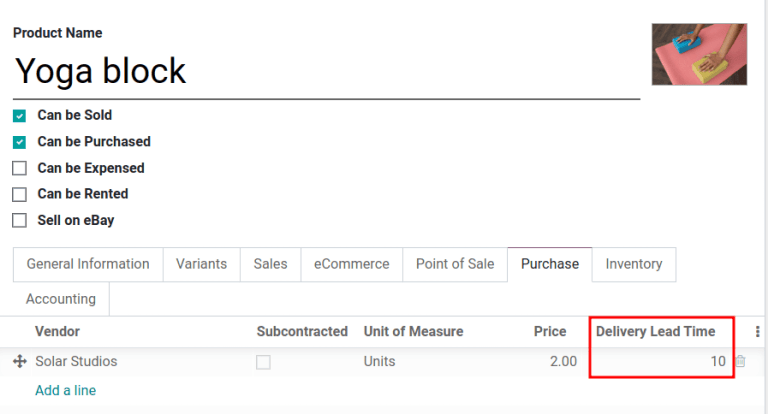
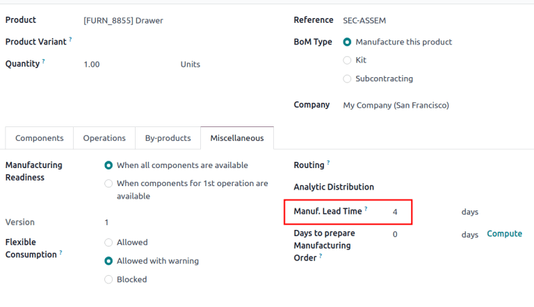
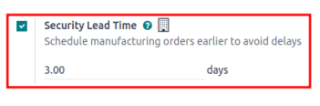

# Lead times

Accurately forecasting delivery dates is vital for fulfilling customer
expectations. In Odoo, the **Inventory** app allows for comprehensive
lead time configuration, allowing coordination and planning of
manufacturing orders, deliveries, and receipts.

## Lead time types

Different lead times for different operations can impact various stages
of the order fulfillment process. Here\'s a summary of the types of lead
times in Odoo:

- `Customer lead time `: default time frame for fulfilling customer orders. The
  customer lead time is the number of days from the date the sales order
  (SO) is confirmed to the date the products are shipped from the
  warehouse. This is also known as *delivery lead time*.
- `Sales security lead time `: moves the *scheduled delivery date* forward by a
  specified number of days. This serves as a buffer to allow ample time
  to prepare the outgoing shipment earlier, considering the possibility
  of delays in the fulfillment process.
- `Purchase lead time `: number of days from the confirmation of a purchase order
  (PO) to the receipt of products. It provides insight on the time it
  takes for products to arrive at the warehouse, facilitating effective
  scheduling and planning of supplier deliveries.
- `Purchase security lead time `: advances the order deadline on a
  `PO (Purchase Order)` by a specified
  number of days. This proactive approach of placing orders earlier
  mitigates the risk of vendor or shipping delays. Thus, for products
  that are set to replenish to order, the need appears on the
  *Replenishment report* earlier, according to the specified number of
  days.
- `Days to Purchase `: days needed for the vendor to receive a request for
  quotation (RFQ) and confirm it. It advances the deadline to schedule a
  `RFQ (request for quotation)` by a
  specified number of days.
- `Manufacturing lead time `: number of days needed to complete a manufacturing order
  (MO) from the date of confirmation. This lead time includes weekends
  (non-working hours in Odoo), and is used to forecast an approximate
  production date for a finished good.
- `Days to prepare manufacturing order
  `: number of days needed to replenish components, or
  manufacture sub-assemblies of the product. Either set one directly on
  the bill of materials (BoM), or click *Compute* to sum up purchase and
  manufacturing lead times of components in the
  `BoM (Bill of Materials)`.
- `Manufacturing security lead time `: moves the scheduled date of the
  `MO (manufacturing order)` forward by a
  specified number of days. When used in conjunction with
  `replenish to order `, the security lead time makes the need appear earlier on
  the replenishment report.

## Sales lead times 

Customer lead times and sales security lead times can be configured to
automatically compute an *expected delivery date* on a
`SO (Sales Order)`. The expected delivery
date ensures a realistic *delivery dates* setting for shipments from the
warehouse.

Odoo issues a warning message if the set delivery date is earlier than
the expected date, as it may not be feasible to fulfill the order by
that time, which would impact other warehouse operations.

::: example
A `SO (sales order)` containing a
[Coconut-scented candle] is confirmed on July 11th. The
product has a customer lead time of 14 days, and the business uses a
sales security lead time of 1 day. Based on the lead time inputs, Odoo
suggests a delivery date in 15 days, on July 26th.

:::

The following sections demonstrate how to automatically compute expected
delivery dates.

### Customer lead time

Set the customer lead time on each product form, by navigating to the
products page. To do so, go to
`Sales app ‣ Products ‣ Products`. From there, select the desired product, and
switch to the `Inventory` tab. Then,
under the `Customer Lead Time` field,
fill in the number of calendar days required to fulfill the delivery
order from start to finish.

::: example
Set a 14-day customer lead time for the [Coconut-scented
candle] by navigating to its product form. Then, in the
`Inventory` tab, type
[14.00] days into the `Customer Lead
Time` field.

:::

### Sales security lead time 

*Sales security lead time* is set globally for the business in
`Inventory app ‣
Configuration ‣ Settings`.

On the configuration page, under the
`Advanced Scheduling` heading, locate
the box for `Security Lead Time for Sales`, and click the checkbox to enable the feature.

Next, enter the desired number of calendar days. This security lead time
is a buffer notifying the team to prepare for outgoing shipments earlier
than the scheduled date.

::: example
Setting the `Security Lead Time for Sales` to [1.00] day, pushes the
`Scheduled Date` of a delivery order
(DO) forward by one day. In that case, if a product is initially
scheduled for delivery on April 6th, but with a one-day security lead
time, the new scheduled date for the delivery order would be April 5th.

:::

### Deliver several products

For orders that include multiple products with different lead times, the
lead times can be configured directly from the quotation itself. On a
quotation, click the `Other Info`
tab, and set the `Shipping Policy`
to:

1.  `As soon as possible` to deliver
    products as soon as they are ready. The
    `Scheduled Date` of the
    `DO (Delivery Order)` is determined
    by adding today\'s date to the shortest lead time among the products
    in the order.
2.  `When all products are ready` to
    wait to fulfill the entire order at once. The
    `Scheduled Date` of the
    `DO (Delivery Order)` is determined
    by adding today\'s date to the longest lead time among the products
    in the order.

::: example
In a quotation containing 2 products, [Yoga mat] and
[Resistance band,] the products have a lead time of 8 days
and 5 days, respectively. Today\'s date is April 2nd.

When the `Shipping Policy` is set to
`As soon as possible`, the scheduled
delivery date is 5 days from today: April 7th. On the other hand,
selecting `When all
products are ready` configures the
scheduled date to be 8 days from today: April 10th.
:::

## Purchase lead times

Automatically scheduling supplier orders streamlines procurement by
showing users exactly when to confirm a request for quotation (RFQ) and
when to expect the goods.

  Field              Description
  ------------------ ------------------------------------------------------------------------------------------------------------------------------------------------------------------------
  Order Deadline     Last calendar day to confirm the `RFQ (request for quotation)` and convert it to a `PO (purchase order)`
  Expected Arrival   Arrival date of the products. Calculated by *Order Deadline* + *Vendor Lead Time*

  : Key dates on an RFQ / PO

In addition, Odoo has global security lead times, which are buffers that
widen the
`just-in-time ` (JIT) forecast window. The security lead times affect
**only** replenishment methods that use `pull rules
`---for example `reordering rules
` or
`make to order (MTO) `. They do not
change the interval between *Order Deadline* and *Expected Arrival*.

  Buffer                                                                                                            Purpose                                                                                                             Impact on dates
  ----------------------------------------------------------------------------------------------------------------- ------------------------------------------------------------------------------------------------------------------- -----------------------------------------------------------------------------------------------------------------------------------------------------------------------------
  `Purchase Security Lead Time `   Extra calendar days to account for delays. Typically used to account for weekends or holidays.                      None on the `RFQ (request for quotation)`/`PO (purchase order)`; adds buffer days in the `JIT forecast window
                                                                                                                                                                                                                                        `.
  `Days to Purchase `                  Days the vendor needs to review an `RFQ (request for quotation)` after it is sent.   None on the `RFQ (request for quotation)`/`PO (purchase order)`; adds buffer days in the `JIT forecast window
                                                                                                                                                                                                                                        `.

  : Global security lead time buffers

::: example
To tie all the purchase lead times together, consider this:

- Today: April 21
- `Vendor Lead Time`: 1 day
- `Purchase Security Lead Time`: 4
  days
- `Days to Purchase`: 2 days

Days from today = 1 + 4 + 2 = 7

Forecasted date = April 28

Example of the JIT (just-in-time) forecast window, which is April
21-28.

If an `RFQ (request for quotation)` is
created today, the following fields show:

- `Order Deadline`: April 23
  ($\text + 2$)
- `Expected Arrival`: April 24
  ($\text + 1$)

:::

### Vendor lead time 

To set a vendor lead time for orders arriving in the warehouse from a
vendor location, begin by navigating to a product form through
`Purchase app ‣ Products ‣ Products`.

Next, select the desired product, and switch to the
`Purchase` tab. In the editable
vendor pricelist, click the `Add a line` button to add vendor details, such as the
`Vendor` name,
`Price` offered for the product, and
lastly, the `Delivery Lead Time`.

::: tip

Multiple vendors and lead times can be added to the vendor pricelist.
The default vendor and lead time selected is the entry at the top of the
list.
::::

::: tip

A `PO (purchase order)` is marked late if
the *Expected Arrival* date has passed, and appears in the *Late* box on
the **Purchase** app\'s dashboard.
::::

::: example
On the vendor pricelist of the product form, the
`Delivery Lead Time` for the selected
vendor is set to [10 days.]

:::

### Purchase security lead time 

*Purchase security lead time* is a global buffer to account for delays,
applied to **all** vendors. To set it, go to
`Inventory app ‣ Configuration ‣ Settings`.

Under `Advanced Scheduling`, tick the
`Security Lead Time for Purchase`
checkbox.

Next, enter the desired number of calendar days. By configuring the
security lead time, a buffer is set to account for potential delays in
supplier deliveries. Then, click `Save`.

### Days to purchase lead time 

To set it up, go to
`Inventory app ‣ Configuration ‣ Settings`. Under the `Advanced Scheduling` section, in the `Days to Purchase` field, specify the number of days required for the
vendor to confirm a `RFQ (request for quotation)` after receiving it from the company.

## Manufacturing lead times 

Lead times can help simplify the procurement process for consumable
materials and components used in manufactured products with bills of
materials (BoMs).

The `MO (manufacturing order)` deadline,
which is the deadline to begin the manufacturing process to complete the
product by the scheduled delivery date, can be determined by configuring
the manufacturing lead times and manufacturing security lead times.

### Manufacturing lead time

Manufacturing lead times for products are configured from a product\'s
bill of materials (BoM) form.

To add a lead time to a `BoM (Bill of Materials)`, navigate to `Manufacturing app ‣ Products ‣ Bills
of Materials`, and select the
desired `BoM (Bill of Materials)` to
edit.

On the `BoM (Bill of Materials)` form,
click the `Miscellaneous` tab. Change
the value (in days) in the `Manuf. Lead Time` field to specify the calendar days needed to
manufacture the product.

::: tip

If the selected `BoM (Bill of Materials)`
is a multi-level `BoM (Bill of Materials)`, the manufacturing lead times of the components are added.

If the `BoM (Bill of Materials)` product
is subcontracted, the `Manuf. Lead Time` can be used to determine the date at which components
should be sent to the subcontractor.
::::

Establish a `MO (manufacturing order)`
deadline, based on the *expected delivery date*, indicated in the
`Scheduled Date` field of the
`DO (Delivery Order)`.

The `MO (manufacturing order)` deadline,
which is the `Scheduled Date` field
on the `MO (manufacturing order)`, is
calculated as the *expected delivery date* subtracted by the
manufacturing lead time.

This ensures the manufacturing process begins on time, in order to meet
the delivery date.

However, it is important to note that lead times are based on calendar
days. Lead times do **not** consider weekends, holidays, or *work center
capacity* (`the number of operations that can be
performed at the work center simultaneously`).

::: example
A product\'s scheduled shipment date on the
`DO (Delivery Order)` is August 15th. The
product requires 14 days to manufacture. So, the latest date to start
the `MO
(Manufacturing Order)` to meet the
commitment date is August 1st.
:::

### Days to prepare manufacturing order 

Configure the days required to gather components to manufacture a
product by going to its `BoM (Bill of Materials)`. To do that, go to
`Manufacturing app ‣ Products ‣ Bills of Materials`, and select the desired
`BoM (Bill of Materials)`.

In the `Miscellaneous` tab of the
`BoM (Bill of Materials)`, specify the
calendar days needed to obtain components of the product in the
`Days to prepare Manufacturing Order`
field. Doing so creates `MOs (manufacturing orders)` in advance, and ensures there is enough time to either
replenish components, or manufacture semi-finished products.

::: tip

Clicking `Compute`, located next to
the `Days to prepare Manufacturing Order` field, calculates the longest lead time among all the
components listed on the `BoM (Bill of Materials)`.

*Purchase security lead times* that impact this specific
`BoM (Bill of Materials)` are also added
to this value.
::::

::: example
A `BoM (Bill of Materials)` has two
components, one has a manufacturing lead time of two days, and the other
has a purchase lead time of four days. The
`Days to prepare Manufacturing Order`
is four days.
:::

### Manufacturing security lead time 

*Manufacturing security lead time* is set globally for the business in
`Manufacturing
app ‣ Configuration ‣ Settings`. Under the `Planning` heading, tick the checkbox for
`Security Lead Time`.

Next, enter the desired number of calendar days. By configuring the
security lead time, a buffer is set to account for potential delays in
the manufacturing process. Then, click `Save`.

::: example
A product has a scheduled shipment date on the
`DO (Delivery Order)` set for August
15th. The manufacturing lead time is 7 days, and manufacturing security
lead time is 3 days. So, the `Scheduled Date` on the `MO (manufacturing order)` reflects the latest date to begin the manufacturing order.
In this example, the planned date on the
`MO (manufacturing order)` is August 5th.
:::

## Global example

See the following example to understand how all the lead times work
together to ensure timely order fulfillment:

- **Sales security lead time**: 1 day
- **Manufacturing security lead time**: 2 days
- **Manufacturing lead time**: 3 days
- **Purchase security lead time**: 1 day
- **Vendor lead time**: 4 days

The customer places an order for a manufactured product on September
1st, and the scheduled delivery date from the warehouse is on September
20th. Odoo uses lead times and automated reordering rules to schedule
the necessary operations, based on the outgoing shipment delivery date,
September 20th:

- **September 1st**: Sales order created, confirmed by salesperson.
- **September 9th**: Deadline to order components to ensure they arrive
  in time when manufacturing begins (4-day supplier lead time).
- **September 13th**: Scheduled date of receipt for components.
  Initially, it was set to 9/14, but the 1-day purchase security lead
  time pushed the date earlier by 1 day.
- **September 14th**: Deadline to begin manufacturing. Calculated by
  subtracting the manufacturing lead time of 3 days, and the
  manufacturing security lead time of 2 days, from the expected delivery
  date of September 19th.
- **September 19th**: `Scheduled Date` on the delivery order form indicates the updated
  expected delivery date, which was originally set as September 20th.
  But the sales security lead time pushed the date forward by a day.

Odoo\'s replenishment planning maps a business\' order fulfillment
process, setting pre-determined deadlines and raw material order dates,
including buffer days for potential delays. This ensures products are
delivered on time.
