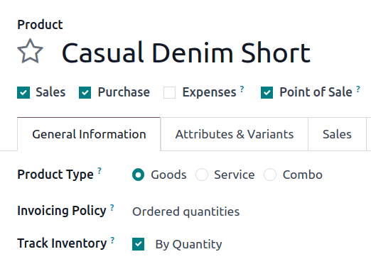
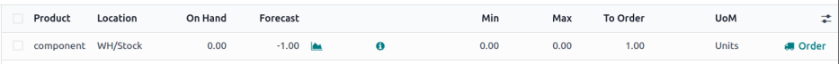
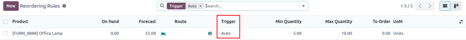
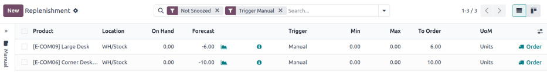
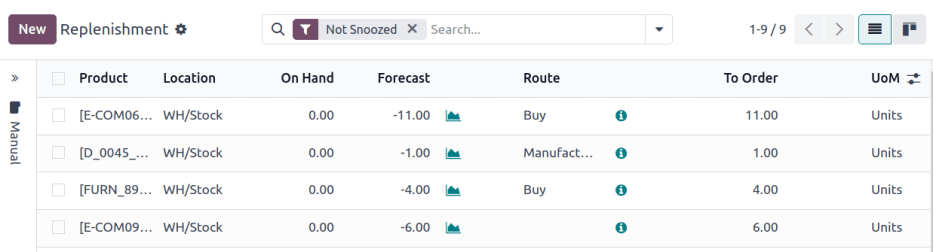
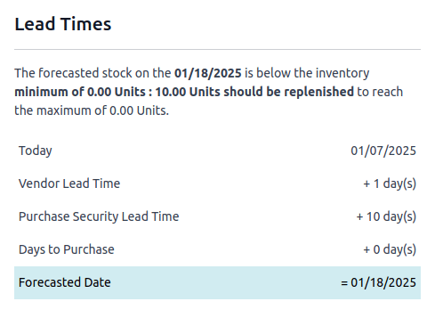
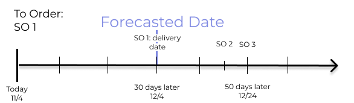
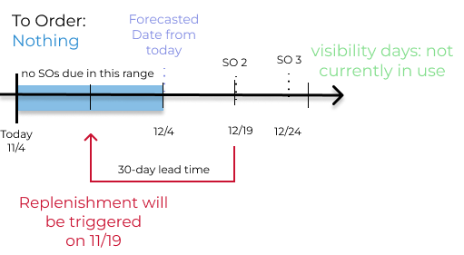

# Reordering rules

*Reordering rules* are used to keep forecasted stock levels above a
certain threshold without exceeding a specified upper limit. This is
accomplished by specifying a minimum quantity that stock should not fall
below and a maximum quantity that stock should not exceed.

Reordering rules can be configured for each product based on the route
used to replenish it. If a product uses the *Buy* route, then a *request
for quotation* (RFQ) is created when the reordering rule is triggered.
If a product uses the *Manufacture* route, then a *manufacturing order*
(MO) is created instead. This is the case regardless of the selected
replenishment route.

To set up reordering rules for the first time, refer to:

- `Reordering rules setup `
- `Trigger `
- `Preferred route `

To understand and optimize replenishment using advanced features, see:

- `Just-in-time logic `
- `Visibility days `
- `Horizon days `

## Reordering rules setup 

To configure automatic and manual reordering rules, complete the
following:

1.  `Product type configuration `
2.  `Replenishment method `
3.  `Create rule `

### Product type configuration 

A product must be configured correctly to use reordering rules. Begin by
navigating to
`Inventory app ‣ Products ‣ Products`, then select an existing product, or create a new
one by clicking `New`.

On the product form, under the `General Information` tab, set the `Product Type` to `Goods`, and make
sure the `Track Inventory` checkbox
is ticked. This is necessary for Odoo to track the product\'s stock
levels and trigger reordering rules.

### Replenishment method 

Next, configure the replenishment method (e.g. buy or manufacture).

If the product is purchased,
`install ` the
**Purchase** app, and confirm that the `Purchase` checkbox is enabled under the product name. In the
`Purchase` tab, add at least one
vendor to the
`vendor pricelist `. Odoo uses the vendor at the top of the list to generate
`RFQs (Requests for Quotations)` when
reordering rules are triggered.

In the `Inventory` tab\'s
`Routes` field, tick the
`Buy` checkbox.

If the product is manufactured,
`install ` the
**Manufacturing** app, and in the `Inventory` tab\'s `Routes`
field, tick the `Manufacture`
checkbox.

Next, ensure at least one `bill of materials
` (BoM) is displayed in the `Bill
of Materials` smart button at the top
of the product form. This is necessary because Odoo only creates
manufacturing orders (MOs) for products with a
`BoM (Bill of Materials)`.

If a `BoM (Bill of Materials)` does not
already exist for the product, click the
`Bill of Materials` smart button,
then click `New` to configure a new
`BoM (Bill of Materials)`.

### Create new reordering rules 

To create a new reordering rule, navigate to
`Inventory app ‣ Operations ‣
Replenishment`, then click
`New`, and fill out the following
fields for the new reordering rule line item:

- `Product`: The product that is
  replenished by the rule.
- `Location`: The location where the
  product is stored.
- `Min`: The minimum quantity that
  can be forecasted without the rule being triggered. When forecasted
  stock falls below this number, a replenishment order for the product
  is created.
- `Max`: The maximum quantity at
  which the stock is replenished.
- `Multiple Quantity`: If the product
  should be ordered in specific quantities, enter the number that should
  be ordered. For example, if the `Multiple Quantity` is set to [5], and only 3 are needed, 5
  products are replenished.

The form for creating a new reordering rule.

::: tip

Reordering rules can also be created from the
`Reordering Rules` smart button on
the product form.
::::

::: tip

To learn how the `On Hand`,
`Forecast`, and
`To Order` fields are calculated
using on-hand quantities and future demand, see the `Just-in-time logic
` section.
::::

For advanced usage, learn about the following reordering rule fields:

- `Trigger `
- `Preferred route `
- `Vendor `
- `Bill of materials `
- `Procurement group `
- `Visibility days `

::: tip

The fields above are not available by default, and must be enabled by
selecting the `oi-settings-adjust`
`(adjust settings)` icon in the
far-right corner and selecting the desired column from the drop-down
menu.
::::

### 0/0/1 reordering rule 

The *0/0/1* reordering rule is a specialty rule used to replenish a
product that is not kept on-hand, each time a sales order (SO) is
confirmed for that product.

::: warning

The 0/0/1 reordering rule is similar to the *Replenish on Order (MTO)*
route, in that both workflows are used to replenish a product upon
confirmation of an `SO (Sales Order)`.

The main difference between the two methods is that the *Replenish on
Order* route automatically reserves the product for the
`SO (Sales Order)` that caused it to be
replenished. This means the product **cannot** be used for a different
`SO (Sales Order)`.

The 0/0/1 reordering rule does not have this limitation. A product
replenished using the rule is not reserved for any specific
`SO (Sales Order)`, and can be used as
needed.

Another key difference is that replenishment orders created by the
*Replenish on Order* route are linked to the original
`SO (Sales Order)` by a smart button at
the top of the order. When using the 0/0/1 reordering rule, a
replenishment order is created, but is not linked to the original
`SO (Sales Order)`.

See the `Replenish on Order (MTO) `
documentation for a full overview of the MTO route.
::::

To create a 0/0/1 reordering rule, navigate to
`Inventory app ‣ Products ‣
Products`, and select a product.

At the top of the product\'s page, click the
`fa-refresh`
`Reordering Rules` smart button to
open the `Reordering Rules` page for
the product. On the resulting page, click `New` to begin configuring a new reordering rule.

In the `Location` field of the new
reordering rule, select the location in which replenished products
should be stored. By default, this location is set to
`WH/Stock`.

In the `Route` field, select the
route the rule should use to replenish the item. For example, if the
product should be purchased from a vendor, select the
`Buy` route.

In the `Min` field and
`Max` field, leave the values set to
[0.00]. In the `To Order`
field, enter a value of [1.00].

With the reordering rule configured using these values, each time an
`SO (Sales Order)` causes the forecasted
quantity of the product to fall below the `Min` of [0.00], the selected
`Route` is used to replenish the
product in one-unit increments, back up to the `Max` of [0.00].

::: tip
An item is configured with a 0/0/1 reordering rule that uses the *Buy*
route. Zero units are kept on-hand at any given time.

A `SO (Sales Order)` is confirmed for one
unit, which causes the forecasted quantity to drop to
[-1.00]. This triggers the reordering rule, which
automatically creates a `PO (Purchase Order)` for one unit.

Once the product is received from the vendor, the forecasted quantity
returns to [0.00]. There is now one unit on-hand, but it is
not reserved for the `SO (Sales Order)`
which triggered its purchase. It can be used to fulfill that
`SO (Sales Order)`, or reserved for a
different order.
:::

## Trigger 

A reordering rule\'s *trigger* can be set to *automatic* or *manual*.
While both function the same way, the difference between the two types
of reordering rules is how the rule is launched:

- `Auto `: A purchase or manufacturing order is automatically
  created when the forecasted stock falls below the reordering rule\'s
  minimum quantity. By default, the `Auto` trigger is selected.
- `Manual `: The `Replenishment report ` lists products needing replenishment, showing
  current/forecasted stock, lead times, and arrival dates. Users can
  review forecasts before clicking *Order*.

To enable the `Trigger` field, go to
`Inventory app ‣ Operations ‣
Replenishment`. Then, click the
`oi-settings-adjust`
`(adjust settings)` icon, located to
the far-right of the column titles, and tick the
`Trigger` checkbox.

In the `Trigger` column, select
`Auto` or `Manual`. Refer to the sections below to learn about the
different types of reordering rules.

### Auto 

*Automatic reordering rules*, enabled by setting the reordering rule\'s
`Trigger` field to
`Auto`, generate purchase or
manufacturing orders when either:

1.  The scheduler runs, and the *Forecasted* quantity is below the
    minimum, or
2.  A `SO (Sales Order)` is confirmed,
    and lowers the *Forecasted* quantity of the product below the
    minimum.

If the `Buy` route is selected, then
an `RFQ (Request for Quotation)` is
generated. To view and manage
`RFQs (Requests for Quotations)`,
navigate to
`Purchase app ‣ Orders ‣ Requests for Quotation`.

If the `Manufacture` route is
selected, then an `MO (Manufacturing Order)` is generated. To view and manage
`MOs (Manufacturing Orders)`, navigate to
`Manufacturing app ‣ Operations ‣ Manufacturing Orders`.

When no route is selected, Odoo selects the `Route` specified in the `Inventory` tab of the product form.

::: tip

The scheduler is set to run once a day, by default.

To manually trigger a reordering rule before the scheduler runs, ensure
`developer mode
` is enabled, and select
`Inventory app ‣ Operations ‣ Run
Scheduler`. Then, click the
purple `Run Scheduler` button on the
pop-up window that appears.

Be aware that this also triggers any other scheduled actions.
::::

::: tip
The product, [Office Lamp], has an automatic reordering rule
set to trigger when the forecasted quantity falls below the
`Min Quantity` of [5.00].
Since the current `Forecast` is
[55.00], the reordering rule is **not** triggered.

:::

### Manual 

*Manual reordering rules*, configured by setting the reordering rule\'s
`Trigger` field to
`Manual`, list a product on the
`replenishment dashboard ` when
the forecasted quantity falls below a specified minimum. Products on
this dashboard are called *needs*, because they are needed to fulfill
upcoming `SOs (Sales Orders)`, for which
the forecasted quantity is not enough.

The replenishment dashboard, accessible by navigating to
`Inventory app ‣
Operations ‣ Replenishment`,
considers order deadlines, forecasted stock levels, and lead times. It
displays needs **only** when it is time to reorder items, thanks to the
`To Reorder` filter.

When a product appears on the replenishment dashboard, clicking the
`Order` button generates the purchase
or manufacturing order with the specified amounts
`To Order`.

## Route 

Odoo allows for multiple routes to be selected as replenishment methods
under the `Inventory` tab on each
product form. For instance, it is possible to select both
`Buy` and
`Manufacture`, indicating to Odoo
that the product can be bought or manufactured.

Odoo also enables users to set a preferred route for a product\'s
reordering rule. This is the replenishment method (e.g., buying or
manufacturing) that the rule defaults to, if multiple are available.

To specify a preferred route, begin by navigating to
`Inventory app ‣ Operations
‣ Replenishment`.

By default, the `Route` column is
hidden. To reveal it, select the `oi-settings-adjust` `(adjust settings)` icon
to the far-right of the column titles, and ticking
`Route` from the drop-down menu that
appears.

Click inside of the column on the row of a reordering rule, and a
drop-down menu shows all available routes for that rule. Select one to
set it as the preferred route.

::: warning

If multiple routes are enabled for a product but no preferred route is
set for its reordering rule, the product is reordered using the *Buy*
route, then *Manufacture*.
::::

### Advanced uses

Pairing `Route` with one of the
following fields on the replenishment report unlocks advanced
configurations of reordering rules. Consider the following:

::: 
- `Vendor`: When the selected
  `Route` is `Buy`, setting the `Vendor` field to one of the multiple vendors on the vendor
  pricelist indicates to Odoo that the vendor is automatically populated
  on `RFQs (Requests for Quotations)`
  when a reordering rule triggers the creation of a purchase order.
:::

::: 
- `Bill of Materials`: When the
  `Route` is set to
  `Manufacture`, and there are
  multiple `BoMs (Bills of Materials)` in
  use, specifying the desired
  `BoM (Bill of Materials)` in the
  replenishment report, draft manufacturing orders are created with this
  `BoM (Bill of Materials)` in use.
:::

::: 
- `Procurement Group`: This is a way
  to group related `POs (Purchase Orders)` or `MOs (Manufacturing Orders)` that are tied to fulfilling a specific demand, like an
  `SO (Sales Order)` or a project. It
  helps organize and track which orders are linked to a particular
  demand.

  ::: tip
  
## Just-in-time logic 

*Just-in-time logic* in Odoo minimizes storage costs by placing orders
precisely to meet deadlines. This is achieved using the
`forecasted date `, which determines when replenishment is necessary to avoid
overstocking.

The forecasted date is the **earliest possible date** to receive a
product if the replenishment process starts immediately. It is
calculated by summing the lead times linked to the replenishment
process, such as
`vendor lead times ` and
`purchasing delays ` for purchases, or
`manufacturing lead times ` for production. Both automatic and manual reordering rules
work this way.

::: tip
For a product with a 5-day total lead time and a sales order delivery
date in 10 days, Odoo waits 5 days to place the order, ensuring it
arrives just in time for delivery.
:::

Important considerations:

- **If this feels risky**, consider adding buffer time or
  `adjusting lead times ` for
  more flexibility.
- While lead times and just-in-time logic provide additional control,
  **reordering rules work perfectly fine without them**. Keeping
  delivery dates on sales orders as their *creation date* ensures
  purchases are immediately triggered when needed

### Forecasted date and To Order quantity 

The *forecasted date* is the earliest receipt date for a product, if it
is ordered right now. It is calculated by summing the lead times linked
to the product\'s replenishment process. The total of these lead times,
added to the current date, determines when Odoo checks for demanded
stock.

To view the forecasted date go to the replenishment report and click the
`fa-info-circle`
`(info)` icon for the desired
reordering rule. The `Replenishment Information` pop-up window displays the
`Forecasted Date` and various lead
times.

::: tip
A manual reordering rule is set up with no minimum or maximum
quantities.

- Vendor lead time is 4 days, the purchase security lead time is 1 day,
  and the days to purchase is 2 days.
- Today\'s date is November 26.
- These add up to 7 days, making the forecasted date, December 3rd.

A confirmed `SO (Sales Order)` for 5
units has a delivery date of December 3rd (7 days from today). This
demand will appear on the replenishment report today, in the **To
Order** field.

However, if the delivery date were later than December 3rd, it would not
yet appear on the report. Odoo only displays quantities to replenish
when they fall within the forecasted date window, ensuring orders are
placed precisely when needed.

:::

The *just-in-time* logic ensures replenishment happens only when it\'s
necessary for the forecasted date\'s demand, helping avoid overstocking.

For example:

- If the forecasted quantity drops below the minimum **on** the
  forecasted date, replenishment must begin immediately to avoid
  shortages.
- If the quantity drops below the minimum **after** the forecasted date,
  replenishment can wait.

The **To Order** quantity is the total demand on the forecasted date.

By timing purchase orders based on the combined lead times, Odoo
optimizes stock levels, keeping inventory minimal while ensuring future
requirements are ordered at the last possible moment---strategic
procrastination without the stress!

### Common confusion about forecasted quantities

`SOs (Sales Orders)` due **after** the
`Forecasted Date` are not accounted
for in the `Forecast` quantities of
the reordering rule.

They are, however, accounted for on the forecasted report that is opened
by clicking the `fa-area-chart`
`(graph)` icon on the replenishment
report, as this one represents the **long-term forecasted quantity**.

::: tip

Continuing the above example, when the sales order's
deadline is adjusted to December 4th, the Forecast and To Order quantities are zero.

Opening the Forecasted Report shows the Forecasted units is
5.00.

:::

## Visibility days 

*Visibility days* enable the ability to determine if additional
quantities should be added to the planned replenishment. Odoo checks if
forecasted stock on the forecasted date will drop below the minimum in
the reordering rule. **Only if** it is time to reorder, visibility days
check additional future demand by the specified number of days.

This feature helps consolidate orders by grouping immediate and
near-future needs, reducing transport costs and enabling supplier
discounts for larger orders.

To set visibility days to incorporate orders for a specified number of
days in the future, navigate to
`Inventory app ‣ Operations ‣ Replenishment`, or by clicking the *Reordering Rules* smart
button from the product form.

Next, enable the `Visibility Days`
field by clicking the `oi-settings-adjust` `(adjust settings)` icon
to the far right and choosing the feature from the drop-down menu. Then,
enter the desired visibility days.

::: warning

The forecasted date is never pushed forward or extended; Odoo only
checks the extra visibility days if the stock falls below the minimum
threshold on the forecasted date.
::::

### Example where visibility days is triggered

A product shipped from Asia has a combined vendor lead time of 30 days
and a shipping cost of \$100 (including
`landed costs ` and tariffs).

- November 4: Current date. The forecasted date is December 4 (30 days
  later).
- `SO (Sales Order)` 1: Requires the
  product by Dec 4. Odoo places the order today, costing \$100.
- `SO (Sales Order)` 2: Requires the
  product by Dec 19. Normally, Odoo would order on Nov 19, costing an
  additional \$100.
- `SO (Sales Order)` 3: Requires the
  product by Dec 25. Normally, Odoo would order on Nov 25, costing
  another \$100.

Ordering separately for these sales orders totals \$300 in shipping
costs.

Setting `Visibility Days` to
[20.0] allows Odoo to \"look ahead\" 20 days from December 4
(`SO (Sales Order)` 1\'s forecasted date)
to December 24.

- It groups `SO (Sales Order)` 2\'s order
  with `SO (Sales Order)` 1, reducing
  shipping costs by consolidating orders.
- `SO (Sales Order)` 3, which is due on
  Dec 25, is one day late and is not grouped with the other two orders.

### Counterexample where visibility days is not triggered

Considering the example above, if `SO (Sales Order)` 1 does not exist, then:

- **November 4**: Current date. The forecasted date is December 4 (30
  days later).
- **November 5**: The forecasted date shifts to December 5.
- `SO (Sales Order)` 2: Requires the
  product by December 19. Odoo will only trigger the order on November
  19, meaning the user will not see a replenishment notification until
  then.

This shows that visibility days complement just-in-time logic by
optimizing it to balance replenishment costs more effectively.

## Horizon days

*Horizon days* determine how many days ahead Odoo checks if the
forecasted quantity will drop below reordering rule\'s minimum. The
feature is meant to help users plan replenishment in advance, by
increasing the
`forecasted date `.

[$$\text = \text + \text + \text$$]

Since horizon days are only meant to be used with manual reordering
rules, find details about the feature in the
`Replenishment report article `.
