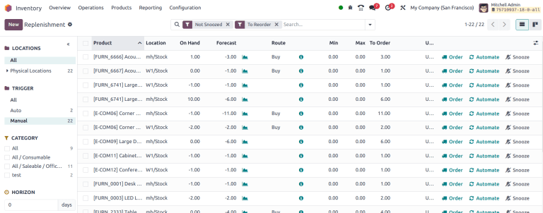
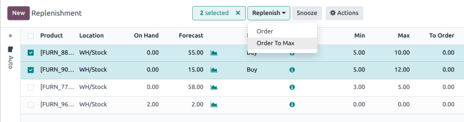
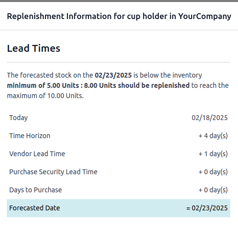
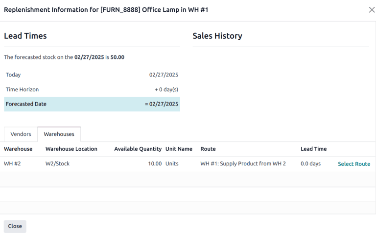

# Replenishment report

The *replenishment report* is an interactive dashboard that uses
`manual reordering rules
`, lead times, and
upcoming demands to forecast quantities of products that need
restocking.

Reordering rules used on this dashboard are normal reordering rules, but
the user benefits from a monitoring menu with extra options to manage
suggestions for replenishment.

This enables users to anticipate future needs, keep less products on
hand without the risk of running out, plan and consolidate orders.

## Navigate the replenishment report

To access the replenishment report, go to
`Inventory app ‣ Operations ‣
Replenishment.`

::: tip

Automatic reordering rules are available on this menu as well, but are
hidden by default.
::::

The fields and features unique to the replenishment dashboard are
displayed below. For definitions of the other fields, go to the
`Create reordering rules section
`.

By default, the quantity in the `To Order` field is the quantity required to reach the set
`Max Quantity`. However, the
`To Order` quantity can be adjusted
by clicking on the field and changing the value. To replenish a product
manually, click `fa-truck`
`Order`.

Click `fa-bell-slash`
`Snooze` to temporarily deactivate
the reordering rule for the set period, hiding the entry from the
replenishment dashboard, when it is supposed to appear.

::: tip

Defining a `Vendor` allows filtering
or grouping demands by the vendor. This simplifies the process of
identifying products to order and can reduce shipment costs. Click the
`oi-settings-adjust`
`(adjust settings)` icon and select
`Vendor` from the drop-down list to
view the field on the report.
::::

### Order to max

If a reordering rule does not forecast the product to arrive below the
minimum, the replenishment cannot be triggered, because it is seen as
*unnecessary*. However, there can be instances where a product needs to
be replenished even if it is not deemed *necessary*, such as when an
order needs to be maximized to obtain better discounts, or to save on
delivery costs.

First, select one or more products by ticking the appropriate checkbox.
Then, click the `Replenish` button
and select `Order to Max`. Doing so
creates a request for quotation (RFQ) for the first possible
replenishment date for each product for the maximum specified in the
reordering rule.

### Horizon days 

*Horizon days* determine how many days ahead Odoo checks if the
forecasted quantity will drop below reordering rule\'s minimum. The
feature is meant to help users plan replenishment in advance, by
increasing the
`forecasted date ` on the `replenishment report `.

::: tip
Setting horizon days to [7] ensures all manual reordering
rules set to trigger within the next seven days appear on the
replenishment report, allowing users to review and decide which products
to order in advance.
:::

To set horizon days, go to
`Inventory app ‣ Operations ‣ Replenishment`, and click
`fa-angle-double-right`
`fa-folder` `Manual` in the left sidebar. In the menu that appears, set the
number of `Horizon` days.

Both horizon days and
`visibility days ` allow Odoo to anticipate future demand, but they work
differently:

- **Visibility days**: only checks future demand if a replenishment
  would have been triggered today.
- **Horizon days**: looks ahead a specified number of days and triggers
  reordering rules as soon as the forecasted quantity falls below the
  minimum within that window --- even if no replenishment is needed
  today.

::: tip
\- Current date: Feb 18 - On hand quantity: 10 - Reordering rule: Min:
5, Max 10 - Vendor lead time: 1 day

8 units are needed for an `SO (Sales Order)` on Feb 23. That means, on Feb 23, there will only be 2
units in stock.

**Without horizon days**

- The demand appears on the replenishment report only on Feb 22, one day
  before the delivery date.
- Forecasted date: Feb 19 (current date + vendor lead time)

**With horizon days (4 or more days)**

- Odoo considers demand up to Feb 23 as relevant today (Feb 18)
- The need for 8 more units appears immediately in the replenishment
  report
- Forecasted date: Feb 23 (current date + vendor lead time + horizon
  days)

:::

## Replenishment information

In each line of the replenishment report, clicking the
`fa-info-circle`
`(info)` icon opens the
`Replenishment Information` pop-up
window, which displays the *lead times* and *forecasted date*.

For detailed information on how to use this feature for replenishment,
go to the `Just in time
logic ` section.

### Select a warehouse

If a warehouse\'s replenishment method is
`resupply from another warehouse
`, check for
available product quantities in other warehouses by opening the
`Replenishment Information` pop-up
window. Warehouses that can replenish the stock are listed under the
`Warehouses` tab, and the
`Available Quantity` shows the
on-hand stock in each warehouse.

After selecting a sourcing warehouse, click
`Select Route`
`Order` button is clicked, the
reordering rule will revert to its preferred route (Buy or Manufacture).

