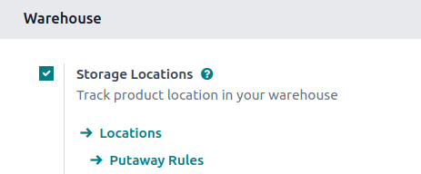
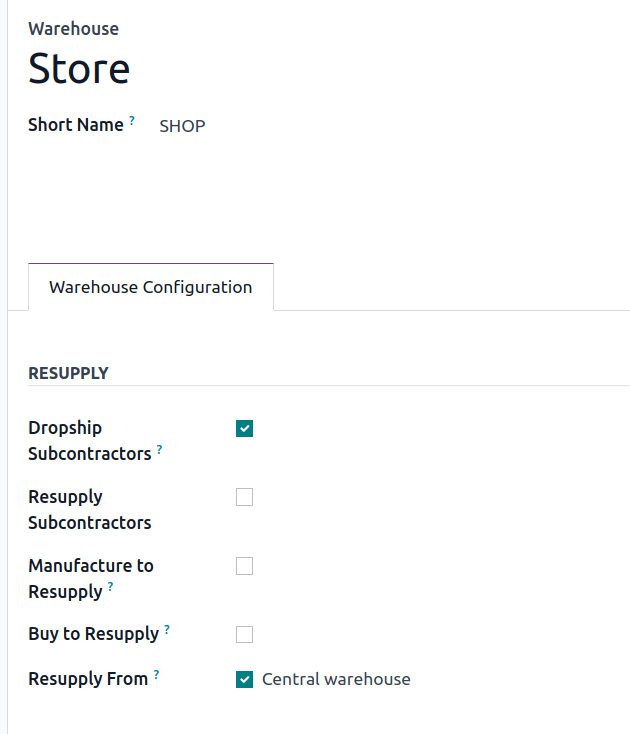
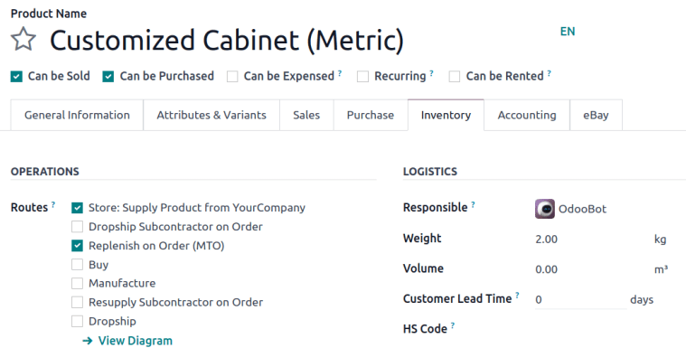
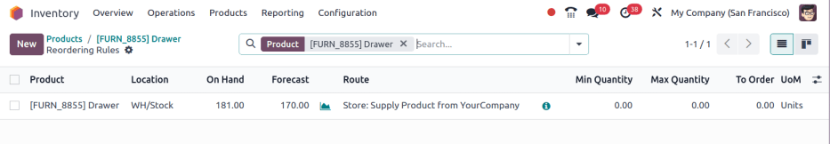
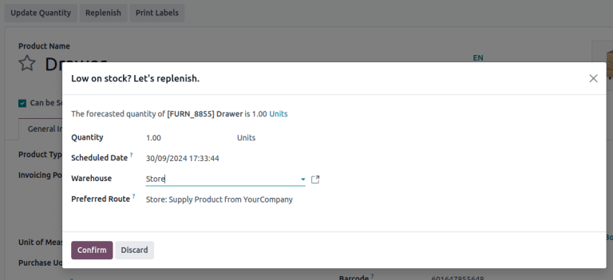
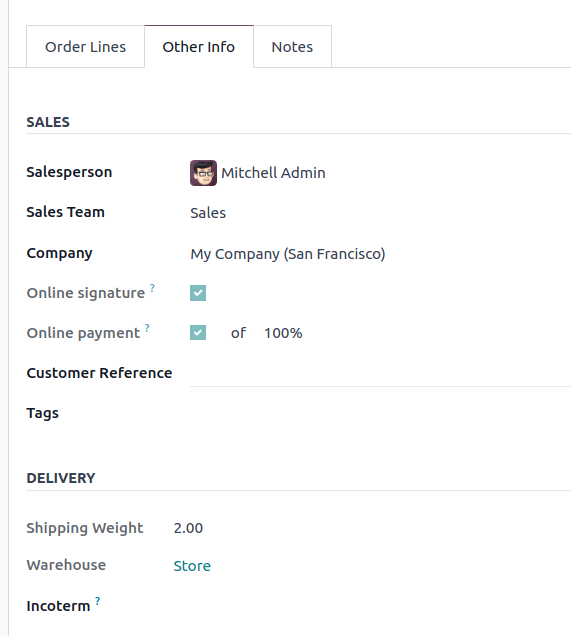
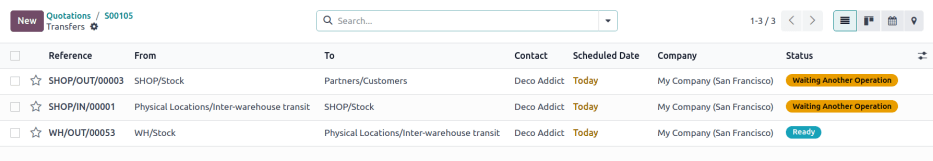

# Inter-warehouse replenishment

When a business operates multiple locations, such as warehouses, retail
shops, or manufacturing facilities, resupplying stock from a central
warehouse is sometimes necessary. Odoo uses a *Route* configuration that
enables locations to replenish from a central distribution center,
automatically generating *inter-warehouse transfers*. Odoo
`Inventory` manages these transfers
to keep stores in stock.

This guide explains how to conduct inter-warehouse transfers using two
replenishment strategies:

1.  `Make to order (MTO) `
2.  `Reordering rule `

## Configuration

The initial configuration for both replenishment strategies is the same.
First go to
`Inventory app ‣ Configuration ‣ Settings`. In the `Warehouse` section, activate `Storage Locations`. Then, click `Save`
to apply the setting.

### Warehouses

Configure the settings for the central warehouse and connecting storage
locations by going to
`Inventory app ‣ Configuration ‣ Warehouses`.

::: warning

Each central warehouse and other locations *must* have its own
warehouse. For example, each shop is considered a local warehouse.
::::

Select an existing warehouse, or create a new one to be resupplied from
the central warehouse, by clicking `New`. Then, give the warehouse a name and a
`Short Name`, which will appear on
that warehouse\'s transfers.

In the `Warehouse Configuration` tab,
locate the `Resupply From` field.
Check the box next to the central warehouse\'s name. If the warehouse
can be resupplied by more than one warehouse, make sure to check those
warehouses\' boxes too. Now, Odoo knows which warehouses can resupply
this warehouse.

::: tip
The central warehouse that will supply the shops is called [Central
warehouse]. The `Resupply From` field is set to this warehouse on the shop\'s warehouse
configuration page.
:::

### Set route on a product

Products must also be configured properly in order for them to be
transferred between warehouses.

Go to `Inventory app ‣ Products ‣ Products` and select the desired product.

In the `Inventory` tab, the new route
appears as `X: Supply Product from Y`
in the `Routes` section, where \'X\'
is the store\'s warehouse that receives products, and \'Y\' is the
warehouse that sends products.

Tick the `X: Supply Product from Y`
checkbox, which is intended to be used with the
`MTO (Make to Order)` route or a
reordering rule to replenish stock by moving the product from one
warehouse to another. Proceed to the dedicated sections below to
continue the process.

#### MTO 

To replenish products using the make-to-order method, go to the product
form and ensure the
`MTO route is unarchived `, so it appears in the `Routes` section of the `Inventory` tab.

With the resupply and `MTO (Make to Order)` routes ticked, jump to the section titled:
`Replenish from another
warehouse `.

::: tip
The product, sold at the warehouse, [Store], is resupplied
from the central warehouse, named [YourCompany]. To
replenish the product using `MTO (Make to Order)`, the following routes are selected:

- `Store: Supply Product from YourCompany`
- `Replenish on Order (MTO)`

:::

#### Reordering rule 

To replenish products using reordering rules, first ensure the
`X: Supply Product from Y` route is
selected in the `Inventory` tab of
the product form.

Then, create a reordering rule to automate replenishment by clicking the
`Reordering
Rules` smart button.

Click `New`, and set:

- `Location`: the stock location of
  the retail store. For example, [SHOP/Stock].
- `Route`:
  `X: Supply Product from Y`.
- `Min Quantity` and
  `Max Quantity` to trigger automatic
  stock transfers when inventory falls below the set threshold.

::: tip
A
`0/0 reordering rule ` to replenish the shop\'s warehouse is created, with the
`Location` set to
[SHOP/Stock], and the `Route` set to
`Store: Resupply from YourCompany`.

:::

## Replenish one warehouse from another 

After completing the setup, trigger replenishment using one of several
methods, such as:

- Navigate to the product form of the product that is resupplied from
  another warehouse.

  Click the `Replenish` button on the
  top-left of the product page. In the pop-up window, set the warehouse
  to the retail shop, (e.g. [Store]), and click
  `Confirm`.

  

- Create a quotation, and in the `Other Info` tab, set the `Warehouse` to the retail shop (e.g. [Store]), when
  selling the product makes the on-hand quantity of the product go below
  the minimum set on the reordering rule.

  

Once triggered, Odoo creates two transfers: One is a *delivery order*
from the central, supplying warehouse, which contains all the necessary
products to the store, and the second is a *receipt* at the shop, from
the main warehouse.

While in transit, the product is located at [Physical
Locations/Inter-warehouse transit].

::: tip
A sales order for the product at the shop is created. To replenish the
product at the shop and ship it from there, Odoo generates a delivery
order from the central warehouse\'s stock, [WH/Stock] to the
shop\'s warehouse [SHOP/Stock]. While the products are
traveling between warehouses, they are in [Physical
Locations/Inter-warehouse transit].

The final delivery order is from the shop to the customer\'s delivery
address, and is not pertinent to the workflow in this guide.

:::
