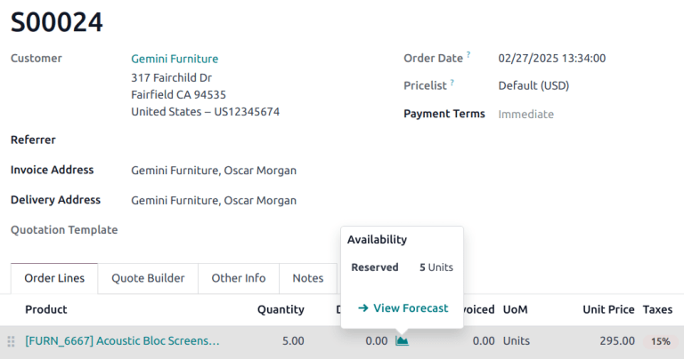
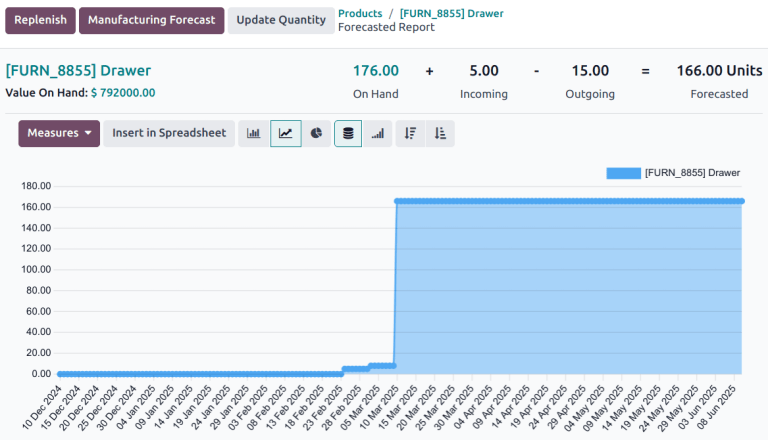
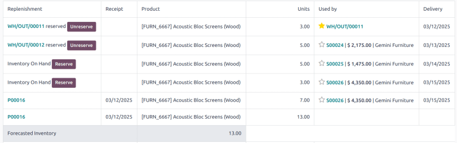
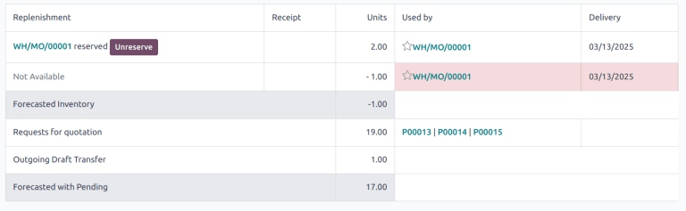
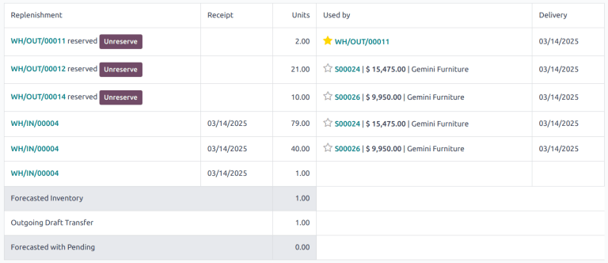

# Forecasted report

The **Inventory** *forecasted report* provides a real-time view of
projected stock levels, helping businesses manage their inventory
efficiently. This report is beneficial for planning and decision making,
ensuring stock availability for upcoming sales, manufacturing, and
replenishment activities.

::: warning

The forecast report is **only** available on products where inventory is
being tracked, commonly referred to as a *storable product*.
::::

## Navigating the forecast report

The forecast report can be accessed via the **Inventory**, **Purchase**,
**Manufacturing**, and **Sales** apps.

To access the report, click the `fa-area-chart` `Forecasted` smart
button on a product form. Alternatively, the report can be accessed from
a sales order (SO) or purchase order (PO) by clicking on the
`fa-area-chart`
`(Graph)` icon next to the product,
then selecting `oi-arrow-right`
`View Forecast`.

The forecasted report consists of a graph and a table. The graph
visually represents stock movements over time. The following information
is displayed:

- `On Hand`: current stock physically
  available in the warehouse.
- `Incoming`: quantities expected
  from confirmed purchase orders or manufacturing orders.
- `Outgoing`: quantities reserved for
  sales orders or other outgoing operations.
- `Forecasted`: projected stock
  levels based on confirmed and planned operations.

The table provides detailed metrics regarding operations, including:

- `Replenishment`: Shows reserved
  quantities, especially useful for multi-step operations.
- `Receipt`: The date of receipt for
  the items.
- `Units`: The number of units
  involved in each operation.
- `Used by`: The operation the stock
  is allocated for.
- `Delivery`: The scheduled or
  expected date of stock movement.
- `Forecasted Inventory`: The
  forecasted stock levels.
- `Forecasted with Pending`: The
  updated stock levels with the pending stock movements considered.

### Reserve and unreserve products

Users can reserve or unreserve products directly from the forecasted
report, ensuring stock allocation aligns with operational needs.

### Replenish products

Click the `Replenish` button at the
top of the report to open the `Product
Replenish` pop-up. From here,
products can be replenished through purchase orders from vendors, or
manufactured. Select the `Quantity`,
`Preferred Route` and
`Vendor`, before clicking
`Confirm`.

### Manufacturing forecast

To view the availability of manufactured products, click the
`Manufacturing Forecast` button. This
displays the forecasted stock levels for raw materials, showing how much
are expected to be consumed for upcoming manufacturing orders.

The manufacturing forecast identifies component shortages before they
can impact manufacturing timelines, and helps to align manufacturing
activities with sales demands.

### Update quantity

To manually update the quantity of a product, click
`Update Quantity`. This opens the
`Change Product Quantity` pop-up.
Confirm the correct product variant is selected in the
`Product` field, then enter the
appropriate value in the `New Quantity on Hand` field. Click `Apply`
when finished. The report then updates to reflect the new product
quantity.

## Multi-step reservation

Reserved quantities for multi-step incoming and outgoing shipments are
indicated on in the `Replenishment`
column on the table of the report.

`Stock in Transit` refers to products
that have been received, but are in transit to their input or quality
control locations. `Free Stock in Transit` refers to available products received in the input
location, but not yet placed in stock.

## Operations affecting the forecast report

The forecast report is influenced by various operations, each impacting
stock levels differently. Scheduled delivery dates, planned
manufacturing dates, and expected arrival dates all affect the forecast
of inventory.

Requests for Quotation (RFQs) do not immediately impact the forecast
report, as the products are not confirmed for replenishment.
`POs (purchase orders)`, however, do
affect the report as the products are expected to arrive after the
`PO (purchase order)` has been confirmed.

Confirmed `SOs (sales orders)` decrease
the forecasted stock, adjusting the report based on the scheduled
delivery date. Confirmed manufacturing orders (MOs) affect the
forecasted stock for both raw materials and finished goods.

## Use cases

### Negative quantity

A negative forecasted quantity indicates that the projected demand
exceeds the available and incoming stock at a given point in time. This
could occur because the `SOs (sales orders)` or `MOs (manufacturing orders)` require more stock than is currently available or expected,
or because of delays in the shipping or manufacturing process.

Whatever the cause, when negative numbers are displayed on the forecast
report, it serves as an early warning, allowing business to take
preventative action. This can include:

- Prioritizing specific sales or production orders.
- Adjusting procurement strategies to expedite purchase orders.
- Manage customer expectations by proactively communicating the
  possibility for delays.

### Split orders

In the example below, there is not currently enough stock of a product,
[Cabinet with Doors] to fulfill the multiple sales orders.
The current stock has been reserved for a shipment,
[WH/OUT/00011], and the remainder has been split between the
two orders. The remaining stock is expected with
[WH/IN/00004]. Once received, they are the separated out to
cover the remaining orders.

### Late receipt

The replenishment table can be used to determine whether an incoming
shipment arrives in time to fulfill an order. For example, a
`SO (sales order)` is displayed with a
`Delivery Date` for today for five
[Cable Management Boxes]. The current on hand quantity is
zero. A `PO (purchase order)` has been
confirmed, with the expected arrival three days from today.

The forecasted quantity for today shows [-5], because the
confirmed demand is five, but the current stock on hand is zero. Since
the `Receipt` date is *after* the
`Delivery Date`, the shipment is
late.

This can be an indication to either expedite the current shipment, if
possible, or reschedule the delivery date for the
`SO (sales order)`.
