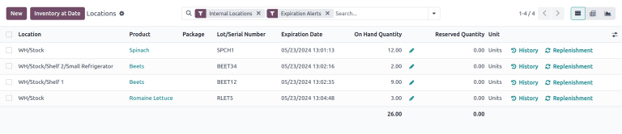
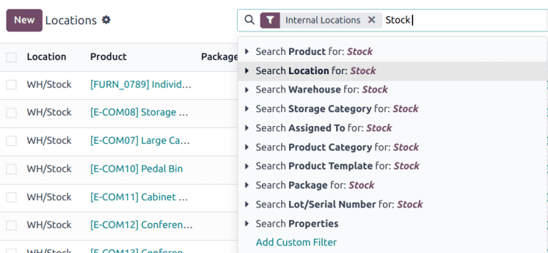
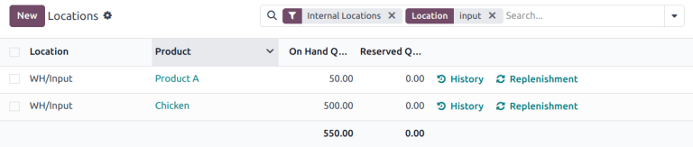
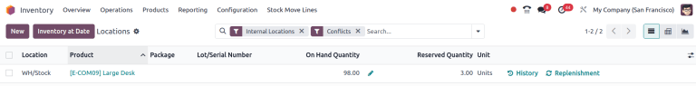
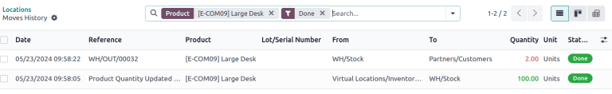

# Locations dashboard

The *Locations* dashboard in the **Inventory** application provides an
overview of on-hand storage locations for company products. Use this
report to see where stock is stored, identify
`misplaced items `, or view past inventory to see product locations on specific
dates.

To access the locations report, the *Storage Locations* feature must be
enabled. To do that, go to
`Inventory app ‣ Configuration ‣ Settings`. In the `Warehouse` section, tick the checkbox for
`Storage Locations`, and click
`Save`. Then, access the locations
dashboard by navigating to
`Inventory app ‣ Reporting ‣ Locations`.

::: tip

The *Reporting* menu in **Inventory** is only accessible to users with
`admin access
`.
::::

## Navigate the locations dashboard 

By default, the `Locations` dashboard
lists all on-hand products in stock (in the `Product` column), along with the following information:

- `Location`: current storage
  location. If a product is stored at [Shelf 1] and [Shelf
  2], the product is listed twice, showing quantities at
  each location.
- `Package`: the package that the
  product is stored in, if any.
- `Lot/Serial Number`: if the product
  has a lot or serial number, it is specified here.
- `On Hand Quantity`: current
  quantity of products. Click the `fa-pencil` `(edit)` icon to
  `modify the on-hand quantity
  `.
- `Reserved Quantity`: on-hand
  quantity reserved for operations, such as pickings, delivery orders,
  or manufacturings.
- `Unit`: the unit of measure of the
  product.

Click the buttons to the right of each row item to access additional
information:

- `fa-history`
  `History`: access the stock move
  history of the product, displaying information about the quantity and
  description of why the product was moved from one location to another.

  ::: tip
  : note

This report can also be generated from the `Lot and Serials Numbers
` page, accessed by going to
`Inventory app ‣ Products ‣ Lots/Serial Numbers`.
::::

### Stranded inventory report 

Businesses using multi-step flows in the **Inventory** or
**Manufacturing** apps, may have *stranded* items, which are products
not in their proper storage locations, due to human error. Use this
report to periodically check transfer locations (e.g. *WH/Input*,
*WH/Pre-Processing*) to ensure items are moved to their intended storage
locations, and accurately recorded in the database.

To get a list of items that might be sitting idly in storage, follow
these steps:

1.  Go to `Inventory app ‣ Reporting ‣ Locations`.

2.  In the search bar, begin typing the name of the location where
    products are intended to be moved to, such as
    [WH/Input], or [WH/Packing].

3.  Select the `Search Location for:`
    \[location name\] option from the resulting drop-down menu that
    appears beneath the search bar.

    

The report now displays a list of products at the transit location.

::: example
Searching [Input] in `Location` shows a list of products at a *WH/Input* location.

The list shows [500] quantities of [Chicken],
which is alarming if not refrigerated soon after reception. The stranded
inventory report helps identify items that have been idling in
non-storage locations.

:::

### Inventory discrepancy report

To generate a report of items that have been moved since the last
`inventory audit
`,
follow these steps:

1.  Go to `Inventory app ‣ Reporting ‣ Locations`.

2.  Then, click into the search bar to reveal a drop-down list of
    `Filters`,
    `Group By`, and
    `Favorite` options.

3.  Enable the `Internal Locations`
    and `Conflicts` option from the
    `Filters` section.

4.  The report now displays items whose quantities have changed since
    the last cycle count.

    

5.  Click the `fa-history`
    `History` button to view
    inventory transfers, including receipts and deliveries, that have
    occurred since the inventory adjustment.

    
