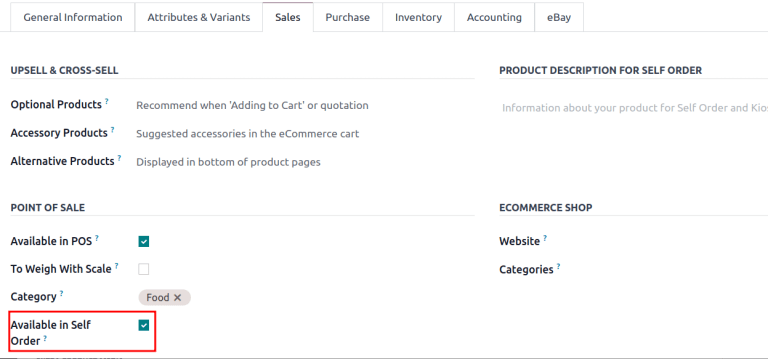

# Stock report

Use the stock report in Odoo *Inventory* for a detailed list of all
stored products, including those reserved, purchased and in transit, as
well as those delivered to customers.

::: tip

The reporting feature is only accessible to users with `admin access
`.
::::

To access the stock report, go to
`Inventory app ‣ Reporting ‣ Stock`.

## Navigate the stock report

On the stock report, the left sidebar includes several groupings to
narrow down what is being shown. The default groupings are
`Warehouses`, which filters products
by specific warehouses, and `Category`, which shows products within a selected product
category.

::: tip

The `Warehouse` grouping is only
available when there are multiple warehouses in the database. Refer to
the `../inventory_management/warehouses`
documentation for more details.
::::

In the report itself, the columns represent:

- `Product`: name of the product.

- `Unit Cost`: average inventory
  valuation per unit, adjusted based on the cost to purchase and/or
  manufacture the product.

- `Total Value`: Total inventory
  valuation of the product, calculated by multiplying unit cost by
  on-hand quantity.

  ::::: tabs
::::: tab
Filters

The `Filters` section allows users to
search among pre-made and custom filters to find specific stock records.

- `Published`: display products
  published on the website. Only available with the *Website* app
  installed.

- `Available in POS`: display
  products available through the *Point of Sale* app.

- `Available in Self`: display
  products available in self order through the *Point of Sale* app.
  Appears in the search because the
  `Available in Self Order` checkbox
  was ticked in the `Point of Sale`
  section of a product form\'s `Sales` tab. The option is only available when the
  `Available in POS` checkbox is
  ticked.

  

- `Not available in Self`: display
  products available in *PoS*, but not available in self order.

- `Can be Sold`: display products
  that can be sold to customers. Appears in the search because the
  `Can be Sold` checkbox is ticked on
  the product form.
- `Can be Purchased`: display
  products that can be bought from vendors. Appears in the search
  because the `Can be Purchased`
  checkbox is ticked on the product form.
- `Can be Recurring`: show
  subscription products, indicated by ticking the
  `Recurring` checkbox on the product
  form. Only available with the *Subscription* app activated.
- `Can be Rented`: show products that
  can be loaned to customers for a certain time. Appears in the search
  because the `Can be Rented`
  checkbox was ticked on the product form. Only available with the
  *Rental* app installed.
- `Can be Subcontracted`: display
  products that can be produced by a third-party manufacturer. Available
  only with the *Manufacturing* app installed.
- `Can be Expensed`: show items that
  can be expensed. Only available with the *Expenses* app installed.

:::::

::: tab
Group By

The `Group By` section allows users
to add pre-made and custom groupings to the search results.

- `Product Type`: group items by
  `product type
  `.
- `Product Category`: group items by
  product category. To configure these, go to
  `Inventory app ‣ Configuration ‣ Products: Product Categories`.
- `POS Product Category`: group items
  by `point of sale product categories
  `.
:::

::: tab
Favorites

To save the current applied filters and groupbys, so the same
information can be easily accessed after closing this page, click
`Save current search`.

Optionally, tick the `Default filter`
checkbox to make this current view the default filter when opening the
stock report. Or tick the `Shared`
checkbox to make the search option available to other users.

Lastly, click the `Save` button.
:::
::::::::

