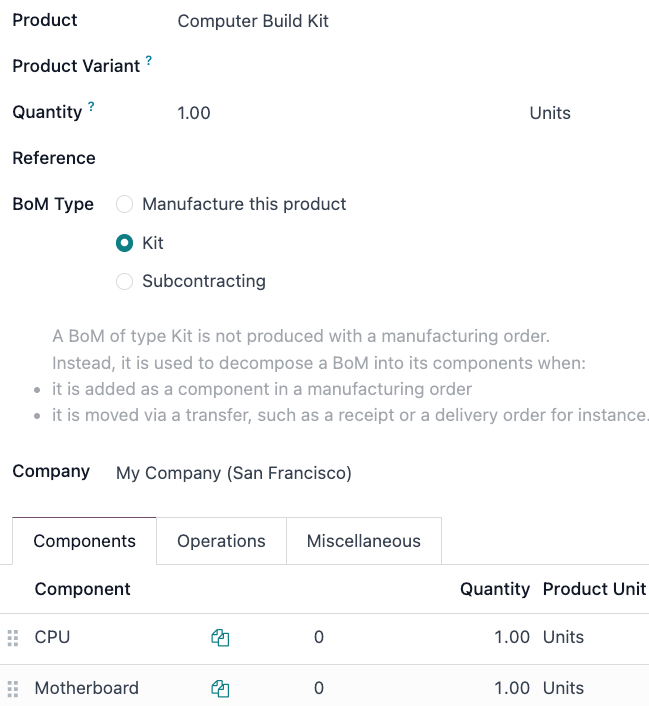

# Kitlar

Odoo tizimida *kit* - bu ishlab chiqarish va sotish mumkin bo'lgan material ro'yxati (BoM) turi hisoblanadi. Kitlar mijozlarga sotiladigan yig'ilmagan komponentlar to'plamidir. Ular mustaqil mahsulot sifatida sotilishi mumkin va murakkab material ro'yxatlarini (BoM) boshqarish uchun foydali vositalar hisoblanadi.

::: tip

Kitlardan foydalanish, ularni ishlab chiqarish va sotish uchun `Manufacturing` va `Inventory` ilovalarining ikkalasi ham o'rnatilgan bo'lishi kerak.
::::

## Kitni mahsulot sifatida yaratish

Kitni sotish mumkin bo'lgan mahsulot yoki komponentlarni tashkil qilish vositasi sifatida ishlatish uchun, avvalo kitni mahsulot sifatida yaratish kerak.

Kit mahsulotini yaratish uchun `Inventory app ‣ Products ‣ Products` bo'limiga o'ting va `New` tugmasini bosing.

Keyin yangi kit mahsulotiga nom bering. Keyinchalik, inventar kuzatuvi va buxgalteriya talablariga qarab kit turini belgilang. Buning uchun `General Information` yorlig'ida `Product Type` ni `Goods` ga o'rnating va agar inventar kuzatuvi talab qilinsa `Track Inventory` yonidagi katakchani belgilang, yoki agar kit uchun inventar kuzatuvi zarur bo'lmasa, belgilanmagan holda qoldiring.

Kit komponentlari ham `Inventory app ‣ Products ‣ Products` orqali mahsulot sifatida sozlanishi kerak. Bu komponentlar maxsus sozlashni talab qilmaydi.

### Kuzatilmaydigan kit inventari sozlash tafsilotlari

Kit boshqa ishlab chiqarish jarayonlarida ishlatilganda yoki kitning o'zi uchun inventar kuzatuvi kerak bo'lmaganda, kit inventarini kuzatilmaydigan holda qoldirishni ko'rib chiqing.

- **Kontinental buxgalteriya uchun tavsiya etiladi**: Agar xarajatlar sotib olish vaqtida darhol hisobdan chiqarilsa, kitning inventarini kuzatilmaydigan holda qoldirish tavsiya etiladi.
- **Komponentlar orqali to'ldirish**: Inventar soni komponent darajasida boshqariladi, shuning uchun qayta buyurtma qoidalari alohida komponentlarga o'rnatilishi kerak.
- **Sotish va zaxira cheklovlari**: Agar biron bir zarur komponent tugab qolsa, kitlarni sotib bo'lmaydi. Mavjudlik alohida komponentlarga bog'liq bo'lgani uchun, sotuv buyurtmasi to'g'ri ko'rinishi mumkin, ammo komponentlar mavjud bo'lmasa yetkazib berish kechikishi mumkin.

### Kuzatiladigan kit inventari sozlash tafsilotlari

Kit moddiy mahsulot bo'lganda yoki ombor va inventar kuzatuvi muhim bo'lganda, kit inventari uchun kuzatuvni yoqishni ko'rib chiqing.

- **Anglo-Sakson buxgalteriya uchun tavsiya etiladi**: Agar Sotilgan tovarlar qiymati (COGS) jurnallarda qayd etilishi kerak bo'lsa, kitning inventarini kuzatish tavsiya etiladi.
- **Komponent sotib olish cheklovlari**: `continue selling` parametri o'chirilmagan bo'lsa, faqat kitning minimal zarur komponentlari **eCommerce** savatiga qo'shilishi mumkin.
- **Kit seriya raqamlari yo'q**: Seriya raqami kuzatuvi kitni emas, balki faqat yetkazib berilgan komponentlarni kuzatadi.
- **Qayta buyurtma qoidasi tavsiyasi**: Qayta buyurtma qoidalari komponent darajasida o'rnatilishi kerak.
- **Zaxira to'ldirish tavsiyasi**: Zaxira to'ldirish ham komponent darajasida amalga oshirilishi kerak.

### Kit sozlash o'xshashliklari

Qaysi sozlash ishlatilishidan qat'i nazar, ikki variant o'rtasida ba'zi o'xshashliklar mavjud.

- **Kit darajasida zaxira tuzatishlar yo'q**: Zaxira tuzatishlari kit darajasida amalga oshirilishi mumkin emas.
- **Kit qiymati o'zgarmaydi**: Zaxira qiymati kitning kuzatilishi yoki kuzatilmasligidan qat'i nazar bir xil.
- **Kit ichki o'tkazmalar**: Kit uchun ichki o'tkazma uni komponentlarga ajratadi.

## Kit BoM ni sozlash

Kit mahsuloti va uning komponentlarini to'liq sozlagandan so'ng, kit mahsuloti uchun yangi `BoM (bill of materials)` yaratish mumkin.

Buning uchun `Manufacturing app ‣ Products ‣ Bills of Materials` bo'limiga o'ting va `New` tugmasini bosing. `Product` maydoni yonida pastga tushuvchi menyuni bosing, mahsulotlar ro'yxatini ochish uchun va oldin sozlangan kit mahsulotini tanlang.

Keyin `BoM Type` maydoni uchun `Kit` variantini bosing. Nihoyat, `Components` yorlig'ida `Add a line` tugmasini bosing va har bir kerakli komponentni qo'shing hamda `Quantity` ustunida ularning miqdorini belgilang.

Tayyor bo'lgach, yangi yaratilgan `BoM (bill of materials)` ni saqlash uchun `Save` tugmasini bosing.

Agar kit faqat sotish mumkin bo'lgan mahsulot sifatida ishlatilayotgan bo'lsa, u holda faqat komponentlarni `Components` yorlig'i ostida qo'shish kifoya va ishlab chiqarish operatsiyalarini sozlash shart emas.

::: tip

Kit mahsulot sifatida sotilganda, u taklifnoma va sotuv buyurtmasida bitta qator elementi sifatida ko'rinadi. Biroq, yetkazib berish buyurtmalarida kitning har bir komponenti alohida ro'yxatlanadi.
::::

## Murakkab BoMlarni boshqarish uchun kitlardan foydalanish

Kitlar murakkab `BoMs (Bills of Materials)` uchun ham ishlatilishi mumkin. Bu usul BoMlarni boshqa BoMlar ichiga joylashtiradi, murakkab mahsulotlarni tartibga soladi va har bir ta'minot va ishlab chiqarish bosqichini alohida belgilash orqali ishlab chiqarishni soddalashtiradi.

Pastki darajadagi BoMlar (pastki yig'malar yoki yarim tayyor mahsulotlar) bu ish oqimlarini tartibga soladi va kuzatuv sa'y-harakatlariga yordam beradi.