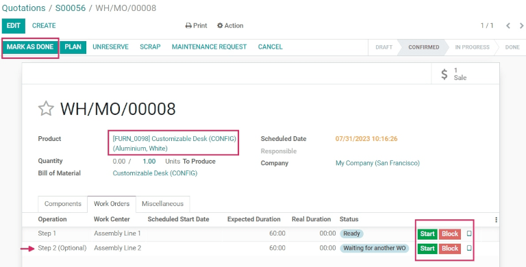

# Mahsulot variantlari uchun BoMlarni boshqarish

Odoo bir xil mahsulotning bir necha varianti uchun bitta material ro'yxatidan (BoM) foydalanish imkonini beradi. Variantlari bo'lgan mahsulot uchun birlashtirilgan `BoM (bill of materials)` ga ega bo'lish bir necha `BoMs (bills of materials)` ni boshqarish zaruriyatini oldini olish orqali vaqtni tejaydi.

## Mahsulot variantlarini faollashtirish

Mahsulot variantlari funksiyasini faollashtirish uchun `Inventory app ‣ Configuration ‣ Settings` bo'limiga o'ting va `Products` bo'limigacha pastga suring. Keyin `Variants` opsiyasini yoqish uchun katakchani belgilang. Shundan so'ng sozlamani qo'llash uchun `Save` tugmasini bosing.

Mahsulot variantlarini sozlash haqida qo'shimcha ma'lumot olish uchun `product variants` hujjatlariga murojaat qiling.

## Maxsus mahsulot xususiyatlarini yaratish

Mahsulot variantlari funksiyasi faollashtirilgandan so'ng, `Attributes` sahifasida mahsulot xususiyatlarini yarating va tahrirlang.

`Attributes` sahifasiga `Inventory app ‣ Configuration ‣ Settings` dan `Attributes` tugmasini bosish orqali yoki `Inventory app ‣ Configuration ‣ Attributes` tugmasini bosish orqali kirish mumkin.

`Attributes` sahifasiga kirgach, mavjud xususiyatga bosing yoki yangisini yaratish uchun `Create` tugmasini bosing. `Create` tugmasini bosish xususiyatni sozlash uchun yangi, bo'sh formani ochadi. Mavjud xususiyat uchun o'zgartirishlar kiritish uchun uning formasida `Edit` tugmasini bosing.

`Attribute Name` ni belgilang va `Category` maydonining pastga tushuvchi menyusidan kategoriyani tanlang. Keyin `Display Type` va `Variants Creation Mode` maydonlari yonida kerakli variantlarni tanlang. Kerakli variantlar tanlanganidan so'ng, yangi qiymat qo'shish uchun `Attribute Values` yorlig'i ostida `Add a line` tugmasini bosing.

::: tip

`Value` qatorida `Is custom value` katakchasi mavjud. Agar tanlab qo'yilsa, bu qiymat maxsus qiymat sifatida tan olinadi, bu esa mijozlarga mahsulotning maxsus variantini buyurtma berishda maxsus sozlash so'rovlarini yozish imkonini beradi.
::::

::: 
.. image:: product_variants/product-variants-attribute.png
:::

Barcha kerakli `Values` qo'shilgandan so'ng, yangi xususiyatni saqlash uchun `Save` tugmasini bosing.

## Mahsulot formasida mahsulot variantlarini qo'shish

Yaratilgan xususiyatlar muayyan mahsulotlar uchun aniq variantlarga qo'llanilishi mumkin. Mahsulotga mahsulot variantlarini qo'shish uchun `Inventory app ‣ Products ‣ Products` ga o'tib mahsulot formasiga o'ting. Mahsulotga o'zgartirishlar kiritish uchun `Edit` tugmasini bosing. Keyin `Variants` yorlig'ini bosing.

`Attribute` sarlavhasi ostida yangi xususiyat qo'shish uchun `Add a line` tugmasini bosing va pastga tushuvchi menyudan qo'shish uchun birini tanlang.

Keyin `Values` sarlavhasi ostida mavjud qiymatlar ro'yxatidan tanlash uchun pastga tushuvchi menyuni bosing. Ularni qo'shish uchun har bir kerakli qiymatga bosing va mahsulotga qo'shilishi kerak bo'lgan qo'shimcha xususiyatlar uchun bu jarayonni takrorlang.

Tugatgach, o'zgarishlarni saqlash uchun `Save` tugmasini bosing.

::: tip

Ichki ishlab chiqariladigan bir necha varianti bo'lgan `BoM (bill of materials)` mahsulotlari uchun **0,0 qayta buyurtma qoidasi** o'rnatilishi yoki ularning to'ldirish yo'llari *Buyurtma bo'yicha to'ldirish (MTO)* ga o'rnatilishi kerak.
::::

## BoM komponentlarini mahsulot variantlariga qo'llash

Keyinchalik, yangi `BoM (bill of materials)` yarating. Yoki `Manufacturing app ‣ Products ‣ Bills of Materials` ga o'tib mavjud birini tahrirlang. Keyin noldan sozlash uchun yangi `Bills of Materials` formasini ochish uchun `Create` tugmasini bosing.

`Product` maydonidagi pastga tushuvchi menyuni bosing va kerakli mahsulotni tanlab `BoM (bill of materials)` ga mahsulot qo'shing.

Keyin `Components` yorlig'ining `Component` bo'limi ostida `Add a line` tugmasini bosing va pastga tushuvchi menyudan kerakli komponentlarni tanlab komponentlar qo'shing.

`Quantity` va `Product Unit of Measure` ustunlarida kerakli qiymatlarni tanlang. Keyin `Apply on Variants` ustunida kerakli qiymatlarni tanlang.

::: tip

`BoM (bill of materials)` da komponentlarni aniq mahsulot variantlariga belgilash uchun `Apply on Variants` opsiyasi `Inventory` ilovasidan `Variants` sozlamasi faollashtirilgandan so'ng mavjud bo'ladi. Agar `Apply on Variants` maydoni darhol ko'rinmasa, uni qo'shimcha variantlar menyusidan (sarlavha qatori o'ngidagi uch nuqta belgisi) faollashtiring.
::::

Har bir komponent bir necha variantga belgilanishi mumkin. Hech qanday variant ko'rsatilmagan komponentlar mahsulotning har bir variantida ishlatiladi. Xuddi shu printsip operatsiyalar va qo'shimcha mahsulotlarni sozlashda ham qo'llaniladi.

Komponent belgilash orqali variant `BoMs (bills of material)` ni belgilashda `BoM (bill of materials)` ning asosiy bo'limidagi `Product Variant` maydoni bo'sh qoldirilishi kerak. Bu maydon *faqat* bitta mahsulot varianti uchun maxsus `BoM (bill of materials)` yaratishda ishlatiladi.

`BoM (bill of materials)` ga barcha kerakli sozlamalar kiritilgandan so'ng, o'zgarishlarni saqlash uchun formaning yuqorisidagi `Save` tugmasini bosing.

::: tip

Faqat aniq variantlar uchun qo'llaniladigan komponentlar uchun komponentlar qaysi operatsiyalarda iste'mol qilinishini tanlang. Agar `Consumed in Operation` ustuni darhol *ko'rinmasa*, uni qo'shimcha variantlar menyusidan (sarlavha qatori o'ngidagi uch nuqta belgisi) faollashtiring.
::::

## BoM mahsulotlarining variantlarini sotish va ishlab chiqarish

`BoM (bill of materials)` mahsulotlarining variantlarini buyurtma bo'yicha sotish va ishlab chiqarish uchun yangi taklif yaratish uchun `Sales app ‣ Create` ga o'ting.

### BoM mahsulotining variantini sotish

Bo'sh `Quotation` formasiga kirgach, mijoz qo'shish uchun `Customer` maydoni yonidagi pastga tushuvchi menyuni bosing.

Keyin `Order Lines` yorlig'i ostida `Add a product` tugmasini bosing va pastga tushuvchi menyudan oldin yaratilgan variantlari bo'lgan `BoM (bill of materials)` mahsulotini tanlang. Buni qilish `Configure a product` oynasini ochadi.

Oynadan mahsulotning to'g'ri variantini ishlab chiqarish uchun sozlash uchun kerakli xususiyat variantlarini bosing. Keyin agar kerak bo'lsa, sotish va ishlab chiqarish miqdorini o'zgartirish uchun [1] yonidagi yashil `+` yoki `-` belgilarini bosing.

Barcha spetsifikatsiyalar tanlanganidan so'ng, `Add` tugmasini bosing. Bu oynani ikkinchi `Configure` oynasiga o'zgartiradi, bu yerda mavjud ixtiyoriy mahsulotlar, agar ular oldin yaratilgan bo'lsa, paydo bo'ladi.

Tayyor bo'lgach, oynani yopish uchun `Confirm` tugmasini bosing.

Keyin barcha o'zgarishlarni saqlash uchun `Save` tugmasini bosing va yangi sotuv buyurtmasini (SO) yaratish va tasdiqlash uchun `Quotation` formasining yuqorisidagi `Confirm` tugmasini bosing.

### BoM mahsulotining variantini ishlab chiqarish

`SO (sales order)` tasdiqlanganidan so'ng, `SO (sales order)` formasining yuqorisida `Manufacturing` aqlli tugmasi paydo bo'ladi. `Manufacturing Order` formasini ochish uchun `Manufacturing` aqlli tugmasini bosing.

Bu formada `Components` yorlig'i ostida tanlangan variant uchun tegishli komponentlar ro'yxatlangan. Va variantga qarab, turli xil komponentlar ro'yxatlangan bo'ladi. Har qanday majburiy yoki ixtiyoriy `Operation` bosqichlarini ko'rish uchun `Work Orders` yorlig'ini bosing.

Planshet ko'rinishi ish buyurtmasi ekraniga kirish uchun bajarilishi kerak bo'lgan operatsiya qatori o'ngidagi `tablet icon` ni bosing.

Planshet ko'rinishidan operatsiya bosqichlarini yakunlash uchun `Mark as Done` tugmasini bosing.

Shu bilan bir qatorda, buyurtmani yakunlash uchun ishlab chiqarish buyurtmasi formasining yuqorisidagi `Mark as Done` tugmasini bosing.

Keyin sahifa yuqorisidagi breadcrumb orqali `SO (sales order)` ga qaytib o'ting.

Endi mahsulot ishlab chiqarilgan bo'lsa, mahsulotni mijozga yetkazib berish uchun `Delivery` aqlli tugmasini bosing. `Delivery Order` formasidan `Validate` tugmasini bosing, keyin mahsulotni yetkazib berish uchun `Apply` tugmasini bosing.

Sotuvni yakunlash uchun sahifa yuqorisidagi `breadcrumbs` orqali yana `SO (sales order)` ga qaytib bosing. Keyin mijozga buyurtma uchun hisob-kitob qilish uchun `Create Invoice` tugmasini bosing va yana `Create Invoice` tugmasini bosing.