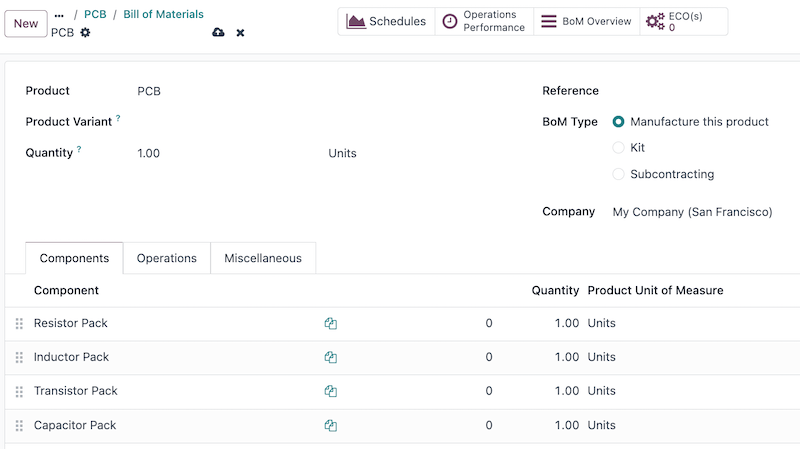
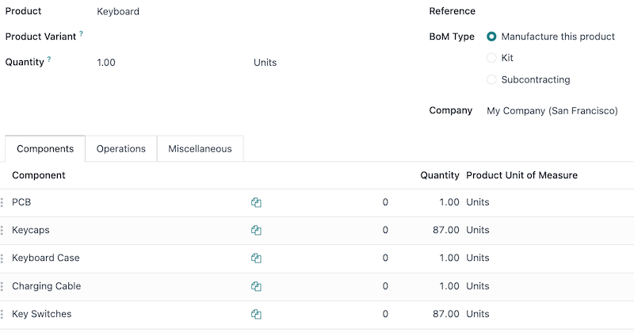

# Ko'p darajali BoMlar

Ishlab chiqarilgan mahsulot boshqa yig'maning bir qismi bo'lganda ko'p darajali material ro'yxatidan (BoM) foydalaning. Bu usul `BoMs (Bills of Materials)` ni boshqa `BoMs (Bills of Materials)` ichiga joylashtiradi, murakkab mahsulotlarni tartibga soladi va har bir ta'minot va ishlab chiqarish bosqichini alohida belgilash orqali ishlab chiqarishni soddalashtiradi.

Pastki darajadagi `BoMs (Bills of Materials)` (pastki yig'malar yoki yarim tayyor mahsulotlar) bu ishlab chiqarish jarayonlarini tartibga soladi va pastki yig'ma bir necha tayyor mahsulotlarda ishlatilganda foydali hisoblanadi (ya'ni ular bir necha yuqori darajadagi `BoMs (Bills of Materials)` da paydo bo'ladi). Mahsulotni qurish yoki sotib olish qanchalik murakkab bo'lsa, ko'p darajali `BoM (Bill of Materials)` shuncha qiymat keltirishi mumkin. Shu sababli, komponent va pastki yig'ma to'ldirish rejalashtirishni ko'p darajali `BoMs (Bills of Materials)` ning muammosiz ishlashini ta'minlash uchun juda muhimdir.

## To'ldirish rejalashtirishining ahamiyati

`Replenishment` ko'p darajali BoMlar uchun to'siqlarni oldini olish, yetkazib berish muddatlarini boshqarish va inventarni optimallashtirish uchun juda muhimdir. Usiz, etishmayotgan komponentlar ishlab chiqarishni to'xtatishi, buyurtmalarni kechiktirishi va xarajatlarni oshirishi mumkin. Yaxshi rejalashtirilgan to'ldirish strategiyasi `just-in-time availability`, `automates procurement` ni ta'minlaydi, zaxira darajasini muvozanatlaydi va ta'minot zanjirlarini samarali ushlab turadi. Bu kechikishlarni kamaytiradi, qo'lda ishni kamaytiradi va ishlab chiqarishning muammosiz bo'lishini ta'minlaydi.

`BoM (Bill of Materials)` dan kelib chiqadigan ishlab chiqarish buyurtmalari (MO) `MO (Manufacturing Order)` ni yakunlash uchun barcha komponentlar mavjud bo'lishini talab qiladi. Bu `MO (Manufacturing Order)` uchun `Component Status` bu ma'lumotni beradi. `check an MO's component status` ni qanday tekshirishni o'rganing.

## Ko'p darajali BoM yaratish

Ko'p darajali `BoM (Bill of Materials)` ni sozlash uchun yuqori darajadagi mahsulot va pastki darajadagi mahsulotlarning `BoMs (Bills of Materials)` yaratilishi kerak. Noldan boshlayotgan bo'lsangiz, `BoMs (Bills of Materials)` ni pastdan yuqoriga qurib chiqing. Eng past darajadagi mahsulot `BoMs (Bills of Materials)` bilan boshlang, keyin bu mahsulotlarni yuqori darajadagi `BoMs (Bills of Materials)` da komponent sifatida kiriting.

::: example
Maxsus klaviatura uchun bosma mikrosxema (PCB) tranzistorlar, rezistorlar va kondensatorlar kabi yuzlab elektron komponentlardan iborat. Bu komponentlarning barchasini ro'yxatlash o'rniga, [PCB] uchun pastki darajadagi mahsulot va `BoM (Bill of Materials)` yaratiladi, bu tranzistorlar va boshqa kichik komponentlar miqdorini kuzatish uchun, maxsus klaviatura uchun yuqori darajadagi `BoM (Bill of Materials)` ni ularni ro'yxatlash orqali haddan tashqari to'ldirish zaruriyatisiz. Buning o'rniga, maxsus klaviaturaning `BoM (Bill of Materials)` tugma qopqoqlari, kalitlar, PCB va klaviatura plitasi kabi komponentlar va pastki darajadagi `BoMs (Bills of Materials)` dan iborat.
:::

`Learn how to build a simple bill of materials`. PCB uchun bu tranzistorlar, rezistorlar va boshqa komponentlarni o'z ichiga oladi.

Pastki darajadagi mahsulotlar (PCB, tugma qopqoqlari va klaviatura plitasi kabi) to'liq sozlangach, `Manufacturing app ‣ Products ‣ Products` ga o'tib va `New` ni tanlab yuqori darajadagi mahsulotni yarating. Bu yerdan kerak bo'lgancha mahsulot spetsifikatsiyalarini sozlang.

Yuqori darajadagi mahsulot (klaviatura) sozlangach, mahsulot formasidagi `Bill of Materials` aqlli tugmasini bosing va keyin yuqori darajadagi mahsulot uchun `BoM (Bill of Materials)` yaratish uchun `New` ni tanlang. Bu `BoM (Bill of Materials)` ga pastki darajadagi mahsulotlarni va boshqa zarur komponentlarni qo'shing.

## Ishlab chiqarish rejalashtiruvini boshqarish

Quyidagi ikkita variant ko'p darajali `BoMs (Bills of Materials)` ga ega mahsulotlar uchun ishlab chiqarish buyurtmalarini avtomatlashtiruvni boshqarishning eng yaxshi yo'llaridan ikkitasidir.

::: tip

Murakkab `BoMs (Bills of Materials)` maxsus ravishda ishlab chiqarilgan komponentlarni talab qiluvchi mahsulotlarni boshqarish uchun ishlatiladi. Agar BoM komponentlarni tartibga solish yoki sotish mumkin bo'lgan mahsulotlarni to'plash uchun yaratilayotgan bo'lsa, buning o'rniga `use a kit` dan foydalaning.
::::

Asosiy mahsulot uchun ishlab chiqarish buyurtmasini tasdiqlagandan so'ng pastki darajadagi mahsulotlar uchun ishlab chiqarish buyurtmalarini avtomatik ravishda ishga tushirish uchun ikki variant mavjud:

- **1-variant (tavsiya etiladi):** Pastki darajadagi mahsulotlar uchun *Qayta buyurtma qoidalarini* yarating va minimal va maksimal zarur zaxira miqdorlarini [0] ga o'rnating.
- **2-variant:** Pastki darajadagi mahsulotning mahsulot formasining `Inventory` yorlig'i ostida `Replenish on Order (MTO)` va `Manufacture` yo'llarini faollashtiring.

1-variant 2-variantdan ko'ra moslashuvchanroq va tavsiya etiladi. Qayta buyurtma qoidalari talabni to'ldirishga bevosita bog'lamaydi, zaxirani zarurat bo'yicha ajratmaslik va qayta belgilash imkonini beradi. Buyurtma bo'yicha to'ldirish (MTO) yo'li esa pastki darajadagi va yuqori darajadagi mahsulotlarni o'ziga xos tarzda bog'laydi, tasdiqlangan yuqori darajadagi ishlab chiqarish buyurtmasi uchun miqdorlarni ajratadi.

Ikkala usulda ham yuqori darajadagi mahsulotni boshlashdan oldin pastki darajadagi mahsulotlar to'liq ishlab chiqarilgan bo'lishi kerak.

## Ko'p darajali BoM sozlash oqimi

Quyidagi bo'lim ko'p darajali BoMlarni qanday sozlash, dastlabki inventarni o'rnatish, `0/0/1 reordering rule` (tavsiya etilgan ishlab chiqarish rejasi) ni o'rnatish, yetkazib berish muddatlarini sozlash va ishlab chiqarish variantlarini sozlash haqida batafsil ma'lumot beradi.

Pastki darajadagi mahsulotlar uchun 0/0/1 qayta buyurtma qoidasini yaratish (minimal zaxira nolga, maksimal zaxira nolga o'rnatilgan, avtomatik ravishda bittasini qayta buyurtma qilish) ular komponent yoki pastki yig'ma ekanligidan qat'i nazar, ko'p darajali `BoM (Bill of Materials)` ni boshqarish uchun tavsiya etilgan yondashuv hisoblanadi. Bu sozlama **Inventory**, **Manufacturing** va **Purchase** ilovalarini ishlatadi.

::: warning

Bu Odoo da ko'p darajali `BoM (Bill of Materials)` ni qanday sozlashning faqat bitta namunasidir. Sozlash paytida hal qilinishi kerak bo'lgan har qanday noyob holatlarni ko'rib chiqing va ularni sozlamaga kiritilganligiga ishonch hosil qiling. Agar sozlash paytida biron bir maxsus yordam kerak bo'lsa, [success pack](https://www.odoo.com/pricing-packs) sotib olishni ko'rib chiqing.
::::

### BoMlarni yaratish

`BoMs (Bills of Materials)` ni qurish uchun `Create a multilevel BoM` bo'limidagi qadamlarni bajaring.

Ko'p darajali `BoM (Bill of Materials)` ni pastdan yuqoriga qurishga ishonch hosil qiling. Odoo da eng past darajadagi komponent mahsulotlarini yaratishdan boshlang, keyin ular uchun ishlatiluvchi pastki yig'ma mahsulotlarini, keyin bu pastki yig'ma uchun `BoM (Bill of Materials)` ni va ko'p darajali `BoM (Bill of Materials)` ning har bir darajasi yaratilgunga qadar takrorlang.

### Dastlabki inventarni o'rnatish

::: tip

Agar sozlash uchun dastlabki inventar bo'lmasa, u holda bu bo'limni o'tkazib yuboring va ko'p darajali `BoM (Bill of Materials)` uchun ta'minot usulini sozlashni boshlang.
::::

Oldingi bosqichda sozlangan har bir mahsulot (komponentlar, pastki yig'malar va yakuniy mahsulotlar) uchun qo'lda miqdorni yangilang. Buning uchun **Inventory** ilovasini oching, keyin filtrlar, qidiruv paneli yoki aylantirish orqali mahsulotlarni toping va ularning mahsulot formasini ochish uchun ularga bosing. Bu yerdan `On Hand` aqlli tugmasini bosing, agar u sozlangan bo'lsa `select the variant` ni tanlang va keyin qo'lda miqdorni kiriting.

### Ta'minot usulini sozlash

Endi bu ko'p darajali `BoM (Bill of Materials)` ishlatiladigan ta'minot usulini tanlash vaqti keldi. Quyidagi ikkita variant afzalroq, ammo noyob holatlar boshqa ta'minot usulini mantiqiyroq qilishi mumkin.

- **1-variant (tavsiya etiladi):** Pastki darajadagi mahsulotlar uchun *Qayta buyurtma qoidalarini* yarating va minimal va maksimal zarur zaxira miqdorlarini [0] ga o'rnating.
- **2-variant:** Pastki darajadagi mahsulotning mahsulot formasining `Inventory` yorlig'i ostida `Replenish on Order (MTO)` va `Manufacture` yo'llarini faollashtiring.

Qayta buyurtma qoidalari tavsiya etiladi, chunki ular ishlab chiqarilgan mahsulotni aniq sotuv buyurtmasiga bog'lamaydi, bu ishlab chiqarilgan mahsulotga asl buyurtma bekor qilinsa, boshqa sotuv buyurtmasini bajarish imkonini beradi.

Buyurtma bo'yicha mahsulot ishlab chiqarish tavsiya etilmaydi, chunki ishlab chiqarilgan mahsulot boshqa sotuv buyurtmasini bajarish uchun ishlatilishi mumkin emas. Biroq, agar biznes uchun qattiq kuzatuv zarur bo'lsa, bu foydali bo'lishi mumkin.

### Sotuvchi va ishlab chiqarish yetkazib berish muddatlarini kiriting

Sotuvchi va ishlab chiqarish yetkazib berish muddatlari Odoo tomonidan buyurtmalarni o'z vaqtida bajarish uchun ishlab chiqarish va ta'minot harakatlarini muvofiqlashtirish uchun ishlatiladi. Sotib olinadigan komponentlar uchun sotuvchi yetkazib berish muddatlarini o'rnating. Bular ko'p darajali `BoM (Bill of Materials)` ning yakuniy mahsulotdan tashqari har qanday darajasida paydo bo'lishi mumkin. `BoM (Bill of Materials)` yordamida quriladigan mahsulotlar uchun ishlab chiqarish yetkazib berish muddatlarini o'rnating. Bular ko'p darajali `BoM (Bill of Materials)` ning eng past daraja (alohida komponentlar sotib olinadi) dan tashqari har qanday darajasida paydo bo'lishi mumkin.

### Ishlab chiqarish oqimini boshqarish uchun operatsiyalarni yaratish

Avvalo biznes uchun joriy ishlab chiqarish oqimini aniqlang, keyin mos keladigan Odoo sozlamalarini moslashtiring. Quyidagi ro'yxat bu bosqichda ishtirok etishi mumkin bo'lgan sozlash qismlarining faqat bir qismidir.

- **Ishlab chiqarish bosqichlari**: Nechta ishlab chiqarish bosqichi bajarilishini ko'rib chiqing (bir-, ikki- yoki uch bosqichli ishlab chiqarish).
- **Ish markazlari**: Biron bir `work centers` sozlanishi kerakligini hal qiling.
- **Asosiy ishlab chiqarish jadvali**: Agar qo'lda rejalashtirilgan ishlab chiqarish buyurtmalari kerak bo'lsa (masalan, mavsumiy talabni boshqarish uchun), `master production schedule` (MPS) yarating.

::: tip

Ishlab chiqarish operatsiyalari san'at va ilm hisoblanadi, shuning uchun o'rnatilgan oqimni Odoo ga sozlash bu bosqich uchun tavsiya etilgan yondashuvdir. `manufacturing in Odoo` haqida ko'proq o'qing.
::::

### Sozlash xulosasi

Bu jarayon oxirida ko'p darajali `BoM (Bill of Materials)` sozlangan va yuqori darajadagi mahsulotning inventar hisobi, ta'minot usuli o'rnatilgan, ta'minot yetkazib berish muddatlari va ishlab chiqarish operatsiyalari sozlangan. Bu yerdan sotuv buyurtmalari yuqori darajadagi mahsulotni o'z ichiga olishi mumkin, sotuvchilar yoki ishlab chiqarish orqali avtomatik ta'minot boshlanishi mumkin, yuqori darajadagi mahsulot **eCommerce** do'koniga kiritilishi mumkin.