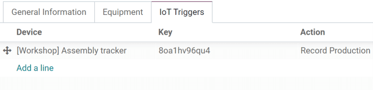

# Ish markazlari

*Ish markazlari* - bu **Ishlab chiqarish** ish buyurtmalari qayta ishlanadigan joylar bo'lib, xarajatlarni kuzatish, jadvallar tuzish, quvvatni rejalashtirish, uskunalarni tashkil qilish va samaradorlikni kuzatish uchun ishlatiladi. Mahsulot uchun materiallar ro'yxati (BoM) ning *Operatsiyalar* bo'limida ish buyurtmasi belgilanganida ish markazini ko'rsatish majburiydir.

::: warning

Ish markazlari faqat `Work Orders` sozlamasi yoqilgan bo'lsagina ko'rinadi. Buning uchun
`Manufacturing app ‣ Configuration ‣ Settings` ga o'ting, so'ngra `Work
Orders` belgilovchi katakchani belgilang. Ish buyurtmalarini
`Manufacturing` ilovasida
`Operations ‣ Work Orders` ni tanlab boshqarish mumkin.
::::

## Ish markazini konfiguratsiya qilish

### Yangi ish markazi yaratish

**Ishlab chiqarish** ilovasida
`Configuration ‣ Work Centers`
ni tanlang va yangi ish markazi formasini ochish uchun `New` tugmasini bosing.

- `Work Center Name`: ish buyurtmasida yoki hisobot panellarida uni tanlash uchun ishlatiladigan ish markazining yorlig'i
- `Tag`: ro'yxat ko'rinishida ish markazlarini saralash uchun ishlatilishi mumkin bo'lgan qayta foydalaniladigan yorliqlar
- `Alternative Workcenters`: agar bu ish markazi mavjud bo'lmasa, ish buyurtmasi qayerda bajarilishi kerak
- `Code`: ro'yxat ko'rinishida ko'rsatiladigan ish markazining mos yozuvlar identifikatori
- `Working Hours`: ish markazi hafta davomida qachon ishlatilishi mumkin bo'lgan soatlar

#### Ish soatlari

*Ish soatlari* ish markazining bir yoki ikki haftalik jadvalga asoslangan holda qachon ishlashi kerakligini belgilaydi. Bu soatlar, shuningdek, *umumiy uskunalar samaradorligi* (OEE) ni hisoblash uchun asos bo'lib xizmat qiladi.

::: tip

Odiy holatda, Odoo [Standard 40 hours/week] ish soatlaridan foydalanadi, bu ish markazlarining dushanbadan juma kunigacha ertalab 8:00 dan kechqurun 17:00 gacha ishlashini nazarda tutadi.
::::

Ish soatlarini o'zgartirish uchun joriy
`Working Hours` qiymatiga sichqonchani olib boring va
ish soatlari formasini ochish uchun `fa-arrow-right`
(`Internal link`) belgisini bosing.

Yangi ish soatlari to'plamini yaratish uchun `New` tugmasini bosing va unga nom bering. Bu yerdan vaqt oralig'ini sozlash uchun har qanday
`Work from` yoki
`Work to` qiymatini tahrirlang. Qatorni `fa-trash-o` `(trash)` belgisini bosib olib tashlang. Yangi vaqt oralig'ini yaratish uchun
ro'yxat pastidagi `Add a line` ni bosing.

### Mahsuldorlik standartlari va ruxsat etilgan xodimlarni belgilash

Ish markazi formasidagi `General Information` bo'limi
ish markaziga mahsuldorlik maqsadlarini belgilashga imkon beradi. Bular ish markazining potensial vaqtining qancha qismi ishlatilayotgani va uning operatsion xarajatlarini hisoblash uchun asos sifatida ishlatiladi.

- `Time Efficiency`: bu ish markazidan foydalanish ish buyurtmasining oddiy bajarilish tezligiga qanday ta'sir qilishining ko'paytiruvchisi

  ::: example
  Agar ish markazida eski uskunalar mavjud bo'lsa va ish buyurtmalarini ishlab chiqarish ikki baravar ko'p vaqt talab qilsa, [Time Efficiency] [50.00%] bo'ladi.
  :::

- `Capacity`: ish markazida bir vaqtning o'zida qayta ishlanishi mumkin bo'lgan mahsulotlar soni

- `OEE Target`: ish markazidagi samaradorlik maqsadi

  ::: example
  Agar ish markazi [kuniga 8 soat] mavjud bo'lsa, lekin faqat [kuniga 7 soat] ishlatilishi kutilsa, OEE [87.50%] bo'ladi. $7/8*100=87.5$
  :::

   tip

Birliklar sonidan boshqa o'lchovlarda ishlab chiqarish quvvatlarini belgilash uchun **Inventar** ilovasida *Units of Measure* funksiyasini yoqing.
::::

### IoT qurilmalarini integratsiya qilish

`IoT Triggers` bo'limi
`IoT (Internet of Things)`
qurilmalarini ish markazi bilan integratsiya qilishga imkon beradi:

- `Device`: ishga tushiriladigan IoT qurilmasini belgilaydi
- `Key`: qurilma uchun xavfsizlik kaliti
- `Action`: ishga tushiriladigan IoT qurilma harakati

## Ish markazlariga uskunalar tayinlash

**Texnik xizmat** ilovasi ish markaziga aniq uskunalarni qo'shish va ularning xarajatlari va mahsuldorligini alohida kuzatishga imkon beradi. Shuningdek, u ish markazi formasiga uskunalarni ro'yxatlash va texnik xizmat faoliyatini rejalashtirish uchun ishlatiladigan `Equipment` va
`Maintenance` bo'limlarini qo'shadi.

### Uskunalarni konfiguratsiya qilish

`Equipment` bo'limidan foydalanib,
aniq uskunalar ish markaziga tayinlanishi mumkin. Qo'shilgan har bir uskuna qismi uchun quyidagi ma'lumotlar ko'rsatiladi:

- `Equipment Name`: uskuna qismining nomi
- `Technician`: uskunaga xizmat ko'rsatish uchun mas'ul bo'lgan texnik
- `Equipment Category`: uskuna tegishli bo'lgan kategoriya
- `MTBF`: nosozliklar orasidagi o'rtacha vaqt; uskuna qismi ishlamay qolishdan oldin ishlaydi deb kutilayotgan o'rtacha vaqt
- `MTTR`: tiklanishgacha bo'lgan o'rtacha vaqt; uskunaning to'liq ishga yaroqli holga kelishi uchun ketadigan o'rtacha vaqt
- `Est. Next Failure`: keyingi uskuna nosozligi qachon sodir bo'lishining taxminiy vaqti

::: tip

`MTBF`, `MTTR`, va `Est. Next Failure` hammasi o'tmishdagi nosozlik ma'lumotlari mavjud bo'lsa, avtomatik ravishda hisoblanadi.
::::

## Ish markazi rejalashtirish

Hozirda rejalashtirilgan ish buyurtmalarini
`Manufacturing app ‣
Planning ‣ Planning by Workcenter` ga kirish orqali ko'rish mumkin.

Turli ko'rinishlar qancha individual ish buyurtmalari rejalashtirilganini, ish markazining har soatning neча daqiqasi ishlab chiqarishda bo'lishini va hozirda ish buyurtmalari uchun rejalashtirilgan sanalar va vaqtlarni ko'rsatadi. Vaqtlar va rejalashtirilgan ish markazlarini individual ish buyurtmasiga kirish uchun bosish orqali o'zgartirish mumkin.

## Ish markazi ishlash ko'rsatkichlari

Individual ish markazi uchun ishlash ko'rsatkichlarini
`Configuration
‣ Work Centers` ni tanlab va
ish markazini bosish orqali ko'rish mumkin. Ko'rsatkichlar formaning yuqori qismidagi aqlli tugmalarda ko'rsatiladi.

- `OEE`: umumiy uskunalar samaraliligi, ish markazining mavjud ish soatlaridan samarali bo'lgan vaqtining foizi.

  >  example
Ishlab chiqaruvchida ikki smena bor: kungi smena ertalab 5:00 dan 13:00 gacha va tungi smena 13:00 dan 21:00 gacha. Har qanday mavjud ish markazidan boshlab, mavjud ish soatlarini kungi smenaga mos ravishda tahrirlang.

Kungi smena saqlanganidan so'ng, `fa-cog` `(cog)` belgisini bosing va
`Duplicate` ni tanlang. Bu yangi jadvalni
[Night Shift] deb nomlang va har bir `Work
from` ni 13:00 ga va
`Work from` ni 21:00 ga o'zgartiring.

:::

### Bir nechta smenalar uchun ish markazlari

Dublikat ish markazlarini yaratish uchun
`Configuration ‣ Work Centers` ga o'tish orqali ish markazi ko'rinishiga qayting va har ikkala smena tomonidan ishlatilayotgan ish markazlarining har birini, yo individual ish markazi formalarida yoki to'g'ridan-to'g'ri ro'yxat ko'rinishidan dublikat qiling.

::: tip

Ish markazlarini to'g'ridan-to'g'ri ro'yxat ko'rinishidan dublikat qilish uchun ro'yxat elementlari ustida paydo bo'ladigan
`fa-check-square-o`
`(checkbox)` ni bosib hammasini tanlang. Keyin ro'yxat yuqorisidagi `fa-cog` `Actions` tugmasini bosing va `Duplicate` ni tanlang.
::::

::::: example
Ishlab chiqaruvchida ikki ish markazi, [Assembly Line 1] va
[Assembly Line 2], va ikki ish soati, [Day
Shift] va [Night Shift] bor.

Har bir smena uchun [Assembly Line 1] va [Assembly Line
2] versiyalarini yaratish uchun ish markazlarining har birini dublikat qiling.
Birinchi ish markazini tanlang va o'sha ish
markazining nomiga smena nomini qo'shing va unga tegishli ish soatlarini belgilang. Ixtiyoriy ravishda, har bir ish markazini qarama-qarshi smena hamkasbini muqobil ish markazi sifatida ishlatish uchun konfiguratsiya qiling, bu ishlab chiqarish buyurtmalarining har ikkisiga tayinlanishiga ishonch hosil qiladi. Teglar, shuningdek, har bir smena o'rtasida vizual farqni yaratishga yordam berishi mumkin.

::: tip

Ro'yxat ko'rinishiga qaytmasdan ro'yxatdagi keyingi formaga o'tish uchun yuqori chap burchakdagi `oi-chevron-left`
`(left arrow)` va
`oi-chevron-right`
`(right arrow)` tugmalaridan foydalaning.
::::
:::::

### Turli smenalarni taqqoslash hisobotlari

Smenalarni ifodalash uchun bir nechta ish markazlari yaratilgan holda, ish markazi bo'yicha saralangan hisobotlar endi smenalarni taqqoslaydi. Buni har bir smenaga tayinlanayotgan ish buyurtmalari soni, OEE yoki har bir smenaning mahsulot ishlab chiqarish uchun sarf qilayotgan haqiqiy vaqtini taqqoslash uchun ishlatish mumkin.

::: example
Bir xil ish markazida bir xil mahsulotni ishlab chiqarayotgan ikki smenaning vaqt samaradorligini taqqoslash uchun hisobot yaratilgan.

Bu hisobotni yaratish uchun
`Reporting ‣ Work Orders` ga o'ting va
`fa-filter` **Ready**
*or* **Waiting** *or* **Pending** *or* **In Progress** filtrini uning o'ng tomonidagi `fa-x`
`Remove` belgisini bosish orqali olib tashlang.
Keyin `Measures` tugmasini bosing va
`Duration Deviation (%)` ni tanlang

Bu holatda, kungi smena o'rtacha mahsulotlarni ishlab chiqarish uchun kutilganidan ko'proq vaqt sarflagan (-6.50%) va tungi smena kutilganidan kamroq vaqt sarflagan (15.00%).
:::