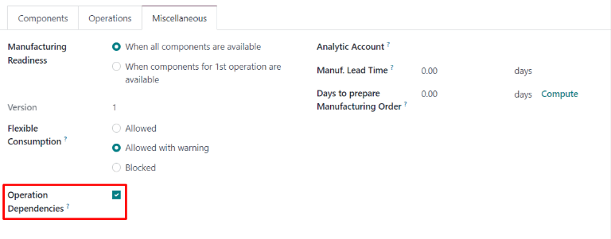
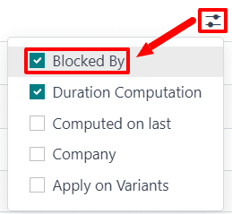
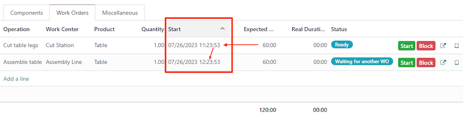

# Ish buyurtmalari bog'liqliklari

Muayyan mahsulotlarni ishlab chiqarishda, ba'zi operatsiyalar boshqalar boshlanishidan oldin tugatilishi kerak bo'lishi mumkin. Operatsiyalarning to'g'ri tartibda bajarilishini ta'minlash uchun Odoo *Ishlab chiqarish* ilovasida *ish buyurtmalari bog'liqliklari* sozlamasi mavjud. Ushbu sozlamani yoqish materiallar ro'yxati (BoM) dagi operatsiyalarning birinchi bo'lib bajarilishi kerak bo'lgan boshqa operatsiyalar tomonidan *bloklanishiga* imkon beradi.

## Konfiguratsiya

*Ish buyurtmalari bog'liqliklari* sozlamasi odatiy holatda yoqilmagan. Uni yoqish uchun
`Manufacturing ‣ Configuration ‣ Settings` ga o'ting. Keyin `Work
Orders` sozlamasini yoqing, agar u allaqachon faol bo'lmasa.

`Work Orders`
sozlamasini yoqgandan so'ng, uning ostida `Work Order Dependencies` sozlamasi paydo bo'ladi. `Work Order Dependencies` ni yoqing, so'ngra o'zgarishlarni tasdiqlash uchun
`Save` ni bosing.

## BoM ga bog'liqliklarni qo'shish

Ish buyurtmalari bog'liqliklari mahsulotning
`BoM (Bill of Materials)` da konfiguratsiya qilinadi. Buning uchun
`Manufacturing ‣ Products ‣ Bills of Materials` ga o'ting, so'ngra
`BoM (Bill of Materials)` ni tanlang yoki
`New` ni bosib yangisini yarating.

::: admonition
Ko'proq o'rgang

Yangi `BoM (Bill of Materials)` ni to'g'ri konfiguratsiya qilish bo'yicha to'liq qo'llanma uchun
`creating a bill of materials ` hujjatini ko'ring.
:::

`BoM (Bill of Materials)` da
`Miscellaneous` bo'limini bosing, so'ngra
`Operation
Dependencies` belgilovchi katakchani yoqing. Bu `Operations` bo'limining sozlamalarida yangi
`Blocked By` variantini mavjud qiladi.

Keyin `Operations` bo'limini bosing.
Bo'limning yuqori o'ng qismida bo'lim
`settings` tugmasini bosing, so'ngra
`Blocked By` belgilovchi katakchani yoqing. Bu `Operations` bo'limidagi har bir operatsiya uchun
`Blocked By` maydonining paydo bo'lishiga olib keladi.

Boshqa operatsiya tomonidan bloklanishi kerak bo'lgan operatsiya qatorida
`Blocked By` maydonini bosing va
`Open: Operations` pop-up oynasi paydo bo'ladi. Pop-up oynadagi `Blocked By` tushirish menyusi maydonida bloklanayotgan operatsiyadan *oldin* tugatilishi kerak bo'lgan bloklayotgan operatsiyani tanlang.

Nihoyat, `Save` ni bosib `BoM (Bill of Materials)` ni saqlang.

## Bog'liqliklardan foydalanib ish buyurtmalarini rejalashtirish

Ish buyurtmalari bog'liqliklari `BoM (Bill of Materials)` da konfiguratsiya qilingandan so'ng, Odoo
*Ishlab chiqarish* ilovasi ish buyurtmalarining bog'liqliklariga asoslanib ularning qachon rejalashtirilishini rejalashtira oladi. Ishlab chiqarish buyurtmasi uchun ish buyurtmalarini rejalashtirish uchun `Manufacturing ‣ Operations ‣
Manufacturing Orders` ga o'ting.

Keyin `BoM (Bill of Materials)` da ish buyurtmalari bog'liqliklari o'rnatilgan mahsulot uchun ishlab chiqarish buyurtmasini tanlang yoki
`New` ni bosib yangi ishlab chiqarish buyurtmasini yarating. Agar yangi ishlab chiqarish buyurtmasi yaratilsa, `Bill of
Material` tushirish menyusi maydonidan ish buyurtmalari bog'liqliklari bilan konfiguratsiya qilingan `BoM (Bill of Materials)` ni tanlang, so'ngra
`Confirm` ni bosing.

Ishlab chiqarish buyurtmasini tasdiqlagandan so'ng, uni bajarish uchun zarur bo'lgan ish buyurtmalarini ko'rish uchun
`Work Orders` bo'limini tanlang. Boshqa ish buyurtmasi tomonidan bloklanmagan har qanday ish buyurtmasi
`Status` bo'limida [Ready] tegini ko'rsatadi.

Bir yoki bir nechta ish buyurtmalari tomonidan bloklangan ish buyurtmalari o'rniga [Waiting for another WO] tegini ko'rsatadi. Bloklayotgan ish buyurtma(lar) tugagandan so'ng, teg [Ready] ga yangilanadi.

Ishlab chiqarish buyurtmasining ish buyurtmalarini rejalashtirish unchun sahifa yuqorisidagi
`Plan` tugmasini bosing.
Shundan so'ng `Work Orders` bo'limidagi har bir ish buyurtma uchun
`Scheduled Start Date` maydoni rejalashtirilgan boshlanish sanasi va vaqti bilan avtomatik to'ldiriladi. Bloklangan ish buyurtma undan oldin keladigan ish buyurtmasining
`Expected Duration` maydonida belgilangan vaqt davri oxirida rejalanadi.

::: example
A mahsuloti uchun ishlab chiqarish buyurtmasi yaratiladi. Ishlab chiqarish buyurtmasida ikkita operatsiya bor: Kesish va Yig'ish. Har bir operatsiya 60 daqiqa kutilayotgan davomiylikka ega va Yig'ish operatsiyasi Kesish operatsiyasi tomonidan bloklanadi.

Ishlab chiqarish buyurtmasi uchun
`Plan` tugmasi soat 13:30 da bosiladi va Kesish operatsiyasi darhol boshlanish uchun rejalanadi. Kesish operatsiyasi 60 daqiqa kutilayotgan davomiylikka ega bo'lgani uchun, Yig'ish operatsiyasi soat 14:30 da boshlanish uchun rejalanadi.
:::

### Ish markazi bo'yicha rejalashtirish

Ish buyurtmalarining qanday rejalashtirilganini vizual tasvirini ko'rish uchun
`Manufacturing ‣ Planning ‣ Planning by
Workcenter` ga o'tib `Work
Orders Planning` sahifasiga o'ting. Bu sahifa har bir operatsiya uchun rejalashtirilgan barcha ish buyurtmalarining vaqt jadvalini ko'rsatadi.

Agar bitta ish buyurtma boshqasining tugallanishi tomonidan bloklansa, bloklangan ish buyurtma uni bloklab turgan ish buyurtmadan keyin boshlash uchun rejalashtirilgan holda ko'rsatiladi. Bundan tashqari, strelka ikkita ish buyurtmasini bog'lab, bloklayotgan operatsiyadan bloklangan operatsiyaga yo'naladi.

