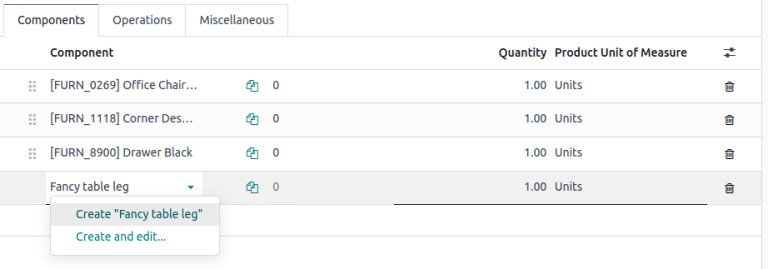
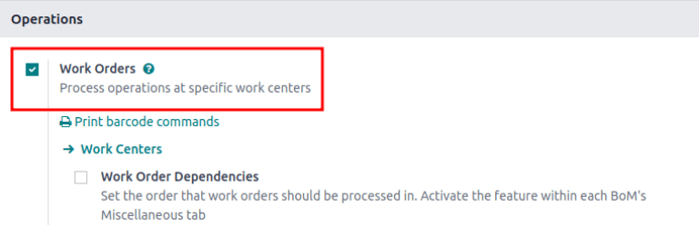
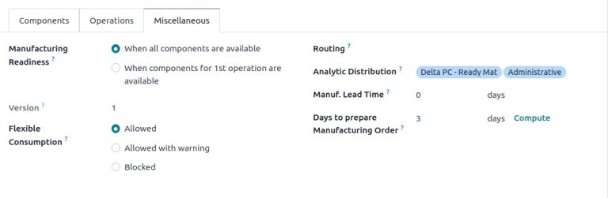

# Materiallar ro'yxati

*Materiallar ro'yxati* (yoki qisqacha *BoM*) mahsulotni ishlab chiqarish yoki ta'mirlash uchun zarur bo'lgan aniq komponentlar va ularning tegishli miqdorlarini hujjatlashadi. Odoo da
`BoMs (Bills of Materials)` ishlab chiqarilgan tovarlar va to'plamlar uchun loyiha sifatida xizmat qiladi va ko'pincha ishlab chiqarish operatsiyalari va bosqichma-bosqich ko'rsatmalarni ham o'z ichiga oladi.

## BoM sozlash

`BoM (Bill of Materials)` yaratish uchun
`Manufacturing app ‣ Products ‣ Bills of Materials` ga o'ting va `New` ni bosing.

Keyin `BoM Type` ni
`Manufacture this Product` ga o'rnating.

So'ngra
`required components ` ni belgilang va zarur bo'lsa, har qanday
`manufacturing operations ` ni aniqlang.

::: tip

Individual `BoMs (Bills of Materials)`
ga *Sales*, *Inventory*, va *Manufacturing* ilovalari orqali, shuningdek, mahsulot havola qilingan har qanday ichki havolalar orqali (masalan, maydon yoki satr elementida) kirish mumkin bo'lgan har qanday mahsulot formasidagi `Bill of
Materials` smart tugmasini bosish orqali ham tezda kirish yoki yaratish mumkin.
::::

Tortma uchun BoM, Components bo'limini ko'rsatadi.

### Komponentlar

`BoM (Bill of Materials)` ning `Components` bo'limida mahsulotni ishlab chiqarish uchun ishlatiladigan komponentlarni
`Add a line` ni bosish orqali belgilang. `Components` tushirish menyusidan mavjud mahsulotlardan tanlang yoki nomini yozib yangi mahsulot yarating va satr elementini tezda qo'shish uchun `Create " "`
variantini yoki komponentni qo'shish va uning konfiguratsiya formasiga o'tish uchun
`Create and edit...` variantini tanlang.

Ixtiyoriy ravishda
`Components` bo'limining eng o'ng tomonidagi
`oi-settings-adjust` `(settings
adjust)` belgisini bosish orqali qo'shimcha maydonlarga kiring. Ushbu ustunlarni yoqish uchun quyidagi xususiyatlar uchun belgilovchi katakchalarni belgilang:

- `Apply on Variants`: har bir komponent qaysi
  `product variant
  ` da ishlatilishini belgilang. Maydon bo'sh qoldirilsa, komponent barcha mahsulot variantlarida ishlatiladi.

::: 
- `Consumed in Operation`: komponentdan foydalanayotgan operatsiyani belgilang. `manufacturing readiness ` ni aniqlash uchun foydali.

- `Manual Consumption`: operatorlarni ishlab chiqarish buyurtmasi (MO) da `Consumed` belgilovchi katakchani belgilashga majburlash uchun belgilovchi katakchani belgilang.

  

  Buni qilmaslik `Consumption Warning` xato xabariga olib keladi, bu yerda sarflangan komponent miqdori qo'lda kiritilishi kerak. Aks holda, operatsiyani tugatish mumkin emas.

  
:::

### Operatsiyalar

`BoM (Bill of Materials)` ga *operatsiya* qo'shing, ishlab chiqarish uchun ko'rsatmalarni belgilash va operatsiyaga sarflangan vaqtni ro'yxatga olish uchun. Ushbu xususiyatdan foydalanish uchun birinchi navbatda
`Manufacturing app ‣ Configuration ‣ Settings` ga o'tib *Work
Orders* xususiyatini yoqing. `Operations` bo'limida xususiyatni yoqish uchun `Work Orders` belgilovchi katakchani belgilang.

Keyin `Manufacturing app ‣ Products ‣ Bill of
Materials` ga o'tib va
kerakli `BoM (Bill of Materials)` ni tanlab
`BoM (Bill of Materials)` ga o'ting. Yangi operatsiya qo'shish uchun `Operations` bo'limiga o'ting va `Add a line` ni bosing.

Buni qilish `Create Operations` pop-up oynasini ochadi, bu yerda operatsiyaning turli maydonlari konfiguratsiya qilinadi:

- `Operation`: operatsiya nomi.

- `Work Center`: operatsiyani bajarish uchun mavjud joylarni tanlang yoki nomini yozib va `Create " "` variantini tanlab yangi ish markazini yarating.

- `Apply on Variants`: agar
  bu operatsiya faqat muayyan mahsulot variantlari uchun mavjud bo'lsa, belgilang. Agar operatsiya barcha mahsulot variantlariga taalluqli bo'lsa, bu maydonni bo'sh qoldiring.

   tip

ChatGPT ni o'z ichiga olgan formatlash variantlari va xususiyatlar ro'yxati uchun [/] ni yozing.

::::

Nihoyat, pop-up oynasini yopish uchun `Save \& Close` ni bosing. Ko'proq operatsiyalar qo'shish uchun
`Save & New` ni bosing va boshqa operatsiyani konfiguratsiya qilish uchun yuqoridagi bir xil qadamlarni takrorlang.

::: tip

Har bir operatsiya noyobdir, chunki u har doim bitta
`BoM (Bill of Materials)` ga eksklyuziv ravishda bog'langaN.
::::

::: tip

Operatsiya yaratgandan so'ng, nusxalash uchun operatsiyani tanlash maqsadida
`Copy Existing Operations` tugmasini bosing.

::::

#### Ko'rsatmalar

::: warning

Operatsiyalarga batafsil ko'rsatmalar qo'shish uchun *Quality* ilovasi o'rnatilgan bo'lishi kerak.
::::

Mavjud operatsiyaga aniq ko'rsatmalar qo'shish uchun operatsiyaning
`Instructions` ustunidagi `fa-list-ul`
`(list)` belgisini bosing. `Instructions` ustunidagi raqam operatsiya uchun mavjud batafsil ko'rsatmalar sonini ko'rsatadi.

`Steps` panelida yangi ishlab chiqarish bosqichini yaratish mumkin bo'lgan bo'sh sifat nazorati nuqtasi formasini ochish uchun
`New` ni bosing. Bu yerda aniq ko'rsatmaga `Title`
bering va `Type` ni
`Instructions` ga o'rnating. Formaning
`Instructions` bo'limida operatsiya bosqichi uchun yo'nalishlarni yozing.

::: tip

Bu formada oddiy ko'rsatmalardan tashqari, aniq (yoki murakkab) shartlarni o'z ichiga olgan sifat nazorati nuqtalarining aniq turlarini ham qo'shish uchun qo'shimcha sozlamalar qilish mumkin. Sifat nazorati nuqtalari haqida batafsil ma'lumot uchun `Instruction check
` hujjatiga murojaat qiling.
::::

### Turli xil

`Miscellaneous` bo'limi xarid qilishni sozlash, xarajatlarni hisoblash va komponentlarning qanday sarflanishini aniqlash uchun ko'proq
`BoM (Bill of Materials)` konfiguratsiyalarini o'z ichiga oladi.

::: 
- `Manufacturing Readiness`: `When components for the 1st operation are
  available` ni tanlash faqat birinchi operatsiyada sarflanadigan komponentlar omborda bo'lganda
  `Component Status` ni **yashil**
  `Not Available` sifatida ko'rsatadi. Bu barcha komponentlar mavjud bo'lmasa ham, operatorlar hech bo'lmaganda birinchi operatsiya bilan boshlashlari mumkinligini bildiradi. `When all components are available` ni tanlash barcha komponentlar mavjud bo'lmaguncha **qizil** `Not
  Available` komponent holatini ko'rsatadi.

  ::: tip
  

## BoM larga qo'shimcha mahsulotlar qo'shish

*Qo'shimcha mahsulot* - bu
`BoM (Bill of Materials)` ning asosiy mahsulotiga qo'shimcha ravishda ishlab chiqarish jarayonida yaratilgan qoldiq mahsulotdir. Asosiy mahsulotdan farqli o'laroq,
`BoM (Bill of Materials)` da birdan ortiq qo'shimcha mahsulot bo'lishi mumkin.

`BoM (Bill of Materials)` ga qo'shimcha mahsulotlar qo'shish uchun birinchi navbatda
`Manufacturing app ‣ Configuration ‣ Settings` da *By-Products* xususiyatini yoqing. `Operations` bo'limida xususiyatni yoqish uchun
`By-Products` uchun belgilovchi katakchani belgilang.

Xususiyat yoqilganidan so'ng
`BoM (Bill of Materials)` ga qo'shimcha mahsulotlar qo'shish uchun
`By-products` bo'limini bosing. `Add a line` ni bosing va
`By-product`,
`Quantity`, va
`Unit of Measure` ni to'ldiring. Ixtiyoriy ravishda qo'shimcha mahsulot uchun `Produced in Operation` ni belgilang.

::: example
[Qizil sharob] ishlab chiqarishda [Uzumlarni maydalash] operatsiyasida qo'shimcha mahsulot [Mush] yaratiladi.

:::