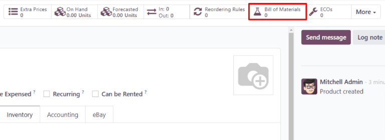

# Ishlab chiqarish mahsulotini sozlash

Odoo *Manufacturing* da mahsulot ishlab chiqarish uchun, mahsulot to'g'ri sozlanishi kerak. Buning uchun *Manufacturing* yo'nalishini yoqish va mahsulot uchun materiallar ro'yxatini (BoM) sozlash kerak. Ushbu qadamlar bajarilgandan so'ng, mahsulot yangi ishlab chiqarish buyurtmasini yaratishda tanlanishi mumkin.

## Manufacture yo'nalishini faollashtirish

Manufacture yo'nalishi har bir mahsulot uchun uning mahsulot sahifasida faollashtiriladi. Buning uchun `Manufacturing ‣ Products ‣ Products` ga o'ting. Keyin mavjud mahsulotni tanlang yoki `New` tugmasini bosib yangisini yarating.

Mahsulot sahifasida `Inventory` yorlig'ini tanlang, so'ngra `Routes` bo'limida `Manufacture` katakchasini yoqing. Bu Odoo ga mahsulotni ishlab chiqarish mumkinligini bildiradi.

### Partiya/seriya raqami kuzatuvi 

Yangi ishlab chiqarilgan mahsulotlarga partiya yoki seriya raqamlarini berish ixtiyoriy. Yangi ishlab chiqarilgan mahsulotlarga `partiya yoki seriya raqamlarini berish` uchun, `Inventory` yorlig'idagi `Traceability` bo'limiga o'ting. `Tracking` maydonida `By Unique Serial Number` yoki `By Lots` ni tanlang.

Buni amalga oshirish ishlab chiqarish buyurtmasida *Lot/Serial Number* maydonini yoki *Shop Floor* ilovasidagi ish buyurtmasi kartasida *Register Production* ko'rsatmasini yoqadi.

MO da Lot/Serial Number maydoni.

Ish buyurtmasi kartasida partiya/seriya raqami yaratish uchun Register Production varianti.

## Materiallar ro'yxatini (BoM) sozlash

Keyin, Odoo mahsulotni qanday ishlab chiqarishni bilishi uchun mahsulot uchun [\|BOM\|](##SUBST##|BOM|) sozlanishi kerak. [\|BOM\|](##SUBST##|BOM|) - bu mahsulotni ishlab chiqarish uchun zarur bo'lgan komponentlar va operatsiyalar ro'yxati.

Ma'lum bir mahsulot uchun [\|BOM\|](##SUBST##|BOM|) yaratish uchun, `Manufacturing ‣ Products ‣ Products` ga o'ting, so'ngra mahsulotni tanlang. Mahsulot sahifasida sahifa yuqorisidagi `Bill of Materials` aqlli tugmasini bosing, so'ngra yangi [\|BOM\|](##SUBST##|BOM|) ni sozlash uchun `New` ni tanlang.

[\|BOM\|](##SUBST##|BOM|) da `Product` maydoni mahsulot bilan avtomatik to'ldiriladi. `Quantity` maydonida BoM ishlab chiqaradigan birliklar sonini belgilang.

[\|BOM\|](##SUBST##|BOM|) ga komponent qo'shish uchun `Components` yorlig'ini tanlang va `Add a line` tugmasini bosing. `Component` ochiladigan menyudan komponentni tanlang, so'ngra `Quantity` maydoniga miqdorni kiriting. Barcha komponentlar qo'shilmaguncha yangi qatorlarga komponentlar qo'shishni davom ettiring.

Keyin `Operations` yorlig'ini tanlang. `Add a line` tugmasini bosing va `Create Operations` qalqib chiquvchi oynasi paydo bo'ladi. `Operation` maydonida qo'shilayotgan operatsiya nomini belgilang (masalan, Yig'ish, Kesish va boshqalar). `Work Center` ochiladigan menyudan operatsiya amalga oshiriladigan ish markazini tanlang. Nihoyat, operatsiyalarni qo'shishni tugatish uchun `Save & Close` tugmasini bosing yoki ko'proq qo'shish uchun `Save & New` tugmasini bosing.

::: warning

`Operations` yorlig'i faqat `Work Orders` sozlamasi yoqilgan bo'lsa paydo bo'ladi. Buning uchun `Manufacturing ‣ Configuration ‣ Settings` ga o'ting, so'ngra `Work Orders` katakchasini yoqing.
::::

::: admonition
Ko'proq bilib oling

Yuqoridagi bo'lim Odoo da mahsulotni ishlab chiqarish imkonini beradigan asosiy [\|BOM\|](##SUBST##|BOM|) yaratish bo'yicha ko'rsatmalar beradi. Biroq, bu [\|BOM\|](##SUBST##|BOM|) ni sozlashda mavjud bo'lgan barcha variantlarning to'liq xulosasi emas. Materiallar ro'yxatlari haqida ko'proq ma'lumot olish uchun `materiallar ro'yxatini yaratish` bo'yicha hujjatlarni ko'ring.
:::