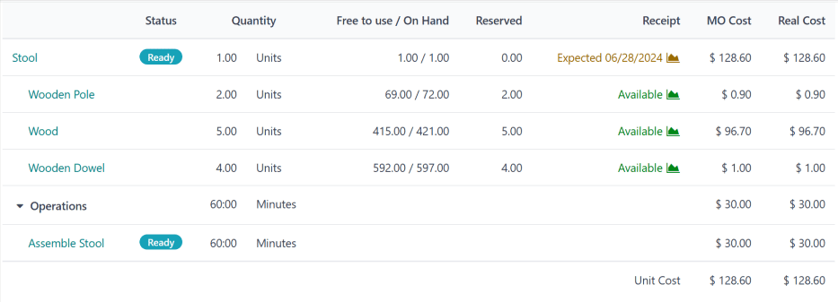
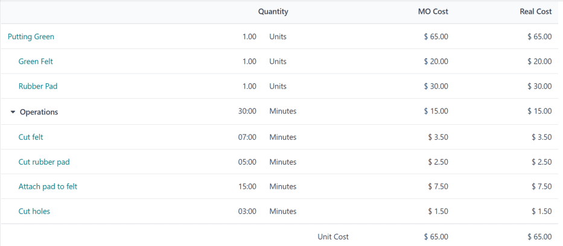
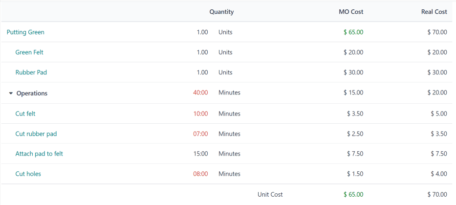

# Ishlab chiqarish buyurtmasi xarajatlari

Mahsulot ishlab chiqarish xarajatlarini aniq hisoblash qobiliyati mahsulot rentabelligini aniqlashda muhim ahamiyat kasb etadi. Odoo ning **Manufacturing** ilovasi har bir ishlab chiqarish buyurtmasini (`MO (Manufacturing Order)`) bajarish xarajatini, shuningdek barcha tugallangan `MOs (Manufacturing Orders)` asosida mahsulotning o'rtacha ishlab chiqarish xarajatini avtomatik ravishda hisoblab, bu hisob-kitobni soddalashtiradi.

::: warning

Odoo ning Manufacturing ilovasi `MO (Manufacturing Order)` ning *MO xarajati* va *haqiqiy xarajati* o'rtasida farq qiladi.

`MO (Manufacturing Order)` xarajati mahsulotning materiallar ro'yxati (BoM) konfiguratsiyasiga asoslanib, `MO (Manufacturing Order)` ni bajarish *qancha* xarajat qilish *kerakligini* ifodalaydi. Bu komponentlarning xarajati va miqdori, shuningdek zarur operatsiyalarni bajarish xarajatini hisobga oladi.

Haqiqiy xarajat `MO (Manufacturing Order)` ni bajarish *aslida* qancha xarajat qilganini ifodalaydi. Bir nechta omillar haqiqiy xarajatning `MO (Manufacturing Order)` xarajatidan farq qilishiga sabab bo'lishi mumkin. Masalan, operatsiya bajarilishi kutilganidan ko'ra uzoqroq vaqt olishi mumkin, `BoM (Bill of Materials)` da ko'rsatilganidan ko'ra ko'proq komponent miqdori kerak bo'lishi mumkin yoki ishlab chiqarish jarayonida komponentlar narxi o'zgarishi mumkin.
::::

## Xarajat konfiguratsiyasi

Odoo `MO (Manufacturing Order)` xarajatlarini mahsulot ishlab chiqarish uchun foydalaniladigan `BoM (Bill of Materials)` konfiguratsiyasiga asoslanib hisoblab chiqadi. Bu hisob-kitob `BoM (Bill of Materials)` da ko'rsatilgan komponentlar va operatsiyalarning xarajati va miqdori, shuningdek bu operatsiyalar amalga oshiriladigan ish markazlarining operatsion xarajatlari va operatsiyada ishlaydigan har bir xodimga to'lanadigan summa hisobga olinadi.

### Komponent xarajati

Komponent xarajati barcha xarid buyurtmalari (PO) bo'yicha komponentning o'rtacha xarid xarajati asosida avtomatik ravishda hisoblanadi. Komponentning xarajatini ko'rish uchun `Inventory app ‣ Products ‣ Products` ga o'ting va komponent mahsulotini tanlang. Xarajat komponentning mahsulot formasidagi `General Information` yorlig'ining `Cost` maydonida ko'rsatiladi.

Komponentning xarajatini qo'lda belgilash mumkin, buning uchun komponentning mahsulot formasidagi `Cost` maydonini bosing va qiymat kiriting. Biroq, komponent uchun kelajakdagi har qanday `POs (Purchase Orders)` qo'lda kiritilgan qiymatni bekor qiladi va `Cost` maydonini avtomatik ravishda hisoblangan qiymatga qaytaradi.

### Ish markazi xarajati 

Ma'lum bir ish markazi uchun operatsion xarajatni belgilash uchun `Manufacturing app ‣ Configuration ‣ Work Centers` ga o'ting va ish markazini tanlang.

Ish markazini bir soat davomida boshqarish xarajatini belgilash uchun ish markazining `General Information` yorlig'idagi `Cost per hour` bo'limining yonida joylashgan `per workcenter` maydoniga qiymat kiriting.

Ish markazida ishlaydigan har bir xodimning soatlik xarajatini belgilash uchun ish markazining `General Information` yorlig'idagi `Cost per hour` bo'limining yonida joylashgan `per employee` maydoniga qiymat kiriting. Masalan, agar `per employee` maydoniga [25.00] kiritilsa, ish markazida ishlaydigan *har bir* xodim uchun soatiga $25.00 xarajat bo'ladi.

::: warning

`per employee` maydoniga kiritilgan qiymat faqat `MO (Manufacturing Order)` xarajatini hisoblash uchun ishlatiladi, bu `MO (Manufacturing Order)` ni bajarishning taxminiy xarajatidir.

`MO (Manufacturing Order)` ni bajarishning haqiqiy xarajati haqiqiy xarajat bilan ifodalanadi. `per employee` maydoniga kiritilgan qiymatdan foydalanish o'rniga, haqiqiy xarajat har bir xodimga xos soatlik xarajat yordamida hisoblanadi.

Masalan, agar ish markazining `per employee` xarajati '$50.00' bo'lsa va soatlik xarajati '$60.00' bo'lgan xodim u yerda ish buyurtmasini bajarse, `MO (Manufacturing Order)` xarajati (taxminiy) $50/soat xarajat yordamida hisoblanadi, haqiqiy xarajat esa $60/soat xarajat yordamida hisoblanadi.

Muayyan xodimlar uchun xarajatni qanday belgilash haqida ma'lumot olish uchun quyidagi `xodim xarajati bo'limi` ga qarang.
::::

### Xodim xarajati 

Ma'lum bir xodim uchun soatlik xarajatni belgilash uchun `Employees` ilovasiga o'ting va xodimni tanlang. Xodimning formasida `Settings` yorlig'ini tanlang va `Application Settings` bo'limining `Hourly Cost` maydoniga xodimning stavkasini kiriting.

::: warning

Yuqoridagi `ish markazi xarajati bo'limi` da batafsil bayon etilganidek, xodimning formasidagi `Hourly Cost` maydoniga kiritilgan qiymat `MO (Manufacturing Order)` ning haqiqiy xarajatini hisoblash uchun ishlatiladi. `MO (Manufacturing Order)` ning taxminiy xarajati, `MO (Manufacturing Order)` xarajati deb ataladi, har bir ish markazi formasida belgilangan xodim boshiga xarajatdan foydalanadi.
::::

### `BoM (Bill of Materials)` konfiguratsiyasi 

`BoM (Bill of Materials)` ni Odoo uni ishlatadigan `MOs (Manufacturing Orders)` xarajatini aniq hisoblashi uchun sozlash ikki bosqichni talab qiladi. Birinchidan, komponentlar **albatta** qo'shilishi va zarur miqdor ko'rsatilishi kerak. Ikkinchidan, operatsiyalar **albatta** qo'shilishi va ular amalga oshiriladigan ish markazlari ko'rsatilishi kerak.

`Manufacturing app ‣ Products ‣ Bills of Materials` ga o'tishdan boshlang. `BoM (Bill of Materials)` ni tanlang yoki `New` tugmasini bosib yangisini yarating.

`BoM (Bill of Materials)` formasining `Components` yorlig'ida har bir komponentni `Add a line` tugmasini bosib, `Component` ustunidagi ochiladigan menyudan komponentni tanlab va `Quantity` ustuniga miqdorni kiritib qo'shing.

`Operations` yorlig'ida `Add a line` tugmasini bosib `Create Operations` qalqib chiquvchi oynasini ochish orqali operatsiya qo'shing. `Operation` maydoniga operatsiya uchun sarlavha kiriting.

Operatsiya amalga oshiriladigan `Work Center` ni tanlang. Keyin operatsiyani bajarish uchun taxmin qilingan vaqt miqdori bo'lgan `Default Duration` ni qo'shing.

Odatiy bo'lib, `Duration Computation` maydoni `Set duration manually` ga o'rnatiladi, bu degani `Default Duration` maydoniga kiritilgan raqam har doim operatsiyaning kutilgan davomiyligi sifatida ishlatiladi.

`Compute based on tracked time` ni tanlash Odoo ga `Default Duration` ni `Based on` maydonida belgilangan ma'lum miqdordagi ish buyurtmalari asosida avtomatik ravishda hisoblashga olib keladi. Bu davomiylikni hisoblash uchun ish buyurtmalari bo'lgunga qadar, `Default Duration` maydonidagi qiymat o'rniga ishlatiladi.

Ish markazini boshqarishning soatlik xarajati va operatsiyaning davomiyligi operatsiyaning xarajatini hisoblash uchun ishlatiladi.

Nihoyat, operatsiyani `BoM (Bill of Materials)` ga qo'shish va `Create Operations` qalqib chiquvchi oynasini yopish uchun `Save & Close` tugmasini bosing. Shu bilan bir qatorda, operatsiyani `BoM (Bill of Materials)` ga qo'shish va boshqa operatsiya qo'shish uchun bo'sh `Create Operations` qalqib chiquvchi oynasini ochish uchun `Save & New` tugmasini bosing.

## `MO (Manufacturing Order)` umumiy ko'rinishi 

Har bir `MO (Manufacturing Order)` ning *umumiy ko'rinish* sahifasi mavjud bo'lib, u `MO (Manufacturing Order)` haqida turli ma'lumotlarni, jumladan `MO (Manufacturing Order)` xarajati va haqiqiy xarajatni ro'yxatlaydi. `MO (Manufacturing Order)` uchun umumiy ko'rinishni ko'rish uchun `Manufacturing app ‣ Operations ‣ Manufacturing Orders` ga o'ting va `MO (Manufacturing Order)` ni tanlang. Keyin `MO (Manufacturing Order)` ning yuqorisidagi `fa-bars` `Overview` aqlli tugmasini bosing.

`MO (Manufacturing Order)` xarajati ham, haqiqiy xarajat ham komponentlarning xarajati va miqdori, shuningdek har bir ish buyurtmasini bajarish xarajatini hisobga oladi. Umumiy ko'rinish sahifasi bu qiymatlarning har biri uchun qator ro'yxatlaydi, ularning yig'indisi `MO Cost` va `Real Cost` ustunlari pastida ko'rsatiladi.

`MO (Manufacturing Order)` bo'yicha ish boshlanishidan oldin, `MO Cost` va `Real Cost` ustunlari bir xil xarajatlarni ko'rsatadi. Bu `MO (Manufacturing Order)` ni bajarishning *taxminiy* xarajatidir.

Biroq, ish boshlanganidan so'ng, `Real Cost` ustunidagi qiymatlar `MO Cost` ustunidagi qiymatlardan farq qila boshlashi mumkin. Bu `MO (Manufacturing Order)` da ko'rsatilganidan boshqa miqdorda komponent ishlatilsa, ish buyurtmasining davomiyligi kutilganidan farq qilsa yoki ish buyurtmasini bajarayotgan xodimning soatlik xarajati ish markazida belgilangan xodim xarajatidan farq qilsa sodir bo'ladi.

`MO (Manufacturing Order)` `Produce All` tugmasini bosish orqali tugallangandan so'ng, `MO Cost` ustunidagi qiymatlar `Real Cost` ustunida ko'rsatilgan qiymatlarga mos ravishda yangilanadi.

## O'rtacha ishlab chiqarish xarajati

Mahsulot uchun har bir alohida `MO (Manufacturing Order)` xarajatidan tashqari, Odoo shuningdek har bir tugallangan `MO (Manufacturing Order)` xarajatini hisobga olib, mahsulotni ishlab chiqarishning o'rtacha xarajatini kuzatib boradi. Buni ko'rish uchun `Inventory app ‣ Products ‣ Products` ga o'ting va mahsulotni tanlang.

Mahsulotning ishlab chiqarish xarajati `General Information` yorlig'ida joylashgan `Cost` maydonida o'lchov birligi uchun ko'rsatiladi. Qo'shimcha `MOs (Manufacturing Orders)` xarajatlari o'rtacha xarajatga hisobga olingan sari qiymat yangilanishda davom etadi.

`Cost` maydonining o'ng tomonida kamida bitta `BoM (Bill of Materials)` ga ega mahsulotlar uchun faqat paydo bo'ladigan `Compute Price from BoM` tugmasi joylashgan. Mahsulotning xarajatini faqat `BoM (Bill of Materials)` da ko'rsatilgan komponentlar va operatsiyalarni hisobga oladigan kutilgan xarajatga qaytarish uchun bu tugmani bosing.

::: warning

`Compute Price from BoM` tugmasini bosish narxni doimiy ravishda belgilamasligini unutmang. Xarajat `BoM (Bill of Materials)` narxi va kelajakdagi har qanday `MOs (Manufacturing Orders)` ning haqiqiy xarajati o'rtachasi asosida yangilanishda davom etadi.
::::

::: 
Misol ish jarayoni: ishlab chiqarish xarajati

Golf mahsulotlari ishlab chiqaruvchisi *Fairway Fields* turli xil golf mahsulotlarini, jumladan yopiq xonadagi *putting green* ni ishlab chiqaradi. Ular putting green uchun `BoM (Bill of Materials)` ni sozlaganlar, shuning uchun Odoo har bir putting green `MO (Manufacturing Order)` ning ishlab chiqarish xarajatini avtomatik ravishda hisoblab chiqadi.

`BoM (Bill of Materials)` da ikkita komponent ro'yxatlangan:

- Bitta *yashil namat* birligi, narxi $20.00.
- Bitta *rezina yostiq* birligi, narxi $30.00.

`BoM (Bill of Materials)` shuningdek to'rtta operatsiyani ro'yxatlaydi, ularning barchasi soatlik operatsion xarajati $30.00 bo'lgan *Assembly Station 1* da amalga oshiriladi. Bu operatsiyalar quyidagilar:

- *Namatni kesish*: standart davomiyligi yetti daqiqa, umumiy xarajat $3.50.
- *Rezina yostiqni kesish*: standart davomiyligi besh daqiqa, umumiy xarajat $2.50.
- *Yostiqni namatga biriktirish*: standart davomiyligi 15 daqiqa, umumiy xarajat $7.50.
- *Teshik ochish*: standart davomiyligi uch daqiqa, umumiy xarajat $1.50.

Jami bitta putting green ishlab chiqarish uchun zarur komponentlar $50.00, zarur operatsiyalar esa $15.00, umumiy ishlab chiqarish xarajati $65.00. Bu xarajat putting green ning mahsulot formasidagi `Cost` maydonida aks etadi.

Fairway Fields bitta putting green uchun `MO (Manufacturing Order)` ni tasdiqlaydi. Ishlab chiqarish boshlanishidan oldin, `MO (Manufacturing Order)` umumiy ko'rinishi `MO Cost` va `Real Cost` maydonlarida [$65.00] xarajatni ro'yxatlaydi.

Ishlab chiqarish boshlanadi va operatsiyalar kutilganidan o'n daqiqa ko'proq, jami 40 daqiqa vaqt oladi. `BoM (Bill of Materials)` dan bu og'ish `MO (Manufacturing Order)` umumiy ko'rinishida aks etadi, u endi `Real Cost` sifatida [$70.00] ni ro'yxatlaydi.

Ishlab chiqarish tugallangandan va `MO (Manufacturing Order)` *Done* deb belgilangandan so'ng, `MO (Manufacturing Order)` umumiy ko'rinishi yana yangilanadi, shuning uchun `MO Cost` va `Real Cost` ustunlaridagi qiymatlar mos keladi, har biri [$70.00] qiymatini ko'rsatadi.

Putting green ning mahsulot sahifasida `Cost` maydoni endi [$67.50] xarajatni ko'rsatadi, bu $65.00 asl xarajat va `MO (Manufacturing Order)` dan $70.00 haqiqiy xarajatning o'rtachasi.
:::
