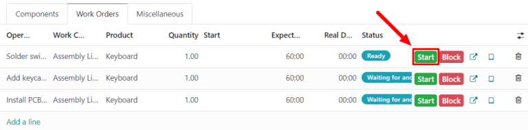
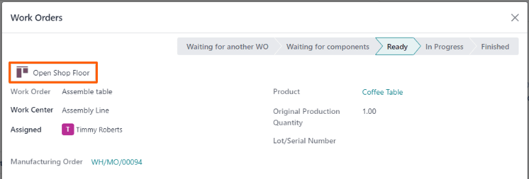

# Bir bosqichli ishlab chiqarish

Odoo *Manufacturing* foydalanuvchilarga mahsulotlarni bir, ikki yoki uch bosqichda ishlab chiqarish imkonini beradi. Bir bosqichli ishlab chiqarishdan foydalanganda, Odoo ishlab chiqarish buyurtmasini (MO) yaratadi, lekin komponentlarni inventardan chiqarish yoki tayyor mahsulotlarni omborga kiritish uchun transferlar yaratmaydi. Inventar soni hali ham foydalanilgan komponentlar soni va ishlab chiqarilgan mahsulotlar asosida yangilanadi, lekin ularni inventarga va inventardan o'tkazish harakati kuzatilmaydi.

::: tip

Ishlab chiqarishda foydalaniladigan bosqichlar soni ombor darajasida belgilanadi, bu har bir omborga turli xil bosqichlar sonidan foydalanish imkonini beradi. Ma'lum bir ombor uchun foydalaniladigan bosqichlar sonini o'zgartirish uchun `Inventory ‣ Configuration ‣ Warehouses` ga o'ting va `Warehouses` ekranidan omborni tanlang.

`Warehouse Configuration` yorlig'ida `Manufacture` radio input maydonini toping va uchta variantdan birini tanlang: `Manufacture (1 step)`, `Pick components and then manufacture (2 steps)` yoki `Pick components, manufacture and then store products (3 steps)`.

::::

::: warning

Mahsulotlar Odoo da ishlab chiqarilishidan oldin to'g'ri sozlanishi kerak. Buni qanday qilish haqida batafsil ma'lumot olish uchun `mahsulotni ishlab chiqarish uchun sozlash` bo'yicha hujjatlarni ko'ring.
::::

## Ishlab chiqarish buyurtmasini yaratish

Odoo *Manufacturing* da mahsulot ishlab chiqarish uchun `Manufacturing ‣ Operations ‣ Manufacturing Orders` ga o'ting, so'ngra yangi `MO (Manufacturing Order)` yaratish uchun `New` tugmasini bosing.

Yangi `MO (Manufacturing Order)` da `Product` ochiladigan menyusidan ishlab chiqariladigan mahsulotni tanlang. `Bill of Material` maydoni bog'langan materiallar ro'yxati (BoM) bilan avtomatik to'ldiriladi.

Agar mahsulot uchun birdan ortiq [\|BOM\|](##SUBST##|BOM|) sozlangan bo'lsa, `Bill of Material` maydonida aniq [\|BOM\|](##SUBST##|BOM|) tanlanishi mumkin va `Product` maydoni bog'langan mahsulot bilan avtomatik to'ldiriladi.

[\|BOM\|](##SUBST##|BOM|) tanlab olingandan so'ng, `Components` va `Work Orders` yorliqlari [\|BOM\|](##SUBST##|BOM|) da ko'rsatilgan komponentlar va operatsiyalar bilan avtomatik to'ldiriladi. Agar sozlanayotgan `MO (Manufacturing Order)` uchun qo'shimcha komponentlar yoki operatsiyalar kerak bo'lsa, `Add a line` tugmasini bosib ularni `Components` va `Work Orders` yorliqlariga qo'shing.

Nihoyat, `MO (Manufacturing Order)` ni tasdiqlash uchun `Confirm` tugmasini bosing.

## Ishlab chiqarish buyurtmasini qayta ishlash

`MO (Manufacturing Order)` uning `Work Orders` yorlig'i ostida ro'yxatlangan barcha ish buyurtmalarini bajarish orqali qayta ishlanadi. Buni `MO (Manufacturing Order)` ning o'zida yoki ish buyurtmasi planshet ko'rinishida amalga oshirish mumkin.

### Asosiy ish jarayoni

Ish buyurtmalarini `MO (Manufacturing Order)` ning o'zidan bajarish uchun `Manufacturing ‣ Operations ‣ Manufacturing Orders` ga o'ting va `MO (Manufacturing Order)` ni tanlang.

`MO (Manufacturing Order)` sahifasida `Work Orders` yorlig'ini tanlang. Bajarilishi kerak bo'lgan birinchi ish buyurtmasi bo'yicha ish boshlanganidan so'ng, o'sha ish buyurtmasi uchun `Start` tugmasini bosing. Odoo *Manufacturing* keyin ish buyurtmasini bajarish qancha vaqt ketganini kuzatib turadigan taymerni ishga tushiradi.

Ish buyurtmasi tugallanganda, o'sha ish buyurtmasi uchun `Done` tugmasini bosing. `Work Orders` yorlig'ida ro'yxatlangan har bir ish buyurtmasi uchun bir xil jarayonni takrorlang.

Barcha ish buyurtmalarini bajargandan so'ng, `MO (Manufacturing Order)` ni `Done` deb belgilash va ishlab chiqarilgan mahsulot(lar)ni inventarga ro'yxatdan o'tkazish uchun ekranning yuqorisida `Produce All` tugmasini bosing.

### Shop Floor ish jarayoni

*Shop Floor* moduli yordamida `MO (Manufacturing Order)` uchun ish buyurtmalarini bajarish uchun `Manufacturing ‣ Operations ‣ Manufacturing Orders` ga o'ting va `MO (Manufacturing Order)` ni tanlang.

`MO (Manufacturing Order)` da `Work Orders` yorlig'ini bosing, so'ngra qayta ishlanishi kerak bo'lgan birinchi ish buyurtmasi qatorida `↗️ (ichidan strelka chiqayotgan kvadrat)` tugmasini tanlang. Buni amalga oshirish ish buyurtmasi uchun tafsilotlar va qayta ishlash variantlari bilan `Work Orders` qalqib chiquvchi oynasini ochadi.

Qalqib chiquvchi oynada *Shop Floor* modulini ochish uchun oynaning yuqori chap qismidagi `Open Shop Floor` tugmasini tanlang.

`MO (Manufacturing Order)` ichidagi aniq ish buyurtmasidan to'g'ridan-to'g'ri kirganda, *Shop Floor* ish buyurtmasi amalga oshirilishi uchun sozlangan ish markazi sahifasiga avtomatik ravishda o'tadi. Sahifa `MO (Manufacturing Order)` raqami, mahsulot va ishlab chiqariladigan birliklar soni, hamda ish buyurtmasini bajarish uchun zarur qadamlarni ko'rsatadigan ish buyurtmasi kartasini ko'rsatadi.

Ish buyurtmasi uning kartasida ro'yxatlangan har bir qadamni bajarish orqali qayta ishlanadi. Buni qadamga bosish va paydo bo'ladigan qalqib chiquvchi oynada ko'rsatilgan ko'rsatmalarga amal qilish orqali amalga oshirish mumkin. Qadamni bajargandan so'ng, agar qo'shimcha qadamlar talab qilinsa, keyingi qadamga o'tish uchun `Next` tugmasini bosing.

Shu bilan bir qatorda, ish buyurtmasi qadamlarini ish buyurtmasi kartasida qadamning qatori o'ng tomonida paydo bo'ladigan katakchani bosish orqali bajarish mumkin. Ushbu usuldan foydalanganda, qadamni avtomatik ravishda bajarilgan deb belgilanadi, qalqib chiquvchi oyna paydo bo'lmasdan.

Ish buyurtmasi kartasidagi oxirgi qadam *Register Production* deb nomlanadi. Bu qadam ishlab chiqarilgan mahsulot birliklarining sonini ro'yxatdan o'tkazish uchun ishlatiladi. Agar ishlab chiqarilgan son `MO (Manufacturing Order)` yaratilgan son bilan teng bo'lsa, ishlab chiqarilgan miqdor sifatida o'sha sonni avtomatik ravishda ro'yxatdan o'tkazish uchun qatorning o'ng tomonidagi `# Units` tugmasini bosing.

Agar boshqa son kiritilishi kerak bo'lsa, qalqib chiquvchi oynani ochish uchun `Register Production` qadamini bosing. `Units` maydoniga ishlab chiqarilgan birliklar sonini kiriting, so'ngra o'sha sonni ro'yxatdan o'tkazish uchun `Validate` tugmasini bosing.

::: tip

*Register Production* qadami har bir ish buyurtmasi kartasida paydo bo'ladi. U qayta ishlangan birinchi ish buyurtmasi uchun bajarilishi kerak. Buni bajargandan so'ng, qadam `MO (Manufacturing Order)` dagi qolgan har bir ish buyurtmasi uchun allaqachon bajarilgan deb ko'rinadi.
::::

Ish buyurtmasi uchun barcha qadamlarni bajargandan so'ng, ish buyurtmasi kartasining pastki qismida tugma paydo bo'ladi. Agar `MO (Manufacturing Order)` yopilishidan oldin boshqa ish buyurtmalari bajarilishi kerak bo'lsa, tugma `Mark as Done` deb nomlanadi. Agar bajarilishi kerak bo'lgan qo'shimcha ish buyurtmalari bo'lmasa, tugma `Close Production` deb nomlanadi.

`Mark as Done` tugmasini bosish ish buyurtmasi kartasining xiralashishiga olib keladi. U butunlay yo'qolgandan so'ng, ish buyurtmasining holati `MO (Manufacturing Order)` da *Finished* deb belgilanadi va keyingi ish buyurtmasi *Shop Floor* modulida, u amalga oshirilishi uchun sozlangan ish markazi sahifasida paydo bo'ladi. Har qanday qo'shimcha ish buyurtmalarini ushbu bo'limda batafsil bayon etilgan ko'rsatmalar yordamida qayta ishlash mumkin.

`Close Production` tugmasini bosish ish buyurtmasi kartasining xiralashishiga olib keladi. U yo'qolgandan so'ng, `MO (Manufacturing Order)` *Done* deb belgilanadi va ishlab chiqarilgan mahsulot birliklarining inventarga kiritiladi.

`Mark as Done` yoki `Close Production` ni bosgandan so'ng, har bir tugma `Undo` tugmasi bilan almashtiriladi. Ish buyurtmasini ochiq saqlash uchun ish buyurtmasi kartasi xiralashishidan oldin `Undo` tugmasini bosing.

::: tip

Ushbu bo'lim *Shop Floor* modulida `MO (Manufacturing Order)` ni qayta ishlashning asosiy ish jarayonini batafsil bayon etadi. Modul va uning barcha xususiyatlarining chuqurroq tushuntirilishi uchun `Shop Floor umumiy ko'rinishi` hujjatlarini ko'ring.
::::
