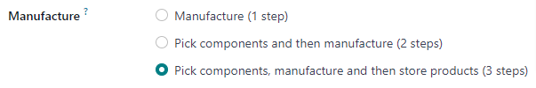
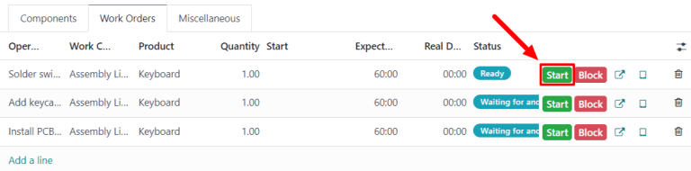

# Uch bosqichli ishlab chiqarish

Odoo *Manufacturing* foydalanuvchilarga bir, ikki yoki uch bosqichda mahsulotlarni ishlab chiqarish imkonini beradi. Uch bosqichli ishlab chiqarishda Odoo komponentlarni olish transferi, ishlab chiqarish buyrug'i (MO) va tayyor mahsulotlarni saqlash transferini yaratadi, hamda olingan komponentlar va yaratilgan tayyor mahsulotlar soniga asoslanib inventar hisobini yangilaydi.

::: tip

Ishlab chiqarishda qo'llaniladigan bosqichlar soni ombor darajasida belgilanadi, bu har bir omborga turli xil bosqichlar sonini ishlatish imkonini beradi. Muayyan ombor uchun bosqichlar sonini o'zgartirish uchun
`Inventory ‣ Configuration ‣ Warehouses` ga o'ting va `Warehouses` ekranidan omborni tanlang.

`Warehouse Configuration` yorlig'ida
`Manufacture` radio input
maydonini toping va uchta variantdan birini tanlang:
`Manufacture (1 step)`, `Pick
components and then manufacture (2 steps)` yoki `Pick components, manufacture and then
store products (3 steps)`.

::::

::: warning

Mahsulotlar Odoo da ishlab chiqarilishidan oldin to'g'ri sozlanishi kerak. Buni qanday qilish haqida batafsil ma'lumot uchun
`configure a product for manufacturing
` hujjatlariga qarang.
::::

## Ishlab chiqarish buyrug'ini yaratish

Odoo *Manufacturing* da mahsulot ishlab chiqarish uchun
`Manufacturing ‣ Operations ‣ Manufacturing Orders` ga o'ting va yangi
`MO (Manufacturing Order)` yaratish uchun `New` tugmasini bosing.

Yangi `MO (Manufacturing Order)` da
`Product` ochiluvchi menyusidan ishlab chiqariladigan mahsulotni tanlang. 
`Bill of Material` maydoni
bog'langan Bill of Materials (BoM) bilan avtomatik to'ldiriladi.

Agar mahsulot uchun bir nechta [\|BOM\|](##SUBST##|BOM|) sozlangan bo'lsa, aniq [\|BOM\|](##SUBST##|BOM|) ni
`Bill of Material` maydonida tanlash mumkin va
`Product` maydoni
bog'langan mahsulot bilan avtomatik to'ldiriladi.

[\|BOM\|](##SUBST##|BOM|) tanlagandan so'ng,
`Components` va
`Work Orders` yorliqlari
[\|BOM\|](##SUBST##|BOM|) da ko'rsatilgan komponentlar va operatsiyalar bilan avtomatik to'ldiriladi. Agar sozlanayotgan `MO (Manufacturing Order)` uchun qo'shimcha komponentlar yoki operatsiyalar talab qilinsa, ularni
`Components` va
`Work Orders` yorliqlariga
`Add a line` tugmasini bosib qo'shing.

Nihoyat, `MO (Manufacturing Order)` ni tasdiqlash uchun `Confirm` tugmasini bosing.

## Komponentlarni olish transferini qayta ishlash

Uch bosqichli
`MO (Manufacturing Order)` ni tasdiqlagandan so'ng,
sahifa yuqorisida `Transfers` aqlli tugmasi paydo bo'ladi. Uni bosib
`MO (Manufacturing Order)` ning
`Transfers` sahifasiga o'ting. Sahifada ikkita transfer ro'yxati ko'rsatiladi: *WH/PC/XXXXX* (komponentlarni olish transferi) va
*WH/SFP/XXXXX* (tayyor mahsulotlarni saqlash transferi).

`MO (Manufacturing Order)` uchun komponentlarni olish transferini ochish uchun `WH/PC/XXXXX` ni tanlang. Ushbu transfer komponentlarning saqlanish joylaridan mahsulot ishlab chiqarish uchun ishlatiladigan joyga ko'chirilishini kuzatish uchun ishlatiladi.

Komponentlarni saqlash joyidan ko'chirgandan so'ng, transferning yuqorisidagi
`Validate` tugmasini bosing, so'ngra paydo bo'lgan
`Immediate Transfer?` qalqib chiquvchi oyna ustidagi `Apply` tugmasini bosing. Buni amalga oshirish transferni `Done` deb belgilaydi va inventar hisobini ko'chirilgan komponentlar miqdorini aks ettirish uchun yangilaydi.

Nihoyat, sahifa yuqorisidagi `WH/MO/XXXXX` breadcrumb tugmasini bosib `MO (Manufacturing Order)` ga qayting.

## Ishlab chiqarish buyrug'ini qayta ishlash

`MO (Manufacturing Order)`
uning `Work Orders` yorlig'i ostida sanab o'tilgan barcha ish buyruqlarini bajarish orqali qayta ishlanadi. Buni
`MO (Manufacturing Order)` ning o'zida yoki ish buyrug'i planshet ko'rinishidan amalga oshirish mumkin.

### Asosiy ish jarayoni

Ish buyruqlarini
`MO (Manufacturing Order)` ning o'zidan bajarish uchun
`Manufacturing
‣ Operations ‣ Manufacturing Orders` ga o'ting va ishlab chiqarish buyrug'ini tanlang.

`MO (Manufacturing Order)` sahifasida
`Work Orders` yorlig'ini tanlang. Bajarilishi kerak bo'lgan birinchi ish buyrug'i ustida ish boshlangach, o'sha ish buyrug'i uchun
`Start` tugmasini bosing. Odoo *Manufacturing* so'ngra ish buyrug'ini bajarish uchun qancha vaqt ketganini kuzatib turadigan tajmer ishga tushiradi.

Ish buyrug'i tugallangach, o'sha ish buyrug'i uchun `Done` tugmasini bosing. `Work Orders` yorlig'ida sanab o'tilgan har bir ish buyrug'i uchun bir xil jarayonni takrorlang.

Barcha ish buyruqlarini bajargandan so'ng,
`MO (Manufacturing Order)` ni `Done` deb belgilash va ishlab chiqarilgan mahsulot(lar)ni inventarga ro'yxatga olish uchun ekranning yuqorisidagi
`Produce All` tugmasini bosing.

### Shop Floor ish jarayoni

*Shop Floor* modulidan foydalanib
`MO (Manufacturing Order)` ning ish buyruqlarini bajarish uchun
`Manufacturing ‣ Operations ‣ Manufacturing Orders` ga o'ting va
`MO (Manufacturing Order)` ni tanlang.

`MO (Manufacturing Order)` da
`Work Orders` yorlig'ini bosing, so'ngra qayta ishlanishi kerak bo'lgan birinchi ish buyrug'i qatorida
`↗️ (o'qli kvadrat
tugmasi)` tugmasini tanlang. Buni amalga oshirish ish buyrug'i uchun tafsilotlar va qayta ishlash parametrlari bilan
`Work Orders` qalqib chiquvchi oynasini ochadi.

Qalqib chiquvchi oynaning chap yuqori qismidagi `Open Shop Floor` tugmasini tanlab *Shop Floor* modulini oching.

`MO (Manufacturing Order)` ichidagi aniq ish buyrug'idan to'g'ridan-to'g'ri foydalanilganda, *Shop Floor*
ish buyrug'i bajarilishi kerak bo'lgan ish markazi sahifasiga standart ravishda o'tadi. Sahifada ish buyrug'i uchun karta ko'rsatiladi, unda
`MO (Manufacturing Order)` raqami, mahsulot va ishlab chiqariladigan birliklar soni hamda ish buyrug'ini bajarish uchun zarur bosqichlar ko'rsatiladi.

Ish buyrug'i uning kartasida sanab o'tilgan har bir bosqichni bajarish orqali qayta ishlanadi. Buni bosqichni bosish va paydo bo'lgan qalqib chiquvchi oynada sanab o'tilgan ko'rsatmalarga amal qilish orqali amalga oshirish mumkin. Bosqich tugallangach, keyingi bosqichga o'tish uchun (agar kerak bo'lsa)
`Next` tugmasini bosing.

Shu bilan birga, ish buyrug'i bosqichlarini ish buyrug'i kartasidagi bosqich qatorining o'ng tomonida paydo bo'ladigan belgilash katakchasi (checkbox) ni bosish orqali ham bajarish mumkin. Ushbu usuldan foydalanilganda, bosqich qalqib chiquvchi oyna paydo bo'lmasdan avtomatik ravishda bajarilgan deb belgilanadi.

Ish buyrug'i kartasidagi oxirgi bosqich *Register Production* deb nomlanadi. Ushbu bosqich ishlab chiqarilgan mahsulot birliklarining sonini ro'yxatga olish uchun ishlatiladi. Agar ishlab chiqarilgan miqdor
`MO (Manufacturing Order)` yaratilgan miqdorga teng bo'lsa, o'sha sonni ishlab chiqarilgan miqdor sifatida avtomatik ro'yxatga olish uchun qatorning o'ng tomonidagi
`# Units` tugmasini bosing.

Agar boshqa raqam kiritish kerak bo'lsa,
qalqib chiquvchi oynani ochish uchun `Register Production` bosqichini bosing. Ishlab chiqarilgan birliklar sonini
`Units` maydoniga kiriting va so'ngra o'sha sonni ro'yxatga olish uchun
`Validate` tugmasini bosing.

::: tip

*Register Production* bosqichi har bir ish buyrug'i kartasida paydo bo'ladi. U qayta ishlanadigan birinchi ish buyrug'i uchun bajarilishi kerak. Buni amalga oshirgandan so'ng, bosqich
`MO (Manufacturing Order)` dagi qolgan har bir ish buyrug'i uchun allaqachon bajarilgan ko'rinishda paydo bo'ladi.
::::

Ish buyrug'i uchun barcha bosqichlarni bajargandan so'ng, ish buyrug'i kartasining pastki qismida tugma paydo bo'ladi. Agar
`MO (Manufacturing Order)` yopilishidan oldin boshqa ish buyruqlari bajarilishi kerak bo'lsa, tugma
`Mark as Done` deb nomlanadi. Agar bajarilishi kerak bo'lgan qo'shimcha ish buyruqlari bo'lmasa, tugma
`Close Production` deb nomlanadi.

`Mark as Done` tugmasini bosish ish buyrug'i kartasining so'nishiga olib keladi. U butunlay yo'qolgach, ish buyrug'ining holati
`MO (Manufacturing Order)` da *Finished* deb belgilanadi va keyingi ish buyrug'i *Shop Floor* modulida, u bajarilishi kerak bo'lgan ish markazi sahifasida paydo bo'ladi. Har qanday qo'shimcha ish buyruqlarini ushbu bo'limda batafsil bayon qilingan ko'rsatmalar yordamida qayta ishlash mumkin.

`Close Production` tugmasini bosish ish buyrug'i kartasining so'nishiga olib keladi. U yo'qolgach,
`MO (Manufacturing Order)` *Done* deb belgilanadi va ishlab chiqarilgan mahsulot birliklari inventarga kiritiladi.

`Mark as Done` yoki
`Close Production` tugmasini bosgandan so'ng, har bir tugma `Undo` tugmasi bilan almashtiriladi. Ish buyrug'ini ochiq qoldirish uchun ish buyrug'i kartasi so'nishidan oldin
`Undo` tugmasini bosing.

::: tip

Ushbu bo'lim *Shop Floor* modulida
`MO (Manufacturing Order)` ni qayta ishlashning asosiy ish jarayonini batafsil bayon qiladi. Modul va uning barcha funksiyalarining to'liqroq tushuntirilishi uchun `Shop Floor
overview ` hujjatlariga qarang.
::::

## Tayyor mahsulot transferini qayta ishlash

`MO (Manufacturing Order)` ni bajargandan so'ng, buyruqning yuqori qismidagi `Transfers` tugmasini bosib buyruqning `Transfers` sahifasiga qayting. Bu safar
tayyor mahsulotlarni saqlash transferini ochish uchun `WH/SFP/XXXXX` ni tanlang. Ushbu transfer tayyor mahsulotlarning ishlab chiqarilgan joyidan saqlanish joyiga ko'chirilishini kuzatish uchun ishlatiladi.

Tayyor mahsulotlarni saqlash joyiga ko'chirgandan so'ng, transferning yuqorisidagi
`Validate` tugmasini bosing, so'ngra paydo bo'lgan
`Immediate Transfer?` qalqib chiquvchi oyna ustidagi `Apply` tugmasini bosing. Buni amalga oshirish transferni `Done` deb belgilaydi va inventar hisobini ko'chirilgan tayyor mahsulotlar miqdorini aks ettirish uchun yangilaydi.