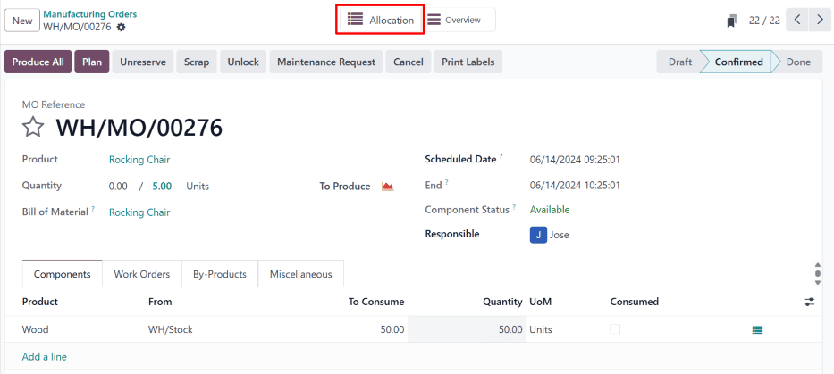
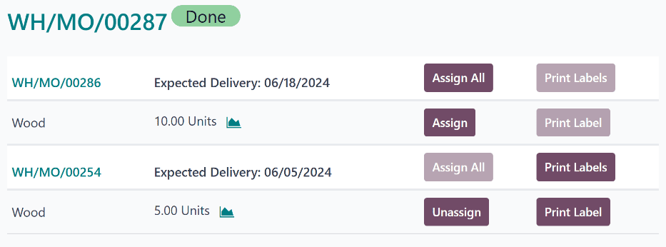

# Allocation reports

When fulfilling sales orders (SOs), or sourcing components for
manufacturing orders (MOs), it is sometimes necessary to prioritize one
`SO (sales order)` or
`MO (manufacturing order)` over another.
In situations where there is insufficient stock on-hand to fulfill every
`SO (sales order)` or
`MO (manufacturing order)`, ensuring that
products and components are reserved for priority orders is essential.

In Odoo *Manufacturing*, allocation reports are used on
`MOs (manufacturing orders)` to assign
products to specific sales orders `SOs (sales orders)`, or components to specific
`MOs (manufacturing orders)`. This
ensures the products or components are available for those orders, and
are not used by mistake.

## Configuration

To use allocation reports, the *Allocation Report for Manufacturing
Orders* feature **must** be enabled. To do so, navigate to
`Manufacturing app ‣ Configuration ‣ Settings`, and tick the checkbox next to
`Allocation Report for Manufacturing Orders`. Then, click `Save`.

For products that are sold, it is also necessary to configure them so
they can be included in `SOs (sales orders)`. To do so, begin by navigating to
`Inventory ‣ Products ‣ Products`, and select a product. Under the
`Product Name` field on the product
form, make sure that the `Can Be Sold` checkbox is ticked.

## Allocate products

To allocate products or components from an
`MO (manufacturing order)` to an
`SO (sales order)`, or to a different
`MO (manufacturing order)`, begin by
navigating to
`Manufacturing app ‣ Operations ‣ Manufacturing Orders`. Click `New` to
create a new `MO (manufacturing order)`.

On the `MO (manufacturing order)` form,
select a product in the `Product`
field, and specify the quantity to be produced in the
`Quantity` field. Finally, click
`Confirm` to confirm the
`MO (manufacturing order)`.

The rest of the allocation workflow depends on the current on-hand
quantity of the product being manufactured, and whether or not there are
any `SOs (sales orders)` or
`MOs (manufacturing orders)` which
require the product, but have not already been allocated units.

If there **are** existing `SOs (sales orders)` and `MOs (manufacturing orders)` that require the product, **and** there are too few units
of the product on-hand to fulfill those orders, then an
`fa-list` `Allocation` smart button appears at the top of the page as soon as
the `MO (manufacturing order)` is
confirmed.

If there **are** existing `SOs (sales orders)` and `MOs (manufacturing orders)` that require the product, **and** there are enough units of
the product on-hand to fulfill those orders, then the
`fa-list` `Allocation` smart button only appears at the top of the page once
the `MO (manufacturing order)` has been
marked as done, by clicking `Produce All`.

::: tip

If there **are not** any existing `SOs (sales orders)` and `MOs (manufacturing orders)` that require the product, the `fa-list` `Allocation` smart
button does not appear, even when the
`MO (manufacturing order)` has been
marked as done.
::::

Click the `fa-list`
`Allocation` smart button to open the
`MRP Reception
Report` for the
`MO (manufacturing order)`. This report
lists open delivery orders or
`MOs (manufacturing orders)`, depending
on the type of product produced in the original
`MO (manufacturing order)`.

### Allocate to delivery order

If the `MO (manufacturing order)`
contains a finished product, the report lists any open delivery orders
for which quantities of the product have yet to be reserved.

::: example
An `MO (manufacturing order)` is created
to produce three units of a *rocking chair*. Clicking the
`Allocation` smart button on the
`MO (manufacturing order)` opens an
allocation report that lists open delivery orders that require one or
more rocking chairs.
:::

Click the `Assign All` button to the
right of a specific order to assign products for each quantity required
to fulfill that order.

::: example
If an order requires one quantity of four units of the product, and one
quantity of one unit of the product, clicking
`Assign All` assigns five units of
the product to fulfill both quantities.
:::

Alternatively, click `Assign` next to
a specific quantity to only assign products to that quantity, and not
any others in the order.

::: example
If an order requires one quantity of four units of the product, and one
quantity of one unit of the product, clicking `Assign` next to the quantity of one unit assigns a product to
that quantity, but leaves the quantity of four units without any
products assigned.
:::

### Allocate to MO

If the `MO (manufacturing order)`
contains a component, the report lists any open
`MOs (manufacturing orders)` for which
quantities of the component have yet to be reserved.

::: example
An `MO (manufacturing order)` is created
to produce three units of *wood*, which is used as a component for the
*rocking chair* product. Clicking the `Allocation` smart button on the
`MO (manufacturing order)` opens an
allocation report that lists open rocking chair
`MOs (manufacturing orders)` that require
one or more pieces of wood.
:::

Click the `Assign All` or
`Assign` button to the right of a
specific `MO (manufacturing order)` to
assign components to that `MO (manufacturing order)`.

### Unassign products

After assigning products to a quantity within a delivery order, or
components to an `MO (manufacturing order)`, the `Assign` button
turns into an `Unassign` button.
Click `Unassign` to unreserve the
assigned products from that quantity, making them available for other
quantities.

### Print labels

After clicking `Assign All` or
`Assign`, the
`Print Labels` or
`Print Label` button to the right of
either button becomes selectable. Selecting either button generates and
downloads a PDF document with one label for each product that was
assigned. These labels are used to designate each product as being
reserved for that specific order.

