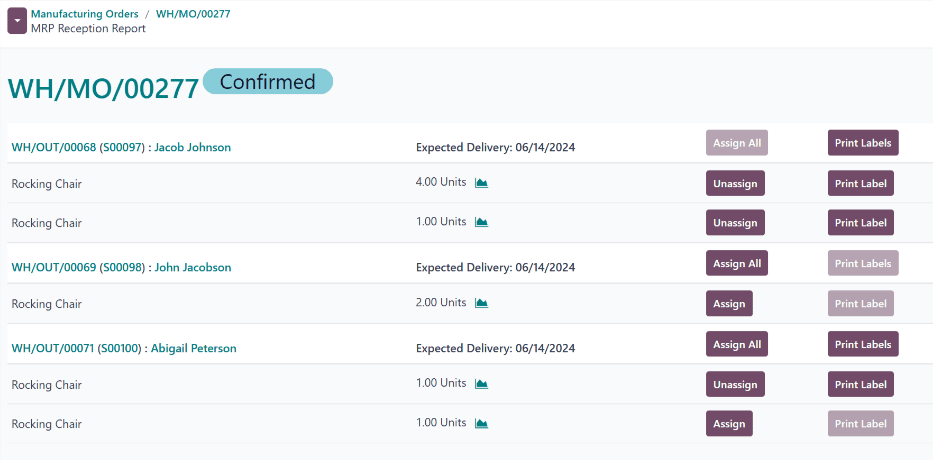

# Taqsimlash hisobotlari

Savdo buyurtmalarini (`SO (sales order)`) bajarish yoki ishlab chiqarish buyurtmalari (`MO (manufacturing order)`) uchun komponentlarni ta'minlashda, ba'zan bir `SO (sales order)` yoki `MO (manufacturing order)`ni boshqasidan ustun qo'yish zarur bo'ladi.

Har bir `SO (sales order)` yoki `MO (manufacturing order)`ni bajarish uchun ombordagi zaxira yetarli bo'lmagan holatlarda, mahsulotlar va komponentlar ustuvor buyurtmalar uchun zaxiralanganligini ta'minlash muhimdir.

Odoo *Manufacturing*da taqsimlash hisobotlari `MO (manufacturing order)`larda mahsulotlarni ma'lum `SO (sales order)`larga yoki komponentlarni ma'lum `MO (manufacturing order)`larga tayinlash uchun ishlatiladi. Bu mahsulotlar yoki komponentlarning ushbu buyurtmalar uchun mavjudligini ta'minlaydi va ularning xato bo'yicha ishlatilishining oldini oladi.

## Konfiguratsiya

Taqsimlash hisobotlaridan foydalanish uchun *Ishlab chiqarish buyurtmalari uchun taqsimlash hisoboti* funksiyasi **albatta** yoqilgan bo'lishi kerak. Buning uchun `Manufacturing app ‣ Configuration ‣ Settings` bo'limiga o'ting va `Allocation Report for Manufacturing Orders` yonidagi katakchani belgilang. Keyin `Save` tugmasini bosing.

Sotiladigan mahsulotlar uchun ularni `SO (sales order)`larga kiritish imkoniyatini berish uchun sozlash ham zarur. Buning uchun `Inventory ‣ Products ‣ Products` bo'limiga o'ting va mahsulotni tanlang. Mahsulot formasidagi `Product Name` maydoni ostida `Can Be Sold` katakchasi belgilanganligiga ishonch hosil qiling.

## Mahsulotlarni taqsimlash

`MO (manufacturing order)`dan mahsulotlar yoki komponentlarni `SO (sales order)` yoki boshqa `MO (manufacturing order)`ga taqsimlash uchun `Manufacturing app ‣ Operations ‣ Manufacturing Orders` bo'limiga o'ting. Yangi `MO (manufacturing order)` yaratish uchun `New` tugmasini bosing.

`MO (manufacturing order)` formasida `Product` maydonida mahsulotni tanlang va `Quantity` maydonida ishlab chiqariladigan miqdorni belgilang. Nihoyat, `MO (manufacturing order)`ni tasdiqlash uchun `Confirm` tugmasini bosing.

Taqsimlash jarayonining qolgan qismi ishlab chiqarilayotgan mahsulotning joriy ombordagi miqdoriga va mahsulotni talab qiladigan, ammo hali birliklar tayinlanmagan `SO (sales order)` yoki `MO (manufacturing order)`lar mavjudligiga bog'liq.

Agar mahsulotni talab qiladigan `SO (sales order)` va `MO (manufacturing order)`lar **mavjud** bo'lsa **va** ushbu buyurtmalarni bajarish uchun ombordagi mahsulot birliklari juda kam bo'lsa, `MO (manufacturing order)` tasdiqlangandan so'ng sahifaning yuqori qismida `fa-list` `Allocation` aqlli tugmasi paydo bo'ladi.

Agar mahsulotni talab qiladigan `SO (sales order)` va `MO (manufacturing order)`lar **mavjud** bo'lsa **va** ushbu buyurtmalarni bajarish uchun ombordagi mahsulot birliklari yetarli bo'lsa, `fa-list` `Allocation` aqlli tugmasi faqat `MO (manufacturing order)` `Produce All` tugmasini bosish orqali bajarilgan deb belgilangandan keyin sahifaning yuqori qismida paydo bo'ladi.

::: tip

Agar mahsulotni talab qiladigan `SO (sales order)` va `MO (manufacturing order)`lar **mavjud bo'lmasa**, `MO (manufacturing order)` bajarilgan deb belgilangan bo'lsa ham `fa-list` `Allocation` aqlli tugmasi paydo bo'lmaydi.
::::

`MO (manufacturing order)` uchun `MRP Reception Report`ni ochish uchun `fa-list` `Allocation` aqlli tugmasini bosing. Bu hisobot asl `MO (manufacturing order)`da ishlab chiqarilgan mahsulot turiga qarab ochiq yetkazib berish buyurtmalari yoki `MO (manufacturing order)`larni ro'yxatlaydi.

### Yetkazib berish buyurtmasiga taqsimlash

Agar `MO (manufacturing order)` tayyor mahsulotni o'z ichiga olsa, hisobot mahsulot miqdorlari hali zaxiralanmagan ochiq yetkazib berish buyurtmalarini ro'yxatlaydi.

::: example
Uchta *chayqaladigan kreslo* ishlab chiqarish uchun `MO (manufacturing order)` yaratilgan. `MO (manufacturing order)`dagi `Allocation` aqlli tugmasini bosish bir yoki bir nechta chayqaladigan kreslo talab qiladigan ochiq yetkazib berish buyurtmalarini ro'yxatlaydigan taqsimlash hisobotini ochadi.
:::

Ma'lum buyurtmani bajarish uchun zarur bo'lgan har bir miqdor uchun mahsulotlarni tayinlash uchun ma'lum buyurtmaning o'ng tomonidagi `Assign All` tugmasini bosing.

::: example
Agar buyurtma mahsulotning to'rtta birligidan iborat bir miqdorni va mahsulotning bitta birligidan iborat bir miqdorni talab qilsa, `Assign All` tugmasini bosish ikkala miqdorni ham bajarish uchun beshta mahsulot birligini tayinlaydi.
:::

Shu bilan bir qatorda, faqat shu miqdorga mahsulotlarni tayinlash va buyurtmadagi boshqalariga emas, ma'lum miqdor yonidagi `Assign` tugmasini bosing.

::: example
Agar buyurtma mahsulotning to'rtta birligidan iborat bir miqdorni va mahsulotning bitta birligidan iborat bir miqdorni talab qilsa, bitta birlik miqdori yonidagi `Assign` tugmasini bosing, bu miqdorga mahsulot tayinlanadi, lekin to'rtta birlik miqdori hech qanday mahsulot tayinlanmasdan qoladi.
:::

### MO ga taqsimlash

Agar `MO (manufacturing order)` komponentni o'z ichiga olsa, hisobot komponent miqdorlari hali zaxiralanmagan ochiq `MO (manufacturing order)`larni ro'yxatlaydi.

::: example
*Chayqaladigan kreslo* mahsuloti uchun komponent sifatida ishlatiladigan uchta *yog'och* birligini ishlab chiqarish uchun `MO (manufacturing order)` yaratilgan. `MO (manufacturing order)`dagi `Allocation` aqlli tugmasini bosish bir yoki bir nechta yog'och bo'lagini talab qiladigan ochiq chayqaladigan kreslo `MO (manufacturing order)`larini ro'yxatlaydigan taqsimlash hisobotini ochadi.
:::

Ma'lum `MO (manufacturing order)`ga komponentlarni tayinlash uchun ma'lum `MO (manufacturing order)`ning o'ng tomonidagi `Assign All` yoki `Assign` tugmasini bosing.

### Mahsulotlarni tayinlashni bekor qilish

Yetkazib berish buyurtmasidagi miqdorga mahsulotlarni yoki `MO (manufacturing order)`ga komponentlarni tayinlashdan so'ng, `Assign` tugmasi `Unassign` tugmasiga aylanadi. Tayinlangan mahsulotlarni ushbu miqdordan bekor qilish va ularni boshqa miqdorlar uchun mavjud qilish uchun `Unassign` tugmasini bosing.

### Yorliqlarni chop etish

`Assign All` yoki `Assign` tugmasini bosgandan so'ng, har ikkala tugmaning o'ng tomonidagi `Print Labels` yoki `Print Label` tugmasi tanlanishi mumkin bo'ladi. Har ikkala tugmani ham tanlash tayinlangan har bir mahsulot uchun bitta yorliq bilan PDF hujjatini yaratadi va yuklab oladi. Bu yorliqlar har bir mahsulotni shu aniq buyurtma uchun zaxiralanganligini belgilash uchun ishlatiladi.

