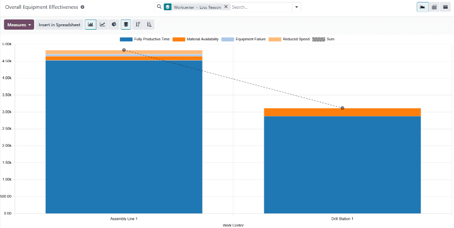

# Umumiy uskunalar samaradorligi

Odoo'ning *Ishlab chiqarish* ilovasida, *umumiy uskunalar samaradorligi* (`OEE (overall equipment effectiveness)`) ish markazining to'liq mahsuldor bo'lgan vaqtini ifodalaydi. `OEE (overall equipment effectiveness)` ish markazining faol bo'lgan umumiy vaqtining foizi sifatida ko'rsatiladi.

To'liq mahsuldor vaqt ish markazining ishlab turgan **va** *kutilgan davomiylik*ni oshirmagan ish buyurtmalarini qayta ishlayotgan vaqti hisoblanadi.

`OEE (overall equipment effectiveness)` ishlab chiqarish jamoalariga ish markazlarining samaradorligi va ishlab chiqarish to'xtash sabablarini tushunishga yordam beradi.

::: warning

`OEE (overall equipment effectiveness)` ish markazlarining mahsuldorligini kuzatgani uchun, undan foydalanish Ishlab chiqarish ilovasining sozlamalarida ish markazlari funksiyasini yoqishni talab qiladi.

Buning uchun `Manufacturing app ‣ Configuration ‣ Settings` ga o'ting va `Operations` sarlavhasi ostidagi `Work Orders` yonidagi katak belgilansin. Keyin `Save` tugmasini bosing.
::::

## Samaradorlik standartlari

`OEE (overall equipment effectiveness)` ish markazining to'liq mahsuldor vaqtining foizini aniq aks ettirishi uchun, ish markazi to'g'ri mahsuldorlik ko'rsatkichlari bilan to'g'ri sozlangan **bo'lishi kerak**. Bular ish markazining *vaqt samaradorligi*, *quvvati* va *OEE maqsadi*ni o'z ichiga oladi.

### Vaqt samaradorligi

Vaqt samaradorligi ish buyurtmalarini qayta ishlashda ish markazining samaradorligini ifodalaydi va foiz sifatida ko'rsatiladi. 100% vaqt samaradorligi qiymati ish markazining mahsulotning `BoM (Bill of Materials)`ida ko'rsatilgan kutilgan davomiylik tezligida ish buyurtmalarini qayta ishlashini bildiradi. 100%dan kam yoki ko'p qiymat ish markazining operatsiyaning kutilgan davomiyligigina nisbatan sekinroq yoki tezroq ish buyurtmalarini qayta ishlashini bildiradi.

Ish markazi uchun vaqt samaradorligini o'rnatish uchun `Manufacturing app ‣ Configuration ‣ Work Centers` ga o'ting va ish markazini tanlang. `General Information` tabida `Time Efficiency` maydoniga raqamli qiymat kiriting.

::: example
*Kreslo* mahsulotini ishlab chiqarish ikki operatsiyani talab qiladi: *kesish* va *yig'ish*. Mahsulotning `BoM (Bill of Materials)`i har bir operatsiya uchun 30 daqiqa kutilgan davomiylikni ko'rsatadi.

Kesish operatsiyasi *kesish stansiyasi* ish markazida amalga oshiriladi, u 50% vaqt samaradorlik qiymatiga ega. Bu operatsiyani yakunlash ikki marta ko'proq vaqt olishini bildiradi, ya'ni jami bir soat.

Yig'ish operatsiyasi *yig'ish liniyasi* ish markazida amalga oshiriladi, u 200% vaqt samaradorlik qiymatiga ega. Bu operatsiyani yakunlash yarim vaqt olishini bildiradi, ya'ni jami 15 daqiqa.
:::

### Quvvat

Quvvat ish markazida parallel ravishda nechta mahsulot birligi ishlab chiqarilishi mumkinligini ifodalaydi. Bir nechta birlik uchun ish buyurtmalarining davomiyligi ish markazining nechta birlikni boshqarishi mumkinligiga qarab oshadi yoki kamayadi.

Ish markazi uchun quvvatni o'rnatish uchun `Manufacturing app ‣ Configuration ‣ Work Centers` ga o'ting va ish markazini tanlang. `General Information` tabida `Capacity` maydoniga raqamli qiymat kiriting.

::: example
*Burg'ulash stansiyasi* ish markazi bir birlik quvvatiga ega. Burg'ulash stansiyasidan foydalanilgan holda ishlab chiqariladigan *kreslo* mahsulotining 10 birligi uchun `MO (manufacturing order)` tasdiqlangan.

Ishlab chiqarish kerak bo'lgan birliklar ish markazining bir vaqtda boshqara oladigan birliklaridan o'n marta ko'p bo'lgani uchun, operatsiya vaqti mahsulotning `BoM (Bill of Materials)`ida ko'rsatilgan davomiylikdan o'n marta ko'p bo'ladi.
:::

### `OEE (overall equipment effectiveness)` maqsadi

`OEE (overall equipment effectiveness)` maqsadi ish markazining ishlay vaqtining qancha qismi to'liq mahsuldor vaqt bo'lishi kerakligi uchun maqsaddir. U foiz sifatida ko'rsatiladi va faqat [100%] gacha baland qilib o'rnatilishi kerak.

Ish markazi uchun `OEE (overall equipment effectiveness)` maqsadini o'rnatish uchun `Manufacturing app ‣ Configuration ‣ Settings ‣ Work Centers` ga o'ting va ish markazini tanlang. `General Information` tabida `OEE Target` maydoniga [100.00] yoki undan kam raqamli qiymat kiriting.

## `OEE (overall equipment effectiveness)` hisoblash

`OEE (overall equipment effectiveness)` nol va 100 orasidagi foiz qiymati sifatida ifodalanadi. Qiymat ish markazining to'liq mahsuldor bo'lgan vaqt miqdorini bildiradi. Qolgan qism ish markazining to'liq samaradorlikdan past ishlab turgan vaqt miqdorini bildiradi. Bu bir qator sabablarga ko'ra sodir bo'lishi mumkin, jumladan *kamaygan tezlik*, *material mavjudligi* va *uskundagi nosozlik*.

### To'liq mahsuldor vaqt

Ish markazining to'liq mahsuldor deb hisoblanishi uchun, u ish buyurtmalarini qabul qila olishi, ish buyurtmalarini qayta ishlash uchun zarur komponentlarga ega bo'lishi va qayta ishlayotgan ish buyurtmasining kutilgan davomiyligi ichida ishlashi kerak.

::: example
*Yig'ish liniyasi* ish markazi to'siq qilinmagan va *velosiped*ni yig'ish uchun ish buyurtmasini oladi. Kerakli komponentlar mavjud, shuning uchun ular tanlab olinib ish markaziga yetkazilgandan so'ng darhol ishlab chiqarish boshlanadi. Ish buyurtmasining kutilgan davomiyligi 30 daqiqa va u 27 daqiqada yakunlangan. Bu vaqtning barchasi to'liq mahsuldor vaqt hisoblanadi.
:::

### Kamaygan tezlik

Ish markazi kamaygan tezlikda ishlaganda, bu uning kutilgan davomiyligini oshirgan ish buyurtmasini qayta ishlayotganini bildiradi. Ish markazi ishlab turgani bilan, bu to'liq mahsuldor vaqt hisoblanmaydi.

::: example
*Kesish stansiyasi* ish markazi *stol* uchun taxta kesish ish buyurtmasini oladi. Ish buyurtmasining kutilgan davomiyligi 15 daqiqa. Ish buyurtmasi oxir-oqibat yakunlanishi 18 daqiqa vaqt oladi. Ish markazi kutilgan davomiylikni oshirgan uch daqiqa davomida kamaygan tezlikda ishlaganliigi hisoblanadi.
:::

### Material mavjudligi

Material mavjudligi ish markazi ish buyurtmasini qabul qila olgan, lekin kerakli komponentlar mavjud bo'lmagan holatlarni bildiradi. Bu komponentlar omborda yo'qligi yoki boshqa buyurtma uchun ajratilgani uchun sodir bo'lishi mumkin.

::: example
*Skameyka* ishlab chiqarish 20 birlik *yog'och*ni talab qiladi. Skameykaning 10 birligi uchun ishlab chiqarish buyurtmasi (MO) tasdiqlangan, lekin ishlab chiqarishni boshlash uchun omborda yetarli yog'och yo'q. Yog'ochni olish uchun ketgan vaqt material mavjudligi to'xtashi sifatida qayd etiladi.
:::

### Uskundagi nosozlik

Uskundagi nosozlik ish markazining uning uskunalari bilan bog'liq texnik xizmat ko'rsatish muammolari tufayli foydalanib bo'lmaydigan har qanday vaqt davomini bildiradi. Bu uskunalar buzilganda yoki ish markazi rejali texnik xizmat ko'rsatish uchun yopilganda sodir bo'lishi mumkin. Bunday hollarda ish markazi `maintenance request` yordamida to'siq qilinishi mumkin.

::: example
*Burg'ulash stansiyasi* ish markazida burg'u buziladi va ish markazini foydalanib bo'lmay qiladi. Burg'uni tuzatish uchun texnik xizmat so'rovi yaratiladi va ish markazi ish buyurtmalarini olishdan to'siladi. Burg'uni tuzatish va ish markazini yana mavjud qilish ikki soat vaqt oladi. Bu ikki soatlik davr uskundagi nosozlik to'xtashi sifatida qayd etiladi.
:::

## `OEE (overall equipment effectiveness)` hisobot

Har bir ish markazi uchun `OEE (overall equipment effectiveness)` hisobot ko'rsatkichlarini ko'rish uchun `Manufacturing app ‣ Reporting ‣ Overall Equipment Effectiveness` ga o'ting. Bu sahifa `OEE (overall equipment effectiveness)` ma'lumotlari mavjud bo'lgan har bir ish markazi uchun ko'rsatkichlarni ko'rsatadi.

Shuningdek, bitta ish markazi uchun `OEE (overall equipment effectiveness)` hisobot ko'rsatkichlarini ko'rish uchun `Manufacturing app ‣ Configuration ‣ Work Centers` ga o'ting va ish markazini tanlang. Ish markazi formasining yuqori qismida `fa-pie-chart` `OEE` aqlli tugmasini bosing.

Odatiy bo'lib, asosiy `OEE (overall equipment effectiveness)` hisobot sahifasi ma'lumotlarni ustunli diagrammada ko'rsatadi, muayyan ish markazi uchun sahifa esa doira diagrammasida ko'rsatadi. Ikkala sahifada ham boshqa diagramma turini tanlash uchun ko'rsatilgan diagramma ustidagi `fa-bar-chart` `(bar chart)`, `fa-line-chart` `(line chart)`, yoki `fa-pie-chart` `(pie chart)` tugmasini bosing.

Shuningdek, `OEE (overall equipment effectiveness)` ma'lumotlarini pivot ko'rinishida yoki har bir vaqt yozuvini ko'rsatuvchi ro'yxatda ko'rish mumkin, sahifaning yuqori-o'ng burchagidagi `oi-view-pivot` `(pivot view)` yoki `oi-view-list` `(list view)` tugmalarini bosish orqali.

