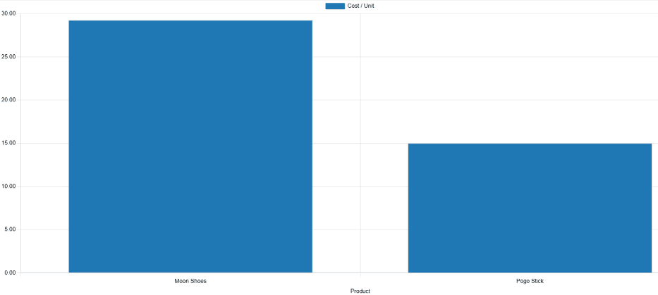
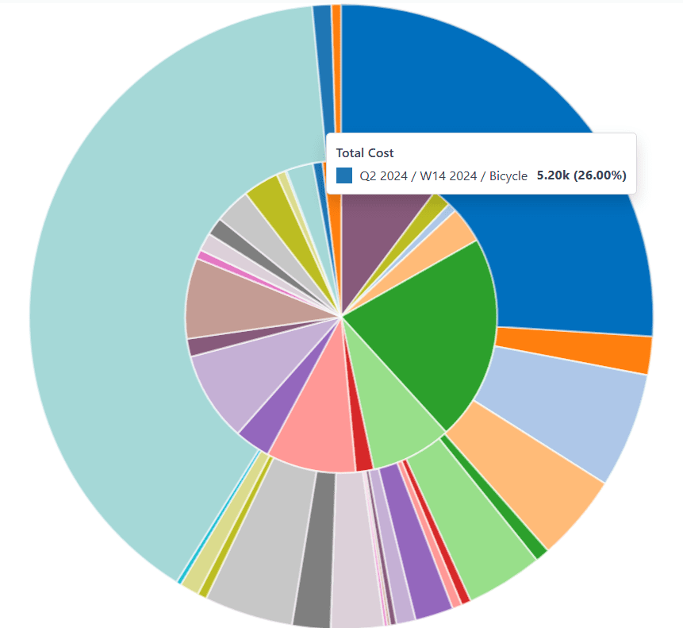

# Ishlab chiqarish tahlili

*Ishlab chiqarish tahlili* hisoboti Odoo'ning *Ishlab chiqarish* ilovasi yordamida ishlab chiqarilgan mahsulotlar haqida statistik ma'lumotlar beradi. Hisobot ishlab chiqarish xarajatlari, ishlab chiqarish davomiyligi va ishlab chiqarilgan mahsulotlar haqidagi boshqa muhim statistikalarni tushunishga harakat qilganda foydalidir.

Ishlab chiqarish tahlili hisobotini ochish uchun `Manufacturing app ‣ Reporting ‣ Production Analysis` ga o'ting.

::: warning

`Production Analysis` hisoboti Odoo ilovalar to'plamida mavjud bo'lgan ko'plab hisobotlardan biridir. Ushbu hujjat faqat `Production Analysis` hisobotiga xos o'lchovlarni va bir nechta foydalanish holatlari misollarini qamrab oladi.

Ko'pgina Odoo hisobotlarida mavjud bo'lgan asosiy xususiyatlarning to'liq ko'rinishi uchun `reporting essentials` bo'yicha hujjatlarni ko'ring.
::::

## O'lchovlar

*O'lchovlar* `Production Analysis` hisobotida tanlanishi mumkin bo'lgan ma'lumotlar to'plamidir. Har bir ma'lumotlar to'plami ma'lumotlar bazasidagi `MOs (manufacturing orders)` haqida muayyan statistikani ifodalaydi. `Measures` `fa-caret-down` tugmasini bosib va ochiladigan menyudan variantlardan birini tanlab o'lchovni tanlang:

`Measures` `fa-caret-down` ochiladigan menyusida ko'rsatiladigan variantlar va ular paydo bo'ladigan tartib `Search...` panelida yoqilgan filtrlar, guruhlash va taqqoslashlarga qarab farqlanadi. Odatiy bo'lib, mavjud o'lchovlar quyidagicha paydo bo'ladi:

- `Average Employee Cost/Unit`: mahsulotning bir birligini ishlab chiqarish uchun xodimlarga to'lanadigan o'rtacha xarajat.
- `By-Products Total Cost`: mahsulotni ishlab chiqarish natijasida yaratilgan barcha qo'shimcha mahsulotlarning umumiy qiymati.
- `Component Cost/Unit`: mahsulotning bir birligini ishlab chiqarish uchun zarur komponentlarning o'rtacha xarajati.
- `Cost/Unit`: komponent, xodimlar, operatsiya va subpudrat xarajatlarini o'z ichiga olgan holda mahsulotning bir birligini ishlab chiqarishning o'rtacha xarajati.
- `Duration of Operations/Unit`: mahsulotning bir birligini ishlab chiqarish uchun zarur operatsiyalarning o'rtacha umumiy davomiyligi.
- `Quantity Demanded`: `MOs (manufacturing orders)`ga kiritilgan mahsulot birliklarining umumiy soni.
- `Quantity Produced`: haqiqatda ishlab chiqarilgan mahsulot birliklarining umumiy soni.
- `Total Component Cost`: mahsulot uchun har bir `MO (manufacturing order)` bo'yicha mahsulot komponentlariga sarflangan umumiy summa.
- `Total Cost`: hozirgacha ishlab chiqarilgan mahsulotning har bir birligini ishlab chiqarishga sarflangan umumiy summa.
- `Total Duration of Operations`: mahsulotni ishlab chiqarishda bajarilgan har bir operatsiyaning jami davomiyligi.
- `Total Employee Cost`: mahsulotni ishlab chiqarish uchun xodimlarga to'langan jami summa.
- `Total Operation Cost`: mahsulotni ishlab chiqarish uchun zarur operatsiyalarga sarflangan jami summa.
- `Total Operation Cost/Unit`: mahsulotning bir birligini ishlab chiqarish uchun zarur operatsiyalarning o'rtacha xarajati.
- `Total Subcontracting Cost`: mahsulotni ishlab chiqarish uchun subpudratchilar to'langan jami summa.
- `Total Subcontracting Cost/Unit`: mahsulotning bir birligini ishlab chiqarish uchun subpudratchi jalb qilishning o'rtacha xarajati.
- `Yield Percentage (%)`: talab qilingan umumiy miqdorga nisbatan ishlab chiqarilgan mahsulotning umumiy miqdori, foiz sifatida ifodalangan.
- `Count`: mahsulot uchun yaratilgan `MOs (manufacturing orders)`ning umumiy soni.

::: tip

`fa-area-chart` `(graph view)` variantlaridan biri yoqilganda bir vaqtda faqat bitta o'lchov tanlanishi mumkin. Biroq, `oi-view-pivot` `(pivot table)`dan foydalanilganda bir nechta o'lchovlar va turli guruhlash mezonlari (x va y o'qlarida) tanlanishi mumkin.
::::

## Foydalanish holati: mahsulotlarni taqqoslash

`Production Analysis` hisobotining eng yaxshi foydalanish usullaridan biri ikki yoki undan ortiq mahsulotlar haqidagi statistikalarni taqqoslashdir. Bu mahsulotlarni `Search...` paneliga kiritish, keyin kerakli ma'lumotlarni ko'rish uchun zarur o'lchov, filtr va guruhlashni tanlash orqali amalga oshiriladi.

::: example
O'yinchoq ishlab chiqaruvchisi *Tommy's Toys* o'zlarining ishlab chiqarish operatsiya xarajatlarini kamaytirmoqchi. Buni amalga oshirish uchun ular ortiqcha mahsulotlarni aniqlash va operatsiya xarajatlari yuqori bo'lganlarini ishlab chiqarishni to'xtatishga qaror qildilar.

Tahlil uchun ajratilgan o'yinchoqlardan ikkitasi *pogo tayoqchasi* va *oy poyabzali*dir. Tommy's Toys bu ikki o'yinchoq shunchalik o'xshashki, ular birini ishlab chiqarishni to'xtatib, mahsulot taklifi sezilarli darajada ta'sir qilmasdan qila olishlariga ishonadi.

O'yinchoqlar uchun operatsiya xarajatlarini taqqoslash uchun biznes tahlilchisi Mayk `Manufacturing` ilovasini ochib, `Production Analysis` sahifasiga o'tadi. `Search...` panelida u ikkala mahsulot nomini kiritadi. Keyin u `Search...` paneli ochiladigan menyusini ochib, `Group By` bo'limida `Product`ni bosadi.

`Search...` paneli ostida Mayk `Measures` `fa-caret-down` ochiladigan menyusini bosib, `Total Operation Cost/Unit` variantini tanlaydi. Nihoyat, u `fa-bar-chart` `(bar chart)` grafik turini tanlaydi.

Ushbu variantlar tanlanganda, `Production Analysis` hisoboti joriy yil uchun ustunli diagrammani ko'rsatadi, har bir mahsulot uchun bitta ustun bilan, mahsulotning bir birligining o'rtacha operatsiya xarajatini bildiradi.

Ushbu ma'lumotlar bilan Mayk oy poyabzalining o'rtacha operatsiya xarajati pogo tayoqchasining xarajatidan deyarli ikki baravar ko'p ekanligini ko'ra oladi. Ushbu tushunchadan foydalanib, Tommy's Toys oy poyabzalini ishlab chiqarishni to'xtatishga qaror qiladi va shu tariqa ishlab chiqarish operatsiyalarining o'rtacha xarajatini pasaytiradi.

:::

## Foydalanish holati: vaqt davrlari taqqoslash

`Production Analysis` hisoboti ikki xil vaqt davri uchun ma'lumotlarni taqqoslash uchun ham ishlatilishi mumkin. Bu `Search...` panelining `Comparison` bo'limidagi variantlar yordamida amalga oshiriladi.

::::::: example
Mebel kompaniyasi *Fanny's Furnishings* 2024 yilning birinchi va ikkinchi kvartallaridagi ishlab chiqarish xarajatlarini taqqoslab, har bir kvartalda qaysi mahsulotlarni ishlab chiqarishga eng ko'p pul sarflaganini ko'rmoqchi.

Ikki vaqt davrini taqqoslash uchun ish joyi nazoratchisi Adam `Manufacturing` ilovasini ochib, `Production Analysis` sahifasiga o'tadi. U sahifaning yuqori qismida `fa-pie-chart` `(pie chart)` grafik turi variantini tanlashdan boshlaydi.

::: warning

`Comparison` funksiyasi `fa-pie-chart` `(pie chart)` grafik turi yoki `oi-view-pivot` `(pivot)` ko'rinishi bilan ishlatilishi mo'ljallangan.

`Comparison` varianti boshqa ko'rinish turlari yoqilgan holda ham tanlanishi mumkin, lekin buni qilish hisobotda ma'lumotlar ko'rsatilish usulini o'zgartirmaydi.
::::

Keyin Adam `Measures` `fa-caret-down` ochiladigan menyusidan `Total Cost` variantini tanlaydi. Bu variant har bir mahsulotni ishlab chiqarishga sarflangan umumiy summani ko'rsatadi.

`Search...` paneli ochiladigan menyusida u `End Date` bo'limida `2024` filtrini yoqilgan holda qoldiradi va `Q2` filtrini ham yoqadi. Ushbu ikkala vaqt davri tanlanganda, doira diagramma 2024 yilning ikkinchi kvartaliga oid ma'lumotlarni ko'rsatadi.

Nihoyat, Adam `Search...` panelining `Comparison` bo'limida `End Date: Previous Period` variantini tanlaydi. Buni qilish doira diagrammaning ichki doira va tashqi halqaga bo'linishiga sabab bo'ladi.

Tashqi halqa tanlangan vaqt davri, 2024 yilning ikkinchi kvartaliga oid ma'lumotlarni ko'rsatadi. Ichki doira oldingi vaqt davri, 2024 yilning birinchi kvartaliga oid ma'lumotlarni ko'rsatadi.

::: tip

Agar `End Date: Previous Period` o'rniga `End Date: Previous Year` tanlansa, ichki doira tanlangan vaqt davridan bir *yil* oldingi ma'lumotlarni ko'rsatadi.

Ushbu misolda u 2023 yilning ikkinchi kvartaliga oid ma'lumotlarni ko'rsatadi.
::::

Ushbu hisobotdan foydalanib, Adam ikkinchi kvartal uchun eng yuqori umumiy xarajatga ega mahsulotlar *velosiped* va *uch g'ildirakli velosiped* ekanligini ko'ra oladi. Boshqa tomondan, birinchi kvartalda *rolikli konki* eng yuqori umumiy xarajatga ega edi.

:::::::