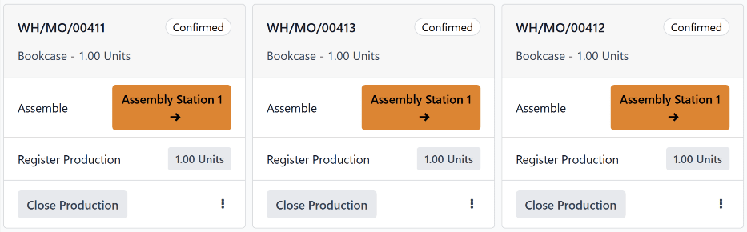

# Shop Floor umumiy ko'rinishi

*Shop Floor* moduli *Ishlab chiqarish* ilovasining hamroh modulidir. *Shop Floor* ishlab chiqarish buyurtmalari (MO) va ish buyurtmalarini qayta ishlash uchun vizual interfeys taqdim etadi. Shuningdek, u ishlab chiqarish xodimlarining ishlab chiqarish va ish buyurtmalari ustida ishlash uchun sarflangan vaqt miqdorini kuzatishga imkon beradi.

*Shop Floor* moduli *Ishlab chiqarish* ilovasi bilan birga o'rnatiladi. U o'z-o'zidan o'rnatilishi mumkin emas. *Ishlab chiqarish* ilovasini o'rnatish uchun `Apps` ga o'ting, `Search...` panelida [manufacturing] ni qidiring va keyin `Manufacturing` ilova kartasida `Install` tugmasini bosing.

::: warning

*Shop Floor* moduli *Ishlab chiqarish* ilovasining planshet ko'rinishi funksiyasini almashtiradi va faqat Odoo 16.4 va undan keyingi versiyalarida mavjud.

Odoo ma'lumotlar bazasining versiya raqamini tekshirish uchun `Settings` ga o'ting va sahifaning pastki qismidagi `About` bo'limiga aylantiring. Versiya raqami u yerda ko'rsatilgan.

Odoo'ning yangi versiyasiga o'tish uchun `upgrading a database` bo'yicha hujjatlarni ko'ring.
::::

## Navigatsiya

*Shop Floor* uchta asosiy ko'rinishga bo'lingan bo'lib, ular modulning yuqori qismidagi navigatsiya panelidan tanlanishi mumkin:

- `All` sahifasi modul uchun asosiy boshqaruv paneli bo'lib xizmat qiladi va `MOs (Manufacturing Orders)` uchun ma'lumot kartalarini ko'rsatadi.
- Har bir ish markazining ham maxsus sahifasi bor, u ushbu ish markaziga tayinlangan ish buyurtmalari uchun ma'lumot kartalarini ko'rsatadi. Ish markazi sahifalarini navigatsiya panelida `+ (plus)` tugmasini bosib, paydo bo'ladigan qalqib chiquvchi oynada ularni tanlash yoki bekor qilish va keyin `Confirm` tugmasini bosish orqali yoqish yoki o'chirish mumkin.
- `My` sahifasi modulning chap tomonidagi operator panelida hozirda faol bo'lgan profilli xodimga tayinlangan barcha ish buyurtmalari uchun ma'lumot kartalarini ko'rsatadi. Faqat faol xodimga tayinlangan ish buyurtmalarini ko'rsatishdan tashqari, bu sahifa har bir ish markazi sahifalari bilan bir xil ishlaydi.

::: tip

[\|MO\|](##SUBST##|MO|) yoki ish buyurtmasini ajratish uchun, boshqa buyurtmalar ko'rinmasligi uchun, shunchaki modulning yuqori qismidagi `Search...` panelida [\|MO\|](##SUBST##|MO|) ning ma'lumotnoma raqamini qidiring. Bu qidiruv filtri turli modul ko'rinishlari o'rtasida almashganda faol bo'lib qoladi.
::::

Modulning chap tomonida operator paneli joylashgan bo'lib, u hozirda *Shop Floor* ga kirgan barcha xodimlarni ko'rsatadi va yangi xodimlarning kirishiga imkon beradi. Operator paneli qaysi ko'rinish tanlangan bo'lishidan qat'i nazar, doimo modulda mavjud. Uni navigatsiya panelining eng chap tomonidagi `sidebar` tugmasini bosish orqali yoqish yoki o'chirish mumkin.

### All sahifasi

Odatiy bo'lib, `All` sahifasi *boshlashga tayyor* bo'lgan har bir [\|MO\|](##SUBST##|MO|) uchun ma'lumot kartasini ko'rsatadi. [\|MO\|](##SUBST##|MO|) tasdiqlangandan va barcha kerakli komponentlar mavjud bo'lgandan so'ng boshlashga tayyor deb hisoblanadi.

Tayyorgarligidan qat'i nazar, tasdiqlangan har bir [\|MO\|](##SUBST##|MO|) ni ko'rish uchun `Ready to Start` filtrini `Search...` panelidan olib tashlash uchun `x` tugmasini bosing.

#### MO ma'lumot kartasi

`All` sahifasidagi [\|MO\|](##SUBST##|MO|) ma'lumot kartasi bog'liq [\|MO\|](##SUBST##|MO|) ning barcha tegishli tafsilotlarini ko'rsatadi va shuningdek xodimlarga [\|MO\|](##SUBST##|MO|) ni qayta ishlash uchun variantlar taqdim etadi.

[\|MO\|](##SUBST##|MO|) kartasining sarlavhasi [\|MO\|](##SUBST##|MO|) raqamini, ishlab chiqarilayotgan mahsulot va birliklar sonini va [\|MO\|](##SUBST##|MO|) holatini ko'rsatadi. Agar [\|MO\|](##SUBST##|MO|) bo'yicha ish hali boshlanmagan bo'lsa, holat `Confirmed` sifatida ko'rinadi. Ish boshlanganidan so'ng, holat `In Progress` ga yangilanadi. Agar [\|MO\|](##SUBST##|MO|) uchun barcha ish buyurtmalari yakunlangan va [\|MO\|](##SUBST##|MO|) yopishga tayyor bo'lsa, holat `To Close` ga yangilanadi.

[\|MO\|](##SUBST##|MO|) kartasining asosiy qismi yakunlangan har bir ish buyurtmasi uchun qator ko'rsatadi (agar mavjud bo'lsa), keyin yakunlanishi kerak bo'lgan joriy ish buyurtmasini ko'rsatadi. Yakunlangan ish buyurtmalari ish buyurtmasi sarlavhasining o'ng tomonidagi yashil belgi bilan ko'rsatiladi. Joriy ish buyurtmasi buyurtma tayinlangan ish markazi sahifasini ochadigan tugma bilan ko'rsatiladi.

Joriy ish buyurtmasining ostida `Register Production` nomli qator joylashgan bo'lib, u ishlab chiqarilgan mahsulot birliklarining sonini qayd etish uchun ishlatiladi. Ishlab chiqarilgan birliklar sonini qo'lda kiritish uchun `Register Production` qatorini bosing, natijada paydo bo'ladigan qalqib chiquvchi oynaning `Units` maydoniga qiymat kiriting, keyin `Validate` tugmasini bosing.

Shu bilan bir qatorda, qatorning o'ng tomonidagi `# Units` tugmasini bosing, bu avtomatik ravishda [\|MO\|](##SUBST##|MO|) yaratilgan birliklar sonini ishlab chiqarilgan birliklar soni sifatida qayd etadi. Masalan, agar [\|MO\|](##SUBST##|MO|) ovqat stolining 10 birligi uchun yaratilgan bo'lsa, `10 units` tugmasini bosish 10 birlik ishlab chiqarilganligini qayd etadi.

[\|MO\|](##SUBST##|MO|) kartasining pastki qismida `Close Production` tugmasi ko'rsatiladi. Bu ishlab chiqarish yakunlangandan so'ng [\|MO\|](##SUBST##|MO|) ni yopish uchun ishlatiladi. Biroq, agar [\|MO\|](##SUBST##|MO|) uchun umuman (undagi ish buyurtmalari uchun emas) zarur sifat tekshiruvlari bo'lsa, o'rniga `Quality Checks` tugmasi paydo bo'ladi. `Quality Checks` tugmasini bosish qalqib chiquvchi oynani ochadi, undan zarur sifat tekshiruvlarini bajarish mumkin.

`Close Production` tugmasini bosgandan so'ng, [\|MO\|](##SUBST##|MO|) kartasi yo'qola boshlaydi va pastki qismda `Undo` tugmasi paydo bo'ladi. `Undo` tugmasini bosish [\|MO\|](##SUBST##|MO|) ochiq qolishiga sabab bo'ladi. [\|MO\|](##SUBST##|MO|) kartasi to'liq yo'qolgandan so'ng, ish buyurtmasi yopiladi.

Pastki qismning o'ng tomonida `⋮ (options)` tugmasi joylashgan bo'lib, u [\|MO\|](##SUBST##|MO|) uchun qo'shimcha variantlar bilan qalqib chiquvchi oynani ochadi:

- `Scrap` komponentlar nuqsonli deb topilganda ularni chiqindi joyiga yuborish uchun ishlatiladi.
- `Add Work Order` [\|MO\|](##SUBST##|MO|) ga qo'shimcha ish buyurtmasi qo'shish uchun ishlatiladi.
- `Add Component` [\|MO\|](##SUBST##|MO|) ga qo'shimcha komponent qo'shish uchun ishlatiladi.
- `Open Backend MO` [\|MO\|](##SUBST##|MO|) ni Ishlab chiqarish ilovasida ochadi.

### Ish markazi sahifalari

Odatiy bo'lib, har bir ish markazi sahifasi unga tayinlangan *boshlashga tayyor* bo'lgan har bir ish buyurtmasi uchun ma'lumot kartasini ko'rsatadi. Ish buyurtmasi uning qismi bo'lgan [\|MO\|](##SUBST##|MO|) boshlashga tayyor bo'lganda va oldingi ish buyurtmalari yakunlanganda boshlashga tayyor deb hisoblanadi.

Tayyorligidan qat'i nazar, ish markaziga tayinlangan tasdiqlangan har bir ish buyurtmasini ko'rish uchun `Ready to Start` filtrini `Search...` panelidan olib tashlash uchun `x` tugmasini bosing.

#### Ish buyurtmasi ma'lumot kartasi

Ish markazi sahifasidagi ish buyurtmasi ma'lumot kartasi bog'liq ish buyurtmasining barcha tegishli tafsilotlarini ko'rsatadi va shuningdek xodimlarga ish buyurtmasini qayta ishlash uchun variantlar taqdim etadi.

Ish buyurtmasi kartasining sarlavhasi ish buyurtmasi qismi bo'lgan [\|MO\|](##SUBST##|MO|) ning ma'lumotnoma raqamini, ishlab chiqarilayotgan mahsulot va birliklar sonini va ish buyurtmasining holatini ko'rsatadi. Agar ish buyurtmasi bo'yicha ish hali boshlanmagan bo'lsa, holat `To Do` sifatida ko'rinadi. Ish boshlanganidan so'ng, holat ish buyurtmasi ustida ishlangan umumiy vaqtni ko'rsatadigan taymer ko'rinishida yangilanadi.

Ish buyurtmasi kartasining asosiy qismi ish buyurtmasini yakunlash uchun zarur bo'lgan har bir qadam uchun qator ko'rsatadi. Ish buyurtmasi qadamlari qatorni bosib, keyin paydo bo'ladigan qalqib chiquvchi oynada ko'rsatmalarga amal qilish orqali yakunlanishi mumkin. Shu bilan bir qatorda, har bir qatorning o'ng tomonidagi katakchani bosish qadamni avtomatik ravishda yakunlangan deb belgilaydi.

Ish buyurtmasining oxirgi qadamining ostida `Register Production` nomli qator joylashgan bo'lib, u [\|MO\|](##SUBST##|MO|) kartasidagi `Register Production` qatori bilan bir xil ishlaydi. Ish buyurtmasi kartasidagi `Register Production` qatori yordamida ishlab chiqarilgan birliklar sonini ro'yxatga olish bog'liq [\|MO\|](##SUBST##|MO|) kartasi uchun qadamni ham yakunlaydi.

Agar qayta ishlayotgan ish buyurtmasi [\|MO\|](##SUBST##|MO|) uchun oxirgi ish buyurtmasi bo'lsa, ish buyurtmasi kartasining pastki qismida `Close Production` tugmasi paydo bo'ladi. `Close Production` tugmasini bosish ish buyurtmasi va [\|MO\|](##SUBST##|MO|) ikkalasini ham yopadi, agar [\|MO\|](##SUBST##|MO|) uchun sifat tekshiruvi talab qilinmasa. Bu holda, [\|MO\|](##SUBST##|MO|) yopilishidan oldin [\|MO\|](##SUBST##|MO|) kartasidan sifat tekshiruvi yakunlanishi kerak.

Shu bilan bir qatorda, agar [\|MO\|](##SUBST##|MO|) qo'shimcha ish buyurtmalarini yakunlashni talab qilsa, o'rniga `Mark as Done` tugmasi paydo bo'ladi. `Mark as Done` tugmasini bosish joriy ish buyurtmasini yakunlangan deb belgilaydi va keyingi ish buyurtmasining tayinlangan ish markazi sahifasida paydo bo'lishiga sabab bo'ladi.

`Close Production` yoki `Mark as Done` tugmasini bosgandan so'ng, ish buyurtmasi kartasi yo'qola boshlaydi va pastki qismda `Undo` tugmasi paydo bo'ladi. `Undo` tugmasini bosish ish buyurtmasining ochiq qolishiga sabab bo'ladi. Ish buyurtmasi kartasi to'liq yo'qolgandan so'ng, ish buyurtmasi [\|MO\|](##SUBST##|MO|) da `Finished` deb belgilanadi.

Pastki qismning o'ng tomonida `⋮ (options)` tugmasi joylashgan bo'lib, u ish buyurtmasi uchun qo'shimcha variantlar bilan qalqib chiquvchi oynani ochadi:

- `Scrap` komponentlar nuqsonli deb topilganda ularni chiqindi joyiga yuborish uchun ishlatiladi.
- `Add Component` [\|MO\|](##SUBST##|MO|) ga qo'shimcha komponent qo'shish uchun ishlatiladi.
- `Move to work center` ish buyurtmasini boshqa ish markaziga o'tkazish uchun ishlatiladi.
- `Suggest a Worksheet improvement` foydalanuvchiga ish buyurtmasining ko'rsatmalari yoki qadamlariga o'zgartirish taklif qilishga imkon beradi.
- `Create a Quality Alert` sifat jamoasini mumkin bo'lgan muammo haqida ogohlantirish uchun to'ldirilishi mumkin bo'lgan sifat ogohlantirish formasini ochadi.

### Operator paneli

Operator paneli *Shop Floor* moduliga kirgan xodimlarni boshqarish uchun ishlatiladi. Panel ma'lumotlar bazasining barcha nusxalarida hozirda tizimga kirgan har bir xodimning ismi va profil rasmini ko'rsatadi.

Muayyan xodim sifatida *Shop Floor* bilan ishlash uchun xodimning ismini bosib, ularning profilini faollashtiring. Faol bo'lmagan profillar ularning ismlari va profil rasmlari kulrang holda ko'rinadi.

Operator panelida xodim tanlanganda, ular ish buyurtmasining sarlavhasini bosish orqali ish buyurtmasi ustida ishlay boshlashilari mumkin. Agar xodim bir yoki bir nechta ish buyurtmalari ustida ishlayotgan bo'lsa, ish buyurtmasi sarlavha(lari) ularning ismi ostida, har bir buyurtma ustida qancha vaqt ishlashganini ko'rsatadigan taymer bilan birga paydo bo'ladi.

Operator paneliga yangi xodim qo'shish uchun panelning pastki qismidagi `+ Add Operator` tugmasini bosing. Keyin `Select Employee` qalqib chiquvchi oynasidan xodimni tanlang.

Xodimni operator panelidan olib tashlash uchun paneldagi ularning ismi yonidagi `x` tugmasini bosing.

## MO/WO ustuvorlik berish

**Shop Floor** moduli `MOs (Manufacturing Orders)` da kiritilgan *rejalashtirilgan sana*dan foydalanib, modulning boshqaruv paneli va ish markazi sahifalarida paydo bo'ladigan `MOs (Manufacturing Orders)` va ish buyurtmalariga ustuvorlik beradi. Tezroq rejalashtirilgan `MOs (Manufacturing Orders)` va ish buyurtmalari yuqori ustuvorliklarga ega va uzoqroq rejalashtirilgan buyurtmalardan oldin paydo bo'ladi.

[\|MO\|](##SUBST##|MO|) da rejalashtirilgan sanani belgilash uchun `Manufacturing app ‣ Operations ‣ Manufacturing Orders` ga o'tib, yangi [\|MO\|](##SUBST##|MO|) yaratish uchun `New` tugmasini bosing.

Kalendar qalqib chiquvchi oynasini ochish uchun `Scheduled Date` maydonini bosing. Odatiy bo'lib, `Scheduled Date` maydoni va unga mos keladigan qalqib chiquvchi oyna joriy sana va vaqtni ko'rsatadi.

[\|MO\|](##SUBST##|MO|) uchun qayta ishlash boshlanishi kerak bo'lgan sanani tanlash uchun kalendardan foydalaning. Qalqib chiquvchi oynaning pastki qismidagi ikki maydonida 24 soatlik soat formatidan foydalanib, qayta ishlash boshlanishi kerak bo'lgan soat va daqiqani kiriting.

Nihoyat, `Scheduled Date` maydoni uchun sana va vaqtni o'rnatish uchun qalqib chiquvchi oynaning pastki qismidagi `Apply` tugmasini bosing. Keyin uni tasdiqlash uchun [\|MO\|](##SUBST##|MO|) ning yuqori qismidagi `Confirm` tugmasini bosing.

[\|MO\|](##SUBST##|MO|) tasdiqlangandan so'ng, u barcha komponentlar mavjudligini bildiruvchi `Ready` holatiga ega bo'lsa, **Shop Floor** modulida paydo bo'ladi.

Odoo boshqaruv panelida `Shop Floor` modulini ochish uchun uni bosing. Boshqaruv panelining `All MO #` sahifasi rejalashtirilgan sanalar tartibida tartibga solingan *Ready* `MOs (Manufacturing Orders)` ni ko'rsatadi.

Modulning yuqori qismida unga tayinlangan ish buyurtmalarini ko'rish uchun ish markazini tanlang. Har bir ish markazi sahifasi ish buyurtmalarini ularning mos keladigan `MOs (Manufacturing Orders)` ning rejalashtirilgan sanalariga asoslangan holda tartibga soladi.

::: example
*Kitob javoni* mahsuloti uchun uchta `MOs (Manufacturing Orders)` tasdiqlangan:

- WH/MO/00411 ning `Scheduled Date`si 16-avgust.
- WH/MO/00412 ning `Scheduled Date`si 20-avgust.
- WH/MO/00413 ning `Scheduled Date`si 18-avgust.

**Shop Floor** modulining `All MO #` sahifasida har bir [\|MO\|](##SUBST##|MO|) uchun kartalar quyidagi tartibda paydo bo'ladi: WH/MO/00411, WH/MO/00413, WH/MO/00412.

Har bir [\|MO\|](##SUBST##|MO|) `Assembly Station 1` da amalga oshiriladigan bitta ish buyurtmasini talab qiladi. Ekranning yuqori qismidagi `Assembly Station 1` tugmasini bosish ish markazi sahifasini ochadi, u ularning mos keladigan `MOs (Manufacturing Orders)` bilan bir xil tartibda paydo bo'ladigan har bir ish buyurtmasi uchun bitta karta ko'rsatadi.
:::