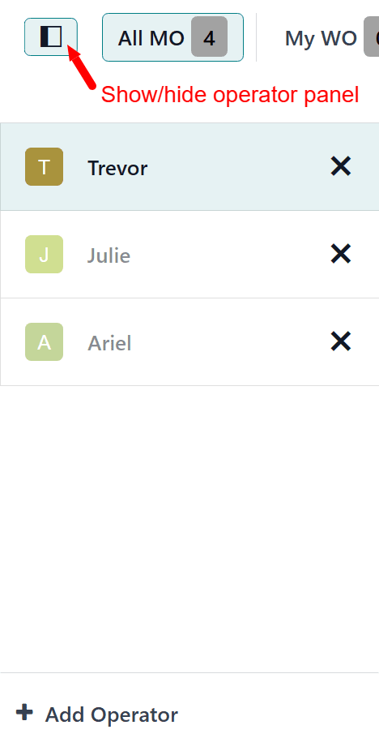
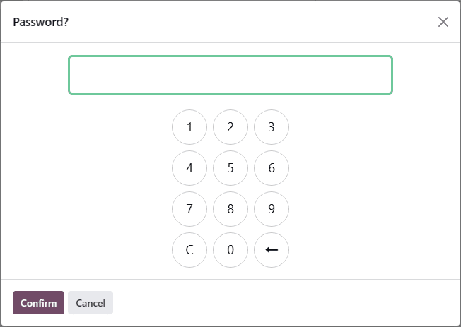
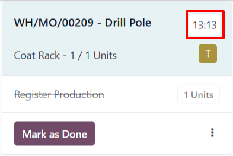
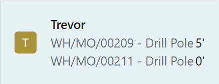

# Ishlab chiqarish zalida vaqtni kuzatish

Odoo *Shop Floor* moduliga `operators` sifatida kirish orqali xodimlar
har bir ish buyruq ustida qancha vaqt sarflashganini kuzatib borish imkoniga ega bo'ladilar.

Odoo har bir ish buyruqni bajarish uchun ketgan vaqtni, shuningdek,
har bir operator har bir ish buyruq ustida qancha vaqt sarflashganini kuzatib boradi.

## Operator tizimga kirishi

*Shop Floor* moduliga operator sifatida kirish uchun,
Odoo ma'lumotlar bazasiga kiring va `Shop Floor` modulini oching. Ma'lumotlar bazasiga
kirgan xodim profili avtomatik ravishda operator sifatida tizimga kiritiladi.

Barcha faol operatorlar modulning chap tomonidagi operator panelida ro'yxatlangan.
Panelni ochish yoki yopish uchun modulning yuqori chap
burchagida joylashgan `show/hide panel (white square with black column on
left side)` tugmasini bosing.

*Shop Floor* ga boshqa xodim sifatida kirish uchun,
panelning pastki qismidagi `+ Add Operator` tugmasini bosing.
Bu `Select Employee` pop-up oynasini ochadi, unda modulga kirish imkoniyatiga ega bo'lgan
barcha xodimlar ro'yxatlangan.

Ularning profili yordamida tizimga kirish uchun muayyan xodimni bosing.
Agar o'sha xodim sifatida kirish uchun PIN kod talab qilinmasa,
profil avtomatik ravishda tizimga kiritiladi.

Agar PIN kod talab qilinsa, `Password?` pop-up oynasi paydo bo'ladi,
unda raqamlar paneli ko'rsatiladi, undan kod kiritish mumkin.
Raqamlar paneli yordamida kodni kiriting va *Shop Floor* moduliga
kirish uchun `Confirm` tugmasini bosing.

::: tip

Har bir xodim uchun PIN kod o'rnatilishi mumkin, ular *Shop Floor* moduliga
har gal kirishda, *Attendances* ilovasining *Kiosk Mode* da chiqish
yoki kirishda, yoki *Point of Sale* ilovasida kassir sifatida kirishda
kiritilishi kerak.

Xodim PIN kodini o'rnatish uchun `Employees` ilovasiga o'ting va
muayyan xodimni tanlang. Xodim formasining pastki qismida
`HR Settings` yorlig'ini bosing va `PIN Code` maydoniga
raqamli kodni kiriting.
::::

Xodim modulga kirgandan so'ng, ularning ismi operator panelida,
kirgan boshqa barcha xodimlar bilan birga paydo bo'ladi.
Panel bir nechta xodimni ro'yxatlashi mumkin bo'lsa-da,
*Shop Floor* modulining bitta nusxasida bir vaqtda faqat
bitta xodim faol bo'lishi mumkin.

Ularning profilini faol qilish uchun xodim ismini bosing.
Faol xodim ko'k rangda ajratilgan holda ko'rinadi,
kirgan, lekin faol bo'lmagan xodimlarning ismlari esa
xiraroq ko'rinadi.

Moduldan muayyan xodimni chiqarish uchun operator panelida
ularning ismi yonidagi `X (remove)` tugmasini bosing.

## Ish buyruq davomiyligini kuzatish

Ish buyruq ustida sarflangan vaqtni kuzatish uchun,
avval operator panelidan ustida ishlaydigan xodimni tanlang.

Keyin ish buyruq bajarilishi rejalashtirilgan ish markazining
sahifasiga o'ting. Buni *Shop Floor* modulining yuqori
navigatsiyasidan ish markazini tanlash orqali yoki ish buyruq
qismi bo'lgan ishlab chiqarish buyrug'i (MO) kartasidagi
ish markazi nomini bosish orqali amalga oshirish mumkin.

Ish markazi sahifasida ish buyruq kartasini toping.
Ish boshlangandan so'ng, uni bajarish uchun ketgan vaqtni
o'lchashni boshlash uchun ish buyruq kartasining sarlavhasini bosing.
Bu davomiylik ish buyruq kartasi sarlavhasidagi taymer orqali
ko'rsatiladi, u barcha xodimlar tomonidan ish buyruq ustida
sarflangan umumiy vaqtni kuzatib boradi.

Bundan tashqari, ish buyruq reference raqami operator panelida
ustida ishlaydigan xodim ismi ostida ikkinchi taymer bilan
birga paydo bo'ladi, bu xodimning ish buyruq ustida alohida
sarflagan vaqtini kuzatib boradi. Bu taymer faqat joriy
sessiya davomidagi ishni aks ettiradi, hatto xodim ilgari
ish buyruq ustida ishlagan bo'lsa ham.

Xodimlar bir vaqtning o'zida bir nechta ish buyruq ustida
ishlashi va har biri uchun vaqtni kuzatib borishi mumkin.
Ustida ishlayotgan har bir ish buyruq uchun reference raqami
xodim ismi ostida taymer bilan birga paydo bo'ladi.

Ish buyruq kartasidagi taymerni to'xtatish va ish buyruqni
operator panelidagi xodim ismi ostidan olib tashlash uchun
sarlavhani ikkinchi marta bosing.

Ish buyruq tugallangandan so'ng, ish buyruq kartasining
pastki qismidagi `Mark as Done` tugmasini bosing, bu
kartaning yo'qolishiga olib keladi. Agar taymer hali ham
faol bo'lsa, karta to'liq yo'qolgandan so'ng to'xtaydi.

## Ish buyruq davomiyligini ko'rish

Ish buyruq davomiyligini ko'rish uchun
`Manufacturing app ‣ Operations
‣ Manufacturing Orders` ga o'ting va
`MO (Manufacturing Order)` ni tanlang.

Tugallangan va *Done* deb belgilangan `MOs (Manufacturing Orders)` ni ko'rish va tanlash uchun,
filtrning o'ng tomonidagi `X (close)` tugmasini bosish orqali
`Search...` panelidan `To Do` filtrini olib tashlang.

`MO (Manufacturing Order)` sahifasida
`MO (Manufacturing Order)` ga kiritilgan
barcha ish buyruqlar ro'yxatini ko'rish uchun `Work Orders` yorlig'ini bosing.
Har bir ish buyruqni bajarish uchun ketgan vaqt yorliqning
`Real Duration` ustunida ko'rsatilgan.

*Real Duration* ustida ishlagan barcha ishchilar tomonidan
ish buyruq ustida sarflangan umumiy vaqtni ifodalaydi.
U *Shop Floor* modulida kuzatilgan vaqtni, shuningdek,
`MO (Manufacturing Order)` ning
`Work Orders` yorlig'ida kuzatilgan vaqtni o'z ichiga oladi.