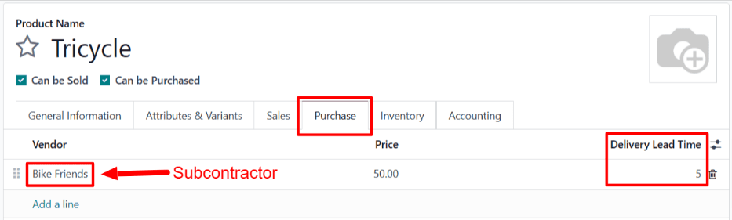
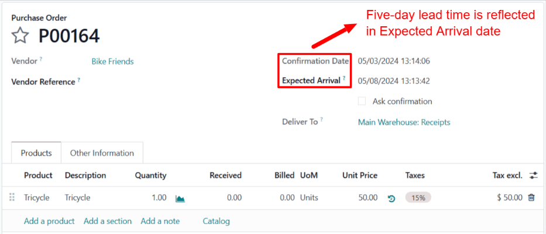

# Asosiy subpudratchilik yetkazib berish muddatlari

Odoo da yetkazib berish muddatlari muayyan harakatni bajarish uchun qancha vaqt ketishini bashorat qilish uchun ishlatiladi. Masalan, sotib olingan mahsulot uchun *yetkazib berish muddati* o'rnatilishi mumkin, bu odatda sotuvchining mahsulotni sotib oluvchi kompaniyaga yetkazib berishi uchun qancha kun ketishini belgilaydi.

Subpudratchilik mahsulotlari uchun, yetkazib berish muddatlari subpudratchi mahsulotni ishlab chiqarish uchun zarur bo'lgan vaqt miqdorini hisobga olish uchun sozlanishi mumkin. Buning amalga oshirilishi pudratchi kompaniyaga subpudratchilik mahsulotlarining yetkazib berish sanalarini yaxshiroq bashorat qilishga imkon beradi.

::: warning

Odoo dagi barcha yetkazib berish muddatlari kabi, subpudratchilik mahsulotlari uchun yetkazib berish muddatlari faqat taxminiy hisoblanadi va harakatlarning qancha vaqt *kutilayotganiga* asoslanadi.

Kutilmagan holatlar bu harakatlarning bajarilishiga ta'sir qilishi mumkin, bu esa yetkazib berish muddatlarini kafolat sifatida ko'rmaslik kerakligini anglatadi.
::::

## Sozlash

Mahsulotni ishlab chiqarish uchun `basic subcontracting` ish jarayonidan foydalanganda, kompaniya subpudratchini zarur komponentlar bilan ta'minlash uchun javobgar emas. Bu mahsulotning yetkazib berish sanasiga ta'sir qiluvchi yagona omillar subpudratchining uni ishlab chiqarish va yetkazib berish uchun ketgan vaqt miqdori ekanligini anglatadi.

Mahsulot subpudratchisiga ushbu ikkala omilni hisobga olgan yetkazib berish muddatini belgilash orqali, mahsulot uchun sotib olish buyruqlari (PO) da ko'rsatilgan *Expected Arrival* sanasi ishlab chiqarish va yetkazib berish uchun zarur bo'lgan vaqt miqdorini yanada aniqroq aks ettiradi.

### Mahsulot yetkazib berish muddati

Mahsulot subpudratchisi uchun yetkazib berish muddatini o'rnatish uchun, `Inventory app
‣ Products ‣ Products` ga o'ting va subpudratchilik mahsulotini tanlang.

Keyin mahsulot sahifasida `Purchase` yorlig'ini tanlang. Agar subpudratchi hali sotuvchi sifatida qo'shilmagan bo'lsa, `Add a line` ni bosish va `Vendor` ustunida subpudratchini tanlash orqali uni hozir qo'shing.

Subpudratchi qo'shilgandan so'ng, `Delivery Lead Time` ustuniga ular mahsulotni ishlab chiqarish va yetkazib berish uchun ketadigan kunlar sonini kiriting.

::: tip

Mahsulot sahifasidagi `Purchase` yorlig'iga bir nechta subpudratchilar qo'shilishi mumkin va har biri uchun har xil `Delivery Lead Time` o'rnatilishi mumkin.
::::

## Yetkazib berish muddati ish jarayoni

Mahsulot sotuvchisi uchun yetkazib berish muddatini o'rnatgandan so'ng, `Purchase app ‣ Orders ‣ Purchase Orders` ga o'tish va `New` ni bosish orqali `RfQ (Request for Quotation)` yarating.

`Vendor` maydonida subpudratchini belgilang. Keyin `Products` yorlig'ida `Add a product` ni bosish, `Product` ustunida mahsulotni tanlash va `Quantity` ustuniga miqdorni qo'shish orqali mahsulotni qo'shing.

Mahsulot qo'shilgandan so'ng, `RfQ (Request for Quotation)` dagi `Expected Arrival` maydoni mahsulot sahifasida belgilangan sotuvchining yetkazib berish muddatini aks ettiradigan sana bilan avtomatik to'ldiriladi.

Agar sanani o'zgartirish kerak bo'lsa, kalendar popover-ni ochish uchun `Expected Arrival` maydonini bosing va kerakli sanani tanlang. Subpudratchi mahsulotni o'sha sanaga yetkazib berishga qodir ekanligini tasdiqlamagan bo'lsa, avtomatik to'ldirilgan sanadan ertaroq sanani tanlamaslik kerak.

Nihoyat, uni `PO (Purchase Order)` ga aylantirish uchun `RfQ (Request for Quotation)` da `Confirm Order` ni bosing. Shu paytda subpudratchi subpudratchilik mahsulotini pudratchi kompaniyaga yetkazib berishdan oldin ishlab chiqarishni boshlashi kerak.

::: example
Velosiped chakana sotuvchisi *Mike's Bikes* subpudratchi --- *Bike Friends* --- bilan ularning *Tricycle* mahsuloti birliklarini ishlab chiqarish uchun hamkorlik qiladi.

O'rtacha Bike Friends uch g'ildirakli velosiped ishlab chiqarish uchun uch kun, qo'shimcha ravishda uni Mike's Bikes ga yetkazib berish uchun yana ikki kun talab qiladi.

Natijada, Mike's Bikes Bike Friends tomonidan ishlab chiqarilgan uch g'ildirakli velosipedlar uchun besh kunlik yetkazib berish muddatini o'rnatadi: ishlab chiqarish uchun uch kun va yetkazib berish uchun ikki kun.

3-may kuni Mike's Bikes Bike Friends dan bitta uch g'ildirakli velosiped sotib olish uchun `PO (Purchase Order)` tasdiqlaydi.

`PO (Purchase Order)` da ko'rsatilgan `Expected Arrival` sanasi 8-may, `Confirmation Date` dan besh kun keyin.

Bike Friends 3-may kuni --- `PO (Purchase Order)` tasdiqlangan kun --- uch g'ildirakli velosiped ishlab chiqarishni boshlaydi va uch kun o'tgach 6-may kuni tugatadi.

Uch g'ildirakli velosiped xuddi shu kuni Mike's Bikes ga jo'natiladi va ular uni ikki kun o'tgach 8-may kuni oladilar.
:::
