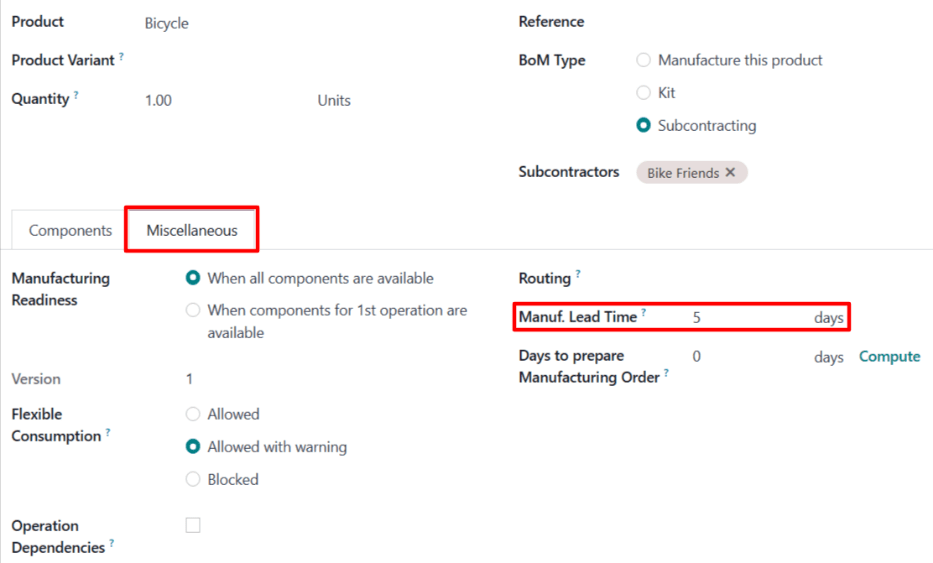

# Dropship subpudratchilik yetkazib berish muddatlari

Odoo da yetkazib berish muddatlari muayyan harakatni bajarish uchun qancha vaqt ketishini bashorat qilish uchun ishlatiladi. Masalan, sotib olingan mahsulot uchun *yetkazib berish muddati* o'rnatilishi mumkin, bu odatda sotuvchining mahsulotni sotib oluvchi kompaniyaga yetkazib berishi uchun qancha kun ketishini belgilaydi.

Subpudratchilik mahsulotlari uchun, yetkazib berish muddatlari subpudratchi mahsulotni ishlab chiqarish uchun zarur bo'lgan vaqt miqdorini hisobga olish uchun sozlanishi mumkin. Buning amalga oshirilishi pudratchi kompaniyaga subpudratchilik mahsulotlarining yetkazib berish sanalarini yaxshiroq bashorat qilishga imkon beradi.

Ba'zi subpudratchilik mahsulotlari pudratchi kompaniyadan subpudratchiga ishlab chiqarish komponentlarini ta'minlashni talab qiladi. Bunday holda, mahsulotni ishlab chiqarish va vaqtida yetkazib berish uchun subpudratchi kerakli komponentlarni qabul qilishi kerak bo'lgan sanani aniqlash uchun yetkazib berish muddatidan tashqari *ishlab chiqarish muddati* dan ham foydalanish mumkin.

Komponentlar subpudratchiga dropship qilingan hollarda, har bir komponent uchun qo'shimcha yetkazib berish muddati o'rnatilishi mumkin. Bu sotuvchining komponentlarni subpudratchiga yetkazib berishi uchun ketadigan vaqt miqdoriga o'rnatilishi kerak.

Komponentda yetkazib berish muddati o'rnatilgandan so'ng, komponent uchun dropship buyruqlar ishlab chiqarishni boshlash kerak bo'lgan sanaga qadar subpudratchiga dropship qilish uchun buyruqni tasdiqlash kerak bo'lgan sanani ko'rsatadi.

::: warning

Odoo dagi barcha yetkazib berish muddatlari kabi, subpudratchilik mahsulotlari uchun yetkazib berish muddatlari faqat taxminiy hisoblanadi va harakatlarning qancha vaqt *kutilayotganiga* asoslanadi.

Kutilmagan holatlar bu harakatlarning bajarilishiga ta'sir qilishi mumkin, bu esa yetkazib berish muddatlarini kafolat sifatida ko'rmaslik kerakligini anglatadi.
::::

## Sozlash

`Dropship Subcontractor on Order` marshrutidan foydalanganda, kompaniya sotuvchidan kerakli komponentlarni sotib olish va ularni to'g'ridan-to'g'ri subpudratchiga dropship qilish uchun javobgardir.

Bu subpudratchining mahsulotni ishlab chiqarish va yetkazib berish uchun ketadigan vaqt miqdoridan tashqari, komponent sotuvchisining komponentlarni subpudratchiga dropship qilishi uchun qancha vaqt ketishini ham hisobga olish zarurligini anglatadi.

Mahsulot subpudratchisiga *yetkazib berish muddati* ni, mahsulot BoM-ida *ishlab chiqarish muddati* ni belgilash va komponentlar sotuvchisiga qo'shimcha *yetkazib berish muddati* ni tayinlash orqali, mahsulot komponentlari uchun *Dropship Subcontractor* buyruqlari komponentlarni subpudratchiga jo'natish uchun dropship buyruqni tasdiqlash muddatini ko'rsatadi.

### Mahsulot yetkazib berish muddati

Mahsulot subpudratchisi uchun yetkazib berish muddatini o'rnatish uchun, `Inventory app ‣ Products ‣ Products` ga o'ting va subpudratchilik mahsulotini tanlang.

Keyin mahsulot sahifasida `Purchase` yorlig'ini tanlang. Agar subpudratchi hali sotuvchi sifatida qo'shilmagan bo'lsa, `Add a line` ni bosish va `Vendor` ustunida subpudratchini tanlash orqali uni hozir qo'shing.

Subpudratchi qo'shilgandan so'ng, `Delivery Lead Time` ustuniga ular mahsulotni ishlab chiqarish va yetkazib berish uchun ketadigan kunlar sonini kiriting.

### Mahsulot ishlab chiqarish muddati

Keyin, mahsulot sahifasining yuqori qismidagi `Bill of Materials` aqlli tugmasini bosish orqali mahsulotning `BoM (Bill of Materials)` ga o'ting. Keyin ro'yxatdan BoM ni tanlang.

`BoM (Bill of Materials)` da `Miscellaneous` yorlig'ini tanlang. `Manuf. Lead Time` maydoniga `BoM (Bill of Materials)` mahsulotining `Delivery Lead Time` maydoniga kiritilgan kunlar sonini kiriting.

Bu kunlarning hammasi aslida subpudratchi tomonidan ishlab chiqarish uchun ishlatilmasa ham, har bir maydonga bir xil kunlar sonini o'rnatish Odoo ga subpudratchi komponentlarni qabul qilishi va mahsulotning yetkazib berish muddati boshlanishi bilan ishlab chiqarishni boshlashi kerakligini bildiradi. Bu subpudratchiga mahsulotni ishlab chiqarish va yetkazib berish uchun etarli vaqt beradi.

### Komponent yetkazib berish muddati

Mahsulot BoM-idan `Components` yorlig'ida komponentni bosish, keyin komponentning o'ng tomonidagi `oi-arrow-right` `(right arrow)` tugmasini bosish orqali har bir komponentga o'ting.

Har bir komponentning mahsulot sahifasida `Purchase` yorlig'ini tanlang. Agar sotuvchi hali qo'shilmagan bo'lsa, `Add a line` ni bosish va `Vendor` ustunida subpudratchini tanlash orqali uni hozir qo'shing.

Sotuvchi qo'shilgandan so'ng, `Delivery Lead Time` ustuniga ular mahsulotni subpudratchiga dropship qilish uchun ketadigan kunlar sonini kiriting.

## Dropship subpudratchilik ish jarayoni

`Purchase app ‣ Orders ‣ Requests for Quotation` ga o'tish va `New` ni bosish orqali mahsulot uchun taklifnoma so'rovi (RfQ) yarating.

`Vendor` maydonida subpudratchini belgilang. Keyin `Products` yorlig'ida `Add a product` ni bosish, `Product` ustunida mahsulotni tanlash va `Quantity` ustunida miqdorni belgilash orqali mahsulotni qo'shing.

`Expected Arrival` maydoniga komponent sotuvchisining komponentlarni dropship qilishi va subpudratchining mahsulotni ishlab chiqarish va yetkazib berishi uchun etarli vaqt beradigan sanani kiriting.

::: warning

Mahsulot `RfQ (Request for Quotation)` ga qo'shilganda, `Expected Arrival` maydoni bugungi sana va mahsulotning yetkazib berish muddati qo'shilgan sana bilan avtomatik to'ldiriladi. Biroq, bu komponentlarni subpudratchiga dropship qilish uchun ketadigan vaqtni hisobga olmaydi.

*Dropship Subcontractor on Order* marshrutidan foydalangan holda subpudratchilik qilingan mahsulotni sotib olishda, komponentlarning subpudratchiga yetkazib berilishi uchun zarur bo'lgan qo'shimcha vaqtni hisobga olish uchun bu sanani o'zgartirish zarur.

Ular komponentlarni qabul qilguncha ishlab chiqarish boshlanmaganligi sababli, sanani o'zgartirishsiz qoldirish tayyor mahsulotning `RfQ (Request for Quotation)` da ko'rsatilgan sanadan *keyin* kelishiga olib keladi.
::::

Keyin, `RfQ (Request for Quotation)` ni `PO (Purchase Order)` ga aylantirish uchun `Confirm Order` ni bosing. Bunday qilish komponentlarni dropshipperdan sotib olish va ularni subpudratchiga jo'natish uchun ikkinchi `RfQ (Request for Quotation)` yaratadi.

`Purchase app ‣ Orders ‣ Requests for Quotation` ga o'ting va `Vendor` ustunida dropshipperni ko'rsatadigan `RfQ (Request for Quotation)` ni tanlang.

`RfQ (Request for Quotation)` da `Expected Arrival` maydoni subpudratchi `PO (Purchase Order)` da ko'rsatilgan *Expected Arrival* sanasiga qadar tayyor mahsulotni yetkazib berish uchun subpudratchi komponentlarni qabul qilishi kerak bo'lgan sanani ko'rsatadi.

`Order Deadline` maydoni dropshipperning komponentlarni subpudratchiga `Expected Arrival` sanasiga qadar yetkazib berishi uchun `RfQ (Request for Quotation)` ni tasdiqlash mumkin bo'lgan eng oxirgi sanani ko'rsatadi.

`RfQ (Request for Quotation)` ni `PO (Purchase Order)` ga aylantirish va dropshipperdan komponentlarni sotib olishni tasdiqlash uchun `Confirm Order` ni bosing. Bunday qilish sahifaning yuqori qismida `Dropship` aqlli tugmasini paydo qiladi.

Dropship buyruqni ochish uchun `Dropship` aqlli tugmasini bosing. Bu buyruqqa subpudratchi `PO (Purchase Order)` da endi paydo bo'lgan `Resupply` aqlli tugmasi orqali ham kirish mumkin.

Dropshipper komponentlarni subpudratchiga yetkazib bergandan so'ng, subpudratchi komponentlarni qabul qilganligini tasdiqlash uchun dropship buyruqning yuqori qismidagi `Validate` tugmasini bosing.

Subpudratchi komponentlarni qabul qilgandan so'ng, ular komponentni ishlab chiqarishni boshlaydilar va keyin uni pudratchi kompaniyaga yetkazib beradilar.

::: example
Velosiped chakana sotuvchisi *Mike's Bikes* subpudratchi --- *Bike Friends* --- bilan ularning *Bicycle* mahsuloti birliklarini ishlab chiqarish uchun hamkorlik qiladi.

Mike's Bikes kerakli komponentlarni Bike World sotuvchisidan sotib olishi va ularni Bike Friends ga dropship qilishi kerak.

O'rtacha Bike Friends har bir velosipedni ishlab chiqarish uchun uch kun va uni Mike's Bikes ga yetkazib berish uchun qo'shimcha ikki kun oladi.

Natijada, Mike's Bikes Bike Friends tomonidan ishlab chiqarilgan velosipedlar uchun besh kunlik yetkazib berish muddatini o'rnatadi: ishlab chiqarish uchun uch kun va yetkazib berish uchun ikki kun.

Velosiped BoM-ida ular komponentlarning subpudratchiga yetkazib berilishi kerak bo'lgan sanani eslatish uchun besh kunlik ishlab chiqarish muddatini kiritadilar.

Velosipedning har bir komponenti uchun mahsulot sahifalarida ular Bike World ga ikki kunlik yetkazib berish muddatini tayinlaydilar. Bu Bike World ning har bir komponentni to'g'ridan-to'g'ri subpudratchiga dropship qilish uchun ketadigan vaqt miqdori.

10-may kuni Mike's Bikes kutilgan yetkazib berish sanasi 17-may bo'lgan bitta velosiped uchun `PO (Purchase Order)` ni tasdiqlaydi.

Komponentlarni Bike World dan sotib olish va ularni Bike Friends ga dropship qilish uchun `RfQ (Request for Quotation)` 12-may sanasida Expected Arrival va 10-may sanasida Deadline ga ega. Bike Friends ga komponentlarni Expected Arrival sanasiga qadar qabul qilishi va tayyor velosipedni 17-may kuni Mike's Bikes ga yetkazib berishi uchun etarli vaqt berish uchun `RfQ (Request for Quotation)` muddatgacha tasdiqlashi kerak.

Mike's Bikes 10-may kuni `RfQ (Request for Quotation)` ni tasdiqlaydi va Bike World 12-may kuni komponentlarni Bike Friends ga yetkazib beradi. Bike Friends velosipedni ishlab chiqaradi va 17-may kuni uni Mike's Bikes ga yetkazib beradi.
:::
