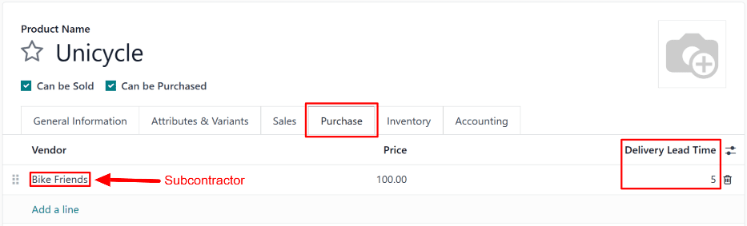
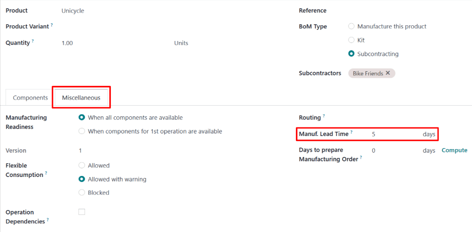

# Qayta ta'minot subpudrat yetkazish muddatlari

Odoo da yetkazish muddatlari ma'lum bir harakatni bajarish uchun qancha vaqt kerakligini bashorat qilish uchun ishlatiladi. Masalan, sotib olingan mahsulot uchun *yetkazish muddati* belgilanishi mumkin, bu mahsulot sotuvchisining mahsulotni sotib oluvchi kompaniyaga yetkazish uchun odatda necha kun kerakligini ko'rsatadi.

Subpudrat mahsulotlari uchun maxsus ravishda, yetkazish muddatlari subpudratchi tomonidan mahsulot ishlab chiqarish uchun zarur bo'lgan vaqt miqdorini hisobga olish uchun sozlanishi mumkin. Buni amalga oshirish pudratchi kompaniyaga subpudrat mahsulotlarining yetkazish sanalarini yaxshiroq bashorat qilish imkonini beradi.

Ba'zi subpudrat mahsulotlari pudratchi kompaniyadan subpudratchi uchun ishlab chiqarish komponentlarini ta'minlashni talab qiladi. Bunday holda, *ishlab chiqarish muddati* yetkazish muddatiga qo'shimcha ravishda mahsulotni ishlab chiqarish va o'z vaqtida yetkazish uchun subpudratchi zarur komponentlarni qabul qilishi kerak bo'lgan sanani yaratish uchun ishlatilishi mumkin.

::: warning

Odoo dagi barcha yetkazish muddatlari kabi, subpudrat mahsulotlari uchun yetkazish muddatlari faqat taxminiy bo'lib, harakatlar qancha vaqt davom etishi *kutilayotganiga* asoslanadi.

Kutilmagan holatlar bu harakatlarning bajarilishiga ta'sir qilishi mumkin, ya'ni yetkazish muddatlari kafolat sifatida **qaralmasi** kerak.
::::

## Sozlash

`Resupply Subcontractor on Order` yo'nalishidan foydalanganda, kompaniya subpudratchi uchun zarur komponentlarni ta'minlash uchun javobgardir. Natijada, subpudratchi komponentlar qabul qilinmaguncha ishlab chiqarishni boshlay olmaydi.

Bu shuni anglatadiki, subpudratchi mahsulotni ishlab chiqarish va yetkazish uchun kerak bo'lgan vaqt miqdoriga qo'shimcha ravishda, ularning komponentlarni qabul qilish sanasi ham hisobga olinishi kerak.

Mahsulot subpudratchiiga yetkazish muddatini belgilash va mahsulotning `BoM (Bill of Materials)` da ishlab chiqarish muddatini ko'rsatish orqali, mahsulot komponentlari uchun *Resupply Subcontractor* buyurtiqlari subpudratchi komponentlarni qabul qilishi kerak bo'lgan oxirgi muddatni ko'rsatadi.

### Mahsulot yetkazish muddati

Mahsulot subpudratchi uchun yetkazish muddatini belgilash uchun `Inventory app
‣ Products ‣ Products` ga o'ting va subpudrat mahsulotini tanlang.

Keyin mahsulot sahifasida `Purchase` yorlig'ini tanlang. Agar subpudratchi hali sotuvchi sifatida qo'shilmagan bo'lsa, `Add a line` tugmasini bosish va `Vendor` maydonida subpudratchi tanlash orqali buni hozir amalga oshiring.

Subpudratchi qo'shilgandan so'ng, ularning mahsulotni ishlab chiqarish va yetkazish uchun kerak bo'lgan kunlar sonini `Delivery Lead Time` ustuniga kiriting.

### Mahsulot ishlab chiqarish muddati

Keyin, mahsulot sahifasining yuqori qismidagi `Bill of Materials` smart tugmasini bosish orqali mahsulotning `BoM (Bill of Materials)` ga o'ting. Keyin ro'yxatdan `BoM (Bill of Materials)` ni tanlang.

`BoM (Bill of Materials)` da `Miscellaneous` yorlig'ini tanlang. `Manuf. Lead Time` maydoniga `BoM (Bill of Materials)` mahsulotining `Delivery Lead Time` maydoniga kiritilgan kunlar soni bilan bir xil kunlar sonini kiriting.

Bu kunlarning hammasi ham subpudratchi tomonidan ishlab chiqarish uchun ishlatilmasa ham, har bir maydoniga bir xil kunlar sonini belgilash Odoo ga subpudratchi komponentlarni qabul qilishi va mahsulotning yetkazish muddati boshlanishida ishlab chiqarishni boshlashi kerakligini bildiradi. Bu subpudratchi uchun mahsulotni ham ishlab chiqarish, ham yetkazish uchun yetarli vaqt beradi.

### Qayta ta'minlash subpudrat ish jarayoni

`Purchase app
‣ Orders ‣ Requests for Quotation` ga o'tish va `New` tugmasini bosish orqali mahsulot uchun taklif so'rovi (RfQ) yarating.

`Vendor` maydonida subpudratchi belgilang. Keyin `Products` yorlig'ida `Add a product` tugmasini bosish, `Product` ustunida mahsulotni tanlash va `Quantity` ustunida miqdorni belgilash orqali mahsulotni qo'shing.

`Expected Arrival` maydoniga subpudratchi komponentlarni qabul qilish, mahsulotni ishlab chiqarish va subpudrat kompaniyasiga qaytarib yetkazish uchun yetarli vaqt beradigan sanani kiriting.

::: warning

Mahsulot `RfQ (Request for Quotation)` ga qo'shilganda, `Expected Arrival` maydoni avtomatik ravishda bugungi sana va mahsulotning yetkazish muddati qo'shilgan sana bilan to'ldiriladi. Biroq, bu komponentlarni subpudratchi uchun jo'natish vaqtini hisobga **olmaydi**.

Resupply Subcontractor on Order yo'nalishi yordamida subpudrat qilingan mahsulotni sotib olishda, komponentlarni subpudratchi uchun jo'natish uchun kerak bo'lgan qo'shimcha vaqtni hisobga olish uchun bu sanani o'zgartirish zarur.

Ishlab chiqarish ular komponentlarni qabul qilmaguncha boshlanmaganligi sababli, sanani shunday qoldirish tayyor mahsulotning `RfQ (Request for Quotation)` da ko'rsatilgan sanadan *keyin* kelishiga olib keladi.
::::

Keyin `RfQ (Request for Quotation)` ni `PO (Purchase Order)` ga aylantirish uchun `Confirm Order` tugmasini bosing. Buni amalga oshirish sahifaning yuqori qismida `Resupply` smart tugmasini paydo bo'lishiga sabab bo'ladi.

Subpudratchi uchun komponentlarni jo'natish uchun yaratilgan buyurtma bo'lgan qayta ta'minlash subpudratchi buyurtmasini ochish uchun `Resupply` smart tugmasini bosing.

Qayta ta'minlash subpudratchi buyurtmasidagi `Deadline` maydoni kutilayotgan kelish sanasiga qadar tayyor mahsulotni ishlab chiqarish va yetkazish uchun yetarli vaqt bo'lishi uchun subpudratchi komponentlarni qabul qilishi kerak bo'lgan oxirgi muddatni ko'rsatadi.

`Scheduled Date` maydoni subpudratchi `Deadline` ga qadar yetib kelish uchun komponentlar jo'natilishi mumkin bo'lgan eng oxirgi sanani ko'rsatishi kerak. Biroq, odatiy ravishda ko'rsatilgan sana `Deadline` maydonidagi sana bilan bir xil bo'lib, jo'natish uchun kerak bo'lgan vaqtni hisobga olish uchun yangilanishi kerak.

Sana tanlanishi mumkin bo'lgan kalendar popoverini ochish uchun `Scheduled Date` maydonini bosing. Qayta ta'minlash subpudratchi buyurtmasidagi `Deadline` ga qadar komponentlar yetkazilishiga imkon beradigan sanani tanlang.

Komponentlar jo'natilgandan so'ng, ular subpudratchi uchun jo'natilganligini tasdiqlash uchun buyurtma yuqori qismidagi `Validate` tugmasini bosing.

Subpudratchi komponentlarni qabul qilgandan so'ng, ular pudratchi kompaniyaga yetkazishdan oldin komponentni ishlab chiqarishni boshlaydilar.

::: example
Velosiped chakana sotuvchi *Mike's Bikes* o'zlarining *Unicycle* mahsuloti birliklarini ishlab chiqarish uchun subpudratchi --- *Bike Friends* --- bilan ishlaydi.

Mike's Bikes velosipedlarni ishlab chiqarish uchun Bike Friends ga zarur komponentlarni ta'minlashi kerak.

O'rtacha hisobda, Bike Friends har bir velosipedni ishlab chiqarish uchun uch kun, shuningdek uni Mike's Bikes ga yetkazish uchun qo'shimcha ikki kun vaqt sarflaydi.

Natijada, Mike's Bikes tomonidan Bike Friends ishlab chiqargan velosipedlar uchun besh kunlik yetkazish muddati belgilaydi: ishlab chiqarish uchun uch kun, yetkazish uchun ikki kun.

Velosipedning `BoM (Bill of Materials)` da ular ham besh kunlik ishlab chiqarish muddatini kiritadilar, komponentlar subpudratchi uchun yetkazilishi kerak bo'lgan sanani eslatish uchun.

Ular kutilayotgan kelish sanasi 30-may bo'lgan bitta velosiped uchun `PO (Purchase Order)` ni tasdiqlaydilar.

Komponentlarni subpudratchi uchun jo'natish bo'yicha qayta ta'minlash subpudratchi buyurtmasi 25-may *Deadline* ni ko'rsatadi. Subpudratchi velosipedni ishlab chiqarish va 30-may gacha yetkazish uchun yetarli vaqt bo'lishi uchun shu sanaga qadar komponentlarni qabul qilishi kerak.

Mike's Bikes komponentlarni yetkazish uchun ikki kun vaqt kerak bo'lganligi sababli, ular qayta ta'minlash subpudratchi buyurtmasidagi *Scheduled Date* maydonini Deadline dan ikki kun oldin 23-may ga yangilaydilar.

Mike's Bikes komponentlarni 23-may rejalashtirilgan sanada Bike Friends ga jo'natadi va ular 25-may oxirgi muddatida yetib keladi. Bu Bike Friends ga velosipedni ishlab chiqarish va kutilayotgan kelish sanasi 30-may gacha Mike's Bikes ga qaytarib jo'natish uchun yetarli vaqt beradi.
:::